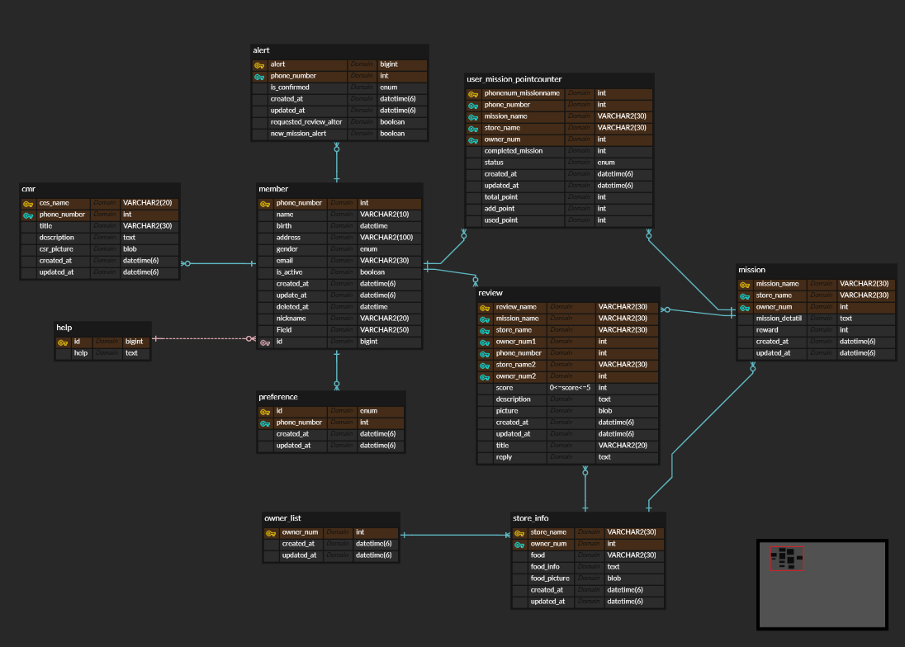

## 📢 학습 후기

---

- 이번 주차 워크북을 해결해보면서 어땠는지 회고해봅시다.
- 핵심 키워드에 대해 완벽하게 이해했는지? 혹시 이해가 안 되는 부분은 뭐였는지?

<aside>
💡 조인 구문 사용법을 알수있었고 아직 cursor paging부분이 이해가 잘 안됩니다.

## 🔥 미션

---

1. 1주차 때 설계한 데이터베이스를 토대로 아래의 화면에 대한 쿼리를 작성

내가 진행중, 진행 완료한 미션 모아서 보는 쿼리(페이징 포함)

SELECT ump.mission_name, ump.status FROM user_mission_pointcounter ump
JOIN member m ON m.phone_number = ump.phone_number
JOIN mission miss ON miss.mission_name = ump.mission_name
 WHERE ump.created_at < (SELECT created_at FROM user_mission_pointcounter WHERE ____←(이부분에 화면에서 이미 나와있는 가장 늦은 created_at을 넣는다 ))
ORDER BY ump.created_at DESC LIMIT 20;

리뷰 작성하는 쿼리,
* 사진의 경우는 일단 배제

SELECT rv.title, rv.score, rv.description, rv.reply FROM review rv 
JOIN member m ON rv.phone_number = m.phone_number
GROUP BY rv.phone_number

홈 화면 쿼리
(현재 선택 된 지역에서 도전이 가능한 미션 목록, 페이징 포함)

SELECT ump.completed_mission, miss.store_name, miss.created_at 

FROM user_mission_pointcounter ump

JOIN mission miss ON miss.store_name=ump.store_name

WHERE miss.created_at < (SELECT created_at FROM mission WHERE ____←(이부분에 화면에서 이미 나와있는 가장 늦은 created_at을 넣는다 ))

ORDER BY miss.created_at DESC LIMIT 20;

마이 페이지 화면 쿼리

SELECT m.nickname, m.phone_number, m.email, ump.total_point, rv.review_name, cm.title  FROM member m
JOIN user_mission_pointcounter ump ON m.phone_number=ump.phone_number
JOIN review rv ON m.phone_number=rv.phone_number
JOIN cmr cm ON m.phone_number=cm.phone_number;

**< 시니어 미션 >**

[시니어 미션](https://www.notion.so/1b7b57f4596b81d7b1eadc1486bce70b?pvs=21)

## 💪 미션 기록 (여기에 해도 되고 위의 미션에서 각 페이지 밑에 간단하게 블록 만들어서 하셔도 됩니다!)

<aside>
🍀 미션 기록의 경우, 아래 미션 기록 토글 속에 작성하시거나, 페이지를 새로 생성하여 해당 페이지에 기록하여도 좋습니다!

하지만, 결과물만 올리는 것이 아닌, **중간 과정 모두 기록하셔야 한다는 점!** 잊지 말아주세요.

</aside>

---

- **미션 기록**
    
    erd를 보고 작성을 하다 부족한 부분들이 있어서 약간의 수정을 거쳤습니다.
    
    
    
    1. 각 개인의 미션 상태를 보여주기 위해서 멤버테이블과 유저미션포인트카운터 테이블을 핸드폰번호의 키를 연결함으로 유저 개인의 미션상태에 접근 할 수있고 이 미션의 각 매장마다의 고유성을 확보하기 위해서 미션테이블과 유저미션포인트카운터 테이블의 매장이름이 동일한 것만 보여줌으로 확보한다. 페이징을 위해서는 유저미션포인트카운터 테이블의 생성시간을 기준으로 내림차순으로 20개를 보여주고 where조건으로 마지막으로 나온 미션의 생성시간보다 작은 것은 다음 페이지에 생성되도록 만든다. 마지막으로 생성시간을 그룹으로 묶어서 각 미션을 분리한다.
    
    2. 사진에 나와있는 자료들이 리뷰 제목, 점수, 내용, 답글만 보여주면 되기에 리뷰테이블에 해당 컬럼들을 가져온다 그리고 멤버 테이블과 리뷰테이블의 핸드폰 번호가 같은 것으로 연결하여 리뷰의 맴버별 고유성을 확보한다. 그리고 멤버별(핸드폰 번호)로 그룹핑함으로 리뷰를 보여준다.
    
    3. 유저미션포인트카운터 테이블에 있는 완료된 미션 갯수와 미션테이블의 가게이름 컬럼, 미션테이블의 생성시간을 가져온다 이때 미션테이블의 미션이름과 유저미션포인트카운터 테이블의 미션이름이 같은 것만 가져옴으로 도전이 가능한 미션을 보여 줄 수 있다 1번과 같은 페이징 방식으로 미션 테이블의 생성시간을 기준으로 서브 쿼리를 활용하여 화면에 나온 마지막 미션의 생성시간을 기준으로 다음 페이지의 데이터가 결정된다. 미션 테이블의 생성시간을 그룹핑하고 이를 내림차순으로 20개씩 보여주는 쿼리다.
    
    4. 내 프로필 페이지는 멤버 테이블의 닉네임, 핸드폰번호, 이메일 ,유저미션포인트카운터의 총 포인트, 리뷰 테이블의 리뷰이름, 고객지원테이블의 제목의 데이터들이 필요하기에 멤버 테이블과 유저미션포인트 테이블의 핸드폰 번호가 같은 것으로 이너 조인하고 마찬가지로 리뷰 테이블, 고객지원 테이블도 멤버테이블의 핸드폰 번호랑 같은 것으로 각 회원별 고유성을 확보한다.