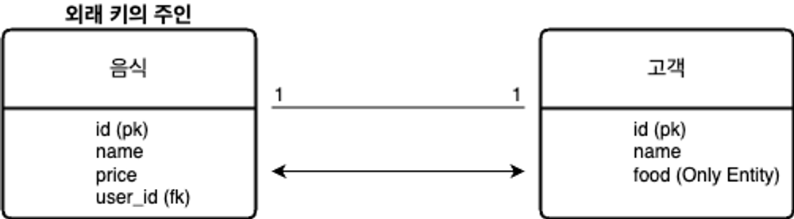
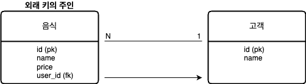
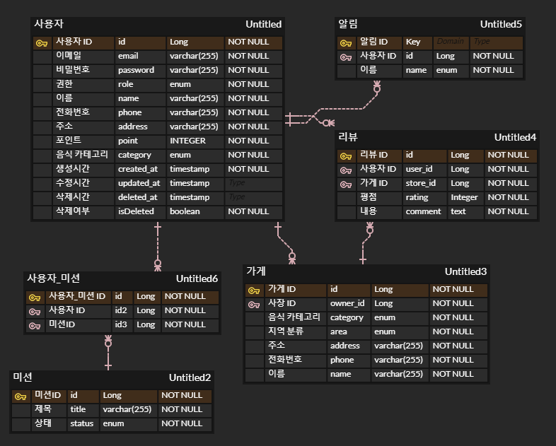

# UMC 1주차

- 외래키
    
    어떤 릴레이션의 기본키를 참조하는 속성 또는 속성들의 집합.
    
    테이블 간 관계를 나타내기 위해 사용됨.
    
- 기본키
    
    후보키: 유일성과 최소성을 만족하는 속성 또는 속성들의 집합
    
    이 후보키 중 기본적으로 사용하기 위해 선택한 것이 기본 키.
    
    null 값을 가질 수 없고, 동일한 값이 중복되어 저장될 수 없다. 
    
     
    
- ER 다이어그램
    
    데이터베이스 구조를 파악하기 위해 Entity(개체)와 Relationship(관계)를 중점적으로 표시하는 다이어그램으로 구체화 하는 것.
    
- 복합 키
    
    두 개 이상의 컬럼으로 구성된 기본키. 
    
    한 테이블 내에서 특정 컬럼 조합의 고유성을 보장해 데이터 중복을 방지하고 무결성을 유지할 수 있다.
    
    또한 데이터베이스 설계의 정규화 과정에서 발생하는 테이블 간 관계를 나타내는 데 유용하게 사용된다.
    
- 연관관계
    
    테이블은 실제 데이터를 db에 저장하는 물리적으로 존재하는 것이고, 엔티티는 db의 테이블을 추상화한 개념.
    
    -연관관계란?
    
    두 도메인이 서로 논리적인 의미를 갖고 양쪽을 참조하는 관계
    
    ### 1대 1
    
    @OneToOne
    
    -단방향
    
    - 음식
        
        ```java
        @Entity
        @Table(name = "food")
        public class Food {
            @Id
            @GeneratedValue(strategy = GenerationType.IDENTITY)
            private Long id;
            private String name;
            private double price;
        
            @OneToOne
            @JoinColumn(name = "user_id")
            private User user;
        }
        ```
        
    - 고객
        
        ```java
        @Entity
        @Table(name = "users")
        public class User {
            @Id
            @GeneratedValue(strategy = GenerationType.IDENTITY)
            private Long id;
            private String name;
        }
        ```
        
    
    -양방향
    
    jpa에서 양방향 연관 관계 설정 시, 어떤 엔티티가 외래 키를 실제로 관리할지를 정해야하는데, 이떄 외래 키를 갖는 엔티티가 주인이됨.
    
    
    
     
    
    이때, 외래 키를 갖지 않는 쪽 엔티티에서 mappedBy 설정 필요하다.
    
    - 음식 Entity가 외래 키의 주인인 경우!
        - 음식
            
            ```java
            @Entity
            @Table(name = "food")
            public class Food {
                @Id
                @GeneratedValue(strategy = GenerationType.IDENTITY)
                private Long id;
                private String name;
                private double price;
            
                @OneToOne
                @JoinColumn(name = "user_id")  //외래키 주인쪽에서 joincolumn
                private User user;
            }
            ```
            
        - 고객
        
        양방향일 경우 외래키의 주인이 아닌 쪽에서도 mappedby속성으로 매핑 시켜줌.
        
        이때 속성값은 상대 엔티티에 매핑된 필드값이 되어야함.
        
        ```java
        @Entity
        @Table(name = "users")
        public class User {
            @Id
            @GeneratedValue(strategy = GenerationType.IDENTITY)
            private Long id;
            private String name;
        
            @OneToOne(mappedBy = "user")
            private Food food;
        		//mappedBy의 속성값은 user클래스가 아닌 상대 엔티티의 필드값 user임
            //db에는 적용 x / 외래키 직접 소유 x
        }
        ```
        
    
    ## N대 1
    
    @ManyToOne
    
    -단방향 
    
    
    
    - 음식
        
        ```java
        @Entity
        @Table(name = "food")
        public class Food {
            @Id
            @GeneratedValue(strategy = GenerationType.IDENTITY)
            private Long id;
            private String name;
            private double price;
        
            @ManyToOne
            @JoinColumn(name = "user_id")  //실제db에도 외래키를 음식 엔티티 본인이 가짐
            private User user;
        }
        ```
        
    - 고객
        
        ```java
        @Entity
        @Table(name = "users")
        public class User {
            @Id
            @GeneratedValue(strategy = GenerationType.IDENTITY)
            private Long id;
            private String name;
        }
        ```
        
    
    -양방향
    
    
    
    - 양방향 참조를 위해 고객 Entity에서 Java 컬렌션을 사용하여 음식 Entity 참조
        
        
        음식 Entity가 N의 관계로 외래 키의 주인
        
        - 음식
            
            ```java
            @Entity
            @Table(name = "food")
            public class Food {
                @Id
                @GeneratedValue(strategy = GenerationType.IDENTITY)
                private Long id;
                private String name;
                private double price;
            
                @ManyToOne
                @JoinColumn(name = "user_id")
                private User user;
            }
            ```
            
        - 고객
    
    ```java
    @Entity
    @Table(name = "users")
    public class User {
        @Id
        @GeneratedValue(strategy = GenerationType.IDENTITY)
        private Long id;
        private String name;
    
        @OneToMany(mappedBy = "user")
        private List<Food> foodList = new ArrayList<>();
    }
    ```
    
    <aside>
    💡
    
    N:1 과 1:N
    
    N:1 이면 N 쪽이 외래키의 주인, 1:N이면 1 쪽이 주인이 됨. 
    
    관점의 차이로 onetomany를 사용하면 단방향 설정시  jpa에서 중간 테이블을 생성하기에 잘 사용하지 않고, 
    1쪽에서 외래키를 직접 관리하면 불필요한 업데이트가 발생하기에 성능이 나빠 잘 사용 x.
    
    </aside>
    
    ## -N대 M
    
    `@ManyToMany` 를 사용하면 jpa에서 자동으로 중간 테이블을 생성하지만
    
    - 중간 테이블에 **추가적인 컬럼**을 추가할 수 없음 (예: 등록일, 상태 등).
    - 중간 테이블에 대한 **개별 제어가 불가능**함.
    - **연결 테이블에 대한 직접적인 CRUD가 어렵고 성능 튜닝이 제한적**
    
    위와 같은 점 때문에 실무에서는 잘 쓰이지 않고 중간 테이블을 직접 엔티티로 만들어 OneToMany + ManyToOne으로 처리하는 것이 일반적
    
    
    
    - 중간 테이블 orders를 직접 생성하여 관리하면 변경 발생 시 컨트롤하기 쉽기 때문에 확장에 유리.
    
    - 음식
        
        ```java
        @Entity
        @Table(name = "food")
        public class Food {
            @Id
            @GeneratedValue(strategy = GenerationType.IDENTITY)
            private Long id;
            private String name;
            private double price;
        
            @OneToMany(mappedBy = "food")
            private List<Order> orderList = new ArrayList<>();
        }
        ```
        
    - 고객
        
        ```java
        @Entity
        @Table(name = "users")
        public class User {
            @Id
            @GeneratedValue(strategy = GenerationType.IDENTITY)
            private Long id;
            private String name;
        
            @OneToMany(mappedBy = "user")
            private List<Order> orderList = new ArrayList<>();
        }
        ```
        
    - 주문
        
        ```java
        @Entity
        @Table(name = "orders")
        public class Order {
            @Id
            @GeneratedValue(strategy = GenerationType.IDENTITY)
            private Long id;
        
            @ManyToOne
            @JoinColumn(name = "food_id")
            private Food food;
        
            @ManyToOne
            @JoinColumn(name = "user_id")
            private User user;
        }
        ```
        
    
- 정규화
    
    관계형 데이터베이스에서 중복을 최소화하기 위해 데이터를 구조화하는 작업. 
    
    하나의 종속성이 하나의 릴레이션에 표현될 수 있도록 데이터를 분해하는 과정.
    
    장점:
    
    데이터 중복을 제거하고 무결성 유지, 이상현상을 방지할 수 있음.
    
    단점:
    
    join이 많아져 여러 테이블을 조회해야하기에 성능 저하.
    
- 반 정규화
    
    의도적으로 정규화 원칙을 위배하는 것으로, 성능 향상을 위해 데이터 중복을 허용하고 join을 줄이는 방법.
    
    정규화된 테이블을 다시 합쳐 성능을 향상.
    
    장점:
    
    join을 제거하여 데이터를 빠르게 조회해 성능 향상.
    
    단점:
    
    데이터 중복 증가로 저장 공간을 낭비. 
    
    데이터 무결성 유지의 어려움(서로 다른 데이터가 저장될 수 있음).
    
    데이터 갱신 시 비용 증가.
    



설계한 erd에서 user의 엔티티의 경우를 생각해보겠다.

### -1NF

category 컬럼의 경우 사용자가 선호하는 음식 카테고리가 여러 개일 수 있기에, **속성 하나는 하나의 속성 값만을 가져야 한다**는 1차 정규형 원칙에 위배된다.

그래서 category를 따로 테이블로 설계하고, user와 category를 n:m 관계로 설계한다면 사용자는 제 1 정규형 원칙에 어긋나지 않고 여러 개의 category를 선택할 수 있다.

### -2NF

제 1 정규화를 진행한 테이블에 대해 완전 함수 종속을 만족하도록 하는 것으로, **기본키 중 특정 컬럼에만 종속된 컬럼이 없어야** 한다는 것이다.

여기서 완전 함수 종속이란 기본키의 부분집합이 결정자가 되어서 안된다는 것을 의미.

설계한 엔티티의 컬럼들은 id에 종속되기에 제 2 정규화 원칙에 어긋나는 부분은 없다 판단했다.

### -3NF

제 2 정규형을 만족하는 상태에서 **이행 함수 종속을 제거**하는 정규화 하는 과정을 말하는 것이다. 

 X → Y, Y → Z 일떄, X → Z 이면 이행 함수 종속이 발생하고, 이를 제거하는 과정이 제 3 정규화이다.

이 역시도 모든 컬럼들이 기본 키 id에 종속되기에 이행 함수 종속이 없다 판단했다.

### -생각

그래서 위와 같이 정규화 원칙에 따라 erd 설계를 고려해보았고, category 테이블을 따로 분리하여 user와 category 사이에 중간테이블을 두고 관리하는 방식을 고려해볼 수 있을 것이다.

또한 category, role과 같이 정해진 값이 들어가는 컬럼들은 enum으로 관리하는 방식과 별도의 테이블로 관리하는 방식을 고려해볼 수 있는데 각각 장단점이 있다.

enum으로 관리시 구현이 간단하고 지정해둔 값만 저장 가능하기에 무결성 유지에 좋다. 

하지만 실제 서비스를 운영한다면 새로운 값을 추가하려면 코드 수정 및 재배포가 필요해지고, enum값에 변경이 생기게 된다면 기존 데이터에는 업데이트 되지 않는다는 점이 있다.

테이블로 따로 관리시에는 새로운 값이 추가되어도 코드 수정없이 DB에서 관리가 가능해 확장성이 높아진다.

다만 테이블 간 조인이 필요해져 조회 속도가 느려지고 설계가 복잡해진다는 단점이 있다.

실무에서는 항상 서버가 돌아가고 있어야 하기에 위와 같은 점들에도 테이블로 관리하는 방식을 많이 쓴다고 한다.

내 생각에는 크게 변경점이 발생하지 않을 Role과 같은 부분은 Enum으로 관리하고, 추후 운영에 있어 추가되거나 변경 사항이 발생할 부분은 테이블로 관리하면 좋을 것 같다.

서비스 운영 목적으로 erd를 설계한 것은 아니기에, 두 부분 모두 enum으로 관리하도록 설계했다. 

---

## 공유 락(shared lock) 베타 락(exclusive lock)

### 공유 락(shared lock):

여러 트랜잭션이 동시에 읽기 작업을 수행할 수 있도록 허용하는 락
다른 트랜잭션에서 동일한 행에 공유 락은 생성 가능하지만, 베타 락은 불가

다른 공유 락과 동시에 공유는 가능하지만, 쓰기나 베타 락은 허용하지 않는 잠금

### 베타 락(exclusive lock):

특정 트랜잭션이 데이터를 읽고 수정할 수 있도록 하는 락
다른 트랜잭션에서 공유, 베타 락 모두 생성 불가

한 번에 하나의 트랜잭션만 해당 데이터에 접근 가능 (다른 트랜잭션의 락을 허용하지 않음)

(베타 락을 걸린 상태에서는 다른 트랜잭션이 읽기를 못함 but 락을 사용하지 않는 일반 select는 읽기가 가능할 수 있음)

## 비관적 락 낙관적 락

### 비관적 락:

데이터를 읽거나 변경할 때 다른 트랜잭션이 동시에 접근하지 못하도록 db에 락을 걸고 시작하는 방식.

동시 갱신을 막을 수 있어 무결성을 보장할 수 있고 보다 안전하지만, 여러 트랜잭션이 대기해야 하므로, 동시성이 낮아 성능 저하 가능성 및 서로 락을 기다리며 교착 상태(데드락)에 빠지게될 수 있음

트랜잭션 간 충돌이 자주 발생하는 경우 (예: 좌석 예매, 은행 계좌 이체).

데이터 일관성이 최우선인 경우 사용

(트랜잭션이 시작될 때 Shared Lock 또는 Exclusive Lock을 걸고 시작하는 방법으로 미리 락을 걸어 충돌을 방지하기에 충돌 발생할 일이 없어 트랜잭션 실패시에도 자동으로 롤백됨)

### 낙관적 락:

데이터를 수정할때만 충돌을 검사하고 충돌이 발생했을 때만 해결. 락을 사용하지 않으며 동시성이 높아 성능이 좋음. 주로 읽기 작업이 많고, 쓰기 충돌이 적은 경우 사용.

성능이 좋지만 충돌 발생시 트랜잭션 실패시키고 재시도해야함.

충돌 발생 후 처리하는 방식이기에 애플리케이션에서 직접 롤백 처리나 예외를 발생시켜야함.

### 분산 락

- 비관적 락, 낙관적 락은 단일 db에서만 유효하지만, 분산 시스템에서는 하나의 db 트랜잭션만으로 다른 애플리케이션에서의 동시 실행을 막을 수 없기에 동시성 제어가 어렵다.
- 비관적 락은 트랜잭션 단위에서만 락이 유지되기에, 트랜잭션이 종료된 후에도 실행 중인 다른 서비스가 같은 리소스를 수정하는 것을 막을 수 없다.

### 분산락의 목적:

단일 서버에서는 DB락, synchronized 로도 동시성 제어가 어느 정도 가능하지만

MSA 환경과 같이 여러 분산된 서버가 존재시, 여러 서버에서 공유 자원에 접근하여 발생하는 race condition(경쟁상태) 자체를 없앤다.

그래서 분산 락 선택.

그런데 분산락에도 mysql로도 (네임드 락을 사용해) 구현 가능했고, redis로 구현하는 방식 존재.

### 1. mysql로 구현 시

중요한 비즈니스 데이터가 존재하는 db에서 락을 관리하기에 부담이 있고, 락을 자동으로 해제할 수 없어 명시적으로 해제해야 했다.

### 2. redis 구현 시

인메모리 db이므로 디스크 기반으로 동작하는 mysql에 비해 성능이 뛰어나고,

(db락은 각 서버가 개별적으로 락을 관리하지만) redis는 분산형 메모리 내 데이터 저장소로, 분산환경에서의 락을 구현 가능. (하나의 중앙 집중형 락을 제공)

그런데 redis에서도 분산락을 구현하는 방법이 여러 가지가 있는데..

### -Lettuce

spin lock(락을 획득하려는 스레드가 락을 사용할 수 있는지 반복적으로 확인하며 락 획득 시도) 방식으로 지속적으로 redis에 요청을 보내 lock 여부 확인

장점:

spring data redis를 이용하면 lettuce가 기본 라이브러리이기 때문에 별도의 라이브러리를 사용하지 않아도 된다.

단점:

spin Lock 방식이므로 동시에 많은 스레드가 Lock 획득 대기 상태라면 redis에 부하를 줄 수 있다.

setnx(set if not exist의 줄임말로, 키와 밸류를 set 할 때 기존의 값(key)이 없을 때만 set(락 획득) 하는 명령어), setex 등을 이용해 분산락을 직접 구현해야 한다. 

개발자가 직접 retry, timeout과 같은 기능을 구현해 주어야 한다는 번거로움이 있다. retry 로직을 개발자가 작성해줘야 한다. 

### -redisson

pub-sub 기반으로 락 구현을 제공

장점:

Lettuce는 계속 락 획득을 시도하는 반면, Redisson은 락 해제가 되었을 때만 한 번, 혹은 몇 번만 시도를 하기 때문에 레디스의 부하를 줄여준다. (pub-sub 방식으로 구현되었기 때문이다)

단점:

별도의 라이브러리를 사용해줘야 한다.

lock을 라이브러리 차원에서 제공해주기 때문에 사용법 학습을 따로 해줘야 한다.

이러한 점을 바탕으로 동시에 공유 자원에 접근하게되는 상황이 매우 많으므로, 매 요청마다 락을 획득할때까지 시도하면 상당한 부하를 줄 수 있따 생각해 부하를 더 줄일 수 있도록  redisson 분산 락 사용 결정했다.

---

프론트에서도 처리해볼 수도 있을 것 같아서 찾아본 방법으로

### **(1) 버튼 비활성화 (Disable 버튼)**

사용자가 버튼을 누르면 즉시 비활성화하여 추가 클릭을 방지

### **(2) 로딩 상태 활용 (Throttle / Debounce 적용)**

- Throttle: 일정 시간 간격으로만 요청을 보냄
- Debounce: 마지막 클릭 후 일정 시간 후에만 요청을 보냄

몇 초간은 중복 요청을 방지할 수 있다고 한다.

하지만 네트워크 지연, 비동기 로직 등으로 **중복 요청이 발생할 수 있기 때문에** 근본적인 해결책이 될 수는 없을 것 같다. 

또 다른 방법으로는 UNIQUE INDEX 라는 방법이 있다고 해서 가져와봤다.

테이블의 특정 컬럼들(user_id, mission_id)에  **UNIQUE INDEX**를 추가하여 같은 유저가 같은 미션을 연속으로 수행하지 못하게 할 수 있다고 한다.

같은 `user_id + mission_id` 조합이 이미 DB에 있으면 `UNIQUE` 제약 조건 위반으로 예외를 발생시키는 식으로 구현하여 중복 요청임을 사용자에게 알려줄 수 있을 것 같다.