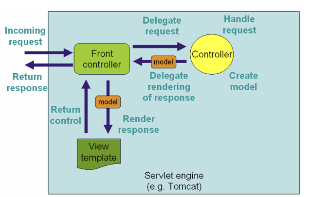

# 시니어 미션

### **서블릿 vs. Spring MVC 비교**

**💡 미션:**

- **전통적인 서블릿(Servlet) 기반 개발과 Spring MVC의 차이**를 조사하고,
    - `HttpServlet`, `doGet()`, `doPost()` 방식과
    - `@Controller`, `@RequestMapping`, `DispatcherServlet` 구조를 비교.
- Spring MVC가 왜 서블릿보다 편리한지 **프레임워크의 역할과 함께 정리해보기**
- **DispatcherServlet**이 내부적으로 요청을 처리하는 방식 단계별 분석하고, (키워드: HandlerMapping, HandlerAdpater) 다이어그램을 그려서 단계별로 설명하기

**🔎 참고 레퍼런스:**

- [Spring 공식 문서 - 서블릿과 인터셉터](https://docs.spring.io/spring-framework/reference/web/webmvc/mvc-servlet.html)
- [Spring MVC 공식 문서](https://docs.spring.io/spring-framework/reference/web/webmvc.html)

## Servlet

웹 서비스를 위해서 http protocol을 통해 클라이언트는 서버에게 데이터를 요청한다. 이때 **동적으로 클라이언트에게 화면을 뿌려주는 역할.**

## Spring MVC

Model, View, Controller 구조로 이어진 패턴.

- Model
    - 데이터와 비즈니스 로직을 관리/처리.
    - 즉, 사용자의 요청에 대한 업무를 처리.
    - DAO(Data Access Object) 등의 Java class
- View
    - 사용자가 보게될 결과 화면을 담당. (레이아웃, 화면 처리 등)
    - HTML, JSP
- Controller
    - 사용자의 입력 처리와 흐름을 제어하고, 사용자에게 받은 명령을 model이나 view로 라우팅.
    - 사용자로부터의 입력에 대한 응답으로 모델/뷰를 업데이트.
    - Servlet이 MVC 내의 Controller가 된다.

## HttpServlet

서블릿이 요청을 처리할 수 있도록 허용하기 위해 메소드를 재정의하여 서블릿을 요청했을떄에 대한 응답을 정의

-doGet: Get방식에서 호출되는 메소드로 데이터가 url에 노출. 즉 헤더에 포함하여 요청.

-doPost: Post방식에서 호출되는 메소드로 데이터가 url에 노출 x. 데이터가 바디에 포함됨.

## DispatcherServlet

프론트 컨트롤러라고도 불리며 HTTP 프로토콜로 들어오는 모든 요청을 먼저 받아서 적합한 컨트롤러에 위임하는 역할.

동작 과정

1. DispatcherServlet이 클라이언트의 모든 요청을 받음.
2. 요청 정보에 대해 HandlerMapping에 위임. 처리할 controller(handler) 찾아매핑
3.  2에서 찾은 handler를 수행할 HadlerAdapter를 찾음
4. HandlerAdapter는 Controller에 비즈니스 로직 처리를 호출.
5. Controller는 비즈니스 로직을 수행후 처리결과를 model에 설정. HandlerAdapter에 view name을 반환
(모델 반환시 view렌더링 , 아니면 restcontroller로 view 없이 반환) 
6. 5에서 받은 view name을 viewResolver에 전달 후 해당 view 객체를 반환
7. DispatcherServlet은 view에게 model 전달, 화면 표시를 요청
8. 서버의 응답을 클라이언트에 반환

[Spring DispatcherServlet(디스패처서블릿) 개념부터 동작 과정까지](https://zzang9ha.tistory.com/441)

### **AOP(Aspect-Oriented Programming) 원리 탐구**

**💡 미션:**

- AOP가 무엇인지, 그리고 왜 필요한지 개념적으로 정리한 내용을 블로그 내용에 정의하기
    - **OOP와 AOP의 차이점** 분석.
    - **AOP의 핵심 개념(Advice, JoinPoint, Pointcut, Aspect, Weaving)** 정리.
    - AOP가 적용되는 **런타임 위빙 vs 컴파일 타임 위빙**의 차이점 조사.
- Spring에서 AOP가 프록시 패턴(Proxy Pattern)을 활용하여 동작하는 원리 분석.

**🔎 참고 레퍼런스:**

- [Spring AOP 공식 문서](https://docs.spring.io/spring-framework/reference/core/aop.html)

## AOP(Aspect Oriented Programming)

관점 지향 프로그래밍.

어떤 로직을 기준으로 핵심적 기능, 공통 기능으로 나누어 보고 그 관점을 기준으로 각각 모듈화 하는 것.

핵심적인 관점은 개발하고자 하는 핵심 비즈니스 로직이면, 공통 기능은 핵심 로직을 실행하기 위해 행하는 db연결, 로깅, 보안, 트랜잭션 등을 예시로 들 수 있다.

한마디로 말하면 공통된 기능을 재사용하는 기법.

### **Target**

부가기능을 부여할 대상(클래스)을 의미한다. 바로 아래서 설명하는 Aspect가 적용되는 대상

### **Aspect**

객체지향 모듈을 오브젝트라 부르는 것과 비슷하게 부가기능 모듈을 Aspect라고 부르며, **핵심 기능에 부가되어 의미를 갖는 특별한 모듈**

Aspect = Advice + PointCut

### **Advice**

Aspect에서 실질적으로 어떤 일을 해야할지에 대한 부가기능을 담은 구현체

### **JoinPoint**

Advice가 적용될 위치. spring에선 advice가 적용되는 메소드

### **PoinCut**

부가기능이 적용될 대상(메서드)를 선정하는 방법

### **Proxy**

Target을 감싸서 Target에 들어오는 요청을 대신 받아주는 Warpping 오브젝트

### Weaving?

Pointcut에 의해서 결정된 타겟의 Join Point에 부가기능(Advice)를 삽입하는 과정

AOP가 핵심기능(타겟)의 코드에 영향을 주지 않으면서 필요한 부가기능(어드바이스)를 추가할 수 있도록 해주는 핵심적인 처리과정

### Compile Time Weaving(CTW)

- AspectJ에는 AJC (AspectJ Compiler)라는 컴파일러가 있는데 Java Compiler를 확장한 형태의 컴파일러.
- AJC를 통해 java파일을 컴파일 하며, 컴파일 과정에서 바이트 코드 조작을 통해 Advisor 코드를 직접 삽입하여 위빙을 수행.
- 장점으로는 가장 빠름.
- 하지만 컴파일 과정에서 lombok과 같이 컴파일 과정에서 코드를 조작하는 플러그인과 충돌이 발생할 가능성이 아주 높다. (거의 같이 사용 불가)
- AspectJ에는 AJC (AspectJ Compiler)라는 컴파일러가 있다.

### Runtime Weaving(RTW)

- Spring AOP에서 사용하는 방식으로, Proxy를 생성해 실제 타깃 오브젝트의 변형없이 위빙을 수행한다.
- 실제 런타임시 Method 호출 시에 위빙이 이루어지는 방식이다.
- 소스파일, 클래스 파일에 변형이 없다는 장점이 있지만, Point Cut에 대한 Advice 수가 늘어날수록 성능이 떨어진다는 단점이 있다.

## OOP

객체 지향 프로그래밍.

공통된 목적을 띤 데이터와 동작을 묶어 하나의 객체로 정의하는 것이 핵심. 

- 캡슐화

데이터와 그 데이터를 처리하는 메서드를 하나의 단위로 묶어

- 은닉화

캡슐화의 목표. 내부 구조는 private하게 감춰두고 외부에서 조작할 수 있는 정보만 public으로 공개

- 추상화

객체의 공통된 특성을 추출하여 모델링

- 상속

코드의 재사용성이 증가하고, 클래스 간의 계층 구조를 형성

- 다형성

동일한 메서드명이지만 다른 동작을 수행

## Spring AOP 작동 원리

-proxy 패턴

Spring AOP에서 프록시 패턴이 동작하는 핵심 아이디어는, **실제 객체를 감싸는 대리 객체(프록시)를 생성**해서 메서드 호출을 가로채고, 필요한 로직(Advice)을 수행한 뒤 원본 객체에 위임하도록 하는 것

1. **스프링 컨테이너가 빈(Bean)을 생성**
    - 스프링은 설정(Annotation, XML 등)을 기반으로 빈 A의 인스턴스(예: A 객체)를 생성. (그림 상 1번 “생성”)
2. **AOP 적용 대상 여부 확인**
    - 스프링은 AOP 설정(Advisor, Advice, Pointcut 등)을 참고하여, 현재 생성된 A 객체가 **프록시 생성 대상**인지 확인. (그림 상 2번 “전달” 후, 3번 “빈 후처리기”에서 Advisor 정보를 확인)
3. **프록시(Proxy) 객체 생성**
    - AOP 적용 대상(Advisor나 Pointcut에 매칭)이면, 스프링은 A 객체를 감싸는 **프록시 객체**를 생성.
    - 프록시 안에는 A 객체의 메서드 호출을 대리할 로직이 구현되어 있으며, 필요한 Advice(메서드 전후 로직, 예외 처리 로직 등)를 호출 가능. (그림 상 4번 “프록시 생성”)
4. **프록시 객체 빈 등록**
    - 실제 A 객체가 아니라, 새로 생성된 프록시 객체를 스프링 컨테이너 내 Bean으로 등록. (그림 상 5번 “A 프록시 등록”)
    - 이후 애플리케이션에서 의존성 주입(Autowired 등)을 통해 A를 주입받으려 하면, 스프링은 실제 A 객체 대신 “A 프록시”를 반환.
5. **메서드 호출 시 Advice 적용**
    - 클라이언트(또는 다른 빈)에서 A의 메서드를 호출하면, 사실상 **A 프록시 객체**의 메서드를 부르게 됨. (A와 동일한 인터페이스/메서드 시그니처)
    - 프록시 메서드는 스프링 AOP 엔진이 제공한 Advice(전처리, 후처리, 예외 처리 등)를 먼저 실행하거나, 혹은 조건(Pointcut)에 맞지 않으면 바로 원본 A 객체 메서드에 위임.
    - 이 과정에서 Pointcut을 통해 어떤 메서드가 Advice 대상인지 필터링하며, 해당 로직(Advice)을 실행한 후 실제 A 객체의 메서드 호출.
6. **실제 A 객체 메서드 호출 & 결과 반환**
    - 프록시는 필요 시 A 객체의 실제 메서드를 호출하고, 그 결과(리턴 값)나 예외를 다시 클라이언트에게 전달

[[Spring] AOP 개념 및 적용하기](https://dgjinsu.tistory.com/31)

[Spring AOP Weaving, Proxy](https://velog.io/@dnjwm8612/AOP-Weaving-Proxy)

- **🍀 도전 과제**
    - 기존 UMC에서 진행했던 프로젝트를 AOP 기반 Logging 전략을 채택하여 리팩토링할 수 있는 방안에 대해 논의해보세요.
    
    AOP(관점 지향 프로그래밍)를 활용하면 로깅과 같이 여러 곳에서 공통적으로 사용하는 횡단 관심사를 비즈니스 로직에서 분리할 수 있다. 코드 가독성 향상, 유지보수성 및 재사용성 향상 가능
    
    - **로깅 코드 분리**
        
        기존에 각 클래스나 메서드마다 삽입된 로깅 코드를 일일이 관리하는 대신, 로깅에 관한 코드를 하나의 별도 클래스로 분리(Aspect)하여 횡단 관심사로 관리.
        
    - **AOP Aspect 생성**
        - **@Aspect**와 **@Component** 어노테이션을 사용하여 Logging Aspect를 정의.
        - 메서드 호출 전, 후, 또는 전체 실행 시간을 측정하는 등의 다양한 Advice(예: @Before, @After, @Around)
    - **Pointcut 설정**
        - 로깅을 적용할 대상(예: 특정 패키지 내 모든 클래스의 메서드, 컨트롤러, 서비스, DAO 등)에 대한 Pointcut을 정의.
        - 이를 통해 해당 대상에만 로깅이 적용되도록.
    - **로깅 프레임워크와 연동**
        
        SLF4J, Log4j2, 또는 Logback 등의 로깅 라이브러리와 연동하여 필요한 로깅 정보를 출력.
        
    - **리팩토링 효과**
        - 비즈니스 코드가 깔끔해지고, 로깅 코드의 중복 제거
        - 로깅 정책(예: 출력 포맷, 로그 레벨, 실행 시간 측정 등)을 일괄적으로 관리 가능
        - 유지보수 및 확장이 용이함