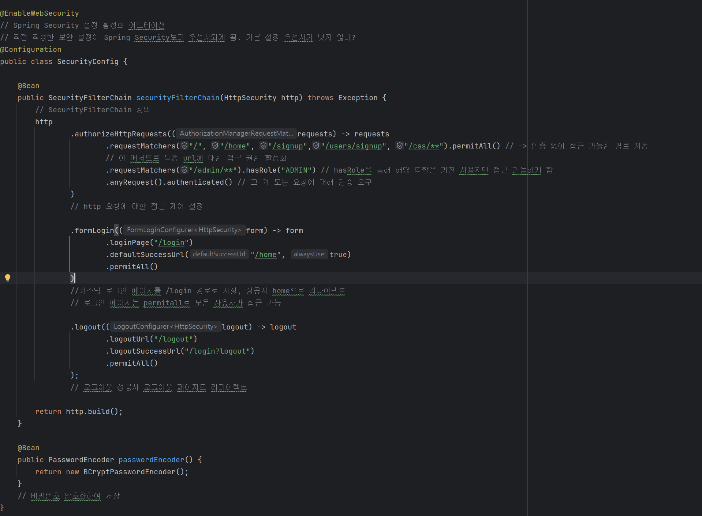

# Chapter 10. 로그인 및 회원 가입

<aside>
 **목차**

</aside>

## 🎯 핵심 키워드

<aside>
💡 주요 내용들을 정리하고, 여러분만의 생각을 통해 정리해보세요!

- 레퍼런스를 참고하여 정의, 속성, 장단점 등을 적어주셔도 괜찮습니다.
- 조사는 공식 홈페이지 **Best**, 블로그(최신 날짜) **Not Bad**
</aside>

- **Spring Security**
    
    스프링 기반의 어플리케이션에서 인증과 인가 등 보안 관련 기능을 제공하는 프레임워크이다. 
    
    인증/인가를 직접 구현하는 것보다 훨씬 안전하고, 최신 보안 트렌드에 맞는 기능을 간단하게 적용할 수 있게 된다.
    
    세션 고정 공격 등 웹 취약점에 대한 방어책을 기본적으로 제공하며, 유지보수 및 확장성을 크게 개선할 수 있게 된다.
    
    주요 기능은 다음과 같다.
    
    - 인증
    - 사용자가 누구인지 확인하는 과정
    - 아이디/비밀번호 입력 뿐 만 아니라 2차 인증까지 가능함
    - 인가
    - 인증된 사용자가 시스템 내에서 어떤 리소스에 접근할 수 있는지 결정
    - 관리자만 접근 가능한 페이지, 특정 역할만 접근 가능한 API 설정등
    - CSRF 보호
    사용자가 의도하지 않은 요청을 공격자가 보내는 것을 막기 위해CSRF 토큰을 사용
    - 세션 관리
    - 로그인 시 새로운 세션을 생성하고 이전 세션을 무효화함
    - 동시 세션 제한, 세션 만료, 세션 고정 공격 방지 등 다양한 세션 보안 기능 제공
    - 외부 인증 연동
    카카오, 네이버, 구글 등 소셜 로그인 등 다양한 인증 방식을 지원함
    - 보안 헤더 관리
    클릭재킹 등 다양한 웹 취약점 방지를 위한 HTTP 보안 헤더를 자동으로 추가해줌
- **인증(Authentication)과 인가(Authorization)**
    
    인증은 사용자가 누구인지 확인하는 과정, 로그인이 곧 인증과정이다. 
    
    시스템에 접근하려는 사용자가 등록된 사용자인지 확인하며, 인증이 성공해야 시스템의 다음 단계로 넘어갈 수 있다.
    
    네이버에 로그인하지 않고서는 메일을 보낼 수 없는 것과 같다.
    
      
    
    인가는 인증된 사용자가 시스템 내의 어떤 자원에 접근할 수 있게 하는지 결정하는 과정이다.
    
    인증된 사용자일지라도 모든 권한에 접근해서는 안 된다. 각 사용자에게 필요한 최소한의 권한만 부여되어야 한다. 이는 민감한 데이터와 기능을 보호하기 위함이다.
    
    맥도날드 키오스크의 관리자 권한을 일반 사용자가 접근해서는 안 되는 것과 같다. 
    
- **세션과 토큰**
    
    세션은 웹과 서버 간의 연결에서 사용자의 상태와 정보를 일정 시간 동안 서버가 기억하게 하는 기술이다. 웹사이트에 로그인했다면, 로그아웃하거나 웹을 종료하기 전까지 로그인되어 있는 것은 이 세션 기능 덕분에 할 수 있는 것이다.
    
    - 사용자가 웹사이트에 처음 접속하면 서버는 고유한 세선 ID를 생성한다.
    - 이 세션 ID는 쿠키에 담겨서 브라우저에 전달된다.
    - 사용자가 서버에 요청을 보낼 때 세션 ID를 함께 전송하면 서버는 해당 ID로 사용자를 식별하며, 사용자 정보를 활용해 서비스를 제공한다.
    - 로그아웃하거나 세션이 만료되면 서버는 세션 정보를 삭제한다.
    
    토큰은 인증 이후 서버가 클라이언트에게 제공하는 암호화된 문자열로, 사용자의 권한과 신원을 증명하는 역할을 한다.
    
    - 사용자가 로그인하면 서버는 인증 정보를 확인한 다음 사용자의 정보와 권한을 암호화하여 토큰을 생성
    - 토큰은 브라우저나 앱 등에 전달되어 로컬 스토리지, 세션 스토리지, 쿠키 등에 저장됨
    - 클라이언트가 서버에 요청을 보낼 때마다 토큰을 헤더에 포함시킨다.
    - 서버는 토큰의 유효성과 위변조 여부를 검증하여 사용자의 신원을 확인함
    
     
    
- **액세스 토큰(Access Token)과 리프레시 토큰(Refresh Token)**
    
    액세스토큰은 사용자가 인증에 성공한 다음 서버가 사용자에게 발급하는 문자열 형태의 토큰이다. 이 토큰은 사용자가 보호된 API나 리소스에 접근할 수 있는 권한을 증명하는데 사용된다. 다음과 같은 특징이 있다.
    
    - 10분~1시간으로 유효기간이 짧다
    - 서버에 저장되지 않는다.
    - HTTP 헤더에 액세스 토큰을 포함시켜 API 요청에 사용한다
    - 토큰이 탈취되면 유효 기간 내에는 누구나 해당 권한으로 API를 사용할 수 있다. 중요한 정보는 담지 않고 반드시 보안채널을 사용해야 한다.
    
    리프레쉬 토큰은 액세스 토큰의 만료 이후 사용자가 다시 로그인하지 않고도 새로운 액세스 토큰을 발급받을 수 있게 해준느 토큰이다. 액세스 토큰의 짧은 유효기간으로 인한 불편을 해소하면서 보안도 강화하는 역할을 한다.ㄱ
    
    - 2주~1달 등으로 유효기간이 길다
    - 서버에 저장된다
    - 액세스 토큰이 만료됐을 때 리프레시 토큰을 서버에 보내 새로운 액세스 토큰을 재발급받는다
    - 보안을 위해 한 번 사용한 리프레시 토큰은 폐기하고 새로 생성한다.

## 📢 학습 후기

<aside>
💡 이번 주차 워크북을 해결해보면서 어땠는지 회고해봅시다.

- Spring Security의 로그인 과정에 대해 완전히 이해했나요?
- 혹시 이해가 안 되는 부분이 있었나요?
- 이번 실습에서 어려웠던 부분은 무엇이었나요?
</aside>

## ⚠️ 스터디 진행 방법

1. 스터디를 진행하기 전, 워크북 내용들을 모두 채우고 스터디에서는 서로 모르는 내용들을 공유해주세요.
2. 미션은 워크북 내용들을 모두 완료하고 나서 스터디 전/후로 진행해보세요.
3. 다음주 스터디를 진행하기 전, 지난주 미션을 서로 공유해서 상호 피드백을 진행하시면 됩니다.

## 🔥 미션

<aside>
📍 **주의 사항**

결과물만 올리면 안되고, 중간 과정 또한 기록을 남겨주셔야 합니다.
(DB 연결, 테이블 생성 등)

**결과물과 중간 과정 모두 기록하여 제출**하라는 뜻입니다.

</aside>

### 필수 미션

<aside>

**⚠️ 모든 미션 과정은 깃허브에 업로드해주세요.**

</aside>

1. **실습 1: Spring Security를 활용한 로그인 및 회원가입 구현 = Session 방식**
    - 회원가입, 로그인, 로그아웃 기능을 구현하고 **DB에 저장**되는 과정을 캡처하고 설명하세요.
2. **실습 2: Spring Security를 활용한 로그인 및 회원가입 구현 = JWT 방식**
    - 회원가입, 로그인을 구현하고 **Swagger에서 테스트 및 DB에 저장**되는 과정을 캡처하고 설명하세요.

- 아래는 실습 참고 코드입니다.
    
    [GitHub - chock-cho/UMC-8th-spring-workbook at feature-week10-workbook-2](https://github.com/chock-cho/UMC-8th-spring-workbook/tree/feature-week10-workbook-2)
    

### 시니어 미션

- **카카오, 구글 또는 네이버 소셜 로그인 추가 구현**
    - 결과물과 중간 과정을 기록하여 제출하세요.
- **리프레시 토큰 방식 로그인 추가 구현**
    - 결과물과 중간 과정, 액세스 토큰만 이용했을 때의 인증방식과의 장단점을 비교해서 제출하세요.

## 💪 미션 기록

<aside>
🍀 미션 기록의 경우, 아래 미션 기록 토글 속에 작성하시거나, 페이지를 새로 생성하여 해당 페이지에 기록하여도 좋습니다!

하지만, 결과물만 올리는 것이 아닌, **중간 과정 모두 기록하셔야 한다는 점!** 잊지 말아주세요.

</aside>

- **미션 기록**
    
    그래이들 추가 후 콘피그 설정부터 했습니다.
    
    
    
    낯선 코드라 주석을 하나하나 달아보니 조금은 흐름이 잡히게 되었습니다
    
    
    
    도메인에서 새로 추가한 enum인 role을 추가하고, email이 중복 없이 저장되도록 unique를 달았습니다.
    
    
    
    DTO에 입력할 수 있게 email과 password를 추가했습니다.
    
    폼에서 입력하기 위해 setter를 추가했습니다. setter를 설정하지 않으면 폼에서 입력을 받을 수 없어 모두 null로 받게 됩니다.
    
    
    
    도메인을 바꾼 만큼, 입력값을 모두 받기 위해 converter도 수정했습니다. 
    
    데이터베이스 상에서 전화번호를 not null로 설정했는데, 테스트를 간편하게 하기 위해 기본값을 넣었습니다
    
    
    
    협업시 @requestbody를 사용하나 왜 여기서는 @modelarrtibute를 사용하는지 궁금해 찾아봤습니다.
    
    @modelarrtibute는 url 파라미터, 폼 데이터. 즉 현 상황에서 사용하기 좋은 어노테이션이었습니다.
    
    바인딩시 setter가 필요한데, 이 부분을 놓쳐 폼 화면에서 데이터가 모두 null로 넘어가는 문제가 있었습니다.
    
    @requestbody http 요청 본문의 json 파일을 처리합니다. setter가 필요하지 않으며, httpMessageConverter를 통해 변환하여 데이터를 바인딩합니다.
    
    
    
    userServiceImpl 단에서는 입력받은 DTO에서 비밀번호를 암호화하여 저장하기 위해 encodePassword 메서드를 사용했습니다. 이를 통해 비밀번호를 그대로 저장하지 않고 해싱을 거쳐 db에 저장합니다
    
    
    
    폼 화면에서 데이터를 입력해 db에 저장되는지 확인해봤습니다.
    
    
    
    비밀번호까지 잘 해시화되어 저장되었음을 알 수 있습니다.
    
    
    
    이 코드를 통해 특정 이메일을 가진 사용자를 파악하고, 사용자가 존재한다면 해당 사용자와 입력받은 값을 대조시켜 일치한다면 로그인할 수 있게 합니다.
    
    
    
    잘 로그인 됨을 알 수 있습니다.
    
    
    
    
    
    권한을 관리자로 바꾸면 관리자 페이지 버튼도 열리는 것을 확인할 수 있었습니다
    
    ### jwt 토큰 방식 로그인/회원가입
    
    
    
    
    
    우선 로그인에 필요한 dto를 web 패키지에 넣었습니다. 기존의 dto와 파일 이름이 겹쳐 경로 문제가 발생했었는데, DTO 대신 Dto로 명명해 이름 충돌을 막았습니다.
    
    
    
    jwt 기본 설정을 부여하고
    
    
    
    Jwt 토큰 프로바이더를 작성했습니다. 기능은 크게 4가지였습니다.
    
    1. generateToken을 통해 인증 정보를 받아 액세스 토큰 생성
    2. validateToken을 통해 토큰이 유효한지 검증
    3. getAuthentication을 통해 인증 정보를 추출한 다음 Spring security의 객체로 변환
    4. extractAuthentication을 통해 httpServletRequest에서 토큰 값 추출, 3번의 메서드를 활용해 객체로 전환
    
    
    
    jwtAuthenticationFilter는 jwt 토큰을 처리하는 커스텀 인증 필터로, 인증된 사용자임을 확인하기 위해 사용합니다. 이는 다음의 과정을 거쳐 토큰을 확인하고 객체를 생성합니다.
    
    1. resolveToken을 통해 순수 토큰 반환
    2. doFilterInternal()를 통해 HttpServletRequest에서 받아온 요청 객체에서 순수 토큰 추출 
    3. validateToken에서 순수 토큰 검증 과정 통과시 getAuthentication을 통해 인증 객체 생성
    
    
    
    userCommandImpl 단에서 로그인 매서드를 구현했습니다.
    
    1. findByEmail로 회원이 존재하는지 확인
    2. 암호화된 패스워드가 일치하는지 확인
    3. Authentication 객체를 만들어 jwt 토큰 발급
    
    처음에 다형성 적용이 안 되는 것 같아 확인해보니 다른 패키지를 import해서 생긴 문제였습니다. 
    
    
    
    UserQueryImpl 도 구현하여 저장된 사용자들을 불러오고자 했습니다.
    
    UserConverter에서 해당 정보들을 구현할 DTO까지 만들어 정보를 더 편하게 보고자 했습니다.
    
    
    
    
    
    RestController를 만든 다음 
    
    
    
    securityConfig를 수정하여 로그인과 회원가입 화면은 접근 가능하도록 열어두었습니다.
    
    이제 swagger를 통해 확인해보겠습니다.
    
    jwt 토큰 회원가입 성공
    
    
    
    처음에 config에서 권한 없이도 접근 가능한 페이지의 이름을 잘못 적었기에 403 forbidden이 발생했었으나, 해당 페이지를 허용해두니 회원가입에 성공했음을 알 수 있었습니다.
    
    jwt 토큰 로그인 성공
    
    
    
    회원가입한 정보로 로그인해보니 성공했음을 확인했습니다.
    
    db에도 해당 정보가 저장되었음을 알 수 있었습니다.
    

> **GitHub 저장소 주소**
> 
> 
> https://github.com/…
> 

## ⚡ 트러블 슈팅

<aside>
💡 실습하면서 생긴 문제들에 대해서, **이슈 - 문제 - 해결** 순서로 작성해주세요.

스스로 해결하기 어렵다면? 스터디원들에게 도움을 요청하거나 **너디너리의 지식IN 채널**에 질문해보세요!

</aside>

- ⚡이슈 작성 예시 (이슈가 생기면 아래를 복사해서 No. 1, No. 2, No. 3, … 으로 작성해서 트러블 슈팅을 꼭 해보세요!)
    
    **`이슈`**
    
    👉 앱 실행 중에 노래 다음 버튼을 누르니까 앱이 종료되었다.
    
    **`문제`**
    
    👉 노래클래스의 데이터리스트의 Size를 넘어서 NullPointException이 발생하여 앱이 종료된 것이었다. 
    
    **`해결`**
    
    👉  노래 다음 버튼을 눌렀을 때 데이터리스트의 Size를 검사해 Size보다 넘어가려고 하면 다음으로 넘어가는 메서드를 실행시키지 않고, 첫 노래로 돌아가게끔 해결
    
    **`참고 레퍼런스`**
    
    - 링크
- ⚡이슈 No. 1
    
    **`이슈`**
    
    👉 [트러블이 생긴 상태 작성]
    
    **`문제`**
    
    👉 [어떤 이유로 해당 이슈가 일어났는지 작성]
    
    **`해결`**
    
    👉  [해결 방법 작성]
    
    **`참고 레퍼런스`**
    
    - [문제 해결 시 참고한 링크]

Copyright © 2025 신수정(베뉴) All rights reserved.

Copyright © 2024 김준석(벡스) All rights reserved.