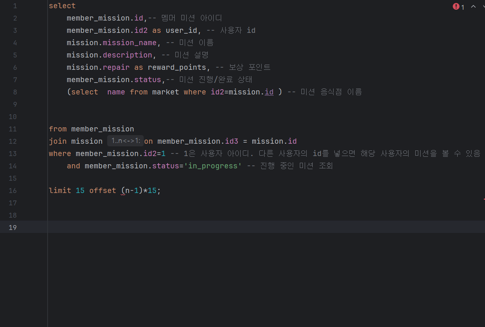

# Chapter 2. 실전 SQL - 어떤 Query를 작성해야 할까?

# 🎯 핵심 키워드

---

<aside>
💡 주요 내용들에 대해 조사해보고, 자신만의 생각을 통해 정리해보세요!
레퍼런스를 참고하여 정의, 속성, 장단점 등을 적어주셔도 됩니다.
조사는 공식 홈페이지 **Best**, 블로그(최신 날짜) **Not Bad**

</aside>

이번 주차는 키워드가 딱히 없습니다!

원하실 경우 join연산에 대해 더 알아보는 정도면 될 것 같습니다.

## 📢 학습 후기

---

- 이번 주차 워크북을 해결해보면서 어땠는지 회고해봅시다.
- 핵심 키워드에 대해 완벽하게 이해했는지? 혹시 이해가 안 되는 부분은 뭐였는지?

<aside>
💡 sql에 대해서는 간략하게만 알고 있습니다. 조인은 개념만 알고 서브쿼리는 자세히 알지 못 하는데, 따로 공부해서 알아봐야 할 것 같습니다.

</aside>

## ⚠️ 스터디 진행 방법

---

1. 스터디를 진행하기 전, 워크북 내용들을 모두 채우고 스터디에서는 서로 모르는 내용들을 공유해주세요.
2. 미션은 워크북 내용들을 모두 완료하고 나서 스터디 전/후로 진행해보세요.
3. 다음주 스터디를 진행하기 전, 지난주 미션을 서로 공유해서 상호 피드백을 진행하시면 됩니다.

## ✅ 실습 체크리스트

---

## ☑️ 실습 인증

---

## 🔥 미션

---

1. 1주차 때 설계한 데이터베이스를 토대로 아래의 화면에 대한 쿼리를 작성

내가 진행중, 진행 완료한 미션 모아서 보는 쿼리(페이징 포함)

리뷰 작성하는 쿼리,
* 사진의 경우는 일단 배제

홈 화면 쿼리
(현재 선택 된 지역에서 도전이 가능한 미션 목록, 페이징 포함)

마이 페이지 화면 쿼리

**< 시니어 미션 >**

[시니어 미션](https://www.notion.so/1b7b57f4596b81ac94d0c55aae66f469?pvs=21)

## 💪 미션 기록 (여기에 해도 되고 위의 미션에서 각 페이지 밑에 간단하게 블록 만들어서 하셔도 됩니다!)

---

<aside>
🍀 미션 기록의 경우, 아래 미션 기록 토글 속에 작성하시거나, 페이지를 새로 생성하여 해당 페이지에 기록하여도 좋습니다!

하지만, 결과물만 올리는 것이 아닌, **중간 과정 모두 기록하셔야 한다는 점!** 잊지 말아주세요.

</aside>

- **미션 기록**
    
    
    **1-1 진행중인 미션을 모아보는 쿼리**
    
    
    
    1차로 간략하게 만들어 본 sql문입니다.
    
    미션 화면에서 가게명을 표시해야 하는데, 알고 보니 market 테이블에 가게명이 없어 해당 칼럼을 새로 만들었습니다.
    
    sql문을 적어본 적이 없어 우선 offset 페이징을 사용해보려 했습니다. offset 페이징의 경우 특정 위치의 행을 건너뛰고 데이터를 선택하는 것인데 ,(n-1) 부분을 변수가 아닌 상수로 둬야 한다는 부분을 잘 이해하지 못 했습니다. 해당 부분을 변수가 아닌 상수로 둔다면 노출되는 행이 고정되어 페이지 이동에 따른 화면의 변화가 일어나지 않는다 생각했는데, 이는 추후에 더 찾아보도록 하겠습니다.
    
    이어서 커서 페이징을 사용해보려고 했습니다.
    
    커서 페이징을 사용하기 위해서는 기준이 되는 커서 값을 지정해야 합니다.
    
    제가 적은 sql 문에서는 기준점으로 세울 것이 없었기에, 생성일자와 변경일자를 추가한 다음, 이를 기준으로 정렬했습니다.
    
    
    
    하지만 서브쿼리에서 하나 이상의 행을 반환했기에 오류가 발생했습니다. 
    
    서브쿼리 반환시 limit를 걸어 강제적으로 하나의 서브쿼리만 출력되게 하는 등의 방법을 생각해봤지만, 추가적인 부작용이 있을 것 같아 서브쿼리를 포기하고 조인으로 방법을 변경했습니다.
    
    
    
    조인을 통해 진행 중인 미션을 출력해낸 모습입니다.
    
    
    
    더미데이터를 추가해 offset을 사용하여 다음 페이지의 미션들을 출력했습니다. 
    
    커서 기반 페이징을 구현하기 위해서는 마지막으로 읽은 페이지의 값을 반환받아야 하는 듯 한데, 현재로서는 반환받을 방법이 없어 단순히 코드만 입력하였습니다. where 절에 updated_at 값이 얼마 이상인 요소들을 출력하는 쿼리를 추가했습니다.
    
    
    
    해당 화면에서는 주석 부분에 2025-03-28 10:00:00.000000 을 입력하면 됩니다.
    
    **1-2 진행 완료된 미션들을 모아보는 쿼리**
    
    진행 완료된 미션들을 모아보는 쿼리는 where 절에 있는 status를 ‘in_progress’에서 ‘complete’ 로 바꿔 완료된 미션들을 모아 볼 수 있게 했습니다.
    
    
    
    **2 리뷰 작성하는 쿼리**
    
    
    
      리뷰 테이블에 있는 컬럼들을 모두 확인하여 불러온 다음 값을 입력하였다.
    
    해당 sql문을 작성하면서 새로 알게 된 사실인데, sql 구문에서는 테이블과 컬럼명을 ‘’ 작은 따옴표가 아니라 `` 백틱으로 감싸야 한다고 한다. 구문오류가 나서 당황했는데, 해당 부분을 고치니 잘 작동하였다.
    
    
    
    **3 홈 화면을 모아보는 쿼리**
    
    
    
    수행할 수 있는 미션들은 아직 수행하지 않았단 뜻이므로, status가 not_perfomed인 미션들을 모아서 봤습니다. 미션들의 내용을 보고 수행보상도 표시하도록 했습니다. 사용자의 닉네임과 완료한 미션 갯수 또한 조회할 수 있도록 했습니다.
    
    다만 where 절에서 not_performed인 미션들만 모아오기 때문에, 완료한 미션 갯수 조회시 항상 0이 뜨는 문제가 있었습니다.
    
    따라서 서브쿼리로 완료한 미션의 개수를 별도로 계산하게 했습니다.
    
    
    
    서브쿼리를 수정한 다음, 더미데이터를 넣어 유저 아이디가 1인 사람이 수행할 수 있는 미션들을 출력해보았습니다.
    
    
    
    수행 완료한 미션 개수도 잘 나옵니다. 
    
    offset 기반 페이징도 추가했습니다.
    
    
    
    **4 마이페이지 화면 쿼리**
    
    
    
    마이페이지에서는 닉네임, 이메일, 휴대폰번호, 보유포인트가 표시됩니다. 
    
    또한 닉네임 수정을 할 수 있으므로, update를 통해 닉네임을 바꿉니다.
    
    
    
    
    
    다시 확인해보면 닉네임이 제대로 변경되었음을 확인할 수 있습니다.
    

## ⚡ 트러블 슈팅

---

<aside>
💡 실습하면서 생긴 문제들에 대해서, **이슈 - 문제 - 해결** 순서로 작성해주세요.

</aside>

<aside>
💡 스스로 해결하기 어렵다면? 스터디원들에게 도움을 요청하거나 **너디너리의 지식IN 채널에 질문**해보세요!

</aside>

- ⚡이슈 작성 예시 (이슈가 생기면 아래를 복사해서 No.1, No.2, No3 … 으로 작성해서 트러블 슈팅을 꼭 해보세요!)
    
    **`이슈`**
    
    👉 앱 실행 중에 노래 다음 버튼을 누르니까 앱이 종료되었다.
    
    **`문제`**
    
    👉 노래클래스의 데이터리스트의 Size를 넘어서 NullPointException이 발생하여 앱이 종료된 것이었다. 
    
    **`해결`**
    
    👉  노래 다음 버튼을 눌렀을 때 데이터리스트의 Size를 검사해 Size보다 넘어가려고 하면 다음으로 넘어가는 메서드를 실행시키지 않고, 첫 노래로 돌아가게끔 해결
    
    **`참고레퍼런스`**
    
    - 링크
- ⚡이슈 No.1
    
    **`이슈`**
    
    👉 진행/완료한 미션에 대해서 가게명을 표시해야 하는데, 표시하지 못 함
    
    **`문제`**
    
    👉 erd 상에서 가게명을 추가하지 않아 발생한 문제
    
    **`해결`**
    
    👉  erd 테이블에서 가게명 추가
    
    **`참고레퍼런스`**
    
    - [문제 해결 시 참고한 링크]
- ⚡이슈 No.1
    
    **`이슈`**
    
    👉커서 기반 페이징에서 어떻게 다음 페이지를 불러올 것인가
    
    **`문제`**
    
    👉 커서값으로 지정할 만 한 컬럼을 select하지 않은 점도 문제가 있었고, 페이지의 마지막 값을 어떻게 반환받을 수 있는지에 대해서도 알지 못 해 문제가 있었다.
    
    **`해결`**
    
    👉  created_at과 updated_at도 select한 다음 updated_at을 커서값으로 지정하였다.
    
    페이지의 마지막 값은 데이터베이스 상에서 반환받을 방법이 없는 것 같아 일단은 주석처리로 두었다.
    
    **`참고레퍼런스`**
    
    - [https://velog.io/@minsangk/커서-기반-페이지네이션-Cursor-based-Pagination-구현하기](https://velog.io/@minsangk/%EC%BB%A4%EC%84%9C-%EA%B8%B0%EB%B0%98-%ED%8E%98%EC%9D%B4%EC%A7%80%EB%84%A4%EC%9D%B4%EC%85%98-Cursor-based-Pagination-%EA%B5%AC%ED%98%84%ED%95%98%EA%B8%B0)
- ⚡이슈 No.1
    
    **`이슈`**
    
    👉 리뷰 작성 쿼리문에  구문 오류 발생
    
    **`문제`**
    
    👉 sql문에서는 테이블과 컬럼명에 작은 따옴표 대신 백틱을 사용해야 한다고 함.  죄다 작은 따옴표를 사용하여 구문오류가 발생함
    
    **`해결`**
    
    👉  작은 따옴표 ‘’ 대신 백틱 ``으로 바꿔 문제 해결
    
    **`참고레퍼런스`**
    
    - [문제 해결 시 참고한 링크]
- ⚡이슈 No.1
    
    **`이슈`**
    
    👉 [트러블이 생긴 상태 작성]
    
    **`문제`**
    
    👉 [어떤 이유로 해당 이슈가 일어났는지 작성]
    
    **`해결`**
    
    👉  [해결 방법 작성]
    
    **`참고레퍼런스`**
    
    - [문제 해결 시 참고한 링크]

## 🤔 참고 자료

[2주차](2%E1%84%8C%E1%85%AE%E1%84%8E%E1%85%A1%201b7b57f4596b81b69ce1c639874b317b.csv)

---

Copyright © 2023 최용욱(똘이) All rights reserved.

Copyright © 2024, 2025 제이미(김준환) All rights reserved.