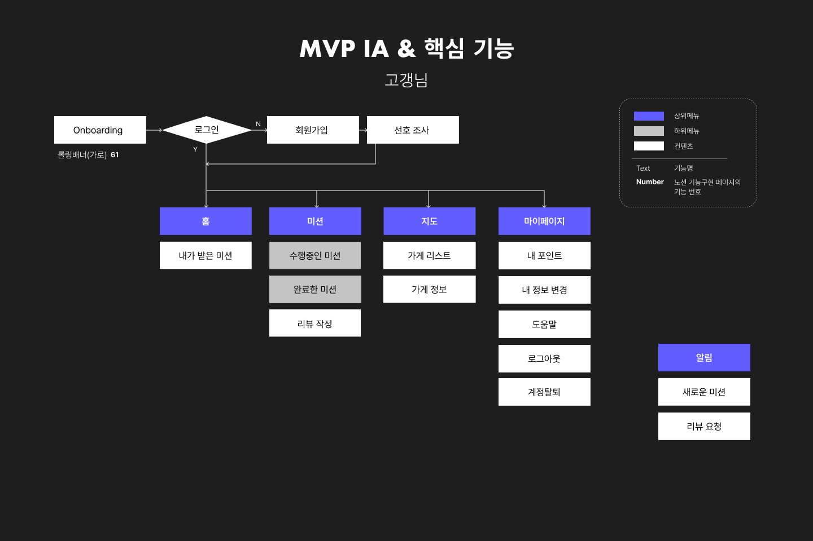
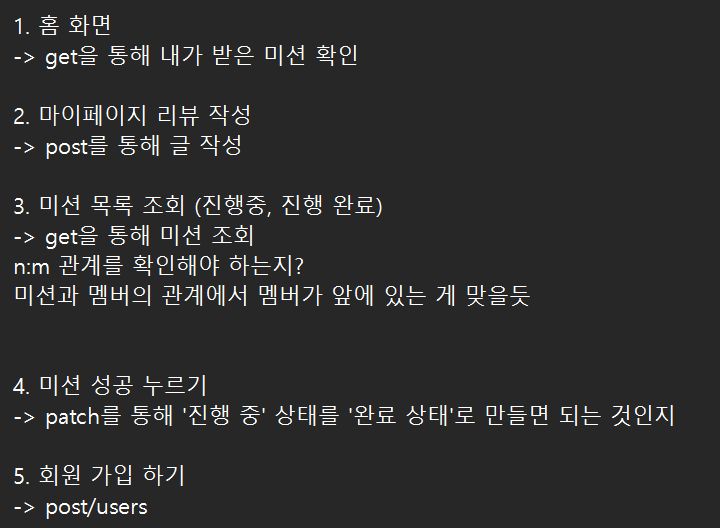

# Chapter 3. API URL의 설계 & 프로젝트 세팅

## 

## 🎯 핵심 키워드

---

<aside>
💡 주요 내용들에 대해 조사해보고, 자신만의 생각을 통해 정리해보세요!
레퍼런스를 참고하여 정의, 속성, 장단점 등을 적어주셔도 됩니다.
조사는 공식 홈페이지 **Best**, 블로그(최신 날짜) **Not Bad**

</aside>

이번 주차는 키워드가 딱히 없습니다!

원하실 경우 Restful API에 대해 한번 더 살펴보면 좋을 것 같습니다.

- URI란?
    
    uniform resource identifier로, 통합 자원 식별자라고 함.
    
    URL과의 차이점은, URL=식별자+위치지만 URI=식별자 라는 점이다.
    
    umc.co.kr은 URI이다. 리소스의 이름만 나타내기 때문이다.
    
    [https://umc.co.kr은](https://umc.co.kr은) URL이다. 프로토콜 https가 포함되었기 때문이다. 
    
    URI는 URL을 감싸는 더 큰 구조이다.
    
     
    
- RESTful API란?
    
    Representational State Transfer의 약자로, 아키텍쳐 스타일의 설계 원칙을 준수하는 어플리케이션 프로그래밍 인터페이스.
    
    http uri를 통해서 자원을식별하고, http 메서드(get, post, put, delete)를 사용해서 자원에 대한 작업을 수행한다. 
    
    클라이언트가 서버에 요청을 보내면, 서버가 클라이언트를 인증하고 권한을 확인, 요청을 수신하고 내부적으로 처리. 이후 클라이언트에 응답을 반환하는 과정을 거침. 이 과정을 용이하게 하는 것.
    
- 

카카오 엔터프라이즈의 api 관련 글

[[TW] API 문서 톺아보기](https://tech.kakaoenterprise.com/127)

pathvariable vs requestparam

파라미터 값이 어떤 기능을 하는지 알아두면 좋음

## 📢 학습 후기

---

- 이번 주차 워크북을 해결해보면서 어땠는지 회고해봅시다.
- 핵심 키워드에 대해 완벽하게 이해했는지? 혹시 이해가 안 되는 부분은 뭐였는지?

<aside>
💡 API endpoints의 집합을 API 명세서로 이해했는데, 여기서 더 부가적인 부분들이 들어가야 할 것 같다. 잘 하고 있는건지 모르겠다.

</aside>

## ⚠️ 스터디 진행 방법

---

1. 스터디를 진행하기 전, 워크북 내용들을 모두 채우고 스터디에서는 서로 모르는 내용들을 공유해주세요.
2. 미션은 워크북 내용들을 모두 완료하고 나서 스터디 전/후로 진행해보세요.
3. 다음주 스터디를 진행하기 전, 지난주 미션을 서로 공유해서 상호 피드백을 진행하시면 됩니다.

## ✅ 실습 체크리스트

---

## ☑️ 실습 인증

---

## 🔥 미션

---

1주차 때 제공된 IA, WF을 참고하여 (아래 **미션 참고 자료**를 보셔도 됩니다!)

- **미션 참고 자료**
    
    <aside>
    🚨 ❗**해당 자료는 챌린저분들의 미션을 위해 Plan 파트에서 제공해준 자료로,
    미션 외의 용도로 사용하는 것 및 유출을 절대 금합니다.**❗
    
    **❗아래 IA&WF 사진 및 for_UMC.fig 파일 및 파일 속 내용의 저작권은 모두 7th UMC Plan 파트장 아크(박승민)에게 있음을 밝힙니다.❗**
    
    </aside>
    
    - IA&WF 사진 파일
        
        아래 사진 외에도 첨부드린 사진에 해당하는 피그마 파일이 존재하니
        사진을 통해 보기 어려우시다면 피그마 파일을 이용해주세요!
        
        
        
        IA
        
        
        
        WF
        
    
    [for_UMC.fig](for_UMC.fig)
    

<aside>
✉️ **홈 화면, 마이 페이지 리뷰 작성, 미션 목록 조회(진행중, 진행 완료), 미션 성공 누르기,
회원 가입 하기(소셜 로그인 고려 X)**

</aside>

위의 기능을 구현하는데 **필요한 API들을 설계**하여

<aside>
🌟 **API Endpoint, Request Body, Request Header, query String, Path variable**

</aside>

이 포함된 간단한 명세서를 만들기!

실제 명세서는 Spring Boot 8주차 및 Node.js 9주차, Swagger 설정에서 더 자세히 다룹니다.

**< 시니어 미션 >**

[시니어 미션](https://www.notion.so/1b7b57f4596b8124ab1ffdba25078262?pvs=21)

## 💪 미션 기록

---

<aside>
🍀 미션 기록의 경우, 아래 미션 기록 토글 속에 작성하시거나, 페이지를 새로 생성하여 해당 페이지에 기록하여도 좋습니다!

하지만, 결과물만 올리는 것이 아닌, **중간 과정 모두 기록하셔야 한다는 점!** 잊지 말아주세요.

</aside>

- **미션 기록**
    
    
    
    해야 하는 목록들을 정리해봤다.
    
    1. IA&WF 파일에 의하면, 홈 화면에서는 내가 받을 미션들을 확인할 수 있다. 서버에서 데이터를 조회하는 것이므로, get 메서드를 사용해야 할 듯 싶었다. 쿼리 스트링을 통해서 조건에 맞는 미션들을 불러오고자 했다.
    2. 마이페이지 리뷰 작성은 리뷰 데이터를 추가하는 것이므로, post 메서드를 사용한다. request body를 사용해야 한다.
    3. 미션 목록 조회는 홈 화면에서와 마찬가지로 get을 통해 확인할 수 있다. 하지만 진행 중, 진행 완료와 같은 상태는 매핑 테이블에서만 확인할 수 있어, 관계를 어떻게 설정해야 할 지는 한 번 확인해봐야 할 듯 싶다. query string 을 사용해야 한다.
    4. 미션 성공은 데이터 부분 수정이 가능한 patch를 사용하면 된다.
    5. 회원 가입은 워크북 예시에 있듯이, post/users를 하면 될 듯 싶었다.
    이때, 사용자의 입력이 변수로 전달되는 query string 대신 request body를 사용해야 한다. 
    
    종합하여 미션을 기록해보았다.
    
    
    
    1. 홈 화면에서는 아직 시작하지 않은 미션들을 모아서 볼 수 있게 query string을 사용하여 적었다.
    2. 마이페이지 리뷰는 POST 메소드를 사용하여 데이터베이스에 올린다. erd 상에 적어뒀던 리뷰아이디, 별점, 내용, 사진을 request body에 넣어 보내도록 했다.
    3. 미션 목록 조회는  진행중/완료한 미션을 분류하여 보도록 GET을 두 번 사용하도록 했다.
    4. 미션 성공은 PATCH 메소드를 사용하여 매핑 테이블의 member-missions에 있는 status를 in_progress 에서 complete로 바꾸도록 했다.
    5. 회원가입은 POST 메소드를 사용하여 회원정보를 데이터베이스에 올린다. erd 상에 적어뒀던 내용들을 request body에 넣어 올리기로 했다.
    

## ⚡ 트러블 슈팅

---

<aside>
💡 실습하면서 생긴 문제들에 대해서, **이슈 - 문제 - 해결** 순서로 작성해주세요.

</aside>

<aside>
💡 스스로 해결하기 어렵다면? 스터디원들에게 도움을 요청하거나 **너디너리의 지식IN 채널에 질문**해보세요!

</aside>

- ⚡이슈 작성 예시 (이슈가 생기면 아래를 복사해서 No.1, No.2, No3 … 으로 작성해서 트러블 슈팅을 꼭 해보세요!)
    
    **`이슈`**
    
    👉 앱 실행 중에 노래 다음 버튼을 누르니까 앱이 종료되었다.
    
    **`문제`**
    
    👉 노래클래스의 데이터리스트의 Size를 넘어서 NullPointException이 발생하여 앱이 종료된 것이었다. 
    
    **`해결`**
    
    👉  노래 다음 버튼을 눌렀을 때 데이터리스트의 Size를 검사해 Size보다 넘어가려고 하면 다음으로 넘어가는 메서드를 실행시키지 않고, 첫 노래로 돌아가게끔 해결
    
    **`참고레퍼런스`**
    
    - 링크
- ⚡이슈 No.1
    
    **`이슈`**
    
    👉 [트러블이 생긴 상태 작성]
    
    **`문제`**
    
    👉 [어떤 이유로 해당 이슈가 일어났는지 작성]
    
    **`해결`**
    
    👉  [해결 방법 작성]
    
    **`참고레퍼런스`**
    
    - [문제 해결 시 참고한 링크]

## 🤔 참고 자료

[3주차](3%E1%84%8C%E1%85%AE%E1%84%8E%E1%85%A1%201b7b57f4596b815fac74e48c3094d73a.csv)

---

Copyright © 2023 최용욱(똘이) All rights reserved.

Copyright © 2024, 2025 김준환(제이미) All rights reserved.