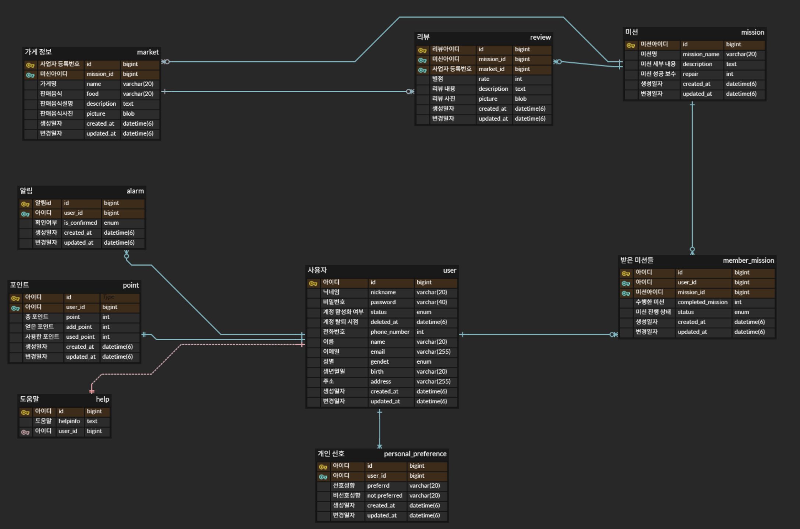

# Chapter 5. JPA 기초 및 프로젝트 구조

# 

# 🎯 핵심 키워드

---

<aside>
💡 주요 내용들에 대해 조사해보고, 자신만의 생각을 통해 정리해보세요!
레퍼런스를 참고하여 정의, 속성, 장단점 등을 적어주셔도 됩니다.
조사는 공식 홈페이지 **Best**, 블로그(최신 날짜) **Not Bad**

</aside>

- Domain
    
    엔티티, 값 객체, 도메인 서비스, 리포지토리 인터페이스로 구성됨
    
    도메인별 모듈화를 통해서 구성되는 패키지
    
    비즈니스 로직과 규칙 포함
    
- 양방향 매핑
    
    두 엔티티가 서로를 참조하는 관계를 의미한다.
    
    양방향 객체 그래프를 탐색할 수 있다는 장점이있으나, 연관관계의 주인을 관리해야 하기 때문에 좀 더 복잡해진다. 
    
    주인 측에서는 외래키의 등록, 수정, 삭제 권한을 가지나, 반대 측에서는 조회만 가능하며 주인 측의 변경 사항을 반영받는다.
    
    참조 측에 설정하여 주인 엔티티의 상태를 cascade 받는다. 
    
- N + 1 문제
    
    한 번의 쿼리로 부모 엔티티를 조회한 뒤, 각 부모마다 연관된 자식 엔티티를 조회하기 위해 n번의 추가 쿼리가 실행되어 총 1+N번의 쿼리가 발생하는 성능 이슈
    
    ORM 연관 관계 처리 방식과 데이터베이스 접근 패러다임의 차이에서 비롯된다.
    

# 📢 학습 후기

---

- 이번 주차 워크북을 해결해보면서 어땠는지 회고해봅시다.
- 핵심 키워드에 대해 완벽하게 이해했는지? 혹시 이해가 안 되는 부분은 뭐였는지?

<aside>
💡

</aside>

# ⚠️ 스터디 진행 방법

---

1. 스터디를 진행하기 전, 워크북 내용들을 모두 채우고 스터디에서는 서로 모르는 내용들을 공유해주세요.
2. 미션은 워크북 내용들을 모두 완료하고 나서 스터디 전/후로 진행해보세요.
3. 다음주 스터디를 진행하기 전, 지난주 미션을 서로 공유해서 상호 피드백을 진행하시면 됩니다.

# 🔥 미션

---

워크북을 따라해보고

1. 본인이 만들었던 ERD에 해당하는 테이블들에 대한 엔티티를 만들고
2. 워크북에서 다루지 않은 연관관계 매핑(양방향 포함)을 다 적용하고
3. 엔티티의 칼럼에 대한 세부적인 설정을 모두 하여
4. 로컬 디비에 실제로 테이블이 생긴 것을 캡쳐할 것(by datagrip)
5. 이후 본인의 깃허브 리포지토리를 만들어 mission5 브랜치에 올린 후,
**해당 깃허브 링크를 본인 워크북에 포함해오기. (미션 기록란에 링크 제출)**
    
    **❗main 브랜치에 올리지 말 것!** (브랜치 명이 굳이 mission5 이 아니어도 됨!) **❗**
    

[시니어 미션](https://www.notion.so/1cbb57f4596b8131be92fa4f302174f3?pvs=21)

<aside>
📌 **주의 사항**

결과물만 올리면 안되고, 중간 과정 또한 기록을 남겨주셔야 합니다.
(DB 연결, 테이블 생성 등)

**결과물과 중간 과정 모두 기록하여 제출**하라는 뜻입니다!

</aside>

# 💪 미션 기록

---

<aside>
🍀 미션 기록의 경우, 아래 미션 기록 토글 속에 작성하시거나, 페이지를 새로 생성하여 해당 페이지에 기록하여도 좋습니다!

하지만, 결과물만 올리는 것이 아닌, **중간 과정 모두 기록하셔야 한다는 점!** 잊지 말아주세요.

</aside>

- **미션 기록**
    
    
    
    기존에 만들어두었던 erd를 바탕으로 도메인 패키지에 엔티티들을 만들어나갔습니다.
    
    
    
    user 테이블부터 컬럼들을 채워나가며 나머지 모든 엔티티들을 완성했습니다.
    
    
    
    n:m 관계를 이루는 member_mission 테이블과 Review 테이블은 mapping 패키지에,
    
    나머지 테이블들은 일반 도메인 테이블에 두었습니다.
    
    1:n 관계를 가지는 경우 n에 해당하는 테이블이 외래키를 가지며, 연관관계의 주인이 된다.
    
    1:1 관계를 가지는 경우 둘 중 하나만 외래키를 가지면 되기에 원하는 엔티티를 연관관계의 주인으로 설정한다.
    
    
    
    따라서 1:n 관계를 갖는 personal_preference 테이블에는 ManyToOne 어노테이션을 사용해 n:1 관계를 만들었습니다.
    
    
    
    1대1 관계를 갖는 point 테이블의 경우 OneToOne 어노테이션을 사용해 user 테이블과 1:1 관계를 만들었습니다.
    
    
    
    mapping 패키지에 두었던 member_mission 테이블의 경우, n:m 관계를 이루는 member와 mission의 중간 테이블 역할을 합니다. 
    
    member와 mission 간 ManyToMany 어노테이션을 사용해 n:m 연결을 이루는 방법도 있지만, mapping 테이블을 통해 각각 1:n 관계를 만드는 것이 확장성에 유리합니다.
    
    
    
    market과 mission 간 n:m 관계를 이루는 review 테이블의 경우에도 두 번의 ManyToOne 어노테이션을 사용해 n:m 관계를 구축했습니다.
    
    양방향 매핑의 경우, 무한 참조의 위험이 있으나 cascade 기능을 살리기 위해 사용합니다.
    
    이는 참조 대상인 테이블이 삭제되거나 변경될 때 같이 변경되는 기능입니다.
    
    예를 들어, member 테이블이 사라질 경우 연결된 point나 personal_preference 테이블 또한 같이 사라져야 합니다. 탈퇴한 회원의 포인트와 개인 선호를 유지할 이유가 없기 때문입니다. cascade 기능을 사용하지 않는다면 탈퇴한 회원과 연관된 모든 테이블들을 직접 찾아 삭제해야 합니다.
    
    하지만 단방향 매핑에서 이를 구현할 경우, member를 참조하는, 연관관계의 주인인 point나 personal_preference가 삭제될 때 member 가 사라지는 경우가 발생합니다.
    
    따라서 cascade 기능을 제대로 구현하기 위해 양방향 매핑을 적용합니다.
    
    
    
    user테이블과 연관된 다른 테이블들 (Point,PersonalPreferencem,MemberMission,Alarm) 테이블과 양방향 매핑을 했습니다. 이를 통해 member 테이블이 사라질 경우 관련된 다른 테이블들이 사라집니다.
    
    
    
    같은 논리로, mission 테이블이 사라진다면 받은 미션 테이블인 member_mission 테이블에서도 사라져야 합니다. 양방향 테이블 구현을 통해 미션 테이블이 사라진다면 member_mission 테이블에서 사라지도록 cascading 했습니다.
    
    
    
    엔티티 칼럼에 대한 세부 설정을 통해 table 상과 일치하도록 했습니다. 
    
    
    
    application과 domain 폴더가 같은 패키지 안에 있지 않아 테이블이 생성되지 않았었습니다.
    
    메인 어플리케이션 클래스의 패키지와 하위 패키지를 스캔하는데, 형제 패키지를 만들어 거기에 domain패키지를 만들고 엔티티를 생성했기에 발생한 문제였습니다. demoapplication을 study 패키지 안에 넣어 해당 문제를 해결했습니다.
    
    
    
    경로 관리를 꼭 잘 해야겠다 생각하게 된 계기였습니다.
    

> **github 링크**
> 
> 
> 

# ⚡ 트러블 슈팅

---

<aside>
💡 실습하면서 생긴 문제들에 대해서, **이슈 - 문제 - 해결** 순서로 작성해주세요.

</aside>

<aside>
💡 스스로 해결하기 어렵다면? 스터디원들에게 도움을 요청하거나 **너디너리의 지식IN 채널에 질문**해보세요!

</aside>

- ⚡이슈 작성 예시 (이슈가 생기면 아래를 복사해서 No.1, No.2, No3 … 으로 작성해서 트러블 슈팅을 꼭 해보세요!)
    
    **`이슈`**
    
    👉 앱 실행 중에 노래 다음 버튼을 누르니까 앱이 종료되었다.
    
    **`문제`**
    
    👉 노래클래스의 데이터리스트의 Size를 넘어서 NullPointException이 발생하여 앱이 종료된 것이었다. 
    
    **`해결`**
    
    👉  노래 다음 버튼을 눌렀을 때 데이터리스트의 Size를 검사해 Size보다 넘어가려고 하면 다음으로 넘어가는 메서드를 실행시키지 않고, 첫 노래로 돌아가게끔 해결
    
    **`참고레퍼런스`**
    
    - 링크
- ⚡이슈 No.1

---

Copyright © 2023 최용욱(똘이) All rights reserved.

Copyright © 2024 신수정(베뉴) All rights reserved.