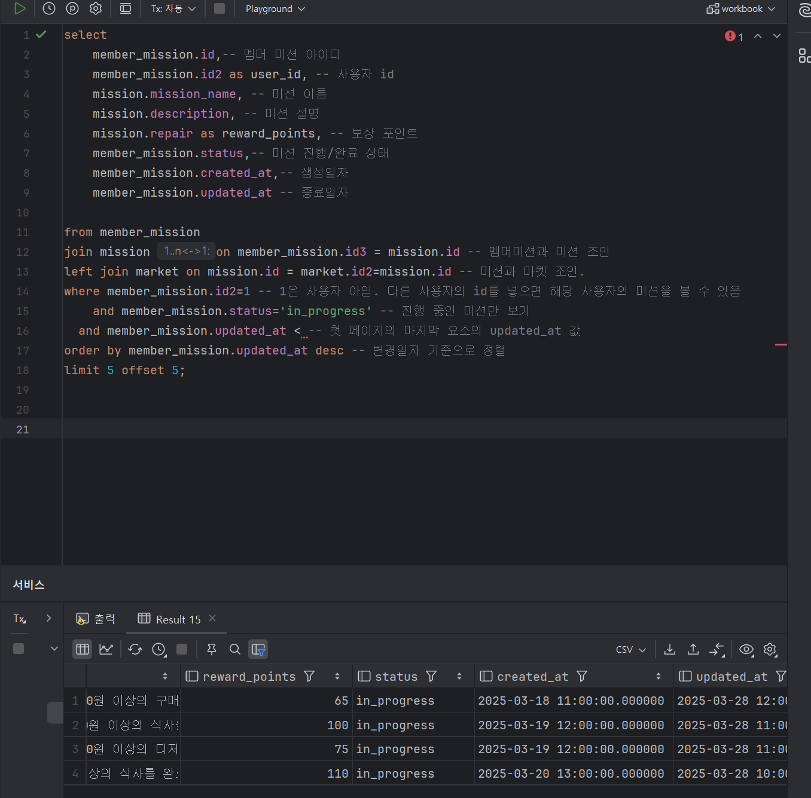

# Chapter 6. JPA 활용

- 즉시로딩, N+1 문제, 영속성 컨텍스트, JPQL, QueryDSL

## 🎯핵심 키워드

---

<aside>
💡 주요 내용들에 대해 조사해보고, 자신만의 생각을 통해 정리해보세요!
레퍼런스를 참고하여 정의, 속성, 장단점 등을 적어주셔도 됩니다.
조사는 공식 홈페이지 **Best**, 블로그(최신 날짜) **Not Bad**

</aside>

- **지연로딩과 즉시로딩의 차이**
    
    즉시로딩은 엔티티를 조회할 떄 해당 엔티티와 연관된 모든 엔티티를 동시에 조회한다. 이로 인해 필요하지 않은 데이터까지 불필요하게 로딩할 수 있으며, 성능 저하를 야기할 수 있다.
    
    지연 로딩은 연관된 엔티티를 처음에는 조회하지 않고, 실제로 해당 엔티티가 필요한 시점에 조회한다. 객체를 프록시로 가져온 다음 실제 해당 객체를 사용하는 시점에 초기화하는 형태이다. 데이터 접근과 메모리 사용이 최적화되고 순환 참조가 방지되기에 지연 로딩을 주로 사용한다.
    
- **Fetch Join**
    
    SQL에서 사용하는 조인과는 다른 종류의 조인으로, JPQ에서 성능 최적화를 위해 제공하는 조인이다. 연관된 엔티티나 컬렉션을  SQL 한 번에 조회하는 기능이다. 
    
    일반 조인에서는 해당 조인 쿼리의 select 절에 연관된 엔티티가 포함되지 않지만, 패치 조인에서는 select 절에 연관된 모든 엔티티가 포함된 채 불러진다.
    
- **@EntityGraph**
    
    연관관계가 있는 엔티티를 조회할 경우, 지연 로딩으로 설정되어 있으면, 연관관계에서 종속된 엔티티는 쿼리 실행 시 select 되지 않고 proxy 객체를 만들어 엔티티가 적용시킨다. 이 같은 연관관계가 지연 로딩으로 되어있을 경우, fetch 조인을 사용하여 여러 번의 쿼리를 한 번에 해결할 수 있다.
    
    @EntityGraph는 fetch 조인을 어노테이션으로 사용할 수 있게 한 기능이다.
    
- **JPQL**
    
    Java Persistence Query Language 의 준말로, JPA 가 SQL을 추상화한 객체지향 쿼리 언어이다.
    
    SQL과 매우 유사한 형태지만 데이터베이스의 테이블과 컬럼이 아닌 자바 클래스와 변수에 작업을 수행한다는 점에서 SQL문과 차이가 있다.
    
    컴파일 단계에서 오류를 확인할 수 없고 런타임에서 해당 쿼리가 실행되어야만 오류를 발견할 수 있다는 단점이 존재한다.
    
- **QueryDSL**
    
    SQL, JPQL 등을 코드로 작성할 수 있게 해주는 빌더 오픈소스 프레임워크이다. 
    
    엔티티 클래스와 매핑되는 QClass 라는 객체를 사용해 쿼리를 실행한다.
    
    @Entity 등의 어노테이션을 찾아 QClass로 만들고, QueryDSL은 QClass를 기반으로 쿼리를 실행한다.
    
    쿼리를 문자열이 아닌 코드로 작성하기 때문에 오타를 발견하기 쉽고, 객체지향적으로 개발할 수 있다. 또한 컴파일 단계에서도 오류를 빠르게 발견할 수 있다는 장점이 있다.
    
- **N+1 문제를 해결할 수 있는 방법들**
    
    n+1 문제는 연관 관계가 설정된 엔티티를 조회할 때, 조회된 데이터와 연관관계인 데이터를 추가로 읽어오는 현상이다. FetchType을 즉시로딩에서 지연로딩으로 바꾼다 하더라도, 이는 N+1 문제 발생 시점을 연관관계 데이터를 사용하는 시점으로 미룰지, 초기 데이터 로드 시점에 가져올지에 따른 차이만 존재한다. 
    
    이를 해결하기 위해 Fetch join, @EntityGraph 등의 방법이 있다.
    
    1. Fetch join은 JQPL을 사용하여 DB에서 데이터를 가져올 때 처음부터 연관된 데이터까지 같이 가져오게 하는 방법이다. 조회시에 추가적인 데이터를 불러오는 것이 아니므로 N+1 문제를 해결할 수 있다.
    2. @EntityGraph 어노테이션은 이 fetch 조인을 어노테이션으로 사용할 수 있게 한 기능이다. 다만 관계가 조금만 복잡해져도 굉장히 꼬이니 사용하지 않는 것이 좋다고 한다.
    
    이들은 카테시안 곱이 발생하여 중복 데이터가 생길 수 있으므로, 중복 데이터를 제거할 수 있도록 해야 한다.
    

## 📢 학습 후기

---

- 이번 주차 워크북을 해결해보면서 어땠는지 회고해봅시다.
- 핵심 키워드에 대해 완벽하게 이해했는지? 혹시 이해가 안 되는 부분은 뭐였는지?

<aside>
💡

</aside>

## ⚠️ 스터디 진행 방법

---

1. 스터디를 진행하기 전, 워크북 내용들을 모두 채우고 스터디에서는 서로 모르는 내용들을 공유해주세요.
2. 미션은 워크북 내용들을 모두 완료하고 나서 스터디 전/후로 진행해보세요.
3. 다음주 스터디를 진행하기 전, 지난주 미션을 서로 공유해서 상호 피드백을 진행하시면 됩니다.

## ✅ 실습 체크리스트

---

## ☑️ 실습 인증

---

`feature/week6` 브랜치를 판 후 실습 코드를 전부 첨부하여 진행해주세요. 

## 🔥 미션

---

1. N+1 문제를 해결할 수 있는 여러 가지 다른 방법들에 대해 조사한 후, [ 핵심 키워드 ] 에 정리
2. 2주차 미션 때 했던 해당 화면들에 대해 작성했던 쿼리를 QueryDSL로 작성하여 리팩토링하기

내가 진행중, 진행 완료한 미션 모아서 보는 쿼리(페이징 포함)

리뷰 작성하는 쿼리,
* 사진의 경우는 일단 배제

홈 화면 쿼리
(현재 선택 된 지역에서 도전이 가능한 미션 목록, 페이징 포함)

마이 페이지 화면 쿼리

# 💪 미션 기록

---

<aside>
🍀 미션 기록의 경우, 아래 미션 기록 토글 속에 작성하시거나, 페이지를 새로 생성하여 해당 페이지에 기록하여도 좋습니다!

하지만, 결과물만 올리는 것이 아닌, **중간 과정 모두 기록하셔야 한다는 점!** 잊지 말아주세요.

</aside>

- **미션 기록**
    
    **1. 진행중인/완료한 미션을 모아보는 쿼리**
    
    2주차에 작성했던 쿼리문을 리팩토링하기 위해 확인해봤습니다.
    
    
    
    멤버미션 테이블을 기반으로 mission과 조인하여 진행하였습니다. 진행중/진행완료 상태를 알기 위해 status를 불러와야 합니다. 
    
    BooleanBuilder 객체의 이름을 predicate로 이름짓고, 이를 동적 조건을 추가할 수 있는 객체로 만들었습니다. jpaQueryFactory을 반환할 때 where(predicate)로 반환시 추가한 동적 조건에 맞는 엔티티들이 걸려저 나온다는 것을 알게 되었습니다. 또한 select할 때 여러 개의 테이블을 불러오는 만큼, 불러오는 테이블과 일치하는 Q타입 객체들을 불러왔습니다.
    
    
    
    하지만 풀던 도중 mission 기반의 리스트를 출력하면 미션의 상태를 넘겨받을 수 없음을 알게 되었습니다. 미션의 상태를 넘겨받기 위해 메서드를 Mission에서 memberMission으로 바꿨습니다. 페이징 기법 또한 적용해보았습니다.
    
    
    
    사용자의 id가 같을 때에만 미션을 출력할 수 있도록 predicate에 조건을 추가했습니다. 
    
    사용법에 대해 잘 감이 오지 않았었는데, 코드를 수정하지 않고 자유롭게 조건을 추가할 수 있다는 것을 알게 되었습니다.
    
    
    
    레포지토리에서 만든 다이나믹쿼리를 불러오도록 서비스에서 호출했습니다. 상태와 userId를 통해 분류한 미션들을 입력받고자 했습니다.
    
    콘솔 로그 출력을 위해 domain에 있는 MemberMission의 toString을 오버라이딩하고자 하였는데, 단순 문자열 오버라이딩을 통해서는 진행중인/ 완료한 미션을 출력할 수 있는 방법이 없어 보였습니다. 처음엔 그냥 참조하는 식으로 구현하려 했으나, 찾아본 결과 toString 메서드가 lazy loading 속성을 가진 필드를 참조할 때 프록시 초기화 문제가 발생할 수 있다는 것을 알게 되었습니다. 
    
    콘솔 로그 출력을 위해서는 toString을 사용해야 하고, toString을 진행중/완료한 미션으로 나눠서 보기 위해서는 필드를 참조해야 하는데 필드를 참조하면 프록시 초기화 문제가 발생하는 상황입니다.
    
    따라서 toString 대신 다른 방법을 통해 데이터베이스에 넣은 데이터를 불러오고자 했습니다. @test 어노테이션을 활용하는 방법도 있었지만, 스터디장님께 여쭤보니 다른 방법을 사용하는 것이 낫다고 하셨습니다.
    
    서비스 또는 레포지토리에서 데이터를 주고받을 때, 반드시 테이블을 모두 채운 정격의 데이터를 보내는 게 낫다고 생각해 리스트의 자료형을 MemberMission으로 정의했으나, DTO를 새로 만들어 기존의 데이터를 캡슐화한 다음 캡슐화된 데이터를 내보내는 방법이 낫다는 것이었습니다. 
    
    DTO를 사용함으로써 얻는 장점들은 다음과 같습니다. 여러 소스의 데이터를 하나의 객체로 모아 계층을 분리한 다음 내보내기에, 필요한 데이터들만 선택적으로 전송할 수 있습니다. 값이 예상치 못하게 변경되더라도 DTO의 값만 수정되기에 원본 값이 변경되는 일이 없습니다. 또한 toString의 오버라이딩 없이 콘솔로그에도 데이터가 출력됩니다. 프록시 초기화 문제도 발생하는 일이 없게 됩니다.
    
    
    
    따라서 DTO를 만들어 필요한 정보들을 담았습니다. 이때 DTO에서 @DATA 어노테이션은 사용하지 않는 것이 좋다고 합니다. 여러 가지 어노테이션이 집약된 강력한 어노테이션이나, @setter 어노테이션도 포함되어 있어 내부 정보가 바뀌는 경우가 발생하기 때문입니다. DTO를 사용하는 이유 중 하나인 데이터 캡슐화를 위해서라도 @getter만 사용하는 것이 낫다고 합니다.
    
    
    
    출력이 잘 되는 것을 확인할 수 있습니다. 데이터를 추가하여 진행중인 미션/완료한 미션을 출력해보도록 하겠습니다.
    
    
    
    멤버미션의 파라미터를 변경한 다음 memberMissions를 바뀐 파라미터값을 넣은 리스트로 재정의하여 값을 출력했습니다.
    
    
    
    
    
    페이지가 길어 한 번에 보이지 않지만, 잘 출력됨을 알 수 있습니다.
    
    
    
    **2.리뷰를 작성하는 쿼리**
    
    
    
    이전에 작성한 쿼리는 이런 형태였습니다. 
    
    
    
    빌더 패턴을 활용하여 레포지토리를 만들려고 했는데, 오류가 발생했습니다.
    
    이는 Review review=review.builder를 통해 만든 빌더 패턴은 엔티티 클래스의 실제 필드명을 기반으로 생성되기 때문이었습니다. Q타입 객체를 불러옴으로써 안의 필드들까지 가져온 것이라 생각했는데, 빌더 패턴은 Q타입 클래스와는 관련이 없었습니다.
    
    missionId와 marketId는 Review 도메인에는 없는 FK로, 이를 사용하기 위해서는 엔티티 참조 설정을 따로 해야만 했습니다. 
    
    
    
    entityManager를 통해 mission의 missionId와 market의 marketId를 불러온 모습입니다.
    
    이어서 리뷰 DTO를 작성했습니다. 
    
    
    
    엔티티를 DTO로 변환하고자 메서드를 작성했습니다.
    
    이어서 ReviewService를 완성했습니다.
    
    
    
    이때 reviewRepository에 문제가 생겨 확인해봤습니다. @bean이 설정되지 않았다는 오류가 떴는데, 레포지토리에서는 bean 을 설정하지 않아 확인해보았습니다.
    
    다시 보니 extends 를 하지 않아서 생기는 문제였습니다. JpaRepostitory를 반드시 상승해야 빈드로 등록된다는 사실을 알게 되었습니다. 콘솔창에서의 리뷰 작성 및 확인은 따로 하지 않았습니다.
    
    **3.홈 화면 쿼리**
    
    
    
    홈 화면에서는 mission 객체가 주인 테이블을 만들면 될 것 같았습니다. 
    
    join을 통해 적당히 처리하면 될 줄 알았는데, mission이 주인 테이블에서는 userId와 Status에 제대로 접근할 수 없었기에 수많은 시행착오에도 제대로 작동하지 않았습니다.
    
    결국 만들던 MissionRepository와 service를 폐기하고 MemberMission 레포지토리와 서비스를 재활용하기로 했습니다. Mission과 관련되었다기보단 MemberMission과 더 관련이 있기에 이게 옳은 선택이라 판단했습니다.
    
    
    
    레포지토리에 해당 메서드를 추가해 완료한 미션의 개수를 파악할 수 있게 했습니다.
    
    
    
    서비스에서 같은 메서드를 구현하여 구현이 가능하도록 바꿨습니다.
    
    
    
    Application에서도 @Bean을 설정해 출력을 확인해보았습니다.
    
    
    
    잘 나오는 것을 볼 수 있습니다.
    
    **4.마이페이지 화면 출력 쿼리**
    
    
    
    이번에는 user의 정보를 출력하는 화면입니다. 
    
    
    
    구현한 레포지토리입니다.
    
    
    
    DTO를 반환하도록 한 번 감싼 서비스 부분입니다.
    
    
    
    콘솔에서의 출력도 잘 되는 것을 확인할 수 있습니다.
    

[시니어 미션](https://www.notion.so/1e9b57f4596b8106ae87dba1742b62cd?pvs=21)

## ⚡ 트러블 슈팅

---

<aside>
💡 실습하면서 생긴 문제들에 대해서, **이슈 - 문제 - 해결** 순서로 작성해주세요.

</aside>

<aside>
💡 스스로 해결하기 어렵다면? 스터디원들에게 도움을 요청하거나 **너디너리의 지식IN 채널에 질문**해보세요!

</aside>

- ⚡이슈 작성 예시 (이슈가 생기면 아래를 복사해서 No.1, No.2, No3 … 으로 작성해서 트러블 슈팅을 꼭 해보세요!)
    
    **`이슈`**
    
    👉 앱 실행 중에 노래 다음 버튼을 누르니까 앱이 종료되었다.
    
    **`문제`**
    
    👉 노래클래스의 데이터리스트의 Size를 넘어서 NullPointException이 발생하여 앱이 종료된 것이었다. 
    
    **`해결`**
    
    👉  노래 다음 버튼을 눌렀을 때 데이터리스트의 Size를 검사해 Size보다 넘어가려고 하면 다음으로 넘어가는 메서드를 실행시키지 않고, 첫 노래로 돌아가게끔 해결
    
    **`참고레퍼런스`**
    
    - 링크
- ⚡이슈 No.1
    
    **`이슈`**
    
    👉 [트러블이 생긴 상태 작성]
    
    **`문제`**
    
    👉 [어떤 이유로 해당 이슈가 일어났는지 작성]
    
    **`해결`**
    
    👉  [해결 방법 작성]
    
    **`참고레퍼런스`**
    
    - [문제 해결 시 참고한 링크]

## 🤔 참고 자료

---

Copyright © 2025 신수정(베뉴) All rights reserved.