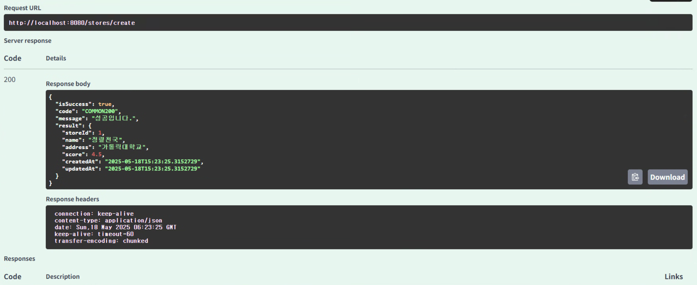

# 🎯핵심 키워드

---

<aside>
💡 주요 내용들에 대해 조사해보고, 자신만의 생각을 통해 정리해보세요!
레퍼런스를 참고하여 정의, 속성, 장단점 등을 적어주셔도 됩니다.
조사는 공식 홈페이지 **Best**, 블로그(최신 날짜) **Not Bad**

</aside>

- java의 Exception 종류들
    
    ### 1. 예외의 기본 구조
    
    Java의 예외는 `Throwable` 클래스를 최상위로 하여 두 가지 주요 하위 클래스로 나뉨
    
    - `Exception`: 애플리케이션에서 발생할 수 있는 예외 상황을 나타내며, 개발자가 처리할 수 있음
    - `Error`: JVM에서 발생하는 심각한 오류로, 일반적으로 애플리케이션에서 처리하지 않음
    
    ```
    Throwable
    ├── Exception
    │   ├── CheckedException
    │   └── UncheckedException (RuntimeException)
    └── Error
    ```
    
    ---
    
    ### 2. Checked Exception (검사 예외)
    
    - 컴파일 타임에 검사되며, 반드시 예외 처리를 해야 함
    - 주로 외부 자원(I/O, DB 등)과 관련된 예외가 해당
    
    대표적인 Checked Exception:
    
    | 예외 클래스 | 설명 |
    | --- | --- |
    | `IOException` | 입출력 작업 중 발생하는 예외 |
    | `SQLException` | 데이터베이스 접근 중 발생하는 예외 |
    | `ClassNotFoundException` | 클래스를 찾을 수 없을 때 발생하는 예외 |
    | `FileNotFoundException` | 파일을 찾을 수 없을 때 발생하는 예외 |
    | `ParseException` | 문자열을 파싱할 때 발생하는 예외 |
    
    ```java
    try {
        FileReader reader = new FileReader("file.txt");
    } catch (IOException e) {
        e.printStackTrace();
    ```
    
    ---
    
    ### 3. Unchecked Exception (비검사 예외)
    
    - 런타임에 발생하며, 컴파일러가 예외 처리를 강제하지 않음
    - 주로 프로그래밍 오류(논리적 오류, 잘못된 API 사용 등)로 인해 발생함
    
    대표적인 Unchecked Exception:
    
    | 예외 클래스 | 설명 |
    | --- | --- |
    | `NullPointerException` | null 객체를 참조할 때 발생하는 예외 |
    | `ArrayIndexOutOfBoundsException` | 배열의 인덱스 범위를 벗어날 때 발생하는 예외 |
    | `ArithmeticException` | 산술 연산 중 오류가 발생할 때 예외 |
    | `IllegalArgumentException` | 메서드에 부적절한 인자가 전달될 때 예외 |
    | `NumberFormatException` | 문자열을 숫자로 변환할 때 실패하는 예외 |
    
    ```java
    String str = null;
    System.out.println(str.length()); // NullPointerException 발생
    ```
    
    ---
    
    ### 4. Error (오류)
    
    - JVM에서 발생하는 심각한 문제로, 애플리케이션에서 처리할 수 없음
    - 주로 시스템 자원 부족, JVM 내부 오류 등으로 인해 발생함
    
    대표적인 Error:
    
    | 오류 클래스 | 설명 |
    | --- | --- |
    | `OutOfMemoryError` | JVM 메모리가 부족할 때 발생하는 오류 |
    | `StackOverflowError` | 스택 오버플로우(재귀 호출 등)로 발생하는 오류 |
    | `VirtualMachineError` | JVM에서 발생하는 심각한 오류의 상위 클래스 |
    | `AssertionError` | assert 문이 실패할 때 발생하는 오류 |
    
    ---
    
    ### 5. 사용자 정의 예외 (Custom Exception)
    
    - Java에서는 `Exception` 클래스를 상속하여 사용자 정의 예외를 만들 수 있음
    - 특정 비즈니스 로직에 맞는 예외를 정의하여 보다 명확한 예외 처리가 가능함
    
    ```java
    class CustomException extends Exception {
        public CustomException(String message) {
            super(message);
        }
    }
    
    public class Example {
        public static void main(String[] args) {
            try {
                throw new CustomException("사용자 정의 예외 발생");
            } catch (CustomException e) {
                System.out.println(e.getMessage());
            }
        }
    }
    ```
    
    ---
    
    ### 6. 예외 계층 구조 요약
    
    ```
    Throwable
    ├── Exception (Checked)
    │   ├── IOException
    │   ├── SQLException
    │   └── ...
    ├── RuntimeException (Unchecked)
    │   ├── NullPointerException
    │   ├── IllegalArgumentException
    │   └── ...
    └── Error
        ├── OutOfMemoryError
        ├── StackOverflowError
        └── ...
    ```
    
    ---
    
    ### 7. 예외 처리의 중요성
    
    - 예외 처리를 통해 프로그램의 안정성과 신뢰성을 높일 수 있음
    - 적절한 예외 처리는 디버깅을 용이하게 하고, 사용자에게 명확한 오류 메시지를 제공할 수 있음
    - 예외를 무시하거나 적절히 처리하지 않으면 예기치 않은 프로그램 종료나 데이터 손실 등의 문제가 발생할 수 있음
- @Valid
    
    `@Valid` 객체의 필드 값이 유효한지(예: null 아님, 길이 제한, 범위 제한 등) 자동으로 검사
    
    나의 프로젝트에서 사용 예
    
    ```java
    @PostMapping("/")
    public ApiResponse<MemberResponseDTO.JoinResultDTO> join(@RequestBody @Valid MemberRequestDTO.JoinDto request) {
        ...
    }
    ```
    
    - `@RequestBody`로 클라이언트가 보낸 JSON → `JoinDto` 객체로 변환
    - `@Valid` 덕분에 `JoinDto` 클래스 안의 필드들에 설정된 제약 조건이 **자동으로 검사됨**
    - 만약 조건을 위반하면 `MethodArgumentNotValidException` 발생
    
    유효성 검사를 위한 DTO 예시
    
    ```java
    @Getter
    public static class JoinDto {
        @NotBlank(message = "공백일 수 없습니다")
        String name;
    
        @NotNull(message = "널이어서는 안됩니다")
        Integer gender;
    
        @Size(min = 5, max = 12)
        String address;
    
        @ExistCategories
        List<Long> preferCategory;
    }
    ```
    
    - 각각의 필드에 유효성 어노테이션(`@NotBlank`, `@NotNull`, `@Size`, 커스텀 `@ExistCategories`)이 붙어있
    - `@Valid`가 붙은 덕분에 Spring이 자동으로 검사해줌
    
    예외 발생 시 처리 흐름
    
    `ExceptionAdvice` 클래스에서 다음 메서드로 처리해줌
    
    ```java
    @Override
    public ResponseEntity<Object> handleMethodArgumentNotValid(MethodArgumentNotValidException e, ...)
    
    ```
    
    - 위에서 `@Valid`에 의해 유효성 검사 실패 → 예외 발생
    - 예외를 이 핸들러가 받아서 → 통일된 응답 형태(`ApiResponse`)로 반환
    
    | 항목 | 내용 |
    | --- | --- |
    | **용도** | DTO의 필드 값을 자동으로 유효성 검사 |
    | **언제 동작** | `@RequestBody @Valid SomeDto`와 같이 사용될 때 |
    | **조건 위반 시** | Spring이 예외(`MethodArgumentNotValidException`)를 던짐 |
    | **네 프로젝트에서의 위치** | `MemberRestController`의 `join()` 메서드에서 `@Valid` 사용됨 |
    | **결과 처리** | `ExceptionAdvice`에서 일관된 에러 응답으로 처리함 |
    - `@Valid`는 Spring MVC에서 DTO의 유효성을 검사하는 핵심 도구
    - 프로젝트 내에서 회원 가입 시 요청 객체의 유효성을 검증하기 위해 사용됨
    - 유효하지 않으면 커스텀한 에러 응답 포맷(`ApiResponse`)으로 처리됨
    - 필수 조건이므로 반드시 적절히 활용되어야 함

# 📢 학습 후기

---

- 이번 주차 워크북을 해결해보면서 어땠는지 회고해봅시다.
- 핵심 키워드에 대해 완벽하게 이해했는지? 혹시 이해가 안 되는 부분은 뭐였는지?

<aside>
💡

</aside>

# ⚠️ 스터디 진행 방법

---

1. 스터디를 진행하기 전, 워크북 내용들을 모두 채우고 스터디에서는 서로 모르는 내용들을 공유해주세요.
2. 미션은 워크북 내용들을 모두 완료하고 나서 스터디 전/후로 진행해보세요.
3. 다음주 스터디를 진행하기 전, 지난주 미션을 서로 공유해서 상호 피드백을 진행하시면 됩니다.

---

### [UMC 서버 워크북 참고 자료](https://github.com/CYY1007/UMC_SERVER_WORKBOOK.git)

[GitHub - chock-cho/UMC-7th-spring-workbook at feature-week8-workbook](https://github.com/chock-cho/UMC-7th-spring-workbook/tree/feature-week8-workbook)

---

3주차에 설계한 URL(없으면 추가!)을 바탕으로 아래의 API 구현

단, 로그인 기능이 없는 관계로 리뷰를 작성하거나 미션 도전하는 유저는

**하드 코딩(그냥 무조건 디비에 있는 아무나 한명)**으로 하기!

1. 특정 지역에 가게 추가하기 API
2. **가게에 리뷰 추가하기 API**
3. 가게에 미션 추가하기 API
4. **가게의 미션을 도전 중인 미션에 추가(미션 도전하기) API**

3주차에 설계하지 않은 API URL의 경우는 설계를 복습 할 겸 해보고 진행해주세요!

반드시 인증 사진을 중간 중간 남기며, 7주차와 동일하게 github에 브랜치를 새로 만들어서 푸시하기

<aside>
📌 **조건**

1. github branch를 만들 때 issue를 만들고 branch 생성하여 진행 후 push할 것
2. controller, service, converter, dto, repository를 모두 활용할 것
3. ExceptionAdvice를 적극 활용해야하며 RequestBody에 값이 누락되거나 값이 잘못된 것을 @Valid 어노테이션으로 검증하기
4. **4번 API의 경우는 도전 하려는 미션이 이미 도전 중인지를 검증해야 하며 이를 커스텀 어노테이션을 통해 검증을 해야 함.**
5. **2번 API의 경우도 4번 API처럼 리뷰를 작성하려는 가게가 존재하는지 검증하는 커스텀 어노테이션을 사용할 것.**
</aside>

1, 2, 3 번 조건을 충족하지 않을 경우 해당 API는 미션 완료 대상에서 제외가 되며

**2, 4번 API는 필수로 구현해야 하고,**

만약 3번 API를 만들지 않을 경우 2,4번 API 만들 때 DB에 수동으로 미션 정보 기입해서 진행

위의 4개 API중 **필수 API 포함 3개 미만으로 완료 시 원 아웃 부여**

# 💪 미션 기록

---

<aside>
🍀 미션 기록의 경우, 아래 미션 기록 토글 속에 작성하시거나, 페이지를 새로 생성하여 해당 페이지에 기록하여도 좋습니다!

하지만, 결과물만 올리는 것이 아닌, **중간 과정 모두 기록하셔야 한다는 점!** 잊지 말아주세요.

</aside>

- **미션 기록**
    
    # 특정 지역에 가게 추가하기 API
    
    ---
    
    ### 1. StoreRequestDTO / StoreResponseDTO 생성
    
    ```java
    @Getter
    public class StoreRequestDTO {
    
        @NotBlank(message = "가게 이름은 필수입니다.")
        private String name;
    
        @NotBlank(message = "주소는 필수입니다.")
        private String address;
    
        @NotNull(message = "점수는 필수입니다.")
        private Float score;
    
        @NotNull(message = "regionId는 필수입니다.")
        private Long regionId;
    
        @NotNull(message = "userMainId는 필수입니다.")
        private Long userMainId;
    }
    ```
    
    ```java
    @Getter
    @Builder
    public class StoreResponseDTO {
        private Long storeId;
        private String name;
        private String address;
        private Float score;
        private LocalDateTime createdAt;
        private LocalDateTime updatedAt;
    }
    ```
    
    ---
    
    ### 2. StoreConverter 생성
    
    ```java
    public class StoreConverter {
    
        public static Store toStore(StoreRequestDTO dto, Region region, UserMain userMain) {
            return Store.builder()
                    .name(dto.getName())
                    .address(dto.getAddress())
                    .score(dto.getScore())
                    .region(region)
                    .userMain(userMain)
                    .build();
        }
    
        public static StoreResponseDTO toStoreResponseDTO(Store store) {
            return StoreResponseDTO.builder()
                    .storeId(store.getId())
                    .name(store.getName())
                    .address(store.getAddress())
                    .score(store.getScore())
                    .createdAt(store.getCreatedAt())
                    .updatedAt(store.getUpdatedAt())
                    .build();
        }
    }
    ```
    
    ---
    
    ### 3. StoreCommandService
    
    ```java
    public interface StoreCommandService {
        Store createStore(StoreRequestDTO request);
    }
    ```
    
    ```java
    @Service
    @RequiredArgsConstructor
    public class StoreCommandServiceImpl implements StoreCommandService {
    
        private final StoreRepository storeRepository;
        private final RegionRepository regionRepository;
        private final UserMainRepository userMainRepository;
    
        @Override
        @Transactional
        public Store createStore(StoreRequestDTO request) {
            Region region = regionRepository.findById(request.getRegionId())
                    .orElseThrow(() -> new IllegalArgumentException("존재하지 않는 지역입니다."));
    
            UserMain userMain = userMainRepository.findById(request.getUserMainId())
                    .orElseThrow(() -> new IllegalArgumentException("존재하지 않는 사용자입니다."));
    
            Store store = StoreConverter.toStore(request, region, userMain);
            return storeRepository.save(store);
        }
    }
    
    ```
    
    ---
    
    ### 4. StoreRestController 생성
    
    ```java
    @RestController
    @RequiredArgsConstructor
    @RequestMapping("/stores")
    public class StoreRestController {
    
        private final StoreCommandService storeCommandService;
    
        @PostMapping("/create")
        public ApiResponse<StoreResponseDTO> createStore(@RequestBody @Valid StoreRequestDTO request) {
            Store store = storeCommandService.createStore(request);
            return ApiResponse.onSuccess(StoreConverter.toStoreResponseDTO(store));
        }
    }
    ```
    
    ---
    
    스웨거 request
    
    ```java
    {
      "name": "정렬천국",
      "address": "가톨릭대학교",
      "score": 4.5,
      "regionId": 1,
      "userMainId": 1
    }
    ```
    
    
    
    # 2. 가게에 리뷰 추가하기 API
    
    ### ReviewRequestDTO / ReviewResponseDTO 생성
    
    ```java
    @Getter
    public class ReviewRequestDTO {
        @NotNull(message = "storeId는 필수입니다.")
        private Long storeId;
    
        @NotNull(message = "userMainId는 필수입니다.")
        private Long userMainId;
    
        @Min(0)
        @Max(5)
        private Float score;
    
        @NotBlank(message = "리뷰 내용은 필수입니다.")
        private String body;
    }
    ```
    
    ```java
    @Getter
    @Builder
    public class ReviewResponseDTO {
        private Long reviewId;
        private String body;
        private Float score;
        private String storeName;
        private String userName;
    }
    ```
    
    ---
    
    ### ReviewConverter 생성
    
    ```java
    public class ReviewConverter {
        public static Review toReview(ReviewRequestDTO dto, Store store, UserMain user) {
            return Review.builder()
                    .score(dto.getScore())
                    .body(dto.getBody())
                    .store(store)
                    .userMain(user)
                    .build();
        }
    
        public static ReviewResponseDTO toResponseDTO(Review review) {
            return ReviewResponseDTO.builder()
                    .reviewId(review.getId())
                    .body(review.getBody())
                    .score(review.getScore())
                    .storeName(review.getStore().getName())
                    .userName(review.getUserMain().getName())
                    .build();
        }
    }
    ```
    
    ---
    
    ### ReviewCommandService
    
    ```java
    public interface ReviewCommandService {
        Review writeReview(ReviewRequestDTO request);
    }
    ```
    
    ```java
    @Service
    @RequiredArgsConstructor
    public class ReviewCommandServiceImpl implements ReviewCommandService {
    
        private final StoreRepository storeRepository;
        private final UserMainRepository userMainRepository;
        private final ReviewRepository reviewRepository;
    
        @Override
        @Transactional
        public Review writeReview(ReviewRequestDTO request) {
            Store store = storeRepository.findById(request.getStoreId())
                    .orElseThrow(() -> new IllegalArgumentException("존재하지 않는 가게입니다."));
    
            UserMain user = userMainRepository.findById(request.getUserMainId())
                    .orElseThrow(() -> new IllegalArgumentException("존재하지 않는 사용자입니다."));
    
            Review review = ReviewConverter.toReview(request, store, user);
            return reviewRepository.save(review);
        }
    }
    ```
    
    ---
    
    ### ReviewRestController 생성
    
    ```java
    @RestController
    @RequiredArgsConstructor
    @RequestMapping("/reviews")
    public class ReviewRestController {
    
        private final ReviewCommandService reviewCommandService;
    
        @PostMapping("/create")
        public ApiResponse<ReviewResponseDTO> createReview(@RequestBody @Valid ReviewRequestDTO request) {
            Review review = reviewCommandService.writeReview(request);
            return ApiResponse.onSuccess(ReviewConverter.toResponseDTO(review));
        }
    }
    ```
    
    ---
    
    스웨거 request
    
    ```java
    {
      "storeId": 1,
      "userMainId": 1,
      "score": 4.5,
      "title": "정말 맛있어요!",
      "body": "맛있어요!"
    }
    
    ```
    
    
    
    # 3. 가게에 미션 추가하기 API
    
    ---
    
    ### Request/Response DTO 생성 (`MissionRequestDTO`,`MissionResponseDTO`)
    
    ```java
    @Getter
    public class MissionRequestDTO {
        @NotNull
        private String missionSpec;
    
        @NotNull
        private Integer reward;
    
        @NotNull
        private LocalDate deadline;
    
        @NotNull
        private Long storeId;
    
    ```
    
    ```java
    @Builder
    @Getter
    public class MissionResponseDTO {
        private Long missionId;
        private String missionSpec;
        private Integer reward;
        private String storeName;
    }
    ```
    
    ---
    
    ### MissionConverter 작성 (`MissionConverter.java`)
    
    ```java
    public class MissionConverter {
    
        public static Mission toMission(MissionRequestDTO dto, Store store) {
            return Mission.builder()
                    .missionSpec(dto.getMissionSpec())
                    .reward(dto.getReward())
                    .deadline(dto.getDeadline())
                    .store(store)
                    .build();
        }
    
        public static MissionResponseDTO toResponseDTO(Mission mission) {
            return MissionResponseDTO.builder()
                    .missionId(mission.getId())
                    .missionSpec(mission.getMissionSpec())
                    .reward(mission.getReward())
                    .storeName(mission.getStore().getName())
                    .build();
        }
    }
    ```
    
    ---
    
    ### MissionCommandService, ServiceImpl 작성
    
    ```java
    public interface MissionCommandService {
        Mission createMission(MissionRequestDTO request);
    }
    ```
    
    ```java
    
    @Service
    @RequiredArgsConstructor
    public class MissionCommandServiceImpl implements MissionCommandService {
    
        private final StoreRepository storeRepository;
        private final MissionRepository missionRepository;
    
        @Override
        @Transactional
        public Mission createMission(MissionRequestDTO request) {
            Store store = storeRepository.findById(request.getStoreId())
                    .orElseThrow(() -> new IllegalArgumentException("존재하지 않는 가게입니다."));
    
            Mission mission = MissionConverter.toMission(request, store);
            return missionRepository.save(mission);
        }
    }
    
    ```
    
    ---
    
    ### Controller 작성 (`MissionRestController.java`)
    
    ```java
    @RestController
    @RequiredArgsConstructor
    @RequestMapping("/missions")
    public class MissionRestController {
    
        private final MissionCommandService missionCommandService;
    
        @PostMapping("/create")
        public ApiResponse<MissionResponseDTO> createMission(@RequestBody @Valid MissionRequestDTO request) {
            Mission mission = missionCommandService.createMission(request);
            return ApiResponse.onSuccess(MissionConverter.toResponseDTO(mission));
        }
    }
    ```
    
    ---
    
    스웨거 request
    
    ```java
    {
      "missionSpec": "100자 이상 리뷰 작성 시 리워드 지급",
      "reward": 100,
      "deadline": "2025-06-30",
      "storeId": 1
    }
    
    ```
    
    
    
    ---
    
    # 4. 가게의 미션을 도전중인 미션에 추가(미션 도전하기) API
    
    ### 미션 도전 API 구현을 위한 구성 정리
    
    ### DTO 생성
    
    ```java
    @Getter
    public class MissionChallengeRequestDTO {
        @NotNull(message = "memberId는 필수입니다.")
        private Long memberId;
    
        @NotNull(message = "missionId는 필수입니다.")
        private Long missionId;
    }
    ```
    
    ---
    
    ### Converter 생성
    
    ```java
    public class MissionChallengeConverter {
        public static MemberMission toMemberMission(Member member, Mission mission) {
            return MemberMission.builder()
                    .member(member)
                    .mission(mission)
                    .status(MissionStatus.CHALLENGING)  // 도전 상태
                    .build();
        }
    }
    ```
    
    ---
    
    ### Service 생성
    
    ```java
    public interface MissionChallengeService {
        MemberMission challengeMission(MissionChallengeRequestDTO request);
    }
    ```
    
    ```java
    @Service
    @RequiredArgsConstructor
    public class MissionChallengeServiceImpl implements MissionChallengeService {
    
        private final MemberRepository memberRepository;
        private final MissionRepository missionRepository;
        private final MemberMissionRepository memberMissionRepository;
    
        @Override
        @Transactional
        public MemberMission challengeMission(MissionChallengeRequestDTO request) {
            Member member = memberRepository.findById(request.getMemberId())
                    .orElseThrow(() -> new IllegalArgumentException("존재하지 않는 회원입니다."));
            Mission mission = missionRepository.findById(request.getMissionId())
                    .orElseThrow(() -> new IllegalArgumentException("존재하지 않는 미션입니다."));
    
            MemberMission memberMission = MissionChallengeConverter.toMemberMission(member, mission);
            return memberMissionRepository.save(memberMission);
        }
    }
    ```
    
    ---
    
    ### Controller 생성
    
    ```java
    
    @RestController
    @RequiredArgsConstructor
    @RequestMapping("/mission-challenges")
    public class MissionChallengeController {
    
        private final MissionChallengeService missionChallengeService;
    
        @PostMapping("/create")
        public ApiResponse<String> challengeMission(@RequestBody @Valid MissionChallengeRequestDTO request) {
            MemberMission memberMission = missionChallengeService.challengeMission(request);
            return ApiResponse.onSuccess("도전 완료! id: " + memberMission.getId());
        }
    }
    ```
    
    ---
    
    ### Repository 생성
    
    ```java
    public interface MemberMissionRepository extends JpaRepository<MemberMission, Long> {
    }
    ```
    
    ---
    
    스웨거 request
    
    ```java
    {
      "memberId": 1,
      "missionId": 1
    }
    ```
    
    
    
    # 4. 조건 충족하기
    
    
    
    4번 API - 미션 도전 중복 여부 검증 (커스텀 어노테이션 사용)
    
    ### 패키지별 작업 내역
    
    ### 1. `validation/annotation`
    
    커스텀 어노테이션 정의
    
    - **파일 생성:** `@AlreadyChallenging.java`
    
    ```java
    java
    복사편집
    @Target({ElementType.FIELD})
    @Retention(RetentionPolicy.RUNTIME)
    @Constraint(validatedBy = AlreadyChallengingValidator.class)
    public @interface AlreadyChallenging {
        String message() default "이미 도전 중인 미션입니다.";
        Class<?>[] groups() default {};
        Class<? extends Payload>[] payload() default {};
    }
    
    ```
    
    ---
    
    ### 2. `validation/validator`
    
    검증 로직 작성
    
    - **파일 생성:** `AlreadyChallengingValidator.java`
    
    ```java
    java
    복사편집
    @Component
    @RequiredArgsConstructor
    public class AlreadyChallengingValidator implements ConstraintValidator<AlreadyChallenging, Long> {
    
        private final MemberMissionRepository memberMissionRepository;
    
        @Override
        public boolean isValid(Long missionId, ConstraintValidatorContext context) {
            Long userId = SecurityUtil.getCurrentMemberId(); // 예시: 현재 로그인된 유저 ID
            boolean isChallenging = memberMissionRepository.existsByMemberIdAndMissionIdAndStatus(userId, missionId, MissionStatus.CHALLENGING);
    
            if (isChallenging) {
                context.disableDefaultConstraintViolation();
                context.buildConstraintViolationWithTemplate("이미 도전 중인 미션입니다.").addConstraintViolation();
                return false;
            }
    
            return true;
        }
    }
    
    ```
    
    ---
    
    ### 3. `dto` (`ApiMission4`)
    
    미션 도전 요청 DTO에 어노테이션 적용
    
    - **파일 수정:** `MissionChallengeRequestDTO.java`
    
    ```java
    java
    복사편집
    @Getter
    public class MissionChallengeRequestDTO {
    
        @NotNull
        @AlreadyChallenging
        private Long missionId;
    }
    
    ```
    
    ---
    
    ### 4. `repository`
    
    - **파일 수정:** `MemberMissionRepository.java`
    
    ```java
    java
    복사편집
    @Repository
    public interface MemberMissionRepository extends JpaRepository<MemberMission, Long> {
        boolean existsByMemberIdAndMissionIdAndStatus(Long memberId, Long missionId, MissionStatus status);
    }
    
    ```
    
    ---
    
    ### 5. `controller`, `service`, `converter`
    
    - Controller → `@Valid`로 DTO 받기
    - Service → `Mission`과 `MemberMission` 연결 저장
    - Converter → DTO to Entity 변환
    - enum memberstatus 에 CHALLENGING 추가
    
    ---
    
    **2번 API의 경우 4번 API처럼 리뷰를 작성하려는 가게가 존재하는지 검증하는 커스텀 어노테이션을 사용할 것.**
    
    ---
    
    ### 패키지별 작업 내역
    
    ### 1. `validation/annotation`
    
    커스텀 어노테이션 정의
    
    - **파일 생성:** `@ExistStore.java`
    
    ```java
    @Target({FIELD})
    @Retention(RUNTIME)
    @Constraint(validatedBy = ExistStoreValidator.class)
    @Documented
    public @interface ExistStore {
    
        String message() default "상점이 존재하지 않습니다.";
    
        Class<?>[] groups() default {};
    
        Class<? extends Payload>[] payload() default {};
    }
    ```
    
    ---
    
    ### 2. `validation/validator`
    
    검증 로직 작성
    
    - **파일 생성:** `ExistStoreValidator.java`
    
    ```java
    @Component
    @RequiredArgsConstructor
    public class ExistStoreValidator implements ConstraintValidator<ExistStore, Long> {
    
        private final StoreRepository storeRepository;
    
        @Override
        public void initialize(ExistStore constraintAnnotation) {
            ConstraintValidator.super.initialize(constraintAnnotation);
        }
    
        @Override
        public boolean isValid(Long storeId, ConstraintValidatorContext context) {
            boolean exists = storeRepository.existsById(storeId);
    
            if (!exists) {
                context.disableDefaultConstraintViolation();
                context.buildConstraintViolationWithTemplate(ErrorStatus.STORE_NOT_FOUND.toString())
                        .addConstraintViolation();
            }
    
            return exists;
        }
    }
    
    ```
    
    ---
    
    ### 3. `dto` (`ApiMission2`)
    
    미션 도전 요청 DTO에 어노테이션 적용
    
    - **파일 수정:** `ReviewRequestDTO.java`
    
    ```java
    @Getter
    public class ReviewRequestDTO {
        @NotNull(message = "storeId는 필수입니다.")
        @ExistStore
        private Long storeId;
    ```
    
    ---
    
    ### 4. `repository`
    
    - **파일 수정:** `ReviewRepository.java`
    
    ```java
    public interface ReviewRepository extends JpaRepository<Review, Long> {
        boolean existsByUserMainIdAndStoreId(Long userMainId, Long storeId);
    
    }
    ```
    
    ---
    

> **github 링크**
> 
> 
> 

[시니어 미션](%E1%84%89%E1%85%B5%E1%84%82%E1%85%B5%E1%84%8B%E1%85%A5%20%E1%84%86%E1%85%B5%E1%84%89%E1%85%A7%E1%86%AB%201f7b57f4596b81829521f14b703c68e8.md)

# ⚡ 트러블 슈팅

---

<aside>
💡 실습하면서 생긴 문제들에 대해서, **이슈 - 문제 - 해결** 순서로 작성해주세요.

</aside>

<aside>
💡 스스로 해결하기 어렵다면? 스터디원들에게 도움을 요청하거나 **너디너리의 지식IN 채널에 질문**해보세요!

</aside>

- ⚡이슈 작성 예시 (이슈가 생기면 아래를 복사해서 No.1, No.2, No3 … 으로 작성해서 트러블 슈팅을 꼭 해보세요!)
    
    **`이슈`**
    
    👉 앱 실행 중에 노래 다음 버튼을 누르니까 앱이 종료되었다.
    
    **`문제`**
    
    👉 노래클래스의 데이터리스트의 Size를 넘어서 NullPointException이 발생하여 앱이 종료된 것이었다. 
    
    **`해결`**
    
    👉  노래 다음 버튼을 눌렀을 때 데이터리스트의 Size를 검사해 Size보다 넘어가려고 하면 다음으로 넘어가는 메서드를 실행시키지 않고, 첫 노래로 돌아가게끔 해결
    
    **`참고레퍼런스`**
    
    - 링크
- ⚡이슈 No.1
    
    **`이슈`**
    
    👉 **4번 API의 경우는 도전 하려는 미션이 이미 도전 중인지를 검증해야 하며 이를 커스텀 어노테이션을 통해 검증을 해야 함.**
    
    **`문제`**
    
    👉 
    
    - 미션 도전 API를 호출할 때, **중복 도전 검증이 제대로 작동하지 않음**.
    - 동일한 `memberId`와 `missionId`로 요청을 여러 번 보내도 **매번 새로운 `MemberMission`이 생성**됨.
    - 커스텀 어노테이션 `@AlreadyChallenging`으로 중복 검증을 했지만 **동작하지 않음**.
    
    **`해결`**
    
    👉 
    
    ### 핵심 원인:
    
    ```java
    MemberMission 엔티티의 status 값이 null로 저장되고 있었
    ```
    
    - `MemberMission` 엔티티에는 `status` 필드가 `nullable = false`로 설정되어 있음.
    - 하지만 `MissionChallengeConverter`에서 `status` 값을 세팅하지 않아, DB에는 `null`로 저장됨.
    - 따라서 다음과 같은 중복 검증 코드가 항상 **false**를 반환함:
    
    ```java
    memberMissionRepository.existsByMemberIdAndMissionIdAndStatus(memberId, missionId, MissionStatus.CHALLENGING)
    ```
    
    → 이유: 기존 row의 status는 null이기 때문에 `CHALLENGING`과 일치하지 않음.
    
    ---
    
    ### 해결 방법
    
    ### `MissionChallengeConverter` 수정
    
    ```java
    java
    복사편집
    public class MissionChallengeConverter {
    
        public static MemberMission toMemberMission(Member member, Mission mission) {
            return MemberMission.builder()
                    .member(member)
                    .mission(mission)
                    .status(MissionStatus.CHALLENGING) // 누락된 status 추가
                    .build();
        }
    }
    
    ```
    
    ---
    
    ### 최종 결과
    
    - status 값이 제대로 저장되면서 중복 검증도 정상 작동함.
    - 같은 `memberId`와 `missionId`로 다시 요청 시,
        
        `"이미 도전 중인 미션입니다."` 메시지와 함께 400 Bad Request 응답 발생.
        
    
    ---
    
    ### 배운 점
    
    - Entity의 필수 필드(`nullable = false`)는 반드시 **Converter 또는 Service 계층에서 초기화** 필요.
    - `@Valid` + 커스텀 Validator로 값 유효성 검사는 가능하지만, **데이터 누락 처리해야 함**.
    
    **`참고`**
    
    - gpt

---

Copyright © 2023 최용욱(똘이) All rights reserved.

Copyright © 2024 김준환(제이미) All rights reserved.