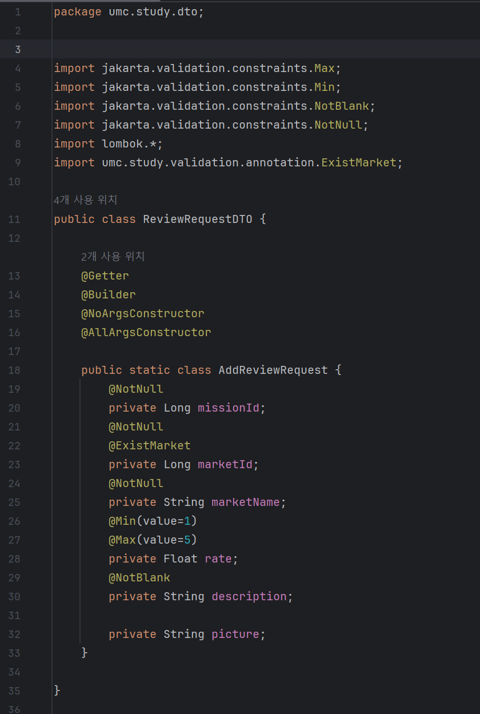

# Chapter 8. API & Swagger & Annotation

# 

```java
@Component
@RequiredArgsConstructor
public class CategoriesExistValidator implements ConstraintValidator<ExistCategories, List<Long>> {

    private final FoodCategoryRepository foodCategoryRepository;

    @Override
    public void initialize(ExistCategories constraintAnnotation) {
        ConstraintValidator.super.initialize(constraintAnnotation);
    }

    @Override
    public boolean isValid(List<Long> values, ConstraintValidatorContext context) {
        boolean isValid = values.stream()
                .allMatch(value -> foodCategoryRepository.existsById(value));

        if (!isValid) {
            context.disableDefaultConstraintViolation();
            context.buildConstraintViolationWithTemplate(ErrorStatus.FOOD_CATEGORY_NOT_FOUND.toString()).addConstraintViolation();
        }

        return isValid;

    }
}
```

# 🎯핵심 키워드

---

<aside>
💡 주요 내용들에 대해 조사해보고, 자신만의 생각을 통해 정리해보세요!
레퍼런스를 참고하여 정의, 속성, 장단점 등을 적어주셔도 됩니다.
조사는 공식 홈페이지 **Best**, 블로그(최신 날짜) **Not Bad**

</aside>

- java의 Exception 종류들
    - illegalArgumentException: 잘못된 인자 전달시
    - IllegalStateException: 객체 상태가 잘못된 경우
    - TypeMismatchException: 타입 변환 실패
    - MissingServletRequestParameterException: 필수 쿼리/매개변수를 안 넣엇을 때
    - MethodArgumentNotValidException: 유효성 검사 실패시
    - EmptyResultDataAccessException: 조회 결과가 없는데 호출하는 경우
    - DuplicateKeyException: 고유키의 위반
    
    이 외에도 다른 예외들이 많이 존재한다. 서비스 단에서 발생하는 예외들은 하나같이 try-catch로 처리해줘야 하는데, 이를 간편하게 한 곳에서 모아 관리할 수 있게 해주는 것이 RestControllerAdvice이다.
    

- @Valid
    
    RequestBody와 같이 쓰이는 어노테이션으로, DTO 필드의 제약 조건을 자동으로 검사해주는 역할을 한다.  @valid가 붙은 객체는 컨트롤러에 진입하기 전 스프링의 argument resolver에 의해 검증이 수행되는데, 이때 필드에 선언된 제약 어노테이션들을 검사한다. 검사 실패시 예외를 발생시킨다. 
    
    이때 발생하는 예외가 MethodArgumentNotValidException으로, 이를 Exceptionhandler나 ControllerAdvice를 통해 에러 메세지를 다른 형태로 반환받을 수 있다. 
    

# 📢 학습 후기

---

- 이번 주차 워크북을 해결해보면서 어땠는지 회고해봅시다.
- 핵심 키워드에 대해 완벽하게 이해했는지? 혹시 이해가 안 되는 부분은 뭐였는지?

<aside>
💡

</aside>

# ⚠️ 스터디 진행 방법

---

1. 스터디를 진행하기 전, 워크북 내용들을 모두 채우고 스터디에서는 서로 모르는 내용들을 공유해주세요.
2. 미션은 워크북 내용들을 모두 완료하고 나서 스터디 전/후로 진행해보세요.
3. 다음주 스터디를 진행하기 전, 지난주 미션을 서로 공유해서 상호 피드백을 진행하시면 됩니다.

---

### [UMC 서버 워크북 참고 자료](https://github.com/CYY1007/UMC_SERVER_WORKBOOK.git)

[GitHub - chock-cho/UMC-7th-spring-workbook at feature-week8-workbook](https://github.com/chock-cho/UMC-7th-spring-workbook/tree/feature-week8-workbook)

---

3주차에 설계한 URL(없으면 추가!)을 바탕으로 아래의 API 구현

단, 로그인 기능이 없는 관계로 리뷰를 작성하거나 미션 도전하는 유저는

**하드 코딩(그냥 무조건 디비에 있는 아무나 한명)**으로 하기!

1. 특정 지역에 가게 추가하기 API
2. **가게에 리뷰 추가하기 API**
3. 가게에 미션 추가하기 API
4. **가게의 미션을 도전 중인 미션에 추가(미션 도전하기) API**

3주차에 설계하지 않은 API URL의 경우는 설계를 복습 할 겸 해보고 진행해주세요!

반드시 인증 사진을 중간 중간 남기며, 7주차와 동일하게 github에 브랜치를 새로 만들어서 푸시하기

<aside>
📌 **조건**

1. github branch를 만들 때 issue를 만들고 branch 생성하여 진행 후 push할 것
2. controller, service, converter, dto, repository를 모두 활용할 것
3. ExceptionAdvice를 적극 활용해야하며 RequestBody에 값이 누락되거나 값이 잘못된 것을 @Valid 어노테이션으로 검증하기
4. **4번 API의 경우는 도전 하려는 미션이 이미 도전 중인지를 검증해야 하며 이를 커스텀 어노테이션을 통해 검증을 해야 함.**
5. **2번 API의 경우도 4번 API처럼 리뷰를 작성하려는 가게가 존재하는지 검증하는 커스텀 어노테이션을 사용할 것.**
</aside>

1, 2, 3 번 조건을 충족하지 않을 경우 해당 API는 미션 완료 대상에서 제외가 되며

**2, 4번 API는 필수로 구현해야 하고,**

만약 3번 API를 만들지 않을 경우 2,4번 API 만들 때 DB에 수동으로 미션 정보 기입해서 진행

위의 4개 API중 **필수 API 포함 3개 미만으로 완료 시 원 아웃 부여**

# 💪 미션 기록

---

<aside>
🍀 미션 기록의 경우, 아래 미션 기록 토글 속에 작성하시거나, 페이지를 새로 생성하여 해당 페이지에 기록하여도 좋습니다!

하지만, 결과물만 올리는 것이 아닌, **중간 과정 모두 기록하셔야 한다는 점!** 잊지 말아주세요.

</aside>

- **미션 기록**
    
    지역을 erd 상에 만들지 않아 가게 리뷰 추가 api, 가게 미션 추가 api, 미션 도전하기 api 세 가지 API를 구현하고자 했습니다. 
    
    ### 가게에 리뷰 추가하기 API
    
    
    
    리뷰 요청 데이터를 담을 dto를 먼저 만들었습니다. 리뷰 테이블은 미션 테이블과 가게 테이블의 매핑 테이블이므로, 각 미션과 가게의 id를 불러왔습니다. 별점의 경우 1점에서 5점 사이에 들어갈 수 있게끔 제한을 뒀습니다. picture의 경우 뒤늦게 추가한 컬럼인데, 리뷰에 컬럼이 필요하지는 않으므로 우선 어노테이션을 제거하고 두었습니다.
    
    
    
    입력받은 리뷰 응답을 반환받기 위해 ReviewResponse도 같이 선언했습니다.
    
    이때 바깥쪽 클래스에 getter를 비롯한 어노테이션을 선언하였기에 안쪽 클래스에는 어노테이션을 선언하지 않아도 될 것 이라 생각했는데, 클래스마다 붙여야 한다는 것을 알게 되었습니다. 
    
    처음엔 클래스가 아니라 값을 반환하는 메서드일 것이라 착각해 class를 붙이지 않고 코드를 짰었는데, 값을 생성한 다음 반환받는다고 생각하는 게 맞는 것 같습니다.
    
    
    
    
    
    리뷰의 서비스와 레포지토리는 저번 주차에서 만든 것에서 추가로 수정할 필요가 없었습니다.
    
    
    
    마지막으로 컨트롤러를 만들어 [localhost](http://localhost) 상에서 출력할 수 있도록 만들었습니다. get과 달리 어노테이션을 GetMapping 대신 PostMapping을 사용하는 것을 확인할 수 있었습니다.
    
    미션 중 커스텀 어노테이션을 통해 리뷰를 작성하려는 가게가 존재하는지 확인해야 하는 조건이 있었습니다. 따라서 실습과 같은 방법으로 어노테이션을 만들어보았습니다.
    
    
    
    ErrorStatus에 가서 가게 관련 에러를 추가했습니다.
    
    
    
    그 다음 MarketExistValidator를 만들어 ConstraintValidator를 구현한 다음 isValid에서 MARKET_NOT_FOUND 예외를 출력하도록 했습니다.
    
    미션에서는 validator에 개선할 수 있는 부분이 있다고 하였습니다. 코드를 작성하며 생각해본 개선점은 다음과 같습니다. 
    
    validator는 가게가 존재하는지 찾고, 존재하지 않는다면 미리 정의해둔 MARKET_NOT_FOUND 예외를 반환합니다. 이때 하나의 예외를 찾기 위해 하나의 validator를 구현하는데, 여러 개의 예외에 각각의 validator를 주어 구현하기는 어려울 것이라 생각했습니다. 예외를 한 곳에서 모아서 관리하듯 validator 또한 하나로 모아 관리할 수 있을 거라 생각합니다.
    
    하지만 어떻게 고쳐야 하는지는 찾지 못 했습니다. 이후 스터디에서 배워가보자 합니다..
    
    
    
    어노테이션이 될 코드도 완성했습니다.
    
    이를 ReviewRequestDTO에서 요청시 확인할 수 있도록 어노테이션을 붙여줍니다.
    
    
    
    이후 swagger를 통해 작동하는지 확인해보았습니다. 데이터베이스 상에 가게 id가 1~5까지 존재하도록 입력했습니다. 
    
    
    
    
    
    존재하는 가게 id이므로, 성공했다는 뜻의 200코드가 발생합니다.
    
    
    
    
    
    다음에는 존재하지 않는 가게에 리뷰를 작성하기 위해 가게 id를 10294로 변경하여 다시 시도했습니다.
    
    400코드 에러가 발생하며, 미리 선언해뒀던 예외인 MARKET_NOT_FOUND가 발생합니다.
    
    ### 가게에 미션 추가 API
    
    
    
    우선 요구사항을 담을 dto부터 만들었습니다. 이전에 만든 @ExistMarket 어노테이션을 사용했습니다.
    
    
    
    처음 코드를 짤 때는 별 생각 없이 불러올 수 있을 것이라 생각하고 marketId와 marketName을 불러오려 했습니다.
    
    
    
    하지만 제 erd 상에서는 mission과 market 간 직접적인 연관관계가 존재하지 않았고, 대신 review 테이블로 매핑만 되어 있어 mission에서 market의 인자를 불러올 수 없었습니다. 
    
    mission.getReview().getMarket().getId()를 통해 넘어갈 수 있을 거라 생각했는데, 실패해 다른 방법들을 찾아보았습니다.
    
    
    
    찾아본 결과 확장 응답 추가 방식으로 이 문제를 해결할 수 있었습니다. MarketInfo 클래스를 따로 만들어 이를 불러온 다음, 필요한 정보를 추출하는 방식으로 문제를 해결했습니다. 미션과 관련된 다른 모든 마켓 정보까지 한 번의 api 호출로 불러오는 방식이라고 합니다. 다른 좋은 방법이 있을 것도 같았지만, 찾기 힘들어 우선 이렇게 해봤습니다.
    
    
    
    서비스 부분도 이렇게 만들었습니다. 가게의 아이디를 찾아보고, 가게가 존재하지 않는다면, 첫 번째 api를 만들 때 같이 만들었던 MARKET_NOT_FOUND 에러를 호출하도록 했습니다. 
    
    다음은 컨버터를 통해 엔티티를 만들고, 이를 savedMission으로 변환해 가게에 미션을 저장하도록 했습니다.
    
    
    
    가게에 미션을 추가해야 하므로 Post를 사용했습니다. 
    
    
    
    존재하는 가게인지 확인한 다음 코드 200을 반환받고 성공했습니다.
    
    
    
    존재하지 않는 가게일 경우 MARKET_NOT_FOUND 오류를 반환받고 실패합니다.
    
    ### 가게의 미션을 도전 중인 미션에 추가하는 API
    
    가게의 미션을 도전 중인 미션에 추가하는 기능에 대해 고민해봤습니다. 추가에 대해서, 처음에는 단순히 mission 테이블에 있는 미션을 복제한 다음 미션의 상태를 “진행 중”으로 초기화 하자 했습니다. 
    
    하지만 그렇게 한다면 수행하려는 미션의 상태를 검증할 수 없다는 문제가 생깁니다. 미션의 진행 상태는 mission과 user 사이의 매핑 테이블인 member_mission 테이블에 있기 때문입니다. mission 테이블에 있는 미션을 member_mission에 추가하기만 한다면 해당 미션의 상태가 “진행 이전”인지, “진행 중인지” 모른 채로 추가하게 됩니다.
    
    미션 목록이 있고 해당 목록에 있는 미션들을 진행 중 미션 목록에 넣는 형태 대신, 모든 미션을 member_mission 테이블에 올린 다음 미션의 상태를 변경하는 식으로 설계하고자 했습니다.
    
    user와 mission 간 memberMission 테이블이 존재하고, 각 사용자들에게 있어 미션의 개수와 같은 memberMission 엔티티가 존재한다고 생각했습니다.  사용자가 n명,  미션이 m개일 때 memberMission은 nm개 존재한다고 보았습니다.
    
    그렇다면 가게의 미션을 도전 중인 미션에 추가한다는 것은 단순히 memberMission에 등록된 미션의 status를 BEFORE_START에서 IN_PROGRESS로 바꾸면 되는 간단한 일이었습니다. 
    
    Https 메소드의 patch 기능을 사용하면 되는 일이라고 생각했습니다.
    
    하지만 “가게”의 미션을 도전 중인 미션에 추가해야 한다는 게 문제였습니다.
    
    
    
    제 erd 상에서 memberMission과 market 테이블은  멀리 떨어져 있었기 때문에 “특정 가게의 미션”을 도전 중인 미션에 추가하기가 어려웠습니다. 뷰 테이블을 사용하는 방법도 고려해보았으나, 디버깅에 어려움이 있을 것 같아 비정규화를 통해  market과 mission 테이블을 연결하도록 했습니다. 가게 id는 조회만 할 뿐 관련 정보를 변경할 일이 없기 때문에, 별다른 성능 저하를 일으키지 않을 거라 생각합니다.  
    
    
    
    DTO를 따로 만들지는 않고, missionDTO의 밑단에 Static 클래스로 만들었습니다. 어노테이션은 미리 적용했습니다. 
    
    다른 dto들처럼 필드 단위에서 어노테이션을 적용하려 했으나, 그렇게 한다면 db에서 관리되어야 할 status가 사용자에게 입력을 받아 상태가 오염될 위험이 있다고 합니다.  따라서 class 단위에서 어노테이션을 적용해 미션의 상태를 파악하고자 했습니다.
    
    
    
    missionInitService를 만들어 각 사용자에게 모든 미션을 추가하여 memberMission 엔티티를 만들고자 했습니다. 데이터가 존재하지 않는다면, 미션을 추가합니다.
    
    
    
    MemberMissionCommandServiceImpl 코드입니다.
    
    사용자 아이디와 미션 아이디를 받아
    
    - 사용자가 존재하지 않는 경우
    - 미션이 존재하지 않는 경우
    - 사용자에게 특정 미션이 없는 경우
    - 사용자에게 있는 미션이 BEFORE START가 아닌 경우
    
    예외를 던지고, 아닐 경우 memberMission의 상태를 BEFORE_START에서 IN_PROGRESS로 변경합니다.
    
    이렇게 미션을 도전합니다.
    
    
    
    추가한 에러코드는 다음과 같습니다.
    
    
    
    어노테이션은 다음과 같이 만들었습니다.
    
    validation에 대해서, 이를 개선할 방법은 bean을 활용해 서비스 단에서 중복되는 코드를 활용하는 것이었습니다.
    
    validatior 하나로 여러 개의 어노테이션을 관리할 수 있을 줄 알았으나, 어노테이션과 validator간 관계는 1대1 이 기본이며, 통합적으로 관리하기 위해서는 약간의 어려움이 있었습니다.
    
    
    
    만든 validatoeService의 메서드를 통해 코드의 중복을 줄일 수 있다고 합니다. 지금으로써는 어노테이션이 많지 않아 메서드가 겹칠 일이 없었으며 오히려 코드의 길이만 늘어났지만, 프로젝트의 크기가 커진다면 괜찮아질 거라고 생각합니다.
    
    
    
    validator의 서비스를 활용하여 수정한 validator입니다.
    
    
    
    memberMission의 미션이 진행중인지 확인하기 위해서는 사용자의 id와 미션의 id 두 개가 필요하여 beanWrapper로 감싼 다음 해당 값을 추출해야 한다고 합니다.
    
    다른 validator와 같이 List로 감싼 다음 추출하는 방법을 선택하고 싶었으나, 이 validator는 다른 테이블의 기본키를 불러오는 것이므로 List보단 이 방법으로 추출하는 것이 안전하다고 합니다.
    
    
    
    컨트롤러를 만들어 잘 작동하는지 확인하고자 했습니다.
    
    
    
    
    
    진행 이전이던 미션이 진행중으로 바뀌었습니다.
    
    
    
    하지만 errorStatus에 지정한 오류메세지가 도저히 발생하지 않아 막힌 상태입니다.
    
    피드백 받은 후 내용 추가하도록 하겠습니다….
    

> **github 링크**
> 
> 
> [jaemin0413/UMC-8th-Spring-Workbook at feature/#3](https://github.com/jaemin0413/UMC-8th-Spring-Workbook/tree/feature/%233)
> 

[시니어 미션](https://www.notion.so/1f7b57f4596b812687e2f7a5175f0b46?pvs=21)

# ⚡ 트러블 슈팅

---

<aside>
💡 실습하면서 생긴 문제들에 대해서, **이슈 - 문제 - 해결** 순서로 작성해주세요.

</aside>

<aside>
💡 스스로 해결하기 어렵다면? 스터디원들에게 도움을 요청하거나 **너디너리의 지식IN 채널에 질문**해보세요!

</aside>

- ⚡이슈 작성 예시 (이슈가 생기면 아래를 복사해서 No.1, No.2, No3 … 으로 작성해서 트러블 슈팅을 꼭 해보세요!)
    
    **`이슈`**
    
    👉 앱 실행 중에 노래 다음 버튼을 누르니까 앱이 종료되었다.
    
    **`문제`**
    
    👉 노래클래스의 데이터리스트의 Size를 넘어서 NullPointException이 발생하여 앱이 종료된 것이었다. 
    
    **`해결`**
    
    👉  노래 다음 버튼을 눌렀을 때 데이터리스트의 Size를 검사해 Size보다 넘어가려고 하면 다음으로 넘어가는 메서드를 실행시키지 않고, 첫 노래로 돌아가게끔 해결
    
    **`참고레퍼런스`**
    
    - 링크
- ⚡이슈 No.1
    
    **`이슈`**
    
    👉 userRepository에서 자동으로 생성된 메서드가 findById가 Long 대신 Integer를 입력받음
    
    **`문제`**
    
    👉 UserRepository가 JpaRepository <User,Long>을 상속받아야 하는데 Long 대신 Interger를 받아서 findById도 Integer로 인자를 받은 것
    
    **`해결`**
    
    👉  Interger를 Long으로 변경
    
    **`참고레퍼런스`**
    
    - [문제 해결 시 참고한 링크]

---

Copyright © 2023 최용욱(똘이) All rights reserved.

Copyright © 2024 김준환(제이미) All rights reserved.