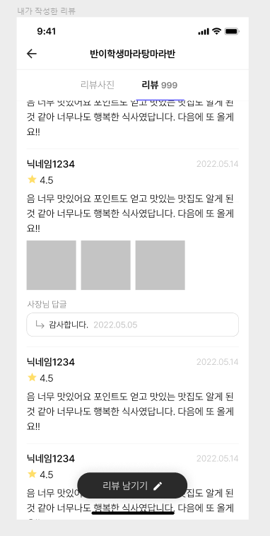
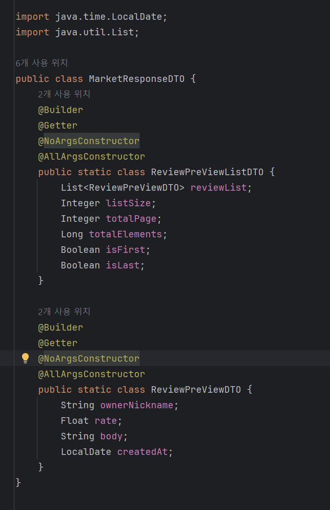

# Chapter 9. API & Paging

# 

# 🎯핵심 키워드

---

<aside>
💡 주요 내용들에 대해 조사해보고, 자신만의 생각을 통해 정리해보세요!
레퍼런스를 참고하여 정의, 속성, 장단점 등을 적어주셔도 됩니다.
조사는 공식 홈페이지 **Best**, 블로그(최신 날짜) **Not Bad**

</aside>

**이번 주차는 핵심 키워드를 무조건 100% 다 조사 해야 하며 자세히 조사 할 것을 권고 드립니다.**

- Spring Data JPA의 Paging
    
    Paging은 대량의 데이터를 효율적으로 처리하고 사용자에게 필요한 만큼 나누어 제공하는 기능이다.
    
    데이터베이스 쿼리에서 페이징을 구현하면 전체 데이터 집합을 페이지로 분할하여 한 번에 적은 양의 데이터만을 가져올 수 있게 된다. 이렇게 하면 메모리 사용을 줄이고 네트워크 트래픽을 최소화하며 사용자에게 더 빠른 응답 시간을 제공할 수 있다.
    
    - Page
        
        Page 객체는 전체 페이지 수, 현재 페이지 번호, 페이지당 항목 수, 총 항목 수, 현재 페이지에 포함된 데이터 목록 등 페이징 관련 정보를 포함한다.
        
        - 특정 페이지로 이동하거나 페이지 번호를 기반으로 항목을 가져올 수 있다.
        - 페이징된 결과의 전체 크기를 계산하기 위해 전체 쿼리가 필요하므로 추가적인 성능 비용이 발생할 수 있다.
        - 페이지 번호를 1,2,3,4.. 로 명시하여 데이터를 구분하는 경우에 유용하다.
    - Slice
        
        Slice 객체는 전체 페이지 수나 총 항목 수에 대한 정보를 제공하지 않고, 현재 페이지에 포함된 데이터 목록과 다음 페이지가 있는지 여부에 대한 정보만 제공한다.
        
        - 전체 크기를 제공하지 않으므로 Page 객체보다 성능이 더 좋을 수 있다.
        - 다음 페이지가 있는지 여부만 제공하여 필요한 경우 더 많은 데이터를 가져올 수 있다.
        - 무한 스크롤 또는 더보기 버튼과 같은 방식이다. 페이지가 명시되지 않고 순차적으로 데이터를 로드하는 경우에 적합하다.
- 객체 그래프 탐색
    
    엔티티 간 연관관계를 따라가며 데이터를 조회하는 개념이다. 관계형 데이터베이스와 객체지향 프로그래밍 간에는 패러다임 차이가 있는데 이를 통해 차이를 극복할 수 있다.
    
    매핑된 연관관계를 통해 연관 객체를 사용하는 시점에 Select 쿼리를 자동으로 실행한다. 이를 통해 객체 간 연관관계를 통해 객체에서 객체로 넘어가며 필요한 데이터를 탐색할 수 있다. 
    
    하지만 객체 그래프 탐색을 무분별하게 사용시 연관된 객체마다 추가 쿼리가 발생해 n+1 문제가 발생할 수 있게 된다. 모든 연관 객체를 한 번에 가져오는 것이 아니므로 필요한 데이터를 적절히 설계해야 한다.
    
    - 객체의 두 관계 중 하나를 연관관계의 주인으로 지정한다.
    - 연관관계의 주인이 외래키를 갖고, 이를 수정할 수 있다.
    - 주인은 MappedBy 속성을 사용할 수 없다
    - 주인이 아닌 쪽은 읽기만 할 수 있다
    - 주인이 아니라면 MappedBy를 통해 주인을 지정해야 한다.
    - MappedBy 속성은 양방향 연관관계 시에만 사용한다.

# 📢 학습 후기

---

- 이번 주차 워크북을 해결해보면서 어땠는지 회고해봅시다.
- 핵심 키워드에 대해 완벽하게 이해했는지? 혹시 이해가 안 되는 부분은 뭐였는지?

<aside>
💡

</aside>

# ⚠️ 스터디 진행 방법

---

1. 스터디를 진행하기 전, 워크북 내용들을 모두 채우고 스터디에서는 서로 모르는 내용들을 공유해주세요.
2. 미션은 워크북 내용들을 모두 완료하고 나서 스터디 전/후로 진행해보세요.
3. 다음주 스터디를 진행하기 전, 지난주 미션을 서로 공유해서 상호 피드백을 진행하시면 됩니다.

# 🔥 미션

---

### [UMC 서버 워크북 참고 자료](https://github.com/CYY1007/UMC_SERVER_WORKBOOK.git)

[GitHub - chock-cho/UMC-7th-spring-workbook at feature-week9-workbook](https://github.com/chock-cho/UMC-7th-spring-workbook/tree/feature-week9-workbook)

---

아래의 API를 구현해야 하며, 추가 조건을 무조건 포함해서 구현을 해야 함.

4개 중 3개 이상의 API를 구현해야 하며 그 이하(0개~2개 구현)는 **원 아웃** 부여.

**2개 이상을 구현 했다고 해도, 추가 조건을 모두 만족하지 않을 경우 구현하지 않은 것으로 판단함.**

**핵심 키워드를 하나라도 조사를 하지 않을 시 역시 원 아웃 부여.**

**구현이 필요한 API 목록**

1. 내가 작성한 리뷰 목록
    - 참고 화면
        
        
        
2. 특정 가게의 미션 목록
3. 내가 진행중인 미션 목록
4. 진행중인 미션 진행 완료로 바꾸기
    - 참고 화면
        
        
        

**API 구현 조건**

1. 반드시 Paging처리를 할 것, 한 페이지에 10개씩 조회 **프론트엔드는 1 이상의 page 번호를 전달**
2. 필요한 데이터는 데이터베이스에서 직접 삽입을 해서 진행 (미션 외 API는 구현해도 됨) 
    1. 다만 미션 외 API는 작성을 해도 구현한 API 갯수로 카운트가 되지 않음
3. 프론트엔드가 주는 page는 쿼리 스트링으로 받아오며 이에 대한 처리를 하는 커스텀 어노테이션 구현을 반드시 할 것 
    1. 1번의 page 범위에 따라 커스텀 어노테이션은 page 1을 0으로 만들어 return 해야 한다.
    2. 그와 동시에 page의 범위가 너무 작은지 (0 이하) 판단을 하여 작은 경우 에러를 발생
    3. 에러 발생 시 반드시 RestControllerAdvice와 연계를 해야 함
4. 반드시 모든 API에 대해 Swagger 명세를 해야 한다. 
5. Converter에서 절대로 for문을 사용해서는 안되며, 무조건 Java의 Stream을 사용해야 한다.
6. 무조건 빌더 패턴을 사용해야 한다.
7. API 구현

# 💪 미션 기록

---

<aside>
🍀 미션 기록의 경우, 아래 미션 기록 토글 속에 작성하시거나, 페이지를 새로 생성하여 해당 페이지에 기록하여도 좋습니다!

하지만, 결과물만 올리는 것이 아닌, **중간 과정 모두 기록하셔야 한다는 점!** 잊지 말아주세요.

</aside>

- **미션 기록**
    
    
    DTO부터 우선 만들겠습니다.
    
    
    
    
    
    컨버터는 다음과 같이 구성했습니다. user에서 id를 끌어와야 하는데, 이는 추후 dto 인젝션을 통해 끌어올 예정입니다
    
    
    
    페이지를 10장 단위로 받아들이도록 서비스를 설정했습니다.
    
    
    
    적힌 어노테이션들의 의미는 차후에 공부하여 다시 적겠습니다.
    

> **github 링크**
> 
> 
> 

[시니어 미션](https://www.notion.so/1f7b57f4596b813dac58f3e27a114773?pvs=21)

# ⚡ 트러블 슈팅

---

<aside>
💡 실습하면서 생긴 문제들에 대해서, **이슈 - 문제 - 해결** 순서로 작성해주세요.

</aside>

<aside>
💡 스스로 해결하기 어렵다면? 스터디원들에게 도움을 요청하거나 **너디너리의 지식IN 채널에 질문**해보세요!

</aside>

- ⚡이슈 작성 예시 (이슈가 생기면 아래를 복사해서 No.1, No.2, No3 … 으로 작성해서 트러블 슈팅을 꼭 해보세요!)
    
    **`이슈`**
    
    👉 앱 실행 중에 노래 다음 버튼을 누르니까 앱이 종료되었다.
    
    **`문제`**
    
    👉 노래클래스의 데이터리스트의 Size를 넘어서 NullPointException이 발생하여 앱이 종료된 것이었다. 
    
    **`해결`**
    
    👉  노래 다음 버튼을 눌렀을 때 데이터리스트의 Size를 검사해 Size보다 넘어가려고 하면 다음으로 넘어가는 메서드를 실행시키지 않고, 첫 노래로 돌아가게끔 해결
    
    **`참고레퍼런스`**
    
    - 링크
- ⚡이슈 No.1
    
    **`이슈`**
    
    👉 [트러블이 생긴 상태 작성]
    
    **`문제`**
    
    👉 [어떤 이유로 해당 이슈가 일어났는지 작성]
    
    **`해결`**
    
    👉  [해결 방법 작성]
    
    **`참고레퍼런스`**
    
    - [문제 해결 시 참고한 링크]

---

Copyright © 2023 최용욱(똘이) All rights reserved.

Copyright © 2024 김준환(제이미) All rights reserved.