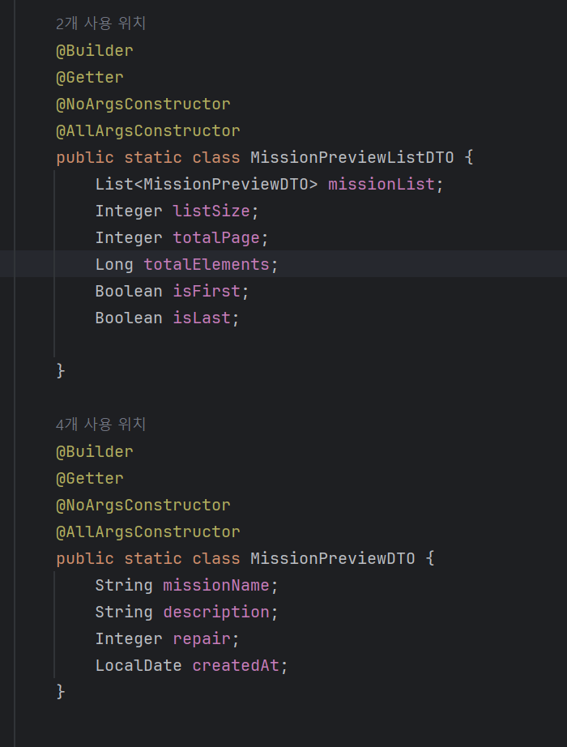

# Chapter 9. API & Paging

# 🎯핵심 키워드

---

<aside>
💡 주요 내용들에 대해 조사해보고, 자신만의 생각을 통해 정리해보세요!
레퍼런스를 참고하여 정의, 속성, 장단점 등을 적어주셔도 됩니다.
조사는 공식 홈페이지 **Best**, 블로그(최신 날짜) **Not Bad**

</aside>

**이번 주차는 핵심 키워드를 무조건 100% 다 조사 해야 하며 자세히 조사 할 것을 권고 드립니다.**

- Spring Data JPA의 Paging
    
    Paging은 대량의 데이터를 효율적으로 처리하고 사용자에게 필요한 만큼 나누어 제공하는 기능이다.
    
    데이터베이스 쿼리에서 페이징을 구현하면 전체 데이터 집합을 페이지로 분할하여 한 번에 적은 양의 데이터만을 가져올 수 있게 된다. 이렇게 하면 메모리 사용을 줄이고 네트워크 트래픽을 최소화하며 사용자에게 더 빠른 응답 시간을 제공할 수 있다.
    
    - Page
        
        Page 객체는 전체 페이지 수, 현재 페이지 번호, 페이지당 항목 수, 총 항목 수, 현재 페이지에 포함된 데이터 목록 등 페이징 관련 정보를 포함한다.
        
        - 특정 페이지로 이동하거나 페이지 번호를 기반으로 항목을 가져올 수 있다.
        - 페이징된 결과의 전체 크기를 계산하기 위해 전체 쿼리가 필요하므로 추가적인 성능 비용이 발생할 수 있다.
        - 페이지 번호를 1,2,3,4.. 로 명시하여 데이터를 구분하는 경우에 유용하다.
    - Slice
        
        Slice 객체는 전체 페이지 수나 총 항목 수에 대한 정보를 제공하지 않고, 현재 페이지에 포함된 데이터 목록과 다음 페이지가 있는지 여부에 대한 정보만 제공한다.
        
        - 전체 크기를 제공하지 않으므로 Page 객체보다 성능이 더 좋을 수 있다.
        - 다음 페이지가 있는지 여부만 제공하여 필요한 경우 더 많은 데이터를 가져올 수 있다.
        - 무한 스크롤 또는 더보기 버튼과 같은 방식이다. 페이지가 명시되지 않고 순차적으로 데이터를 로드하는 경우에 적합하다.
- 객체 그래프 탐색
    
    엔티티 간 연관관계를 따라가며 데이터를 조회하는 개념이다. 관계형 데이터베이스와 객체지향 프로그래밍 간에는 패러다임 차이가 있는데 이를 통해 차이를 극복할 수 있다.
    
    매핑된 연관관계를 통해 연관 객체를 사용하는 시점에 Select 쿼리를 자동으로 실행한다. 이를 통해 객체 간 연관관계를 통해 객체에서 객체로 넘어가며 필요한 데이터를 탐색할 수 있다. 
    
    하지만 객체 그래프 탐색을 무분별하게 사용시 연관된 객체마다 추가 쿼리가 발생해 n+1 문제가 발생할 수 있게 된다. 모든 연관 객체를 한 번에 가져오는 것이 아니므로 필요한 데이터를 적절히 설계해야 한다.
    
    - 객체의 두 관계 중 하나를 연관관계의 주인으로 지정한다.
    - 연관관계의 주인이 외래키를 갖고, 이를 수정할 수 있다.
    - 주인은 MappedBy 속성을 사용할 수 없다
    - 주인이 아닌 쪽은 읽기만 할 수 있다
    - 주인이 아니라면 MappedBy를 통해 주인을 지정해야 한다.
    - MappedBy 속성은 양방향 연관관계 시에만 사용한다.

# 📢 학습 후기

---

- 이번 주차 워크북을 해결해보면서 어땠는지 회고해봅시다.
- 핵심 키워드에 대해 완벽하게 이해했는지? 혹시 이해가 안 되는 부분은 뭐였는지?

<aside>
💡

</aside>

# ⚠️ 스터디 진행 방법

---

1. 스터디를 진행하기 전, 워크북 내용들을 모두 채우고 스터디에서는 서로 모르는 내용들을 공유해주세요.
2. 미션은 워크북 내용들을 모두 완료하고 나서 스터디 전/후로 진행해보세요.
3. 다음주 스터디를 진행하기 전, 지난주 미션을 서로 공유해서 상호 피드백을 진행하시면 됩니다.

# 🔥 미션

---

### [UMC 서버 워크북 참고 자료](https://github.com/CYY1007/UMC_SERVER_WORKBOOK.git)

[GitHub - chock-cho/UMC-7th-spring-workbook at feature-week9-workbook](https://github.com/chock-cho/UMC-7th-spring-workbook/tree/feature-week9-workbook)

---

아래의 API를 구현해야 하며, 추가 조건을 무조건 포함해서 구현을 해야 함.

4개 중 3개 이상의 API를 구현해야 하며 그 이하(0개~2개 구현)는 **원 아웃** 부여.

**2개 이상을 구현 했다고 해도, 추가 조건을 모두 만족하지 않을 경우 구현하지 않은 것으로 판단함.**

**핵심 키워드를 하나라도 조사를 하지 않을 시 역시 원 아웃 부여.**

**구현이 필요한 API 목록**

1. 내가 작성한 리뷰 목록
    - 참고 화면
        
        
        
2. 특정 가게의 미션 목록
3. 내가 진행중인 미션 목록
4. 진행중인 미션 진행 완료로 바꾸기
    - 참고 화면
        
        
        

**API 구현 조건**

1. 반드시 Paging처리를 할 것, 한 페이지에 10개씩 조회 **프론트엔드는 1 이상의 page 번호를 전달**
2. 필요한 데이터는 데이터베이스에서 직접 삽입을 해서 진행 (미션 외 API는 구현해도 됨) 
    1. 다만 미션 외 API는 작성을 해도 구현한 API 갯수로 카운트가 되지 않음
3. 프론트엔드가 주는 page는 쿼리 스트링으로 받아오며 이에 대한 처리를 하는 커스텀 어노테이션 구현을 반드시 할 것 
    1. 1번의 page 범위에 따라 커스텀 어노테이션은 page 1을 0으로 만들어 return 해야 한다.
    2. 그와 동시에 page의 범위가 너무 작은지 (0 이하) 판단을 하여 작은 경우 에러를 발생
    3. 에러 발생 시 반드시 RestControllerAdvice와 연계를 해야 함
4. 반드시 모든 API에 대해 Swagger 명세를 해야 한다. 
5. Converter에서 절대로 for문을 사용해서는 안되며, 무조건 Java의 Stream을 사용해야 한다.
6. 무조건 빌더 패턴을 사용해야 한다.
7. API 구현

# 💪 미션 기록

---

<aside>
🍀 미션 기록의 경우, 아래 미션 기록 토글 속에 작성하시거나, 페이지를 새로 생성하여 해당 페이지에 기록하여도 좋습니다!

하지만, 결과물만 올리는 것이 아닌, **중간 과정 모두 기록하셔야 한다는 점!** 잊지 말아주세요.

</aside>

- **미션 기록**
    
    
    ### 특정 가게의 미션 목록
    
    실습에서와 같이 DTO 구현을 우선 했습니다.
    
    
    
    Mission의 내용들 중 필요한 부분들을 MIssionPreViewDTO에 담았습니다.
    
    그리고 이로 구성된 리스트들을 받는 MissionPreViewDTO도 만들었습니다.
    
    List의 경우 isFirst와 isLast의 경우 따로 사용한 적이 없는 것 같아 사용처가 궁금했는데, 프론트에서 페이지 네비게이션을 제어하는 경우에 사용한다고 합니다. 첫 페이지에서 이전 버튼 없애기, 마지막 페이지에서 다음 버튼 없애기 등을 하기 위해 사용합니다.
    
    
    
    Converter는 다음과 같이 구현했습니다. mission과 market 간 다대다 연관관계를 맺었는데, 연관관계의 주인이 달라 넘어갈 수 없었기에 정규화를 깨고 market과 mission간 일대다 연관관계를 추가로 맺었습니다. 따라서 객체그래프 탐색을 통해 쉽게 해당 엔티티에 접근할 수 있었습니다.
    
    
    
    mission을 List 대신 Page에 담음으로써 전체 데이터 개수, 전체 페이지 수, 현재 페이지 번호, 다음, 이전 페이지 존재여부, 현재 페이지의 mission 리스트 등 페이징에 필요한 정보를 함께 제공합니다.
    
    List의 기능을 포함하며 추가로 페이징을 위한 기능까지 부여한 객체임을 알게 되었습니다.
    
    PageRequest는 페이징 정보를 담는 객체로 몇 번째 데이터를 조회할지, 한 페이지에 몇 개의 데이터를 보여줄지 등을 지정할 수 있게 하는 객체입니다.
    
    
    
    
    
    서비스 단은 이렇게 작성했습니다.
    
    PageRequest.of(page, pagesize)에 대해서, page는 가져올 페이지의 번호이며 pagesize는 한 번에 가져올 데이터의 개수입니다. 한 번에 10개씩 데이터를 가져오기로 했으므로 10으로 지정했습니다. 
    
    페이지의 번호는 0부터 시작합니다. 
    
    pageRequest.of(2,10)이라면, 3번째 페이지를 한 페이지에 10개씩 담아 가져옵니다.
    
    따라서 21~30번째 데이터를 가져오는 것임을 알 수 있습니다.
    
    
    
    컨트롤러 단은 이렇게 작성했습니다.
    
    @ApiResponses 단으로 묶인 어노테이션들의 의미가 궁금했엇는데, 이는 단순히 한 API 엔드포인트가 반환할 수 있는 다양한 응답들을 기술할 수 있게 하는 거라고 합니다.
    
    @content 부분부터는 실제로 이 응답이 올 때 어떤 데이터 구조가 반환되는지 명시하기 위해 존재합니다.
    
    @Schema는 Content 안에서 사용되며 실제로 어떤 클래스가 반환되는지 지정합니다. 여기서는 ApiResponse 클래스를 따라 만들어진 JSON 형태로 오는 것을 명시한다고 합니다.
    
    
    
    Swagger를 통해 확인해보니 잘 작동함을 알 수 있습니다.
    
    ### 커스텀 어노테이션 구현
    
    
    
    우선 어노테이션부터 만들었습니다. validator를 만들어 연결해야 하는 것이 아닌가 했는데, 이 경우에는 HandlerMethodArgumentResolver를 사용하기에 validator를 대체할 수 있다고 합니다. 
    
    값 검증(페이지 번호가 올바른지)과 값 변환( 1 베이스 페이지를 0 베이스 페이지로 변환) 을 동시에 수행하기 위해서는 resolver를 사용하는 것이 더 적합하다고 합니다. validator는 검증은 하더라도 변환을 동시에 수행하지는 못 하기 때문입니다.
    
    
    
    handlerArgumentResolver를 구현했습니다. 이 부분이 validator를 대체하는 역할을 합니다. 
    
    supportsParameter 부분에서는 “이 파라미터를 처리할 수 있는가”에 대해서 판단합니다. 이 경우, @validPage 어노테이션이 붙어있으며 타입이 Integer인 경우에만 이 리졸버가 처리하게 됩니다.
    
    resolveArgument 부분에서는 실제로 파라미터 값을 읽어서 검증 및 변환을 수행합니다.
    
    page 값을 읽고 값이 없으면 0을 반환, 값이 있다면 해당 값을 정수로 바꿔 검증을 시도합니다.
    
    이때 입력받은 값이 1보다 작다면 예외를 내보내고, 1보다 클 때에는 1-base 페이지를 0-base 페이지로 바꿉니다. 따라서 이전에는 리뷰를 볼 때 페이지에 0을 입력해야 보였는데, 이제는 1을 입력해도 페이지를 볼 수 있게 합니다.
    
    만약 page가 숫자가 아니면 형식이상예외를 내보냅니다.
    
     
    
    
    
    이렇게 만든 resolver를 스프링 웹 설정에 등록합니다.
    
    
    
    컨트롤러 단에 @ValidPage 어노테이션을 추가했는데 도저히 작동하지를 않아 방법을 찾아봤습니다.
    
    문제는 @RequestParam 어노테이션이었습니다.
    
    @RequestBody 어노테이션은 ArgumentResolver의 구현체인 RequestResponseBodyMethodProcessor에 의해 처리되는데, 해당 구현체에는 @RequestBody를 찾아서 사용한다고 한다. 해당 resolver가 우선적으로 작동하며, RequestResponseBodyMethodProcessor로 인해 이미 값이 객체로 만들어졌기 때문에 다른 argumentResolver는 작동하지 않았다.
    
    한 개의 객체 생성을 위해 2개의 ArgumentResolver는 동작할 수는 없기 때문이다.
    
    좀 더 찾아보니 RequestBody나 RequestParam이나 동일한 이유로 내가 만든 resolver가 작동하지 않았다. 방법을 좀 더 찾아보니 RequestBodyAdvice를 상속받아 @RequsetBody 어노테이션이 선언된 부분을 수정하여 두 개의 리졸버가 동작하게끔 하는 방법이 있는 것 같았다.
    
    하지만 구현 난이도도 너무 높고, RequestParam에서 검증받는 값이 단순한 Integer였기 때문에, 그냥 RequestParam을 없애고 내 resolver에서 int인지 검증하는 코드를 추가했다.
    
    
    
    그제서야 어노테이션이 제대로 작동했다.
    
    
    
    ### 내가 진행 중인 미션 목록
    
    
    
    진행 중인 미션을 담을 DTO를 작성했습니다.
    
    
    
    레포지토리에 사용자와 미션의 상태를 기준으로 모든 미션을 불러오는 메서드를 정의했습니다.
    
    POST와 다르게 GET은 이용자가 매개변수를 넣는 것이 아니기에 직접 메서드에 status를 넣을 수 있었습니다.
    
    
    
    
    
    서비스 단에는 memberMission에 대해서, memberMissionRepository에 만들어두었던 함수로 진행 중인 미션을 불러왔습니다.
    
    ExistUser 어노테이션은 존재하지 않으므로 user를 찾은 다음 존재하지 않을 경우 예외를 발생시키도록 했습니다.
    
    다른 조회 API와 같이 user 객체를 넣으려 했는데,  레포지토리에서 요구하는 매개변수와 서비스 단에서 제공하는 매개변수가 같음에도 파라미터 불일치가 발생하여 일단 userId를 넣도록 하였습니다. 
    
    
    
    converter 단은 다음과 같이 구성했습니다. 미션의 상태를 파악하기 위해 memberMission을 기준으로 받아왔기 때문에 객체그래프 탐색이 많았지만, 큰 성능저하는 없을 거라 생각합니다.
    
    
    
    컨트롤러 단은 다음과 같이 구성했습니다.
    
    마찬가지로 @ValidPage 어노테이션에서 page가 유효한 매개변수인지 파악하기 때문에 @RequestParam을 제거하여 진행했습니다.
    
    
    
    페이징이 잘 되는지 확인하기 위해 11개의 데이터를 넣었습니다. isLast가 false이기에 뒷 페이지가 있음을 알 수 있습니다.
    
    
    
    2번째 페이지에서는 isLast가 true로 나와 현재 페이지가 마지막 장임을 알 수 있습니다. 총 11개의 데이터를 넣었으므로 10개 단위로 끊겨서 나옴을 확인할 수 있었습니다.
    
    ### 진행 중인 미션 창을 진행 완료 페이지로 만들기
    
    진행 중인 미션 창을 진행 완료 페이지로 바꿔보기 위해서 dto부터 새로 만들 필요는 없다고 생각했습니다. 서비스 단에서 상태를 매개변수로 주입하면 레포지토리에서 주입받은 상태를 바탕으로 미션들을 출력합니다. 서비스 단에서 진행 상태를 주입하는 메서드와 완료 상태를 주입하는 메서드 두 개를 만들 수도 있겠지만, 이를 컨트롤러 단에서 입력받은 상태를 기준으로 진행 중인 미션, 완료한 미션을 찾아보는 더 유연한 방식의 메서드를 구현하고자 했습니다.
    
    
    
    매개변수로 상태까지 입력받은 다음, 입력받은 상태를 그대로 레포지토리의 findAllByUserIdAndStatus 메서드에 주입하면 되는 간단한 방법이었습니다. 따라서 코드를 다음과 같이 수정했습니다.
    
    
    
    컨트롤러 부분의 이름을 바꾸고 @Getmapping을 추가했습니다.
    
    컨트롤러에서 찾아야 하는 상태만 주입하면 되므로 간편하게 API를 만들었습니다.
    
    
    
    결과값도 잘 나옴을 알 수 있습니다.
    

> **github 링크**
> 
> 
> [jaemin0413/UMC-8th-Spring-Workbook at feature/#3](https://github.com/jaemin0413/UMC-8th-Spring-Workbook/tree/feature/%233)
> 

[시니어 미션](https://www.notion.so/1f7b57f4596b813dac58f3e27a114773?pvs=21)

# ⚡ 트러블 슈팅

---

<aside>
💡 실습하면서 생긴 문제들에 대해서, **이슈 - 문제 - 해결** 순서로 작성해주세요.

</aside>

<aside>
💡 스스로 해결하기 어렵다면? 스터디원들에게 도움을 요청하거나 **너디너리의 지식IN 채널에 질문**해보세요!

</aside>

- ⚡이슈 작성 예시 (이슈가 생기면 아래를 복사해서 No.1, No.2, No3 … 으로 작성해서 트러블 슈팅을 꼭 해보세요!)
    
    **`이슈`**
    
    👉 앱 실행 중에 노래 다음 버튼을 누르니까 앱이 종료되었다.
    
    **`문제`**
    
    👉 노래클래스의 데이터리스트의 Size를 넘어서 NullPointException이 발생하여 앱이 종료된 것이었다. 
    
    **`해결`**
    
    👉  노래 다음 버튼을 눌렀을 때 데이터리스트의 Size를 검사해 Size보다 넘어가려고 하면 다음으로 넘어가는 메서드를 실행시키지 않고, 첫 노래로 돌아가게끔 해결
    
    **`참고레퍼런스`**
    
    - 링크
- ⚡이슈 No.1
    
    **`이슈`**
    
    👉 [트러블이 생긴 상태 작성]
    
    **`문제`**
    
    👉 [어떤 이유로 해당 이슈가 일어났는지 작성]
    
    **`해결`**
    
    👉  [해결 방법 작성]
    
    **`참고레퍼런스`**
    
    - [문제 해결 시 참고한 링크]

---

Copyright © 2023 최용욱(똘이) All rights reserved.

Copyright © 2024 김준환(제이미) All rights reserved.