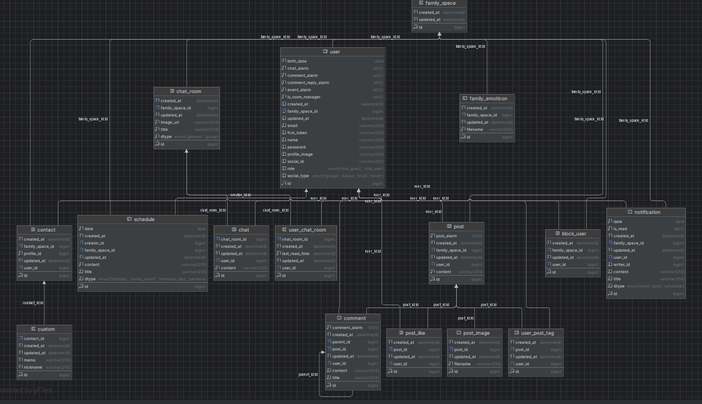
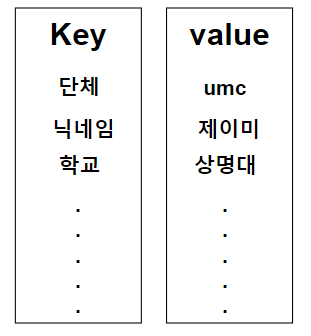
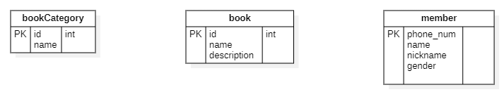
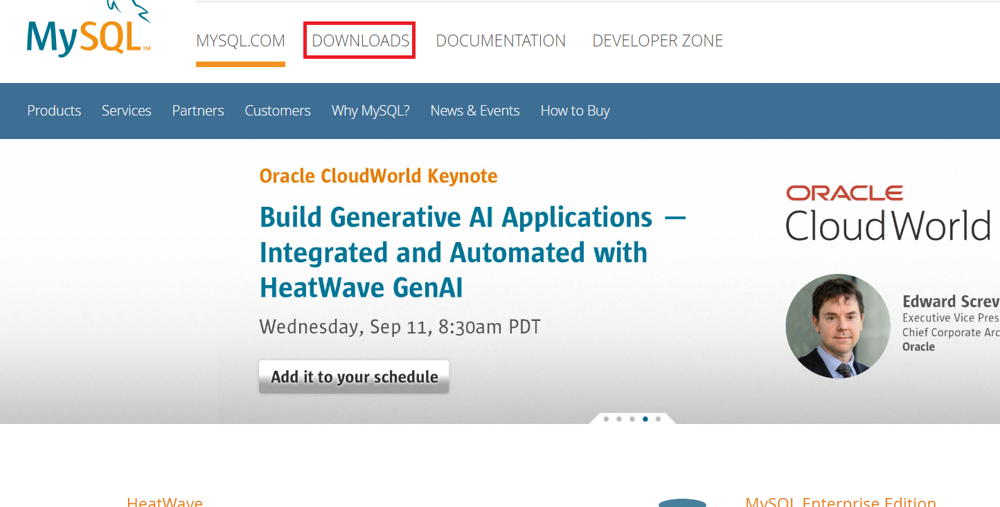
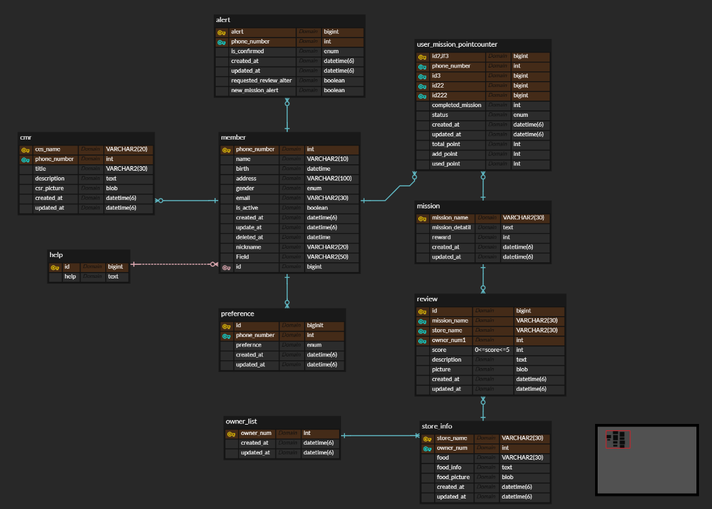
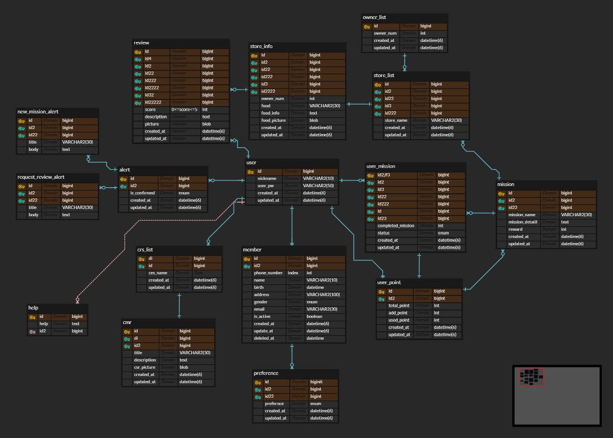
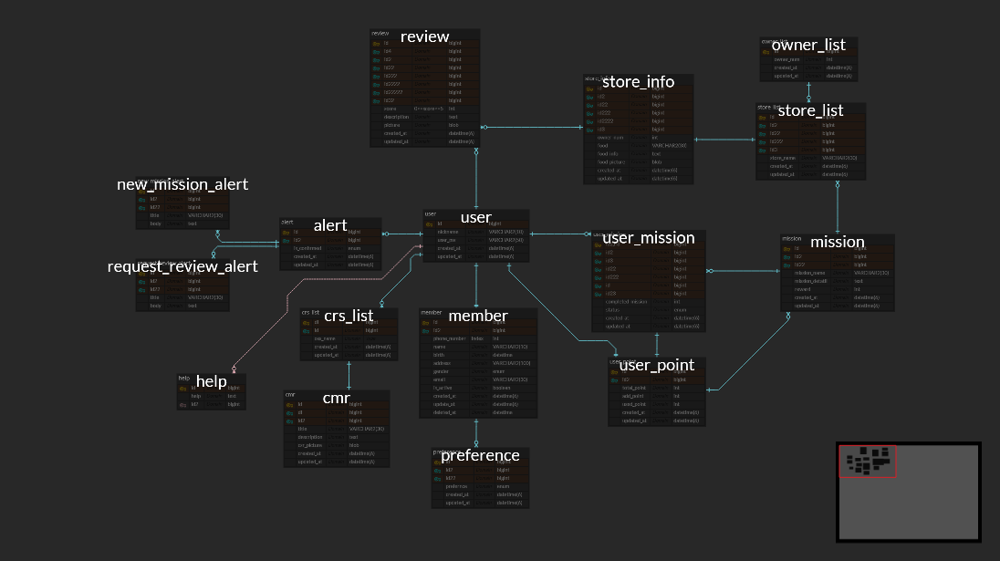

# Chapter 1. Database 설계 (2)

<aside>
🚨 **주의사항!**

이번 1주차에서는 기본적인 **DDL, DML은 알고 계신다는 전제**로 시작하며, 서버 파트의 모집 자체를 **DB에 대한 사전 지식이 있는 분**을 모집했기에, 정말 기본적인 DB 용어 (외래키, 관계형 데이터베이스, 기본 키 등등)는 참고 링크만 드릴 예정이니 준비되지 않으신 챌린저들은 꼭 공부를 하시고 1주차를 진행해주시기 바랍니다.

</aside>

## 📝 학습 목표

---

1. SQL, NoSQL에 대해 알아본다.
2. Database 설계를 어떻게 하는 것이 좋은지 이해한다.
3. 로컬 DB를 설치하여 연결 해본다.

## 📸 잠깐 ! 스터디 인증샷은 찍으셨나요?📸

---

* 스터디리더께서 대표로 매 주차마다 한 장 남겨주시면 좋겠습니다!🙆💗
 (사진을 저장해서 이미지 임베드를 하셔도 좋고, 복사+붙여넣기 해서 넣어주셔도 좋습니다!)

## 📑 1주차 주제

---

이번 주차는 이제 **백엔드 서버의 핵심**인
**데이터베이스를 어떻게 설계하는 것이 좋을까?** 이를 고민하고,

요구 사항 몇 가지와 함께
**이런 상황에서 어떻게 설계를 하는 것이 좋을 지**를 다루는 것이 **주 내용**입니다.

이번 주차의 주제인 데이터베이스를 **직접 설계해보는 것**이 매우 중요하니,
미션을 통해 설계를 해보며 **스스로 익히는 것이 중요한 주차**입니다!

> **이번 주차 요약**
> 
> - **데이터베이스를 어떻게 설계**하는 것이 좋을까?
> - **이런 상황에서는 어떻게 설계**하는 것이 좋을까?
> - **직접 데이터베이스를 설계해보자!**

- **참고 자료 (기초 지식 등)**
    
    [MySQL- 구조와 테이블 생성](https://jominseoo.tistory.com/48)
    
    [[MYSQL] 📚 기본 SQL문법 정리 (테이블 조회, 생성, 수정, 삭제)](https://inpa.tistory.com/entry/MYSQL-%F0%9F%93%9A-%EA%B8%B0%EB%B3%B8-SQL%EB%AC%B8-%EC%A0%95%EB%A6%AC-%ED%85%8C%EC%9D%B4%EB%B8%94-%EC%A1%B0%ED%9A%8C-%EC%83%9D%EC%84%B1-%EC%88%98%EC%A0%95-%EC%82%AD%EC%A0%9C)
    
    [[MYSQL] 📚 테이블 조인(JOIN) - 그림으로 알기 쉽게 정리](https://inpa.tistory.com/m/entry/MYSQL-%F0%9F%93%9A-JOIN-%EC%A1%B0%EC%9D%B8-%EA%B7%B8%EB%A6%BC%EC%9C%BC%EB%A1%9C-%EC%95%8C%EA%B8%B0%EC%89%BD%EA%B2%8C-%EC%A0%95%EB%A6%AC)
    
    [[MYSQL] 📚 서브쿼리 개념 & 문법 💯 정리](https://inpa.tistory.com/m/entry/MYSQL-%F0%9F%93%9A-%EC%84%9C%EB%B8%8C%EC%BF%BC%EB%A6%AC-%EC%A0%95%EB%A6%AC)
    
    [ERD, 어떻게 설계하는 걸까?](https://mslilsunshine.tistory.com/164)
    
    [📋 데이터 모델링 개념 & ERD 다이어그램 작성 💯 총정리](https://inpa.tistory.com/entry/DB-📚-데이터-모델링-1N-관계-📈-ERD-다이어그램)
    
    [ERD 세부 개념과 작성 방법](https://velog.io/@doohyunlm/DB-ERD-작성-방법)
    

## 📑 1주차 본문 들어가기 전

---

본격적인 데이터베이스 설계에 들어가기 전, 먼저 생각해 보아야 할 것은 SQL과 NOSQL입니다.

SQL은 Stands for Structured Query의 약자로 주로 관계형 데이터 베이스에 이용이 되고

NoSQL은 Not Only SQL의 약자로 SQL이 아닌 나머지를 의미합니다. 

밑에 더 자세히 설명하여 볼게요!

## SQL

SQL은 Structured Query Language의 약자로 관계형 데이터베이스를 사용하는 시스템에서 데이터를 관리하는 데 사용되는 언어입니다. 

입출력 속도 보다는 정확도와 입출력이 중요할 때 적합하며 데이터가 일관되고 테이블 간의 관계가 잘 정의된 구조화된 데이터에 좋습니다. 

주요 SQL 쪽의 데이터베이스 시스템으로는 MySQL, PostgreSQL, Oracle Database 등이 존재합니다.

SQL이 쓰이는 관계형 데이터베이스 구조

## NoSQL

NoSQL은 Not Only SQL의 약자로 SQL을 사용하지 않는 DBMS들을 의미합니다. 

NoSQL 쪽의  데이터베이스는 key-value, document, graph 등 다양한 데이터 구조를 지원하기에 데이터가 미리 정의된 스키마를 따르지 않고 데이터 요소 간의 관계가 잘 정의되어 있지 않은 반정형 또는 비정형 데이터에 적합합니다. 

주요 NoSQL 쪽의 데이터베이스 시스템으로는 MongoDB, Redis, neo4j, DynamoDB 등이 존재합니다.

key-value 구조

NoSQL 중 가장 많이 쓰이는 Document 구조 (MongoDB)

SQL과 NoSQL 중 어느 것을 사용해야 할까요?

정답은 없습니다.

SQL과 NoSQL은 서로 다른 장단점을 가지며, 프로젝트의 요구 사항에 맞춰 적절한 데이터베이스 유형을 선택하는 것이 중요합니다. 

저희는 가장 보편적으로 사용 되는 SQL을 기준으로 진행해보겠습니다!

## 🔖 1주차 본문

---

데이터베이스는 언제 설계를 해야 할까요?

데이터베이스의 설계 결과물은 **ERD**이며,
ERD를 그리는 툴은 선호도에 따라 다르니 마음에 드시는 툴을 선택하세요.

TMI) 저(🐕똘이🐕) 같은 경우는 StarUML과 AQueryTool을 사용합니다!

(기능은 별로 안 좋지만 간단하게 실시간으로 팀원들과 함께 실시간으로 수정할 때는 ERD Cloud를 사용하기도 합니다.) (무엇보다 무료여서… 💵)

자, 그러면 ERD는 언제 설계하는 것이 좋을까요?

<aside>
🌟 **ERD는 프로젝트 시작과 동시에 설계하는 것이 좋습니다.**

물론, 기획과 디자인이 어느 정도 나와 개발자가 작업을 시작할 수 있는 시점을 말하는 것입니다.

</aside>

ERD는 세세한 내용은 언제든지 바뀔 수 있기에 **처음부터 완벽하게 만들 필요는 없습니다.**

큰 틀을 정해두는 것이 **1차 목표**이며,
보통 실제 기능 구현을 진행하며 필요한 내용을 수정하죠.

그리고 **서버 파트 챌린저들이 명심해야 하는 것**은

<aside>
❗ **모든 팀원이 인지하는 데이터베이스는 동일해야 한다는 것입니다.**

**각자 자기 마음대로 DB를 설계하고, 작업 후 나중에 합치는 행위는 매우 좋지 않습니다.**

꼭 처음에 빠르게 ERD를 설계하여,
**모두가 공통된 데이터베이스에 대해 인지한 후 작업을 하는 것**이 좋습니다!

</aside>

> 이번 주 **워크북**은
> 
> - **유저 테이블을 어떻게 설계**하는 것이 좋은지
>     
>     무결성-신뢰할 수 있는 데이터 필요(→ 불필요한 데이터 삭제로 저장공간 ), 유연성-데이터의 수정시 최소로 작동하게끔 설계, 확장성-db구동시 클라이언트의 요청에 빠른 회신 가능한 구조
>     
>     요청에따른  예비 필드 목록을 뽑고 이를 예비 테이블로 만들어서 큰틀을 확인하고, 만들고자하는 서비스와 유사한 서비스를 찾아서 어떤 데이터를 수집하고 찾았는지 확인하고, 이를 바탕으로 필요한 데이터를 예측하는 과정이 선제적으로 필요하다. 테이블이 단일 주제를 나타내는 것이 가장 중요합니다. 대부분의 문제가 테이블이 여러 주제를 나타낼 때 발생하기 때문이다.
>     
>     기본키를 설정시 자연키와 인조키를 설정하는데 외부 요인에 의해서 바뀔 확률이 있는 경우 유연성이 높은 인조키로 설정하는 것이 좋다.
>     
>     다중 값 필드와 다중 부분 필드는  그 안에서 데이터를 수정, 삭제, 정렬, 그룹화하기가 어렵기때문에 피하는 것이 좋다.
>     
>     다중값 또는 다중필드들을 포함하지 않는다.
>     
>     계산된 필드들을 포함하지 않는다.
>     
>     외래키에 불필요하게 중복되는 필드들을 포함하지 않는다.⇒ 최소한의 중복 데이터만 포함한다.
>     
>     필드 명세 설정을 데이터에 알맞게 설정해야한다.
>     
> 
> - **N : M(다대다) 관계는 어떻게 하는 것**이 좋은지
>     
>     
>     우선 N:M 관계란 두테이블간  여러개의 연관성을 표현해야 할 때 사용되는 것으로 이를 구현하기 위해서는 연결 테이블 (또는 중간 테이블)이라는 세번째 테이블을 사용하는 것이 일반적이고 가장 좋은 방법이다. 두 테이블
>     ’가’테이블과 ‘나’테이블이 있는 상황에서 서로 여러 연관성이 있을때 두 테이블의 기본 키를 외래키로 가지는 중간테이블을 만들어야한다. 이 테이블은 두 테이블간 관계를 나타내며, 1:n관계로 풀어진다. 
>     
>     요약 = 다대다 → 일대다
>     위 데이터를 조회하기 위해서 join을 사용하여 중간테이블을 거쳐 원하는 데이터를 가져오는 방식으로 사용하면 된다.
>     
> - **알림을 보내야 하는 경우**는 어떻게 하는 것이 좋은지 등
> 
> 알림의 종류 설정 
> 
> 1. 실시간 알림 : 사용자가 즉시 받아야하는 알림 , 웹이나 앱에서 즉시 전달됨
> 
> 2.예약된 알림 : 특정 시점에 맞춰 예약된 알림으로, 시간이 지난 후에 사용자에게 전달된다.
> 
> 알림트리거 조건
> 1이벤트 기반 : 특정 조건 충족, 사용자 동작에 따른 실시간 알림)
> 2.상태 변화 기반
> 3. 시간 기반(사용자가 설정한 특정 시간 또는 시스템에서 예약된 시간에 알림이 트리거됨)
> ⇒ 이를 위해 **이벤트 핸들러** 또는 **스케줄러**(예: Cron Job) 같은 기술을 사용할 수 있습니다.
> 
> 알림전달 방식
> 1.푸시 알림 : 웹 또는 모바일 앱에서 사용자가 알림을 수신할 수 있도록 실시간으로 전달합니다
> 2.이메일 알림 : 사용자에게 이메일로 중요한 알림을 보내는 방법. 이메일 서비스(SMTP)를 통해 구현하며, 주로 장기적인 알림이나 상세한 정보를 제공할 때 유용합니다.
> 3.인 앱 알림 : 앱이나 웹사이트 내부에서 사용자가 접속할 때 알림을 보여주는 방식입니다
> 4.sms알림 : 사용자에게 문자 메시지를 통해 정보를 전달하는 방식. 중요한 알림이나 긴급 알림에 주로 사용됩니다
> 
> **알림 시스템 아키텍쳐**
> pub/sup 패턴(이벤트 발생시 사용자에게 알림 전달 ex-RabbitMQ, Apache Kafka)
> 메시지 큐(비동기적 알림 전송작업 처리로 대용량으로 동시에 보낼시 유리)
> 
> **알림 우선 순위와 빈도**
> 1.우선순위 설정 : 각 알람별 긴급도를 설정하여 높을수록 즉시 전달하고 낮으면 모았다 한번에 보내는 형식으로도 전달 할 수 있다.
> 2.사용자 설정 : 알림 설정 방식을 사용자가 컨트롤 할 수 있게 하는 것
> 
> 위 내용을 바탕으로 알림 구현하면 된다.
> 마지막으로 **사용자경험(UX)**를 고려해야한다.
> 
> **설계를 할 때 이런 식으로 하는 것이 좋다**는 것에 대한 내용을 다룹니다.
> 

> 미리 말씀드리지만, 이번 주차 **미션**은
저희 💛**Plan 파트**💛에서 제공해주신 피그마(IA/WF)를 보고,
**직접 설계를 해보는 것** 입니다!
> 
> 
> 그리고 **추가적으로 AWS에서 로컬 DB를 구축하는 것도 진행할 예정**입니다.
> 

🤓 저희 UMC 스터디에서는 **MySQL을 기준**으로 한다는 점을 말씀드립니다. 🤓

# DATABASE 설계

---

아래 도서 대여 관리 app에 대한 😉**아주 간단한 요구 사항**😉을 살펴봅시다.

## 요구 사항

---

### 사용자 관련 요구 사항

1. **카카오 소셜 로그인**을 구현 할 예정이다.
2. **회원 탈퇴 기능**이 필요하다.
3. **이름, 닉네임, 전화번호, 성별**이 필요하다.

### 책 관련 요구 사항

1. **사용자가 책 여러 권을 대여**할 수 있다.
2. 책은 **하나의 카테고리**가 있다.
3. 책은 **제목, 설명에 대한 정보**가 필요하다.
4. 책 소개 페이지에 **해시태그**가 붙을 수 있고,
**책 한 권에 해시태그 여러 개**가, **해시태그 하나가 여러 책**에 붙을 수 있다.
5. 사용자가 책 설명 페이지에서 책에 **좋아요**를 누를 수 있다.
6. 책 **카테고리 별로 현재 몇 개의 책이 있는지 집계**가 필요하다.

### 알림 관련 요구 사항

1. 알림은 **공지 관련 알림, 책 반납 시간 임박 알림, 마케팅 알림이 있을 수 있다.**

## 한 번 먼저 어떻게 설계할지 고민 해보세요!

---

- **꼭 혼자 고민해본 후, 열어서 읽어주세요!**
    
    <aside>
    💜 ERD 참고 사진 내용 수정사항 안내
    
    - member 테이블의 PK 또한 id여야 하는데 해당 내용이 누락되어 **member 테이블의 PK가 phone_num이 아닌, id로 생각해주세요!**
        - member 테이블의 PK 또한 다른 테이블과 같은 **`id`** 입니다!
    </aside>
    
    우선 저렇게 간단히 구상을 했다고 해봅시다.
    
    
    
    1. 먼저, **테이블 이름과 칼럼 이름은 모두 소문자**,
    그리고 **단어 구분은 대소문자가 아닌, 밑줄로 구분**을 해주는 것이 좋습니다.
    **꼭 이름을 이 규칙**으로 지어주세요!
    2. 기본 키를 위해 **각 엔티티 정보 중 유일한 값을 기본 키로 설정하기 보다는 index를 따로 두는 것이 편합니다!**
    그리고 **각 index를 위한 id를 book_id, member_id 이렇게 보다는
    그냥 id로 이름을 짓는 것이 좋아요!**
    3. **기본 키 타입은 int가 아닌 추후 서비스 확장을 고려해서 bigint**로 해주세요!
    
    이제 그러면 아래처럼 되겠죠
    
    
    
    자 이제 각각 타입을 뭐로 해야 할까요?
    
    사실 **타입은 PM에게 물어봐야 확실히 결정이 가능**합니다!
    
    따라서 DataBase 설계를 하면서 부끄러워하지 말고,
    **PM에게 지속적으로 물어보세요!**
    
    <aside>
    🔥 **와이어 프레임이 있다고 해도 헷갈리는 부분은
    ❗꼭❗ 적극적으로 물어보세요!**
    
    </aside>
    
    
    
    저는 타입을 일단 위와 같이 하겠습니다.
    
    MySQL에서 varchar(20)는 최대 20글자인데, 유니코드 기준 20글자니, 한글 20글자로 생각하셔도 됩니다!
    
    그리고 description의 경우 text 타입은 String과 같이 길이 제한이 없는 타입인데 저는 예시를 위해 저렇게 한 것이고,
    
    **PM과 상의를 해서 글자 수 제한을 얼마로 줄지 결정**을 하시는 것이 좋습니다!
    
    다음으로 member 테이블에서 **gender의 경우**
    
    - **0이면 남자, 1이면 여자** 이렇게 하는 경우도 있고,
    - 저렇게 **varchar로 설정하여, 문자로 두고 enum으로 관리**를 해도 됩니다!
    
    이제 위의 세 테이블을 더 꼼꼼하게 설계 해봅시다.
    
    
    
    위 처럼 created_at, 그리고 updated_at을 테이블마다 추가해주는 것이 좋고
    
    datetime(6)에서 (6)은 밀리초 소수점 6자리까지 구분한다는 의미입니다.
    
    ### 🤔 왜 밀리초까지 구분하죠?
    
    사실 이는 나중에 기능 구현을 염두한 설계입니다.
    **최신순 정렬** 기능은 정말 흔한 기능입니다.
    
    근데 초 단위까지만 저장을 하게 된다면 어떤 일이 일어날까요?
    동시에 책을 등록하여 created_at이 초 단위까지 같은 상황이 일어난다면?
    
    그럴 경우 최신순 정렬이 잘 안되기에, 밀리초 소수점까지 구분하는 것입니다.
    
    참고로 MySQL 기준 6자리가 최대입니다.
    
    
    
    member 테이블은 그리고 위처럼 status와 inactive_date를 두는 것이 좋습니다.
    
    ### 🤔 왜 저렇게 할까요?
    
    사실 기능 구현 시 **회원 탈퇴, 게시글 삭제** 등의 연산을
    **HTTP Method 중 Delete로 바로 삭제**를 해 버리는 방법도 있을 것입니다.
    
    이를 **Hard Delete**라고 부릅니다.
    
    허나, **위의 방법(Hard Delete)은 지양**하는 것이 좋습니다.
    
    게시글은 요구 사항에 따라 다르겠지만, 유저의 경우
    
    예시를 들어보자면 인스타그램의 경우, 회원 탈퇴를 철회하고 다시 돌아오는 회원들이 존재합니다.
    
     ~~갑자기 현타와서 회원 탈퇴하고 7일 만에 다시 돌아와 보셨나요….털석🥲~~
    
    그리고 아래와 같은 요구사항이 있다고 해봅시다.
    
    > ***매일 인기가 있는 사용자 상위 5명을 집계해서 보여줘야 한다.
    근데 이 때 join 연산으로 가져와서 보여주도록 되어있는 상태***
    > 
    
    이 때, 상위 1등이 갑자기 탈퇴를 하고 Delete로 그 자리에서 삭제를 하게 된다면 어떻게 될까요?
    
    ***갑자기 1등은 없고 2 3 4 5등만 존재하게 되는 것이죠.***
    
    사실 저 부분도 요구 사항에 따라 다르긴 합니다.
    근데 저걸 좋아하는 PM은 없지 않을까…. 싶습니다.
    
    따라서 사용자 같이 곧바로 지워버리는 것이 위험한 엔티티는 바로 Delete를 하는 것이 아니라
    
    <aside>
    ☝ **일단 비활성 상태로 두고, 일정 기간동안 비활성인 경우 자동 삭제가 되도록**
    
    </aside>
    
    설계 하는 것이 좋습니다!
    
    이 때, **status를 active, inactive등 enum으로 관리**를 하기 위해 **varchar(15)로 둔 것이고,
    경우에 따라 0이면 비활성, 1이면 활성** 이렇게 해도 됩니다.
    
    그리고 **얼마 동안 비활성 된 상태인지 알아내기 위해 inactive_date**를 따로 두는 것입니다.
    
    ### 🤔 그러면 어떻게 자동으로 지우나요?
    
    이를 위해서는 **batch**라는 것을 알아야 합니다.
    
    **batch란 정해진 시간에 자동으로 실행되는 프로세스**인데,
    
    단적인 예로 매일 새벽 2시에 자동으로 member 테이블을 검사하여
    inactive된 이후 7일이 지난 경우 삭제하도록 할 수 있죠.
    
    > ***그리고 이를 soft delete라고 부릅니다***
    > 
    
    꼭 회원 뿐만 아니라,
    요구 사항에 휴지통 기능(삭제 했다가 복구)이 있는 경우도
    바로 delete를 하면 안되고, ***soft delete***를 해야 합니다.
    
    그리고 soft delete는 당연히 HTTP Method 중 **Patch**입니다!
    
    ### 🤔 연관 관계에 대한 고민
    
    MySQL은 RDB 기반이고, RDB에서는 외래 키로 연관 관계를 표시하죠? 
    
    - 요구 사항 다시 보기
        
        ### 사용자 관련 요구 사항
        
        1. 회원 탈퇴 기능이 필요하다
        2. 이름, 닉네임, 전화번호, 성별 정보가 필요하다.
        
        ### 책 관련 요구 사항
        
        1. 사용자가 책 여러 권을 대여할 수 있다.
        2. 책은 하나의 카테고리가 있다.
        3. 책은 제목, 설명에 대한 정보가 필요하다.
        4. 책 소개 페이지에 해시 태그가 붙을 수 있고 책 한권에 해시태그 여러개가, 해시태그 
            
            하나가 여러 책에 붙을 수 있다.
            
        5. 사용자가 책 설명 페이지에서 책에 좋아요를 누를 수 있다.
        6. 각 책마다 몇 개의 좋아요를 받았는지 집계가 필요하다.
        7. 책 카테고리 별로 현재 몇개의 책이 있는지 집계가 필요하다.
        
        ### 알림 관련 요구 사항
        
        1. 알림은 공지 관련 알림, 마케팅 알림이 있을 수 있다.
    
    여기서 **사용자가 책을 대여할 때**,
    이때는 **연관 관계를 어떻게** 해야 할까요?
    
    ❓ ***사용자랑 책이랑 1 : N ???*** ❓
    
    다시 생각을 해보면 저 테이블에서 book은 책 종류를 말하는 것이지
    실제 책 한 권을 얘기하는 건 아니잖아요.
    
    한 종류의 책을 여러 사용자가 대여하고, 한 사용자가 여러 종류의 책을 대여할 수 있으니
    
    ***이 때 사용자와 책은 N : M 관계입니다.***
    
    ### 🤔 이럴 땐 어떻게 하나요?
    
    **N : M 관계**일 때는 **가운데에 매핑 테이블을 따로 둬야 합니다.**
    
    
    
    가운데 매핑 테이블은 양쪽의 기본 키를 외래 키로 가지고,
    각각과 1 : N 관계를 가집니다.
    
    ### 🤔 책과 책 카테고리의 경우, 어떻게 관계를 매핑할까?
    
    현재 요구 사항에서는 책에 카테고리 한 종류만 붙습니다.
    카테고리 하나 당 그저 여러 종류의 책이 관계를 가지기에,
    **카테고리와 책이 1 : N 관계**입니다.
    
    그러나, **책 한 종류에 여러 카테고리**가 붙을 수 있다면??
    → **N : M 관계**이므로 당연히 가운데 매핑 테이블을 둬야 합니다.
    
    ### 🤔 책에 붙는 해시태그는? 사용자가 책에 누르는 좋아요는
    
    이제 감 오시겠지만,
    
    <aside>
    1️⃣ **해시태그도 여러개가 한 책에 붙고, 책에 여러 해시태그가 붙기에
    N : M 관계**입니다.
    
    </aside>
    
    <aside>
    2️⃣ 마찬가지로 **한 종류의 책에 사용자 여러명이 좋아요를 누르고, 한 사용자가 여러 책에 좋아요를 누르기에
    이 역시 N : M 관계**입니다.
    
    </aside>
    
    따라서 아래와 같이 설계가 가능합니다.
    
    
    
    ### 🤔 알림의 경우는 어떻게 설계할까요?
    
    알림은 살짝 골 때리는 설계입니다. 🥲
    
    알림은 어떤 점이 짜증이 날까요?
    
    아래와 같은 요구 사항이 붙으면 좀 짜증 나게 됩니다. 🤬
    
    ***공지 사항에 대한 알림은 알림 터치 시 해당 공지 사항으로 이동이 되고,***
    
    ***마케팅 알림의 경우 터치 시 해당 마케팅으로 이동이 된다.***
    
    이제 여기서 설계를 하려고 하면 잠깐 사고의 정지가 옵니다.
    
    😱 ***어…. 어떤 것에 대한 알림인지 어떻게 알아내지…?*** 😱
    
    이에 대해서는 **3가지 설계 방법**이 있습니다.
    
    1. **슈퍼 타입과 서브 타입의 구성**
        
        이런 모양으로 설계를 할 수 있습니다.
        
        
        
        1. 슈퍼 타입과 서브 타입의 구성
        
    2. **하나의 테이블에 두고 dtype으로 구분**
        
        간단하게 **모든 내용을 다 한 테이블에 두고 dtype으로 구분을 하는 방법**이 있습니다.
        
        이 때 dtype을 테이블로 따로 관리를 하거나 enum으로 관리하는 것은 **선택**하시면 됩니다.
        
        
        
        2. 하나의 테이블에 두고 dtype으로 구분
        
    3. **그냥 테이블 다 나누기**
        
        
        
        3. 그냥 테이블 다 나누기
        
    
    ### ***fin*** 마지막, 구현을 고려한 설계 예시
    
    사실 데이터베이스는 위에서도 말했지만
    **처음부터 완벽하게 설계를 할 수는 없습니다.**
    
    그러나 경험이 쌓임에 따라 미래를 예측하여
    아, 이렇게 했다가 나중에 다시 바꾸겠지… 하는 부분이 있습니다.
    
    요구 사항 중
    
    사용자가 책에 좋아요를 누를 수 있고 이를 집계를 한다고 했잖아요?
    
    ***이럴 때 책 테이블에 likes 칼럼을 두고 좋아요를 집계하는 것이 좋을까요?***
    
    ***좋아요를 누르면 + 1, 취소하면 -1 이렇게?***
    
    뭐… 큰 무리는 없지만 아래의 요구 사항이 추가된다면 어떻게 될까요?
    
    ***사용자 간 차단 기능이 생기게 되어 차단 한 사용자가 누른 좋아요는 집계를 하지 않는다.***
    
    이럴 때는 어떻게 해야 할까요? 차단 한 경우마다 좋아요를 -1을 해야 하나??
    
    사실, 저런 경우를 대비해
    
    **좋아요 개수를 집계하는 것**은
    
    <aside>
    🌟 ***순수 DML 연산으로, book_likes에서 해당 책 아이디를 가진 것이 몇 개인지 직접 세는 것이 좋습니다.***
    
    </aside>
    

# 로컬 DB 세팅

윈도우를 기준으로 쓰였으며 만약 mac 사용자라면 밑에 과정에서 mac으로 바꾸어서 진행해 주시거나 homebrew를 사용해서 다운로드해 주세요!

MySQL 홈페이지로 들어갑니다.

[MySQL](https://www.mysql.com/)

DOWNLOADS로 들어갑니다.

MySQL Community (GPL) Downloads를 클릭합니다.

MySQL Installer for Windows에 들어갑니다. (만약 MySQL 9점 대를 쓰고 싶거나 mac 사용자라면 Community Server에서 다운로드하시면 됩니다.)

두 번 째 것으로 다운로드를 눌러줍니다.

No thanks, just start my download.를 눌러줍니다.

설치가 된 후 실행시키면 다음과 같은 화면이 나올 텐데 필요한 것을 눌러줍니다. (저는 어느 것들을 다운로드할 수 있는지 보기 위해 Custom으로 들어가겠습니다.)

Custom에서 필요한 것을 넣고 Next를 눌러줍니다. (저희는 Workbench 대신 datagrip이라는 것을 쓰긴 할 건데 일단 workbench까지 다운로드하겠습니다.)

Execute를 눌러줍니다.

완료가 되면 Next를 눌러줍니다.

Next 눌러줍니다.

이제 설정 화면이 나올텐데 비밀 번호 설정 전까지 Next눌러줍니다.

비밀번호를 설정해 주고 Next를 눌러줍니다. (나중에 접속할 때 필요하니 절대 잊어버리면 안 돼요!)

그 이후로는 계속 Next 눌러주시면 됩니다.

Execute누르고 세팅이 완료 되면 설치는 완료 되었습니다.

이제 DB에 접속해봅시다!

데이터베이스 접속 tool은 mysql work bench를 사용할수도 있고,
다양한 tool이 있는데 저는 개인적으로 **DataGrip**을 추천합니다. 

DataGrip 설치 시, 아래 내용을 참고해주세요!

[[DataGrip] Database IDE(통합개발환경) 데이터그립 설치 및 실습](https://m.blog.naver.com/wideeyed/222141637159)

## DB 접속

DataGrip에서 아래처럼 새로 연결을 만들어서

아래 사진처럼 **Host에** localhost를 넣고,

**User와 Password에 로컬 DB의 아이디와 Password를** 해주세요. (아무 것도 설정 안 하셨다면 User는 root 입니다!)
**이후 Test Connection**을 해주세요.

아래 사진처럼 뜨면 **성공**입니다!

**간편하게 Intellij로도 접속이 가능합니다! (밑의 페이지에 어떻게 하는 지 넣어 놓았습니다!) (Intellij를 사용하시는 분들만 참고하시면 될 것 같습니다!)**

[Intellij로 접속하는 방법](https://www.notion.so/Intellij-1b7b57f4596b81279e1ddbb0888d09d1?pvs=21)

docker까지 하기에는 한 주 차에 담을 내용이 너무 많을 것 같아 직접 설치해 보는 방향으로 하였습니다. 나중에 시간이 된다면 docker로도 한번 해보면 좋을 것 같습니다.

또한 배포할 때는 로컬 DB 보다는 클라우드 환경에서 하는 것이 좋은데 이 부분은 **부록. AWS RDS 설정 및 접속**을 확인하여 주세요!

# 🎯 핵심 키워드

---

<aside>
💡 주요 내용들에 대해 조사해보고, 자신만의 생각을 통해 정리해보세요!
레퍼런스를 참고하여 정의, 속성, 장단점 등을 적어주셔도 됩니다.
조사는 공식 홈페이지 **Best**, 블로그(최신 날짜) **Not Bad**

</aside>

- 외래키
    - 테이블간의 관계를 나타낼때 사용하며 각 테이블에 여러개가 지정 가능하다.
    - 외래키는 두 테이블 사이의 관계를 연결해준다. => 다른 테이블의 기본키를 참조해 외래키로 사용한다.
    - 연결되는 두 테이블 중 참조테이불에 위치한다
    - 데이터의 무결성을 지키기 위해서 중요한 역할을 한다.
    
    출처-[https://velog.io/@estell/SQL-테이블-제약조건](https://velog.io/@estell/SQL-%ED%85%8C%EC%9D%B4%EB%B8%94-%EC%A0%9C%EC%95%BD%EC%A1%B0%EA%B1%B4)(2022년 12월 15일)
    
    [https://boring9.tistory.com/54](https://boring9.tistory.com/54)(2023. 4. 1.)
    
- 기본키
    
    데이터의 무결성을 지키기 위해서 테이블에 제약조건을 거는 것이다 
    
    - 각 테이블에는 1개만 지정 가능 => 테이블을 나타내는 id 같은 것
    - 데이터를 구분할 수 있는 식별자로 사용된다.
    - 무조건 NOT NULL, NULL 값 허용 X => 식별자는 필요하다
    - 연결되는 두 테이블 중 기준테이블(기준이 되는)에 위치한다. ⇒ 기본키를 삭제하려면  먼저 해당 키가 참조하는 외래키를 삭제해야한다.

출처-[https://velog.io/@estell/SQL-테이블-제약조건](https://velog.io/@estell/SQL-%ED%85%8C%EC%9D%B4%EB%B8%94-%EC%A0%9C%EC%95%BD%EC%A1%B0%EA%B1%B4)(2022년 12월 15일)

- ER 다이어그램
    
    entity relationship diagram으로 데이터베이스의 구조를 한눈에 알아 볼 수 있게 도식화 한 것이다. 큰 프레임에 불과하기에 자바의 인터페이스나 추상클래스같이 생각하면되고 erd 설정후 db구성을 하면서 바꿔나가도 괜찮다.
    객체-단독으로 존재하는 객체로 동일한 객체는 존재할 수 없다(사각형으로 표시됨)
    속성-객체의 속성을 의미한다(원으로 표시됨), 속성중 기본키는 밑줄을 그어 표시한다.
    관계-개체간 관계를 표현한다.(마름모로 표현된다)
    관계성 그리기-1대1(필수=최소 1개 이상), 1대1(선택=최소 0개),1대다(필수=최소 1개 이상),1대다(선택=최소 0개), 1대1은 개체간 선으로 표현한다, 1대다는 기본적인 선에 문어발 형식으로 표현한다 -< 이런식으로 , 필수를 표현할땐 아무 작업이 필요하지 않지만, 선택이라고 표시하기 위해서 개체 끝단 선위에 o를 그린다
    
    출처-[https://velog.io/@mong9_s/DBRDBMS-5.-ER다이어그램ERD](https://velog.io/@mong9_s/DBRDBMS-5.-ER%EB%8B%A4%EC%9D%B4%EC%96%B4%EA%B7%B8%EB%9E%A8ERD)(2022년 5월 6일)
    
- 복합 키
    
    복합 키란 두 개 이상의 열(column)을 결합하여 테이블의 각 행(row)을 고유하게 식별하는 기본키를 의미합니다. 단일 열로 고유한 값을 식별할 수 없을 때 주로 사용된다
    단일열로 고유성 확보가 안되기에 두 개 이상의 열을 조합하여 고유성을 확보한다.
    복합키를 구성하는 각열은 null값을 가질 수 없다.
    여러 열을 조합하기에 열 조합 순서도 중요하다.
    **복합 키**는 구**성되는 키가 모두 후보 키에 속한다**
     
    
    출처-[https://velog.io/@kon6443/DB-기본키-외래키-후보키-복합키-개념-4x1bgz5w](https://velog.io/@kon6443/DB-%EA%B8%B0%EB%B3%B8%ED%82%A4-%EC%99%B8%EB%9E%98%ED%82%A4-%ED%9B%84%EB%B3%B4%ED%82%A4-%EB%B3%B5%ED%95%A9%ED%82%A4-%EA%B0%9C%EB%85%90-4x1bgz5w)(2023년 1월 6일), [https://gwamssoju.tistory.com/109](https://gwamssoju.tistory.com/109)(2022. 9. 29. ), [https://dev.mysql.com/doc/refman/en/create-table.html](https://dev.mysql.com/doc/refman/en/create-table.html)(공식문서)
    
- 연관관계
    - 관계란-상호 연관성이 있는 상태
        
        엔티티의 인스턴스 사이의 논리적인 연관성으로서 존재의 형태로서나 행위로서 서로에게 연관성이 부여된 상태
        
        관계는 엔티티와 엔티티 간 연관성을 표현하기 때문에 엔티티의 정의에 따라서 영향을 받기도하고 , 속성 및 관계 정의에 따라서도 다양하게 변할 수 있다.
        
    - 연관관계는 항상이용한는 관계로 존재적 관계에 해당한다.
    - 실선(->)으로 표현, 소스코드에서 멤버변수로 선언하여 사용
    
    출처-[https://velog.io/@i_am_heeeun/관계](https://velog.io/@i_am_heeeun/%EA%B4%80%EA%B3%84)(2022년 8월 24일)
    
- 정규화
normalization
    
    효율적인 데이터베이스 스키마 구축을 위한 것이다.
    테이블을 함수적 종속성 특징에 의해서 분해해나가는 과정, 효과적인 검색 알고리즘을 생성한다.
    정규화란 관계형 데이터 베이스의 설계에서 데이터 중복을 줄이고 데이터 무결성을 개선하기 위해 데이터를 정규형(normal form)에 맞도록 구조화하는 프로세스를 뜻한다.
    정규화의 목적은 하나의 테이블에서의 데이터의 삽입, 삭제, 변경이 정의된 관계들로 인하여 데이터베이스의 나머지 부분들로 전파되게 하는 것이다.
    - 1정규화 : 테이블의 컬럼 값이 하나의 값을 갖도록 테이블을 분해하는 것이다.
    -2정규화 : 제1 정규화를 진행한 테이블에 대해 완전 함수 종속(=기본키의 부분집합이 결정자가 되어선 안된다는 것)을 만족하도록 테이블을 분리하는 것
    -3정규화 : 제 2 정규화를 진행한 데이터 테이블에 대해  이행적 종속성을 없애도록 테이블을 분리하는 것이다.
    -bncf정규화 : 제 3정규화를 진행한 테이블에 대해 모든 결정자가 후보키가 되도록 테이블을 분해하는 것이다.
    
     출처-[https://ko.wikipedia.org/wiki/데이터베이스_정규화](https://ko.wikipedia.org/wiki/%EB%8D%B0%EC%9D%B4%ED%84%B0%EB%B2%A0%EC%9D%B4%EC%8A%A4_%EC%A0%95%EA%B7%9C%ED%99%94)(2025년 3월 13일), [https://mangkyu.tistory.com/110](https://mangkyu.tistory.com/110)(2021. 1. 20.)
    
    [정보처리 실기_데이터베이스06강_정규화](https://youtu.be/RXQ1kZ_JHqg?si=f0OPsoOWnJXSbqca)
    
- 반 정규화
    - 의도적으로 정규화 원칙을 위배하는 행위
    - 데이터베이스의 성능 향상을 위해, 데이터 중복을 허용하고 조인을 줄이는 데이터베이스 성능 향상 방법
    - 조회 속도를 향상 시키지만, 데이터 모델의 유연성은 낮아짐
    - 조회 성능을 향상 시키기 위해 데이터 중복을 허용하거나 데이터를 그룹핑 하는 과정
    - 정규화가 끝난 후 성능 이슈가 있을 때 가지는 과정이며, 정규화처럼 일정한 규칙 존재
    - 성능을 향상시키기 위해 정규화된 데이터 모델에서 중복, 통합, 분리 등을 수행하는 모든 과정
    - 반정규화 대상
        - 수행 속도가 많이 느린 경우
        - 테이블의 조인 연산을 지나치게 사용하여 데이터를 조회하는 것이 기술적으로 어려운 경우
        - 테이블에 많은 데이터가 있고, 다량의 범위 혹은 특정 범위를 자주 처리해야 하는 경우
    
    출처-[https://seaforest76.tistory.com/28](https://seaforest76.tistory.com/28)(2023. 4. 9.)
    

## 📢 학습 후기

---

- 이번 주차 워크북을 해결해보면서 어땠는지 회고해봅시다.
- 핵심 키워드에 대해 완벽하게 이해했는지? 혹시 이해가 안 되는 부분은 뭐였는지?

<aside>
💡 기본키-테이블의 기본 식별자, 외래키-다른 테이블의 기본키를 참조한 것, 복합키-2개 이상의 키를 합쳐서 마치 하나의 키처럼 사용하는 것, 연관관계-각 테이블간 1대다(필수,선택), 다대다(필수, 선택) 형식으로 나눈 관계, erd-데이터베이스를 설계하는 과정에서 데이터간 연관성과 각 앤티티들을 보기 좋게 도식화 한 것, 정규화-중복 제거(2차-매핑 테이블 활용) ,반정규화- 상황에따라 정규화를 하지 않고 중복을 허용하는 것 으로 각 키워드를 요약 할 수 있겠습니다.
3차 그 이상 정규화를 개념을 이해하기 힘들었고, 반정규화가 어떤 조건에서 사용하는지 알아봐야 할 것같습니다.

</aside>

## ⚠️ 스터디 진행 방법

---

1. 스터디를 진행하기 전, 워크북 내용들을 모두 채우고 스터디에서는 서로 모르는 내용들을 공유해주세요.
2. 미션은 워크북 내용들을 모두 완료하고 나서 스터디 전/후로 진행해보세요.
3. 다음주 스터디를 진행하기 전, 지난주 미션을 서로 공유해서 상호 피드백을 진행하시면 됩니다.

## ✅ 실습 체크리스트

---

## ☑️ 실습 인증

---

## 🔥 미션

---

- **미션 자료**
    
    <aside>
    🚨 ❗**해당 자료는 챌린저분들의 미션을 위해 Plan 파트에서 제공해준 자료로,
    미션 외의 용도로 사용하는 것 및 유출을 절대 금합니다.**❗
    
    **❗아래 IA&WF 사진 및 for_UMC.fig 파일 및 파일 속 내용의 저작권은 모두 5th UMC Plan 파트장 아크(박승민)에게 있음을 밝힙니다.❗**
    
    </aside>
    
    - IA&WF 사진 파일
        
        아래 사진 외에도 첨부드린 사진에 해당하는 피그마 파일이 존재하니
        사진을 통해 보기 어려우시다면 피그마 파일을 이용해주세요!
        
        
        
        IA
        
        
        
        WF
        
    
    [for_UMC.fig](for_UMC.fig)
    
1. 주어진 IA(기획 플로우)와 와이어 프레임(디자인 프로토타입)을 보고 직접 데이터베이스를 설계해오기, 위에서 언급한 경우를 다 적용해서 할 것
2. 이름 글자 수 등 세부적인 부분은 원하는 대로 해도 됨!
    1. 각 지역 별로 가게들이 있으며 가게를 방문하는 미션을 해결하며 포인트를 모으는 서비스
        1. 모든 지역마다 10개의 미션 클리어시 1000 point 부여로 고정

**최소한 로그인/회원가입, 미션, 홈 화면에 필요한 데이터는 설계를 해야함, 되어있지 않다면 원 아웃**

***미션 난이도 완화를 위해 지도 검색 기능 전부 pass, 저 부분은 설계 하지 마세요***

***내 포인트 관리, 알 부분도 설계하지 마세요***

***사장님이 자신의 점포 관리하는 부분도 설계 대상에서 제외입니다.***

물론 원하시면 하셔도 됩니다. 😉

**< 시니어 미션 >**

[시니어 미션](https://www.notion.so/1b7b57f4596b811c8f61f3b012b8c401?pvs=21)

## 💪 미션 기록

---

<aside>
🍀 미션 기록의 경우, 아래 미션 기록 토글 속에 작성하시거나, 페이지를 새로 생성하여 해당 페이지에 기록하여도 좋습니다!

하지만, 결과물만 올리는 것이 아닌, **중간 과정 모두 기록하셔야 한다는 점!** 잊지 말아주세요.

</aside>

- **미션 기록**
    
    erd cloud 사용
    [https://www.erdcloud.com/d/fzP3rc3brhBu9g5DC](https://www.erdcloud.com/d/fzP3rc3brhBu9g5DC)
    
    
    
    
    
    
    
    - 
    - **알림**
    유저에게 있어 알림은 없어도 되고 있어도 되는 상태로 개인 유저에 1대n 0도 포함되는 관계로 설정할 수 있다. 여기서 리뷰알람과 미션 알람을 알람의 자식 테이블로 두어 각 알람의 카테고리를 구분하였다
    - **고객지원문의**
    고객지원문의사항은 유저가 만들어도 그만 안만들어도 그만이기에 1대n관계에 0로 포함되는 연결을하고 유저가 문의 작성시  리스트를 보여줄수있게 고객지원문의 리스트 테이블을 따로 빼줬다 그리고 실제 내용은 고객지원문의 내용에 넣었다. 고객지원문의리스트와 고객지원문의 내용 테이블을 1대1관계로 연결하여 고유성을 확보한다.
    - **로그인/회원가입**
    유저와 회원정보는 개인 고유 특성이기에 유저마다 1대1관계를 가지고 마찬가지로 개인 선호 내용을 회원 정보와 연결하여 1대1관계로 표현할 수 있다.
    - **미션**
    미션은 유저가 수행하는 것으로 유저와의 관계는 1대n 0을 포함한 관계로 볼 수 있다 하지만 여기서 다수의 유저가 다수의 미션을 수행 하는 관계이기 때문에 중간에 유저미션 테이블을 설정하여 매핑테이블 역할을 수행하게 한다. 이렇게 유저와 미션의 중복제거를 수행하고 여기 매핑 테이블에 미션 상태와 완료된 미션 갯수 속성을 넣어 점수 관리 측면에서 효율적으로 만들 수 있게된다. 매핑테이블 속성에 미션 상태와 완료된 미션 갯수를 넣은 이유는 각 가게마다 리뷰를 작성하면 점수를 얻고 리뷰 10개를 작성할 때마다 1000포인트를 얻는 구조이기 때문이다. 미션 내용을 수행하기 위해서는 점포 리스트 -> 해당 점포의 정보 -> 리뷰의 순서로 들어가 해당 점포의 리뷰 유저 기본키를 참조하기에 이 유저 각각의 리뷰가 미션과 연결되어 나중에 있을 포인트에 자료를 줄 수 있다.
    - **포인트**
    유저가 얻은 포인트는 여기에 저장되는데 미션 내용에서 점수를 추출해야하기에 점수에 여러 미션이 연결될 수 있기에 1대n 0을포함한 관계로 표현했으며 각각의 유저마다 고유한 포인트를 가져야하기에 유저와의 관계는 1대1로 연결했다. 마찬가지로 미션 10개를 채울때마다도 포인트를 얻기에 이를 카운트했던 유저미션테이블이랑 1대1관계를 가지고 있어야지 고유한 포인트를 계산할 수 있기에 위와 같이 관계를 설정했다.
    - **리뷰**
    리뷰는 유저가 작성하는 내용이고 각각의 유저마다 각각의 리뷰가 있기에 1대n 0을 포함한 관계로 표현할 수있다. 또한 이 리뷰는 가게 정보에서도 볼수 있어야하고 포인트를 얻는것을 확인할 수 있게 미션 안에도 들어가있어야하기에 리뷰는 미션과 가게 정보 및 유저에게 1대n 0을 포함한 관계로 표현 할 수 있다.
    - **점포**
    점포의 소유주는 반드시 존재하기고 사장 한명이 여러 점포를 관리할 수도 있기에 사장님 리스트 테이블과 점포 리스트를 1대n관계로 표현할 수 있다. 이를 바탕으로 점포 리스트 테이블을 구현하고 점포 리스트와 점포 정보 테이블을 1대1로 연결하여 각 점포마다 고유성을  확보한다. 여기서 가게 이름을 인덱스로 설정하여 미션체크를 위한 기반을 마련한다. 사장님 고유번호를 인덱스로 설정하지 않은 이유는 사장 한명이 여러점포를 소유할 수 있기 때문이다.
    - **도움말**
    도움말은 유저의 유무와는 별개로 존재하기에 non-identifying 관계로 지정했으며 도움말은 서비스를 하면서 필요할지 안할지 또 얼마나 필요할지 모르기에 1대n 0을 포함한 관계로 설정했다.

## ⚡ 트러블 슈팅

---

<aside>
💡 실습하면서 생긴 문제들에 대해서, **이슈 - 문제 - 해결** 순서로 작성해주세요.

</aside>

<aside>
💡 스스로 해결하기 어렵다면? 스터디원들에게 도움을 요청하거나 **너디너리의 지식IN 채널에 질문**해보세요!

</aside>

- ⚡이슈 작성 예시 (이슈가 생기면 아래를 복사해서 No.1, No.2, No3 … 으로 작성해서 트러블 슈팅을 꼭 해보세요!)
    
    **`이슈`**
    
    👉 앱 실행 중에 노래 다음 버튼을 누르니까 앱이 종료되었다.
    
    **`문제`**
    
    👉 노래클래스의 데이터리스트의 Size를 넘어서 NullPointException이 발생하여 앱이 종료된 것이었다. 
    
    **`해결`**
    
    👉  노래 다음 버튼을 눌렀을 때 데이터리스트의 Size를 검사해 Size보다 넘어가려고 하면 다음으로 넘어가는 메서드를 실행시키지 않고, 첫 노래로 돌아가게끔 해결
    
    **`참고레퍼런스`**
    
    - 링크
- ⚡이슈 No.1
    
    **`이슈`**
    
    👉 [트러블이 생긴 상태 작성]
    
    **`문제`**
    
    👉 [어떤 이유로 해당 이슈가 일어났는지 작성]
    
    **`해결`**
    
    👉  [해결 방법 작성]
    
    **`참고레퍼런스`**
    
    - [문제 해결 시 참고한 링크]

## 🤔 참고 자료

[1주차](1%E1%84%8C%E1%85%AE%E1%84%8E%E1%85%A1%201b7b57f4596b81f192defe4f06310647.csv)

---

Copyright © 2023 최용욱(똘이) All rights reserved.

Copyright © 2024, 2025 김준환(제이미) All rights reserved.