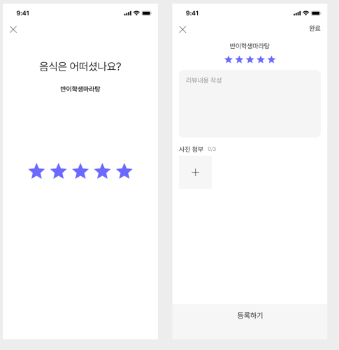

                                                                **회원 가입 하기(소셜 로그인 고려 X)**

| 종류 | 설명 | API Endpoint | Request | 미션 기록 |
| --- | --- | --- | --- | --- |
| [회원] | 회원가입(신규회원 가입) | POST/users | Header : {
Content-Type :
 application/json
//서버에 json형태라고 알려주는 역할
}

Body : {
”phone_number” : “전화번호” ,
”nickname” : “유저 닉네임” ,
”pw” : “유저 비밀번호” ,
”birth” : “생년월일”
”gender” : “남/녀/선택안함” ,
”address” : “주소” ,
”email” : “이메일 주소” ,
”created_at” : “생성일자”

} | 신규회원가입을 위해 POST로 작성했으며 유저에 대한 내용이므로 엔드 포인트를 users로 설정했다.

헤더는 json 형식이라고 명시해준다.

바디는 회원가입에 필요한 내용들을 작성해주었다.

 |
|  | 회원 정보 수정 | Patch/users/users-id | Header : {
Content-Type : application/json
//서버에 json형태라고 알려주는 역할
}

Body :{
”phone_number” : “전화번호” ,
”nickname” : “유저 닉네임” ,
”pw” :  “유저 비밀번호” ,
”birth” : “생년월일” ,
”gender” : “남/녀/선택안함” ,
”address” : “주소” ,
”email” : “이메일 주소” ,
”created_at” : “수정 일자”

} | 회원 정보 수정의 엔드포인트는 기존에 이미 있는 아이디이기에 PATCH를 통해 업데이트 받는 형식으로 하였다.

 고유한 한 유저가 대상이기에 users/users-id를 엔드포인트로 설정했다.

헤더는 json 형식이라는 것을 명시한다.

바디에는 회원가입과 같은 값을 넣는다. |
|  | 회원탈퇴 | PATCH/users/users-id | Header : {
Content-Type : application/json
}

Body : { 
”status” = “in_active” 
} |  유저의 상태 업데이트를 위한 것이므로 PATCH를 사용했다.

마찬가지로 엔드포인트는 해당 유저이기에 users/users-id를 엔드포인트로 설정했다.

회원의 탈퇴는 소프트 딜리트 방식으로 설정하여 회원이 탈퇴후 다시 계정의 복구하고싶을 경우를 대비해서 설정해 놓았다.

헤더에 json형식 이라는 것을 명시한다.
 
바디에는 상태의 값을 in_active로 설정하여 서버에 넘김다.
 |

                                                                         **마이 페이지 리뷰 작성**

| 종류 | 설명 | API Endpoint | Request | 미션 기록 |
| --- | --- | --- | --- | --- |
| 리뷰 | 마이
페이지 
리뷰 
작성 | POST/users/{users-id}/reviews | Header : {
Content-Type : application/json
}

Body : {
”review-id” :  “유저의 고유한 리뷰 아이디” ,
”users-id” : “유저의 아이디” ,
”picture” : “사진” ,
”rating” : “별점” ,
”title” : “제목” ,
”description” : 내용  ,
”created_at”: “생성시간”

} | 리뷰를 새로 작성하는 것이기에 POST로 설정했다.

유저 개인의 리뷰이므로  users/users-id로 고유성을 확보해줬고 그 아이디에 해당하는 review로 앤드포인트를  설정했다.

헤더는 json형식을 명시한다.

바디는 리뷰와 해당 음식점의 아이디를 넣음으로 식별 가능한 값들을 설정해준다. 

리뷰 제목과 내용, 사진값을 넣을수있게 body의 내용을 설정한다.  |

**홈 화면**
미션 목록 조회 API 사용

**미션 목록 조회
(진행중, 진행 완료)**  

-해당 미션에 대한 내용 API 사용

**미션 성공 누르기**
 성공 버튼 누르기 API 사용

| 종류 | 설명 | API Endpoint | Request | 미션 기록 |
| --- | --- | --- | --- | --- |
| 미션 | 미션 목록 조회 | GET/users/{users-Id}/missions | GET 함수는 request header 및 request body를 사용하지 않는다. | 값을 단순이 불러오기만 하기에 GET함수를 사용하였다.

유저의 고유성을 확보하기 위해서 users/users-id를 사용했으며  유저의 미션들을 보기 위해 마지막으로 mission으로 엔드포인트를 설정했다.

 |
|  | 해당 미션 내용 | GET/users/{users-Id}/missions/stores-id?= | GET 함수는 request header 및 request body를 사용하지 않는다. | 데이터를 가져오는 것이기에 GET함수를 사용했다.

유저의 고유성을 확보하기 위해 uesrs/users-id 설정

해당 미션의 가게 미션 내용을 확인하기 위해 
쿼리 스트링을 사용해서 특정 가게의 미션을 조회한다. |
|  | 미션 성공 누르기 | PATCH/users/{users-Id}/missions/{stores-id}/status | Header : {
Content-Type : application/json
}

Body : {
”status” : “completed” ,
”complete-time” : “해당 시간”

 } | 미션의 상태를 업데이트 하는 것이기에 PATCH 함수를 사용했다.

유저의 고유성을 확보하기 위해 users/users-id를 기입했다. 

미션내용에서 해당 가게의 미션 상태를 업데이트 하기에  특정 가게의 상태인 missions/{stores-id}/status 를 엔드포인트로 설정했다.

헤더는 json형식을 나타낸다.

바디는 미션의 상태를 완료상태로 업데이트 하는 것이기에 status 값 completed로 설정하고 완료된 시간도 넣어준다.

 |

