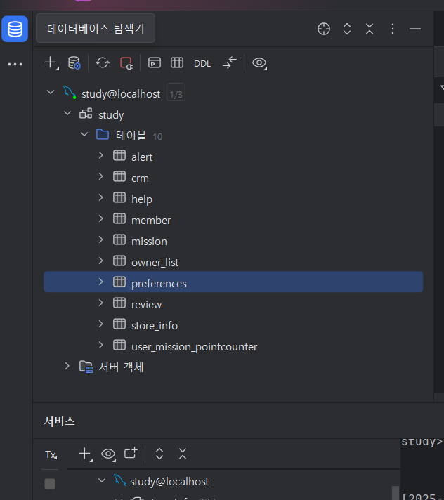

---

<aside>
💡 주요 내용들에 대해 조사해보고, 자신만의 생각을 통해 정리해보세요!
레퍼런스를 참고하여 정의, 속성, 장단점 등을 적어주셔도 됩니다.
조사는 공식 홈페이지 **Best**, 블로그(최신 날짜) **Not Bad**

</aside>

- Domain
    
    **위 내용 : JPA에서 사용하기 위한 엔티티 클래스를 저장**하기 위한 패키지입니다.
    즉 도메인을 담을 페이지를 일컫는다. 
    
    도메인 : 유사한 업무의 집합으로 비즈니스 도메인을 의미한다
    애플리케이션의 핵심 비즈니스 로직을 담당하는 객체를 의미한다. 일반적으로 Entity와 Value Type을 포함하며 데이터테이블과 매핑되어 저장 및 조회된다.
    도메인의 역할
    
    1. 비즈니스 로직을 포함
    2. 데이터베이스와 연결 @Entity 어노테이션을 활용함으로 DB테이블과 연결된다.
    3. 객체 지향적인 데이터 관리 => SQL이 하던걸 대신한다
    도메인 분석 및 설계
    도메인을 설게할때는 DDD(Domain Driven Design)개념을 적용하여 엔티티와 값 타입을 명확히 구분 하는 것이 좋다.
    
    Entity : 고유한 식별자를 가지며 변경될 수 있는 객체
    Value Object : 식별자가 없으며 불변성을 유지하는 객체
    
    도메인 엔티티 : 비즈니스 로직을 들고 있고 식별 가능하며 일반적으로 생명 주기를 갖는다.
    영속성 엔티티 : DB테이블과 1대1로 매핑되는 클래스, 상속받는 구현체이거나 테이블내에 존재하지 않는 컬럼을 가져선 안된다.
    
- 양방향 매핑
    
    단방향 양방향 모두 왜래키 하나로 양쪽 테이블 조인이 가능하다. 따지고 보면 JPA에선 양방향이라는 개념이 아니라 단방향을 양쪽으로 설계하여 양방향처럼 보이는 것이 가능하다.
    양방향으로 해야하는 객체 : 역방향으로 객체 탐색이 꼭필요하다고 느낄 때 추가하면 된다.
    무조건 양방향으로 설정하면 안되는 이유는 db에 무리를 줄 수 있기 때문이다.
    
- N + 1 문제
    
    N+1 문제 정의는 ORM 기술에서 특정 객체를 대상으로 수행한 쿼리가 해당객체가 가지고 있는 연관관계 또한 조회 하게되면서 N번의 추가적인 쿼리가 발행하는 것
    해결 방법 :
    
    1. Fetch join =에초에 연관된 데이터 테이블을 전부 가져오는 방법(join이라 생각하면 된다)
    패치조인과 일반 조인의 차이점 : Fetch join은 ORM에서의 사용을 전제로 DB Schema를 Entity로 자동 변환 해주고 영속성 컨텍스트에 영속화 해준다는 것
    2. EntityGraph 어노테이션 = @EntityGraph 어노테이션을 사용해서 Fetch를 사용하는 것
    3. Batch Size : N+1 문제를 select \* from user where team_id = ? 가 아니라 select \* from user where team_id in (?,?,?) 형식을 사용함으로 N+1문제가 발생하게 하는 것으로 100번 발생할 문제를 1번만 발생하게 한다.
    yml에서 default_batch_fetch_size: 를 100~1000으로 설정한다 최대 1000인 이유는 그 이상은 db에서 막기 때문이다.

# 📢 학습 후기

---

- 이번 주차 워크북을 해결해보면서 어땠는지 회고해봅시다.
- 핵심 키워드에 대해 완벽하게 이해했는지? 혹시 이해가 안 되는 부분은 뭐였는지?

<aside>
💡

</aside>

# ⚠️ 스터디 진행 방법

---

1. 스터디를 진행하기 전, 워크북 내용들을 모두 채우고 스터디에서는 서로 모르는 내용들을 공유해주세요.
2. 미션은 워크북 내용들을 모두 완료하고 나서 스터디 전/후로 진행해보세요.
3. 다음주 스터디를 진행하기 전, 지난주 미션을 서로 공유해서 상호 피드백을 진행하시면 됩니다.

# 🔥 미션

---

워크북을 따라해보고

1. 본인이 만들었던 ERD에 해당하는 테이블들에 대한 엔티티를 만들고
2. 워크북에서 다루지 않은 연관관계 매핑(양방향 포함)을 다 적용하고
3. 엔티티의 칼럼에 대한 세부적인 설정을 모두 하여
4. 로컬 디비에 실제로 테이블이 생긴 것을 캡쳐할 것(by datagrip)
5. 이후 본인의 깃허브 리포지토리를 만들어 mission5 브랜치에 올린 후,
**해당 깃허브 링크를 본인 워크북에 포함해오기. (미션 기록란에 링크 제출)**
    
    **❗main 브랜치에 올리지 말 것!** (브랜치 명이 굳이 mission5 이 아니어도 됨!) **❗**
    

[시니어 미션](https://www.notion.so/1cfb57f4596b8143a7efdc3ac46c3e2a?pvs=21)

<aside>
📌 **주의 사항**

결과물만 올리면 안되고, 중간 과정 또한 기록을 남겨주셔야 합니다.
(DB 연결, 테이블 생성 등)

**결과물과 중간 과정 모두 기록하여 제출**하라는 뜻입니다!

</aside>

# 💪 미션 기록

---

<aside>
🍀 미션 기록의 경우, 아래 미션 기록 토글 속에 작성하시거나, 페이지를 새로 생성하여 해당 페이지에 기록하여도 좋습니다!

하지만, 결과물만 올리는 것이 아닌, **중간 과정 모두 기록하셔야 한다는 점!** 잊지 말아주세요.

</aside>

- **미션 기록**
    
    
    

추상 클래스를 통해서 각 테이블에 공통적인 부함

성별 이넘 내용

확인 한지 안한지 이넘 내용

선호하는 음식 이넘

미션 진행상태 이넘

리뷰 테이블을 나타내는 클래스로 리뷰 작성시 제목 내용과 리뷰를 담을 객체가 필수로 필요하기에 nullable을 false로 설정하였다 

맴버와 미션을 이어주는 매핑테이블로 맴버의 미션 진행상태 및 포인트 내역을 보여준다 모든 포인트는 무조건으로 존재해야하기에 nullable을 false로 설정하였다. 또한 매핑 테이블이기에 관계에서 N역할을 하기에 맴버 테이블과 미션 테이블의 연관을 나타내는 @Manytoone으로 설정하였다

알람 테이블로 맴버에 N대1로 연관관계를 가지고있기에 @Manytoone을 설정하였다. 불리던 자료형을 나타내기위해 세부사항을 어노테이션으로 참또는 거짓 값을 가지게하였다.

고객지원 테이블로 문의시 제목과 내용을 필수로 작성해야하기에 세부사항에 nullable=false로 설정하였다.

도움말 테이블로 맴버테이블과 N대1관계이기에 어노테이션으로 Manytoone을 설정하였고 값이 존재할수도 안할 수도있기에 세부사항을 굳이 넣지 않았다.

멤버 테이블로 모든 값을 필수값으로 설정하여 고객의 세부정보사항을 입력하게 강제하였다. 회원 한명당 선호음식 테이블은 하나만 가지기에 어노테이션 onetoone으로 설정하였다.

미션 테이블로 가게랑 관계가 N대1이기에 어노테이션으로 Manytoone으로 설정하였고 해당 가게의 점수를 표현하기위해 점수의 한계값은 정하지 않았다. 또한 미션이름과 미션 내용은 필수이기에 nullable을 false로 설정하였다.

점주테이블로 한명의 점주가 여러개의 가게를 가질 수도있기에 가게랑 N대1관계이다. 그렇기에 어노테이션 Manytoone으로 연관관계를 설정하였다.

선호음식 테이블로 해당 이넘과 연결하였다. 

가게정보 테이블로 가게이름과 음식이름을 필수로 설정하였고 음식 설명은 없을 수도 있을 것이라 판단하여 true로 설정하였다. 

> **github 링크**
> https://github.com/icarus0616/mission5.git
> 
> 
