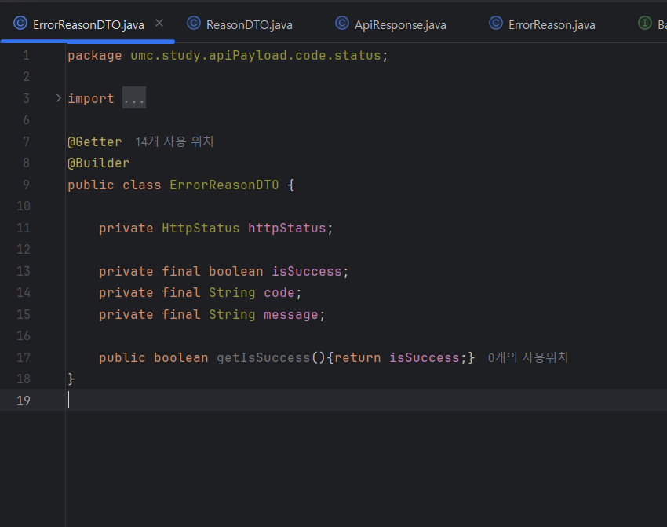

# 🎯 핵심 키워드

---

<aside>
💡 주요 내용들에 대해 조사해보고, 자신만의 생각을 통해 정리해보세요!
레퍼런스를 참고하여 정의, 속성, 장단점 등을 적어주셔도 됩니다.
조사는 공식 홈페이지 **Best**, 블로그(최신 날짜) **Not Bad**

</aside>

<aside>
🤗 여러분들이 **직접** 중요하다고 생각하는 키워드를 조사해보세요!

</aside>

- RestContollerAdvice
    
    RestContollerAdvice는 전역적으로 예외(Exception)를 처리하거나, 공통된 로직을 실행할 때 사용하는 어노테이션이다. 간단히 말해, 모든 @RestControllerAdvice의 예외 처리 또는 응답 가공을 하나의 클래스에서 일괄적으로 처리할 수 있게 해주는 도구인 것으로 반환값은 JSON/XML 등으로 자동 직렬화되어있어 REST API 응답에 적절한 형태로 반환한다. 이 기능들은 풀어보자면
    @ControllerAdvice와 @ResponseBody를 합쳐 놓은 어노테이션으로 볼 수 있는데 @ControllerAdvice와 동일한 기능을 수행하는데 차이점은 앞서 말했듯 응답으로 자바 객체를 리턴하는 어노테이션이다. 두 어노테이션을 설명하면
     여기서 @ResponseBody는 클라이언트에서 서버로 필요한 데이터를 요청하기 위해 JSON 데이터를 요청 본문에 담아서 서버로 보내면, 서버에서는 @RequestBody 어노테이션을 사용하여 HTTP 요청 본문에 담긴 값들을 자바객체로 변환시켜, 객체에 저장해주는 어노테이션이다.
     @ControllerAdvice의 기능은 여러 컨트롤러에 대해 전역적으로 ExceptionHandler를 적용해준다. ControllerAdvice가 선언된 클래스는 스프링 빈으로 등록이 되고 개발자가 전역적으로 에러를 핸들링 하는 클래스를 만들어 어노테이션을 붙임으로 에러처리를 위임할 수 있는 것이 ControllerAdvice 어노테이션이다. 설명한 두 어노테이션이 하나의 어노테이션인 RestContollerAdvice에 두 어노테이션을 합쳐놓은 것으로 볼 수있다.
    
- lombok
    
    자바 라이브러리로  어노테이션 기반으로 되어있다
    도메인 클래스의 수많은 변수들이 있는데 기존에는 개발자들이 직접 수동으로 getter메서드 setter메소드를 선언했었다 하지만 롬복을 사용하게 되면서 어노테이션으로 선언이 가능해짐으로 보다 간결하고 다루기 쉽게 도와주는 라이브러리이다.
     롬복은 컴파일 과정에서 생성해주는 방식으로 동작하는 라이브러리이다. 
    롬복을 사용하면서 장점은 생산성이 높아지고 코드가 간결해지며 해당 어노테이션의 기능을 내부동작을 어느정도만 공부해도 사용하기쉽다는 것이다.
    단점으로는 실제로 생성된 코드가 보이지 않기에 디버깅이나 추적에 어려울 수는 있다.
    
    대표적인 어노테이션 예시
    @Getter / @Setter : 필드에 대한 getter/setter 메서드를 자동 생성
    @AllArgsConstructor : 모든 변수를 사용하는 생성자를 자동 완성시켜주는 어노테이션 
    @NoArgsConstructor : 어떠한 변수도 사용하지 않은 기본 생성자를 자동완성 시켜주는 어노테이션
    @RequiredArgsConstructor : 특정 변수만을 활용하는 생성자를 자동완성 시켜주는 어노테이션
    @EqualsAndHashCode : 클래스에 대한 equals함수와 hashCode 함수를 자동 생성해주는 어노테이션 
    @ToString : 클래스의 변수들을 기준으로 ToString 메소드를 자동완성 시켜주는 어노테이션 
    @Data : ToString, @EqualsAndHashCode, @Getter, @Setter, @RequiredArgsConstructor를 자동완성 시켜주는 어노테이션이다. ⇒ getter만 사용해야하는 부분에 Data어노테이션 사용은 하지 말아야한다.
    @Builder : 해당 클래스의 객체생성에서 Builder 패턴을 적용시켜준다.
    

# 📢 학습 후기

---

- 이번 주차 워크북을 해결해보면서 어땠는지 회고해봅시다.
- 핵심 키워드에 대해 완벽하게 이해했는지? 혹시 이해가 안 되는 부분은 뭐였는지?

<aside>
💡

</aside>

# ⚠️ 스터디 진행 방법

---

1. 스터디를 진행하기 전, 워크북 내용들을 모두 채우고 스터디에서는 서로 모르는 내용들을 공유해주세요.
2. 미션은 워크북 내용들을 모두 완료하고 나서 스터디 전/후로 진행해보세요.
3. 다음주 스터디를 진행하기 전, 지난주 미션을 서로 공유해서 상호 피드백을 진행하시면 됩니다.

# 🔥 미션

---

### [UMC 서버 워크북 참고 자료](https://github.com/CYY1007/UMC_SERVER_WORKBOOK.git)

[GitHub - chock-cho/UMC-7th-spring-workbook at feature-week7-workbook](https://github.com/chock-cho/UMC-7th-spring-workbook/tree/feature-week7-workbook)

---

1. 위의 링크, 그리고 워크북을 보며 API 응답 통일과 에러 핸들러를 숙지하기.
2. **반드시** 본인 손으로 처음부터 끝까지 다 해보고 새 리포지토리 혹은 7주차 리포지토리에 새 브랜치에 push 후 해당 링크를 미션 기록지에 제출할 것.
3. 미션 진행 시 반드시 중간 중간 **과정 인증샷**을 남길 것.
4. ❗**필수**❗ ****RestControllerAdvice의 장점, 그리고 없을 경우 어떤 점이 불편한지도 조사하여 **미션 기록란**에 수록할 것.

특정 exception을 받을 수 있다. 
컨트롤러 클래스 내부에 있던 메서드를 여기로 옮기는 것과 같다. 

프레임워크에서 예외 처리를 전역적으로 적용할 수있게 해주는 어노테이션으로, @controllerAdvice와 @ResponseBody 가 결합된 형태이다 주로 REST API에서 사용되며 이 어노테이션의 장점으로는 앞서 말했듯 전역 예외 처리가 가능하다는 것이다
 모든 @RestController에서 발생하는 예외를 하나의 클래스에서 처리할 수 있게된다 이를 통해 코드 중복을 줄이고 예외처리 로직을 일관되게 유지 할 수 있다. 
이는 특정 예외에 대한 핸들러 메서드를 정의 할 수 있어서 다른 종류의 예외가 발 생하더라도 같은 예외 처리를 통해 사용자에게 전달이 가능하다. 예를 들자면 NullPointerException과 IOException 에러가 발생했다면 원래는 각각의 예외처리를 해줘야하지만 RestControllerAdvice어노테이션을 통해 한곳에서 처리가 가능해지는 것이다 추가로 예외처리가 필요할때 예외처리를 모아둔 곳에 추가하면 되기 때문에 기존 코드에 영향을 최소화하며 추가할 수 있다. 이 특성으로 장점이 하나 더 생기는데 예외 처리 로직이 한곳에 모여있기 때문에 수정 및 유지보수가 편해진다. 또한 다양한 예외 타입별로 @ExceptionHandler를 정의하여 상황에 맞는 응답을 보낼 수 있다.

 다음으로 자동 JSON응답처리가 가능하다는 것이다. @RestControllerAdvice는 @ResponseBody가 포함되어있어, 반환되는 객체를 자동으로 JSON형태로 응답한다 그러므로 별도로 @ResponseBody를 붙이지 않아도 JSON으로 응답할 수있다 

HTTP 상태 코드 제어가 가능하여 예외에따라 적절한 HTTP 상태코드를 응답에 포함 시킬 수 있어, 클라이언트가 정확한 상태를 파악할 수 있다.

만약 이 기능이 없다면 위 장점들을 사용하지 못할 것이고 에러처리를 하는데 있어 에러의 종류마다 각각의 에러 핸들러를 만들어 줘야하고 코드적인 측면에서도 try-catch문을 사용할 수 밖에없어 가독성도 떨어지며 유지보수도 어려워 진다

5. ❗**필수**❗ **미션 목록 조회(진행중, 진행 완료) API 명세서** 작성하기 (이미 작성되어 있으면 상관 없음!)

| 미션 | 미션 목록 조회 | GET/users/{users-Id}/missions | GET 함수는 request header 및 request body를 사용하지 않는다. | Response json

{
"isSuccess": true,
"code": String,
"message": String,
"result": “해당 미션 내용”
}

{
"isSuccess": false,
"code": String,
"message": String,
"result": null
}

 |
| --- | --- | --- | --- | --- |

# 💪 미션 기록

---

<aside>
🍀 미션 기록의 경우, 아래 미션 기록 토글 속에 작성하시거나, 페이지를 새로 생성하여 해당 페이지에 기록하여도 좋습니다!

하지만, 결과물만 올리는 것이 아닌, **중간 과정 모두 기록하셔야 한다는 점!** 잊지 말아주세요.

</aside>

- **미션 기록**
    
    
    

ErrorReasonDTO 클래스
Api에러 정보를 클라이언트에게 보내기 위한 것으로 데이터 전송 객체로 API 실패 및 성공 응답을 표준화하기 위한 DTO 클래스이다. 아래 ReasonDTO클래스랑 구조가 동일한데 이름이 다른 이유는 에러 전용인 것같다

TempHandler클래스
이 클래스는 일반 예외를 구체화 하기위한 클래스로 GeneralException클래스를 상속받는다 워크북에서도  GeneralException 클래스에서 **@AllArgsConstructor**를 통해 만들어진 생성자가 호출 GeneralException은 다시, RuntimeException을 상속 받았기에, 이는 런타임에 발생한 Exception 으로써 MasterExceptionHandler가 감지하게 된다라고 나와있다  MasterExceptionHandler를 통해서 하나의 예외처리에서 여러 특성의 예외들을 하나의 방식으로 다룰 수 있는 것이다.

ErrorStatus 이넘클래스
에러 코드 이넘 클래스로 다양한 예외 상황들을 표준화 하여 BaseErrorCode 인터페이스로 구현함으로 항목이 일관된 방식으로 에러 응답 객체를 생성할 수 있게 해준다. 일반적인 에러가 아니라 개발자가 정의한 커스텀 예외이다. 즉 비즈니스 로직에서 발생할 수 있는 예외를 정의하는 클래스이다. 

ExceptionAdvice클래스
이 클래스는 전역 예외처리기로 GeneralException을 포함한 다양한 예외를 클라이언트에게 일관적으로 응답하기 위한 클래스다. 즉 여기서 모든 예외들을 받는 것이다.

GeneralException클래스
여기서는 앞서 말했듯 ErrorStatus 이넘 클래스에서 만들어진 예외 처리 내용들을 이 클래스를 통해서 예외 처리되는 것이다 GeneralException은 ExceptionAdvice클래스를 통해서 전역적으로 접근이 가능해진다.

ApiResponse 클래스
API 응답 형식을 통일하기 위한 공통 응답 포맷 클래스로 클라이언트에게 API 결과를 줄 때, 성공이든 실패든 같은 구조로 전달되도록 설계되었다.

BaseCode클래스
API 응답에 사용할 공통 에러/성공 코드 형식을 정의하는 클래스이다

BaseErrorCode 클래스
API 응답에 사용할 공통 에러/성공 코드 형식을 정의하는 클래스이다

SuccessStatus 이넘클래스

성공응답 구조를 정의한 클래스로 generalexception 처리를 통해 일반적인 예외처리가 아니라 개발자가 예외처리 내용을 직접 작성함으로 해당 에러의 설명들을 담은 클래스이다. 

ErrorStatus클래스

실패응답 구조를 정의한 클래스로 generalexception 처리를 통해 일반적인 예외처리가 아니라 개발자가 예외처리 내용을 직접 작성함으로 해당 에러의 설명들을 담은 클래스이다. 

TempQueryService 인터페이스

서비스단에서 에러페이지에서 내용을 보여주는 것을 선택하는 flag라는 인자를 사용하여 상황에 맞게끔 페이지에 보내 줄 수 있는 구조를 담은 인터페이스이다. 

TempQueryServiceImpl 클래스(구현체)

이 클래스는 TempQueryService 인터페이스를 받아 구현한 클래스로 페이지에서 flag를 받아와 해당 에러를 보여준다 지금은 flag가 1일때인 상황만 설정되었지만 실제 서비스를 통해서는 여러가지 에러 처리 응답을 보여줄 것이다.

TempRestController 클래스

위에 말했던 flag의 인자값을 받아오는 클래스이다. Getmapping을 통해 url을 설정하였고 해당위치에서 flag에따른 알맞은 응답을 전달하고 Spring Boot에서 REST API 요청을 처리하여 알맞은 JSON 응답을 반환하는 메서드이다.
 

미션 실행 결과

> **github 링크**
> 
> 
> 

[시니어 미션 ](https://www.notion.so/1e7b57f4596b81b2b40ee775ee137630?pvs=21)

# ⚡ 트러블 슈팅

---

<aside>
💡 실습하면서 생긴 문제들에 대해서, **이슈 - 문제 - 해결** 순서로 작성해주세요.

</aside>

<aside>
💡 스스로 해결하기 어렵다면? 스터디원들에게 도움을 요청하거나 **너디너리의 지식IN 채널에 질문**해보세요!

</aside>

- ⚡이슈 작성 예시 (이슈가 생기면 아래를 복사해서 No.1, No.2, No3 … 으로 작성해서 트러블 슈팅을 꼭 해보세요!)
    
    **`이슈`**
    
    👉 앱 실행 중에 노래 다음 버튼을 누르니까 앱이 종료되었다.
    
    **`문제`**
    
    👉 노래클래스의 데이터리스트의 Size를 넘어서 NullPointException이 발생하여 앱이 종료된 것이었다. 
    
    **`해결`**
    
    👉  노래 다음 버튼을 눌렀을 때 데이터리스트의 Size를 검사해 Size보다 넘어가려고 하면 다음으로 넘어가는 메서드를 실행시키지 않고, 첫 노래로 돌아가게끔 해결
    
    **`참고레퍼런스`**
    
    - 링크
- ⚡이슈 No.1
    
    **`이슈`**
    
    👉 [트러블이 생긴 상태 작성]
    
    **`문제`**
    
    👉 [어떤 이유로 해당 이슈가 일어났는지 작성]
    
    **`해결`**
    
    👉  [해결 방법 작성]
    
    **`참고레퍼런스`**
    
    - [문제 해결 시 참고한 링크]

---

Copyright © 2023 최용욱(똘이) All rights reserved.

Copyright © 2024 제이미(김준환) All rights reserved.