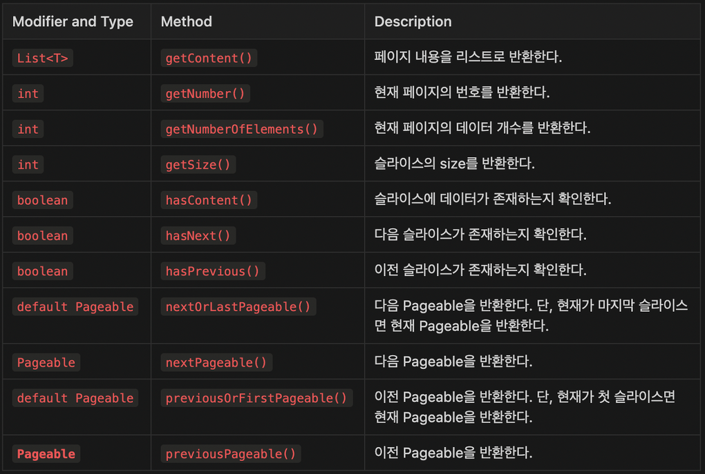

# 🎯핵심 키워드

---

<aside>
💡 주요 내용들에 대해 조사해보고, 자신만의 생각을 통해 정리해보세요!
레퍼런스를 참고하여 정의, 속성, 장단점 등을 적어주셔도 됩니다.
조사는 공식 홈페이지 **Best**, 블로그(최신 날짜) **Not Bad**

</aside>

**이번 주차는 핵심 키워드를 무조건 100% 다 조사 해야 하며 자세히 조사 할 것을 권고 드립니다.**

- Spring Data JPA의 Paging
    - Page
        
        Spring Data JPA에서 페이징 처리를 위해 사용하는 클래스는 Page 클래스이다. Page 클래스는 페이지 출력을 도와주는 클래스로 여러가지 메서드들이 존재한다. Page 클래스를 도와주는 메서드 중 PageRequest.of() 는  page와 size를 기본인자로 사용하며 추가적으로 정렬을 어떤 방식으로 할 것인지를 정할 수 있는 메서드 → page와 size는 출력하고자 하는 페이지가 총 몇 페이지이며, 하나의 페이지에 몇 개의 요소를 출력할 것인지를 정하는 것
        
        Page<T>는 PageRequest.of(page, size, ...) 메서드를 통해 한 페이지에 얼마만큼의 요소가 출력 되게 할 것인지를 정할 수 있고, 페이지들 하나하나를 모아놓은 것이 Page<T>이다
        
        Page 클래스는 getContent() 메서드를 통해 클래스 안의 요소들을 리스트화 시킬 수 있다.
        리스트화 된 데이터를 매핑을 통해 DTO클래스를 만들어서 PageResponseDto 필드값으로 넣어주어 리턴해주면 페이지에 대한 정보까지 포함한 페이징처리를 할 수 있다.
        
        페이징을 하기위한 파라미터들
        page: 페이징 기법이 적용됐을때 원하는 페이지
        size: 해당 페이지에 담을 데이터 개수
        sort: 정렬기준
        
        Repository 코드에서 메소드를 보면 파라미터로 Pageable 객체를 받습니다. Pageable 객체는 Pagination을 위한 정보를 저장하는 객체로 Pageable은 인터페이스이므로 Pageable의 구현체인 PageRequest 객체를 사용한다
        이 Pageable 인터페이스의 구현체인 PageRequest 생성자의 파라미터에 위에서 서술한 page, size, sort를 파라미터로 사용가능하다
        
        Controller계층에서  Pageable를 Argument로 설정해두면, 해당 메소드에서 Pagination 정보를 추출할 수 있도록 도와줍니다. 따라서, "/postList" GetMapping 요청 시 page, size, sort를 파라미터로 함께 요청하여 Paging 정보를 설정할 수 있습니다.
        
        ```java
        @GetMapping("/postList")
        public ResponseEntity<PostDto> postList(Pageable pageable){
            Page<PostDto> postList = postService.getPage(pageable);
            return new ResponseEntity<>(postList,HttpStatus.OK);
        }
        ```
        
        **Service 계층에서** Controller계층에서 요청한 페이징 정보를 Pageable 구현체에 담아 Repository 계층에 접근하여 페이징된 정보를 토대로 데이터를 꺼내옵니다.
        
        ```java
        public Page<Post> getPage(Pageable pageable) {
        	
            int page = pageable.getPageNumber();
            int size = pageable.getPageSize();
            PageRequest.of(page, size, Sort.by(Sort.Direction.DESC));
            return postRepository.findPageBy(pageable);
        }
        ```
        
        만약 클라이언트가 Page, Size, Sort 정보를 파라미터에 쿼리스트링으로 넘겨주지 않는다면, 정렬되지 않은 20개씩 분리된 페이지 중 첫 페이지를 반환한다.
        이를 방지하기 위해 @PageDefault 어노테이션을 사용하여 페이징 정보가 함께 요청되지 않을 때에 대비하여 기본적인 페이징 정보를 설정할 수 있습니다.
        사용예시
        
        ```java
        @GetMapping("/postList")
        public ResponseEntity<PostDto> postList(@PageableDefault(
                    page = 0, size = 10, sort = "id", direction = Sort.Direction.DESC)
                    Pageable pageable){
            Page<PostDto> postList = postService.getPage(pageable);
            return new ResponseEntity<>(postList,HttpStatus.OK);
        }
        ```
        
        Page는 전체 데이터 개수를 조회하는 쿼리를 한번더 실행한다 따라서 전체 페이지 개수나 필요한 경우 유용하다.
        
    - Slice
        
        Page는 Slice과 상속관계로 Slice가 가진 모든 메소드를 Page도 사용가능하다
        Page는 따라서 전체 데이터 개수를 조회하는 쿼리가 나가지 않기 때문에 Slice와 다르게 전체 데이터 개수나 전체 페이지 수까지 확인할 수 있습니다. 하지만 한 번 더 쿼리가 나가게 된다는 점에서 사용 방식에 따른 차이가 있습니다.
        
        **`Slice`**는 전체 데이터 개수를 조회하지 않고 이전 or 다음 **`Slice`**가 존재하는지만 확인할 수 있다. 따라서 **`Slice`는 무한 스크롤 등을 구현하는 경우 유용**하다
        **`Page`**에 비해 쿼리가 하나 덜 날아가므로 **데이터 양이 많을수록 `Slice`를 사용하는 것이 성능상 유리**
        
        **`Slice`**는 **`Streamable`**을 상속받는 인터페이스로 Pagination과 관련된 여러 메서드를 갖고 있다
        현재 페이지의 내용을 확인하거나 다음 페이지, 이전 페이지에 대한 정보를 가져올 수 있다.
        
        아래는 Slice의 메서드들 이다.
        
        
        
- 객체 그래프 탐색
    
    객체 그래프 탐색은 연관관계에서 이어지는 부분으로 여러 연관관계가 얽혀있다고 할 때, SQL을 사용한다면 탐색할 수 있는 영역이 제한되게 된다.  즉 객체 그래프 탐색은 **객체 간 참조 구조를 따라가는 것이다.**
    객체 그래프 = 탐색할 수 있는 영역
    새로운 연관관계가 생긴다면 개발자가 일일히 이어주어야만 한다
    
    객체 간의 연결(참조)을 따라가며, 하나의 객체에서 시작해 관련된 다른 객체들을 차례로 방문하는 것으로 마치 **트리나 그래프를 순회(traverse)** 하듯이, 객체 구조를 탐색하는 방식이다.
    주요 탐색방식으로는 아래와 같다
    
    깊이 우선 탐색: 한 객체의 참조를 따라 가능한 한 깊게 탐색 후 돌아오는 방식
    너비 우선 탐색: 가까운 객체부터 차례대로 탐색하는 방식
    선택적 탐색: 특정 타입이나 조건에 맞는 객체만 추출
    
    객체 그래프 탐색이 사용되는 예시는
    ORM (예: Hibernate): 연관된 엔티티들을 로딩할 때 객체 그래프를 탐색
    직렬화/역직렬화: 객체 그래프를 따라 모든 관련 객체를 저장하거나 복원
    디버깅 도구: 메모리 내 객체 상태를 시각화할 때 객체 그래프를 사용
    GC(Garbage Collection): 도달 가능한 객체를 찾기 위해 객체 그래프를 탐색 등이 있다.
    

# 📢 학습 후기

---

- 이번 주차 워크북을 해결해보면서 어땠는지 회고해봅시다.
- 핵심 키워드에 대해 완벽하게 이해했는지? 혹시 이해가 안 되는 부분은 뭐였는지?

<aside>
💡

</aside>

# ⚠️ 스터디 진행 방법

---

1. 스터디를 진행하기 전, 워크북 내용들을 모두 채우고 스터디에서는 서로 모르는 내용들을 공유해주세요.
2. 미션은 워크북 내용들을 모두 완료하고 나서 스터디 전/후로 진행해보세요.
3. 다음주 스터디를 진행하기 전, 지난주 미션을 서로 공유해서 상호 피드백을 진행하시면 됩니다.

# 🔥 미션

---

### [UMC 서버 워크북 참고 자료](https://github.com/CYY1007/UMC_SERVER_WORKBOOK.git)

[GitHub - chock-cho/UMC-7th-spring-workbook at feature-week9-workbook](https://github.com/chock-cho/UMC-7th-spring-workbook/tree/feature-week9-workbook)

---

아래의 API를 구현해야 하며, 추가 조건을 무조건 포함해서 구현을 해야 함.

4개 중 3개 이상의 API를 구현해야 하며 그 이하(0개~2개 구현)는 **원 아웃** 부여.

**2개 이상을 구현 했다고 해도, 추가 조건을 모두 만족하지 않을 경우 구현하지 않은 것으로 판단함.**

**핵심 키워드를 하나라도 조사를 하지 않을 시 역시 원 아웃 부여.**

**구현이 필요한 API 목록**

1. 내가 작성한 리뷰 목록
    - 참고 화면
        
        
        
2. 특정 가게의 미션 목록
3. 내가 진행중인 미션 목록
4. 진행중인 미션 진행 완료로 바꾸기
    - 참고 화면
        
        
        

**API 구현 조건**

1. 반드시 Paging 처리를 할 것, 한 페이지에 10개씩 조회 **프론트엔드는 1 이상의 page 번호를 전달**
2. 필요한 데이터는 데이터베이스에서 직접 삽입을 해서 진행 (미션 외 API는 구현해도 됨) 
    1. 다만 미션 외 API는 작성을 해도 구현한 API 갯수로 카운트가 되지 않음
3. 프론트엔드가 주는 page는 쿼리 스트링으로 받아오며 이에 대한 처리를 하는 커스텀 어노테이션 구현을 반드시 할 것 
    1. 1번의 page 범위에 따라 커스텀 어노테이션은 page 1을 0으로 만들어 return 해야 한다.
    2. 그와 동시에 page의 범위가 너무 작은지 (0 이하) 판단을 하여 작은 경우 에러를 발생
    3. 에러 발생 시 반드시 RestControllerAdvice와 연계를 해야 함
4. 반드시 모든 API에 대해 Swagger 명세를 해야 한다. 
5. Converter에서 절대로 for문을 사용해서는 안되며, 무조건 Java의 Stream을 사용해야 한다.
6. 무조건 빌더 패턴을 사용해야 한다.
7. API 구현

# 💪 미션 기록

---

<aside>
🍀 미션 기록의 경우, 아래 미션 기록 토글 속에 작성하시거나, 페이지를 새로 생성하여 해당 페이지에 기록하여도 좋습니다!

하지만, 결과물만 올리는 것이 아닌, **중간 과정 모두 기록하셔야 한다는 점!** 잊지 말아주세요.

</aside>

- **미션 기록**아래 내용은 프론트앤드 개발자에게 보여줄 json형식만 나타낸
    
    미션 1번
    
    아래 내용은 프론트앤드 개발자에게 보여줄 json형식만 나타낸 것
    
    
    
    
    
    미션1 실제 내용
    
    
    
    
    
    
    
    미션 2번
    
    아래 내용은 프론트앤드 개발자에게 보여줄 json형식만 나타낸 것
    
    
    
    
    
    2번 미션 실제 내용
    
    
    
    
    
    
    
    3번 미션
    
    아래 내용은 프론트앤드 개발자에게 보여줄 json형식만 나타낸 것
    
    
    
    
    
    
    
    3번 미션 실제 내용
    
    
    
    
    
    
    
    어노테이션 구현
    Validation 클래스
    
    ```java
    package umc.study.validation.validator;
    
    import lombok.RequiredArgsConstructor;
    import org.springframework.core.MethodParameter;
    import org.springframework.stereotype.Component;
    import org.springframework.web.bind.annotation.RequestParam;
    import org.springframework.web.bind.support.WebDataBinderFactory;
    import org.springframework.web.context.request.NativeWebRequest;
    import org.springframework.web.method.support.HandlerMethodArgumentResolver;
    import org.springframework.web.method.support.ModelAndViewContainer;
    import umc.study.apiPayload.code.status.ErrorStatus;
    import umc.study.apiPayload.exception.GeneralException;
    import umc.study.validation.annotation.ZeroBasedPage;
    
    @Component
    @RequiredArgsConstructor
    public class ZeroBasedPageResolver implements HandlerMethodArgumentResolver {
    
        @Override
        public boolean supportsParameter(MethodParameter parameter) {
            boolean hasAnnotation = parameter.hasParameterAnnotation(ZeroBasedPage.class);
            Class<?> paramType = parameter.getParameterType();
            boolean isInteger = Integer.class.equals(paramType) || int.class.equals(paramType);
            boolean result = hasAnnotation && isInteger;
            return result;
        }
    
        // 실제 파라미터 값을 어떻게 바인딩할지 정의하는 메서드
        @Override
        public Object resolveArgument(MethodParameter parameter,
                                      ModelAndViewContainer mavContainer,
                                      NativeWebRequest webRequest,
                                      WebDataBinderFactory binderFactory) throws Exception {
    
            // 1. 파라미터 이름 (ex: "page")
            String paramName = parameter.getParameterName();
    
            // 2. @RequestParam 애노테이션에서 이름을 가져오기 (ex: @RequestParam(name="page"))
            RequestParam requestParam = parameter.getParameterAnnotation(RequestParam.class);
            String requestParamName = (requestParam != null && !requestParam.name().isEmpty())
                    ? requestParam.name()
                    : paramName;
    
            // 3. 요청에서 실제 파라미터 값 읽기
            String paramValue = webRequest.getParameter(requestParamName);
    
            System.out.println("ZeroBasedPageResolver invoked, paramName = " + paramName + ", rawValue = " + paramValue);
    
            // 값이 없으면 null 반환 (또는 기본값 지정 가능)
            if (paramValue == null) {
                throw new GeneralException(ErrorStatus.INVALID_PAGE_NUMBER);
            }
    
            // 문자열 -> 정수 변환 (숫자가 아니면 NumberFormatException 발생 가능)
            int page = Integer.parseInt(paramValue);
    
            // page가 1보다 작으면 예외 발생
            if(page < 1) {
                throw new GeneralException(ErrorStatus.INVALID_PAGE_NUMBER);
            }
    
            // page가 1 이상이면 0-based 인덱스로 변환하여 반환
            return page - 1;
        }
    
    }
    
    ```
    
    어노테이션 클래스
    
    ```java
    package umc.study.validation.annotation;
    
    import java.lang.annotation.*;
    
    @Documented
    @Target({ ElementType.PARAMETER })
    @Retention(RetentionPolicy.RUNTIME)
    public @interface ZeroBasedPage {
        String message() default "페이지 번호는 1 이상이여야 합니다.";
    }
    ```
    
    `WebMvcConfigurer`에 `zeroBasedPageResolver`  을 주입해주는 코드   
    
    ```java
    package umc.study.config;
    
    import org.springframework.context.annotation.Configuration;
    import org.springframework.web.method.support.HandlerMethodArgumentResolver;
    import org.springframework.web.servlet.config.annotation.WebMvcConfigurer;
    import umc.study.validation.validator.ZeroBasedPageResolver;
    
    import java.util.List;
    
    @Configuration
    public class WebConfig implements WebMvcConfigurer {
    
        private final ZeroBasedPageResolver zeroBasedPageResolver;
    
        public WebConfig(ZeroBasedPageResolver zeroBasedPageResolver) {
                this.zeroBasedPageResolver = zeroBasedPageResolver;
            System.out.println("WebConfig 빈이 생성되었고, ZeroBasedPageResolver가 주입되었습니다.");
        }
        @Override
        public void addArgumentResolvers(List<HandlerMethodArgumentResolver> resolvers) {
            System.out.println("체크용");
                resolvers.add(zeroBasedPageResolver);  // 생성자 주입 받은 객체 사용
    
        }
    }
    
    ```
    

> **github 링크**
> 
> 
> 

[시니어 미션](https://www.notion.so/1f3b57f4596b813bb06ad7dd353822ae?pvs=21)

# ⚡ 트러블 슈팅

---

<aside>
💡 실습하면서 생긴 문제들에 대해서, **이슈 - 문제 - 해결** 순서로 작성해주세요.

</aside>

<aside>
💡 스스로 해결하기 어렵다면? 스터디원들에게 도움을 요청하거나 **너디너리의 지식IN 채널에 질문**해보세요!

</aside>

- ⚡이슈 작성 예시 (이슈가 생기면 아래를 복사해서 No.1, No.2, No3 … 으로 작성해서 트러블 슈팅을 꼭 해보세요!)
    
    **`이슈`**
    
    👉 앱 실행 중에 노래 다음 버튼을 누르니까 앱이 종료되었다.
    
    **`문제`**
    
    👉 노래클래스의 데이터리스트의 Size를 넘어서 NullPointException이 발생하여 앱이 종료된 것이었다. 
    
    **`해결`**
    
    👉  노래 다음 버튼을 눌렀을 때 데이터리스트의 Size를 검사해 Size보다 넘어가려고 하면 다음으로 넘어가는 메서드를 실행시키지 않고, 첫 노래로 돌아가게끔 해결
    
    **`참고레퍼런스`**
    
    - 링크
- ⚡이슈 No.1
    
    **`이슈`**
    
    👉 [트러블이 생긴 상태 작성]
    
    **`문제`**
    
    👉 [어떤 이유로 해당 이슈가 일어났는지 작성]
    
    **`해결`**
    
    👉  [해결 방법 작성]
    
    **`참고레퍼런스`**
    
    - [문제 해결 시 참고한 링크]

---

Copyright © 2023 최용욱(똘이) All rights reserved.

Copyright © 2024 김준환(제이미) All rights reserved.