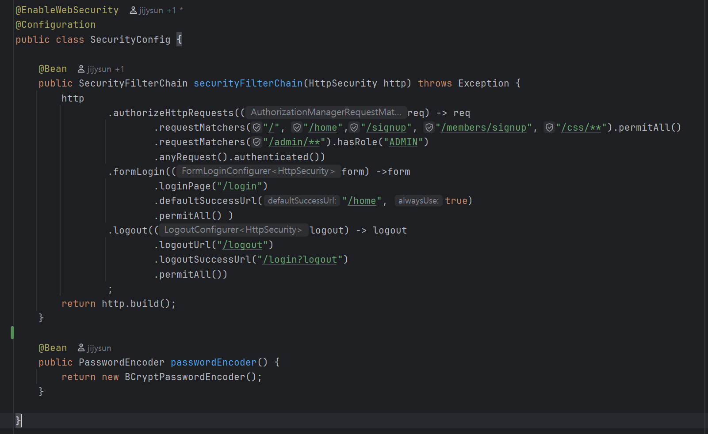
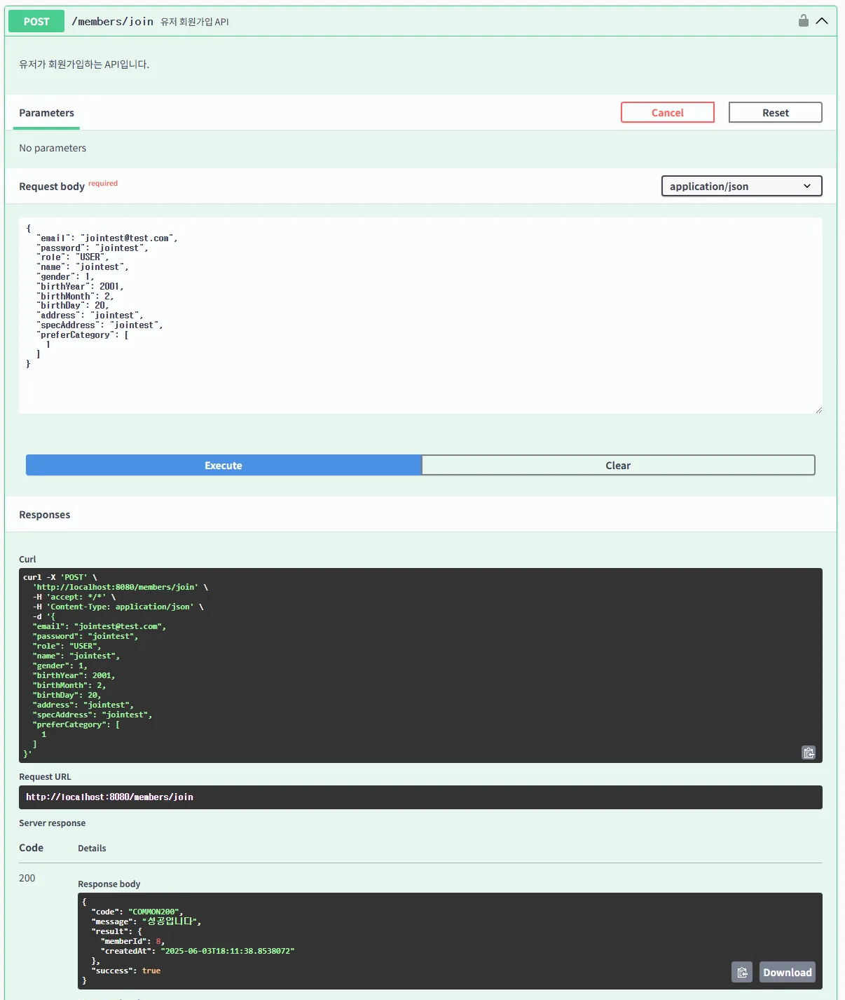
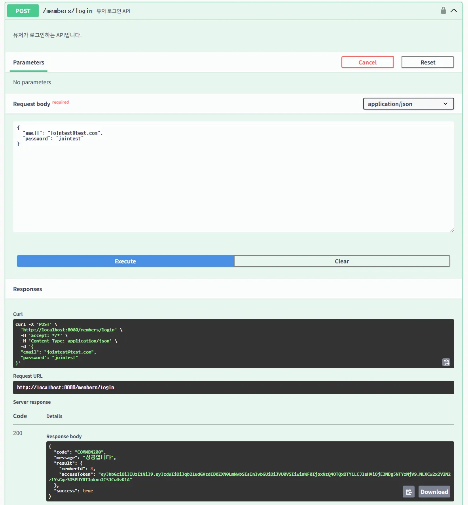

# 빈 미션 페이지

# 핵심 키워드

### **Spring Security?**

- Spring 에서 애플리케이션의 보안을 담당하는 프레임워크입니다. 애플리케이션의 인증과 인가를 처리하는 것에 특화되어 있습니다.
    - 인증 우회를 통한 시스템 접근, 사용자 세션을 장악하는 세션 고정 공격, 인증된 사용자가 의지와 무관하게 공격자가 의도한 행위를 서버에 요청하는 CSRF 등의 공격으로부터 보안 처리를 해줍니다.
    - 이에 Http 응답 보안 헤더 설정, 세션 관리, Role 기반 인가 설정 등등 공격으로 부터 다양한 보안 처리가 존재합니다.
    - 전반적으로 “필터, Filter” 기반 체인 구조를 사용하여 인증, 인가 처리 과정을 밟습니다.

### **인증(Authentication)과 인가(Authorization)**

- 인증은 사용자의 신원을 확인하는 과정으로 흔히 (아아디, 패스워드) 로그인 부터 시작해서, OAuth 로그인과 핸드폰에서 주로 사용되는 생체 인식 방법 등이 있습니다.
    - Spring Security 의 경우 신원이 확인된 경우, 
    (UsernamePasswordAuthenticationToken)인증 토큰이 발급되고, 
    이를 (SecurityContext) 보안 컨텍스트에 저장합니다.
- 인가는 위 인증을 통해 확인된 사용자가 특정 정보나 자원에 접근할 수 있는 지에 대한 권한이 있는 지 확인하는 과정입니다.
    - 보통은 역할, Role을 기반으로 하여 인가 과정을 거칩니다, 또한 Spirng Security 에서는 URL 기반 설정을 통해 구현할 수 있습니다. 
    (SecurityFilterChain → http.authorizeHttpRequests (~~) )

### **세션과 토큰**

- 서버가 인증하는 방식에서 나뉘는 2가지 기반의 방식이라고 할 수 있습니다.
- 세션 기반 인증 방식은 인증 성공 시 서버가 세션 ID (JSESSIONID)를 생성하고, 클라이언트에 쿠키로 전달하는 방식입니다. 이후 클라이언트는 세션 ID를 통해 인증 상태를 유지할 수 있습니다.
    - 하지만 서버에 상태(세션)를 저장하므로 확장성에 어려움이 있습니다.
- 토큰은 일반적으로 서버가 클라이언트에게 발급하는 문자열이다. 이를 통해 서버가 상태를 저장하지 않고, 세션이 필요하지 않으면서, 오직 이 토큰만으로 인증 여부를 판단한다.
    - 클라이언트의 브라우저에 정보를 저장하고 관리한다. 즉, 세션 방식 보다 서버의 부담을 줄일 수 있다.

### **액세스 토큰(Access Token)과 리프레시 토큰(Refresh Token)**

- 액세스 토큰은 말 그대로, 액세스, 접근에서 사용하게 되는 토큰입니다.
    - 클라이언트의 요청마다 포함되어 서버에서 유효성 검사를 통해 인증을 처리할 때 사용됩니다.
    - 실습에서는 4시간으로 설정하였으나, 접근 관련 보안 문제와 직접적으로 연결되어 있기에 짧게 하는 것이 관습입니다.
- 리프레시 토큰은 위 액세스 토큰이 만료되었을 때 새 액세스 토큰을 발급받기 위한, 토큰을 위한 토큰입니다.
    - 액세스 토큰과 다르게, 수명이 길고 서버나 DB에 저장되어 재사용이 가능할 수 있습니다.
    이후 요청에서 리프레시 토큰을 사용하여 재로그인 없이 인증 상태를 유지할 수 있습니다.
    - 하지만 해당 토큰이 탈취될 경우는 심각한 보안 문제가 야기될 수 있으므로 신중히 다루어야 합니다.

# 미션

<aside>

**⚠️ 모든 미션 과정은 깃허브에 업로드해주세요.**

</aside>

1. **실습 1: Spring Security를 활용한 로그인 및 회원가입 구현 = Session 방식**
    - 회원가입, 로그인, 로그아웃 기능을 구현하고 **DB에 저장**되는 과정을 캡처하고 설명하세요.
2. **실습 2: Spring Security를 활용한 로그인 및 회원가입 구현 = JWT 방식**
    - 회원가입, 로그인을 구현하고 **Swagger에서 테스트 및 DB에 저장**되는 과정을 캡처하고 설명하세요.

---

## 1. **Spring Security를 활용한 로그인 및 회원가입 구현 (Session 방식)**

- 회원가입, 로그인, 로그아웃 기능을 구현하고 **DB에 저장**되는 과정을 캡처하고 설명하세요.

SecurityConfig 

- @EnableWebSecurity를 통해 해당 클래스가 Security를 설정하고 있음을 명시해준다
- 또한 SecurityFilterChain을 구현함으로써 URL 접속 관련, 폼 로그인과 로그아웃에 대한 설정을 한다.

### 회원가입

1. MemberViewController 구현

- 맨 처음 페이지 진입하는 경우 계정이 없기 때문에 회원가입 페이지로 이동하여 구현해둔 signin.html 에서 필요한 정보를 입력하게 된다.

1. MemberController

- 해당 URL 로 들어온 요청을 MemberController가 받으면서, 자동으로 파라미터 바인딩을 실시한다. 이때 오류가 발생한 경우 로그인 페이지가 아닌 회원가입 페이지로 리턴한다.
- 이후 MemberService, 서비스 계층 코드로 해당 요청 DTO를 넘겨 회원가입 로직을 실시한다.

1. MemberCommandService
    
    
    
- 들어온 요청 DTO는 Converter를 통해 새로운 Member 객체를 만든다.
- 또한 사용자의 비밀번호는 SecurityConfig에서 구현한 BCrypt 암호화 방식의 비밀번호 인코더를 통해 암호화 한다.
- 이후 DB에 저장하면서, 동시에 Controller로 저장된 값을 반환한다.

### 회원가입 테스트

- 비밀번호는 “test” 이다
- 이후 가입하기 버튼을 누르면 각 Controller, Service 계층 코드를 통해 DB에 저장된 모습을 확인할 수 있다.
    - SQL 로그 및 저장 사진
        
        
        
        
        

### 로그인 과정

MemberViewController

- 해당 로그인 요청 시 페이지 반환
- 이후 [localhost:8080/login 으로](http://localhost:8080/login으로) 요청한다.

1. SecurityConfig

- 인증 시 스프링 시큐리티가 호출하는 메서드를 Override 하여 직접 커스텀, 작성한다.
- 일단 username을 email로 간주하고, DB에서 해당 member를 조회한다.
- 이후 스프링 시큐리티가 사용하는 UserDetails 구현체인 User를 Builder형식으로 작성하여 리턴한다, 이는 이후 인증 객체인 Authentication을 만드는 데에 사용된다.

### 관리자 페이지 접속 테스트

- 테스트용 사용자 데이터
    
    
    
- 일반 사용자 계정의 각 정보는 [test@test.com](mailto:test@test.com) - test 이고,
관리자 계정의 각 정보는 [admin@naver.com](mailto:admin@admin.com) - admin 이다.

- 일반 사용자로 로그인 하였다. 일반 사용자는 관리자 역할이 아니므로, 관리자 페이지에 접속할 수 없다.
- 이에 URL을 통해 접근을 하면 403 에러, 요청에 대한 접근 권한이 없다는 코드를 나타낸다.

 

- 일반 사용자 계정에서 로그아웃 하여, 관리자 계정으로 로그인 시 “관리자” 역할에 의해 Home 페이지에 관리자 Page로 이동할 수 있는 링크를 띄워준다.

- 또한 페이지 이동도 잘 되는 것을 확인할 수 있었다.

### 궁금했던 것, 알게 된 것

1. SecurityFilterChain을 직접 구현해야 되나? 혹시 다른 클래스 상속이나, 라이브러리는 없을까…?
    - 원래는 WebSecurityConfigurerAdapter를 상속하면서 위 코드를 구현할 수 있었다.
    - 하지만 버전 5.7.0 부터 시큐리티 기능의 명시적인 구현과 함수형 코드 스타일 지원을 위해 해당 클래스가 사용 중단되었다.
    - 상위 버전이 업데이트 되면서 해당 기능을 직접 구현하게 되었다. 
    (현재는 6.5.0 이다, https://docs.spring.io/spring-security/reference/5.8/getting-spring-security.html),

1. PasswordEncode와 BCrypt? 
    
    
    
    - SecurityConfig 에서 해당 코드처럼 생성자를 통해 Spring Container에 해당 패스워드 인코더를 등록 및 이후 사용 시 Spring Container 에 주입을 위해 해당 코드를 작성한다.
    - 해당 암호화 알고리즘은 BCrypt 알고리즘으로 특징은 3가지로 둘 수 있다.
        - 단방향 알고리즘: 암호화 후 복호화가 불가능하게 하는 알고리즘이다.
        - Salt 적용: 쉽게 설명하면 들어온 값에 소금을 치듯, 랜덤한 salt 값을 추가한 뒤 암호화하는 방식이다.
        - 고의적인 느림: 고의적으로 느린 해시 연산이 적용되어, 무차별, 무작위적인 대입 공격을 방지하는 방식이다.

1. 정확히 로그인 과정은 어떠한 과정을 거치는가…?
    1. formLogin 요청이 발생하였다. 이때 Spring Security의 필터 중 하나인 UsernamePasswordAuthenticationFilter가 이 요청을 가로채면서 Authentication 객체를 생성한다.
    2. Security 내부 흐름에서 AuthenticationManager 가 적절한  AuthenticationProvieder 를 선택하면서 인증을 위임한다.
    3. 위임받은 AuthenticationProvider가 UserDetailsService의 loadUserByUsername을 호출하여 사용자 정보를 추출한다.
    이때 우리는 CustomUserDetailsService를 통해 상속 및 추가 구현을 실시하였다.
    4. CustomUserDetailsService에서 추출된 사용자 정보를 통해 UserDetails 에서 사용되는, Spring Security에서 검증에 사용될 UserDetails 객체를 만들고 return 한다.
    5. 받은 UserDetails를 통해 위임받은 AuthenticationProvider가 사용자가 요청한 계정의 비밀번호와, DB에 저장된 암호화된 비밀번호를 비교하며 검증을 실시한다.
    6. 인증 성공 시 1번에서 생성된, 인증된 사용자 정보를 담은 Authentication 객체를 SecurityContextHolder에 저장하게 된다.
    
    중간에 생략한 과정을 더 자세히 설명하자면
    
    b 과정에서 여러 Provieder 가 존재하나, 여기서는 DaoAuthenticationProvider가 위임된다.
    
    <aside>
    🔑
    
    DaoAuthenticationProvider는 사용자 정보 서비스와 비밀번호 인코더를 사용하여 사용자 이름과 비밀번호를 인증하는 인증 제공자 구현체입니다.
    
    - [Spring Security **DaoAuthenticationProvider 공식 문서**](https://docs.spring.io/spring-security/reference/servlet/authentication/passwords/dao-authentication-provider.html)
    </aside>
    
    이후 이 Provider가 authenticate ()를 호출하고
    
    - UserDetailsService로 사용자 조회
    - PasswordEncoder로 비밀번호를 암호화하게 된다.
    
    e 과정에서 AuthenticationProvider가 비밀번호를 검증할 때에는 PasswordEncode.mathces () 메소드를 사용한다. 실질적인 코드는 다음과 같다
    
    > PasswordEncode.matches (”입력한 비밀번호”, “DB에 저장된 암호화된 비밀번호”)
    > 

1. 우리가 구현한 관리자 페이지 접속 및 인가 과정은 어떻게 진행되는 것인가..?
    1. 인증된 사용자, 즉 로그인한 사용자가 보호된 자원이나 페이지에 접근을 시도한다.
    2. 해당 접근, 요청에 대해 “**FilterSecurityIntercepter**”가 이를 가로채고, 검증을 시작한다.
        
        <aside>
        🔑
        
        1. 지금의 요청 기준 해당 인터셉터의 역할은 요청 URL에 대해 어떤 권한이 필요한가? 를 **SecurityMetadataSource** 에게서 가져온다,
        2. 이후 Role 이라는 권한이 필요하므로, 인증 정보 객체인 Authentication와 Role 를 
        **AccessDecisionManager에게 전달**하여, 접근이 가능한 지 조사한다.
        </aside>
        
    3. 전달 받은 AccessDecisionManager는 “이 사용자가 접근할 수 있을까?” 를 결정한다.
        
        <aside>
        🗳️
        
        1. 해당 manager는 자신이 보유하고 있는 AccessDecisionVoter들에게 접근 허용 투표를 맡긴다.
        2. 이 투표자들은 3 가지의 유형이 있고, 다음 **투표자에게 투표를 맡긴다.**
            1. 한 명이라도 찬성 시 OK!의 **AffirmativeBase**
            2. 다수결을 따르자! 의 **ConsensusBased** 
            (동일 득표 일 때는 allowIfEqualGrantedDeniedDecision 허용, 거부를 커스텀 할 수 있다.) 
            3. 만장일치 성격 보유자인 **UnanimousBased**
        </aside>
        
    4. 이제 투표자들에 의해 찬성된 경우 현재 인증된 사용자의 권한은  SecurityContextHolder에서 해당 사용자에 대한 권한을 가져오게 되며, 아까 b 번에서 SecurityMetadataSource  에서 가져온 권한과 비교한다.
    5. 충분한 권한이 존재하는 경우 이제서야 요청을 Controller에게 권한을 넘겨 비즈니스 로직을 실행한다.

---

## 2. **Spring Security를 활용한 로그인 및 회원가입 구현 (JWT 방식)**

### JWT 기능 구현 과정

1. application.yml
    
    
    
    - jwt 토큰 생성에 필요한 커스팀 key와 만료 기간을 설정한다. (이는 공유하면 절 대 안 된 다.)
    또한 실습 명목이므로 4시간으로 넉넉하게 셋팅해준다.

1. JwtProperties
    
    
    
    - 이후 Jwt에 대한 설정 클래스를 구현한다.
    - 이 클래스 대신 스프링의 @Value 어노테이션으로 설정도 가능하다.

1. JwtTokenProvider

- 실질적인 JWT를 발급해주는 JwtTokenProvider를 작성한다.
- 각각의 메소드를 간략하게 설명하자면
    1. generateToken:인증 정보를 받아, JWT 액세스 토큰을 생성 및 반환한다.
    2. validateToken: JWT 토큰이 유효한지 검증해요. Parsing이 불가능하거나, 앞서 설정한 4시간이 넘어 토큰이 만료되거나, 혹은 형식 오류가 생기면 예외가 발생시킨다.
    3. getAuthentication: JWT 에서 인증 정보를 추출해서, Spring Security의 인증 정보 객체인Authentication 객체로 변환한다.
    4. extractAuthentication: 해당 Request에서 토큰 값을 추출해내고, 위 getAuthentication을 이용해서 Spring Security의 Authentication 객체로 변환해주어요.

1. JwtAuthenticationFilter
    
    
    
- 요청이 들어왔으므로, 우리는 JWT를 발급해서 다시 보내주어ㅑㅇ 한다.
- Http 요청으로 들어온 객체에서 resolveToken (String Parsing)을 통해  토큰을 추출한다
- 그 다음 jwtTokenProvider를 통해 추출한 토큰에 대해 검사한다.
    - 인증이 완료된 경우 jwtTokenProvider의 getAuthentication로 Authentication 인증 객체가 만들어지고, SecurityContextHolder에 등록된다.

1. SecurityConfig 수정
    
    
    

### 로그인, 정보 조회 API 구현

1. MemberController & MemberCommandService

- JWT 관련 구현을 완료되었다. 이후 Controller, Service를 구현하여 해당 요청에 대한 JWT 인증을 진행한다.

1. MemberController & MemberCommandService

- 로그인 이후 인증된 사용자는 자신에 대한 정보를 확인할 수 있어야 한다.
- 그렇기에 해당 기능에 대한 Controller, Service 코드 또한 구현해준다,

### 회원가입, 로그인, 정보 확인 테스트

- 일단 테스트하고자 하는 일반 사용자로써 회원가입하고자 한다.
- Swagger로 테스트 결과 값이 잘 반환되는 것을 확인 할 수 있었다.

- 회원가입한 정보를 바탕으로 로그인 시에 서버가 발급한 JWT와 함께 반환되는 모습 또한 확인할 수 있었다.

- 이후 어떤 요청이든 해당 JWT를 헤더에 삽입하여 서버에 요청해야 한다.
- 이를 복사하여 Swagger 우상단 설정을 통해 넣어준다.

- 이에 정보 조회 요청 시 DTO로 설정했던 값들이 온전히 반환되는 것을 확인할 수 있었다.

### 궁금했던 것, 알게 된 것

1. OncePerRequestFilter는 무슨 필터인가?
    - 이는 Spring Security 가 아닌 그냥 Spring 프레임워크에서 제공하는 필터 추상 클래스 이다.
    - 같은 요청이 여러 필터 체인을 통과하거나 dispatcher type에 따라 여러 번 호출될 수 있는데, 해당 필터를 상속받아 구현함으로써 중복 필터 적용을 방지한다.

1. 왜 SecurityConfig에서 csrf는 왜 허용하는가?
    - 일단 CSRF, Cross Site Request Forgery는 인증된 사용자의 의도치 않은 요청을 서버가 처리하게 만드는 공격이다.
    - 우리의 Spring Security에서는 기본적으로 CSRF 보호를 활성화하는데, 잠시 비활성화 한 이유는
        - 그 대신 JWT를 사용하여 보안을 활성화 하였기 때문이다.