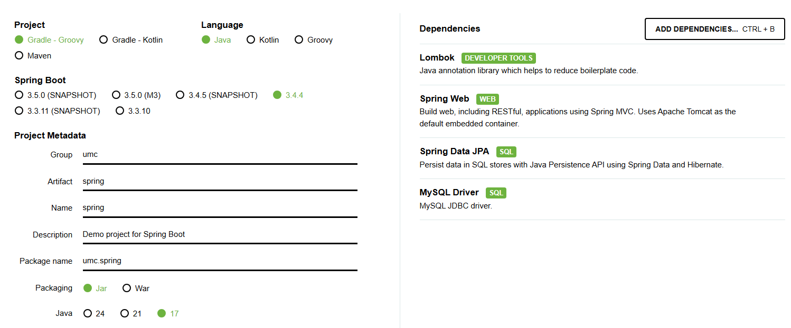

# Chapter 3. API URL의 설계 & 프로젝트 세팅


## ☑️ 실습 인증

---

## 인텔리제이로 스프링 세팅



생성 → 


## 🔥 미션

---

1주차 때 제공된 IA, WF을 참고하여 (아래 **미션 참고 자료**를 보셔도 됩니다!)

- **미션 참고 자료**
    
    <aside>
    🚨 ❗**해당 자료는 챌린저분들의 미션을 위해 Plan 파트에서 제공해준 자료로,
    미션 외의 용도로 사용하는 것 및 유출을 절대 금합니다.**❗
    
    **❗아래 IA&WF 사진 및 for_UMC.fig 파일 및 파일 속 내용의 저작권은 모두 7th UMC Plan 파트장 아크(박승민)에게 있음을 밝힙니다.❗**
    
    </aside>
    
    - IA&WF 사진 파일
        
        아래 사진 외에도 첨부드린 사진에 해당하는 피그마 파일이 존재하니
        사진을 통해 보기 어려우시다면 피그마 파일을 이용해주세요!
        
        
        
        IA
        
        
        
        WF
        
    
    [for_UMC.fig](for_UMC.fig)
    

<aside>
✉️ **홈 화면, 마이 페이지 리뷰 작성, 미션 목록 조회(진행중, 진행 완료), 미션 성공 누르기,
회원 가입 하기(소셜 로그인 고려 X)**

</aside>

위의 기능을 구현하는데 **필요한 API들을 설계**하여

<aside>
🌟 **API Endpoint, Request Body, Request Header, query String, Path variable**

</aside>

이 포함된 간단한 명세서를 만들기!

실제 명세서는 Spring Boot 8주차 및 Node.js 9주차, Swagger 설정에서 더 자세히 다룹니다.

**< 시니어 미션 >**

[시니어 미션](https://www.notion.so/1b7b57f4596b819fa714ea550f699a9a?pvs=21)

## 💪 미션 기록

---

<aside>
🍀 미션 기록의 경우, 아래 미션 기록 토글 속에 작성하시거나, 페이지를 새로 생성하여 해당 페이지에 기록하여도 좋습니다!

하지만, 결과물만 올리는 것이 아닌, **중간 과정 모두 기록하셔야 한다는 점!** 잊지 말아주세요.

</aside>

- **미션 기록**

## API 호출 URL

| 개발 | http://1.1.1.1::8080/api/v1 |
| --- | --- |

## Header 공통

- Accept : application/json
- Content-Type : application/json
- Authorization : Bearer {accesstoken}             로그인,회원가입은 제외

## Reasponse 공통

```json
{
  "status" : "OK",
  "code" : "0000",        //응답 코드 
  "message" : "success",  //응답메세지
  "data" : { }         //조회 요청 데이터
}

```

[API 명세서 (1)](API%20%E1%84%86%E1%85%A7%E1%86%BC%E1%84%89%E1%85%A6%E1%84%89%E1%85%A5%20(1)%201cdb57f4596b809d8020d9615f09e49d.csv)
