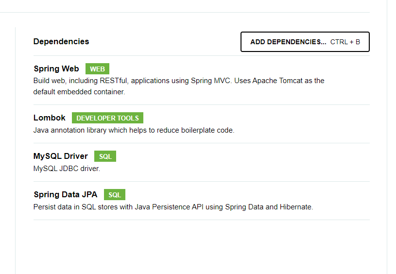

# 빈 미션 페이지

0406 0053

# 🔑 키워드 정리

## API?

- Application Programming Interface. 말 그대로 애플리케이션을 프로그래밍 하는데 사용되는 인터페이스 이다.
- 더 쉽게 말해서 앱을 구현할 때 보다  쉽게 할 수 있도록 해주는 도구라고 할 수 있다.

### REST API?

- Representational State + API 으로. HTTP 기반의 웹 서비스 아키텍쳐를 의미하며, HTTP 메서드와 자원을 이용해 통신을 주고 받는 방법이라고 할 수 있다.

### API Endpoint?

- 위 REST API 에서 해당 API를 호출하기 위한 HTTP 메소드와 URL을 이야기한다.
- RESTful API EndPoint, REST 규칙을 잘 지킨 API EndPoint 설계를 위해서는 다음 과 같은 규칙에 따라 설계가 가능하다.
    - URI에 **동사가 포함이 되어선 안된다.**
    - URI에서 **단어의 구분이 필요한 경우 -(하이픈)을 이용**한다.
    - **자원**은 기본적으로 **복수형으로 표현**한다.
    - 단 하나의 자원을 **명시적 표현**을 하기 위해서는 **/users/id와 같이 식별 값을 추가로 사용**한다.
    - **자원 간 연관 관계가 있을 경우 이를 URI에 표현한다.**

### 리소스 간 연관 관계의 경우

- 1 : N인 경우는 **똑같은 순서대**로 표현한다.
    - 예로 사용자가 여러 교과목을 들을 경우로 예시를 들자면,
    - /users/subjects 로 표현하거나, /users/id/subjects/id 로 표현한다.
- N : M 인 경우는 비즈니스 로직 상 **더 중요 대상을 계층 관계 앞에 두어** **표현**한다.
    - 예로 이전 실습의 erd 기준 지역 테이블인 area과 음식점 관계는 N : M 이다.
    - 비즈니스 로직 상 **“한 지역점”**에 있는 **다른 여러 음식점**을 확인할 수 있어야 한다.
    - 그렇기에 표현하자면 /areas/restaurants 로 설계가 가능하다.

### **Request Body? Request Header? query String? Path variable?**

Request Body? 

- 클라이언트 측에서 HTTP - POST 방식으로 데이터를 전달하는 경우가 존재한다.
- 조회, 생성 등의 목적을 위해 사용되기에, **URL에 정보를 노출시키는 것은 위험**이 따른다.
- 그렇기에 **URL에 노출 시키지 않으며**, **json 방식**으로 데이터를 담아 서버로 전송시키는 방식이 **Request Body** 방식이라고 할 수 있다.

```json
{
	"name" : "가톨릭",
	"phone" : "010-1234-5678"
}
```

Request Header?

- 전송에 관련된 기타 정보들이 담기는 부분이라고 할 수 있다.
- 위 Request Body 에서는 json 형식으로 보냈지만, form-data로 보낼 수 있음을 표기하거나, 다른 인증 방식을 서버로 보낼 수 있다.

Path Variable

- 다른 여러 값이 조회되는 것이 아닌, **하나의 특정 대상을 지목할 때** 사용된다.
- 예로 들어, 어느 특정 지역의 특정 레스토랑을 지정하고 조회하고 싶을 때 사용될 수 있다.

<aside>
💡

GET /areas/restaurants/**{restaurantId}**

</aside>

 Query String?

- Path Variable의 경우와는 반대로, 여러 값이 조회되는 경우 또한 존재한다. 보통 검색의 경우가 대다수다.
- 이에 Query String과 정보 조회인 GET 방식을 사용한다.
- 예시로 어느 특정 지역에 이름이 “가톨릭”인 음식점을 검색하고자 할 때 사용할 수 있다.
    
    <aside>
    💡
    
    GET /areas/restaurants**?name=catholic**
    
    </aside>
    

이렇듯, **API 설계에는 절대적인 정답은 없고** 위에서 나열한 5개의 규칙을 지키되, 요구 사항에 따라 **피치 못한 경우는 무조건 저 규칙을 따르지 않아도 됩니다. 결국 프론트엔드 개발자 분들이 우리의 API 설계를 보고 쉽게 무슨 API인지 감을 잡으면 되는 거에요!**

---

# 미션, API 설계하기

<aside>
✉️ **홈 화면, 마이 페이지 리뷰 작성, 미션 목록 조회(진행중, 진행 완료), 미션 성공 누르기,
회원 가입 하기(소셜 로그인 고려 X)**

</aside>

위의 기능을 구현하는데 **필요한 API들을 설계**하여

<aside>
🌟 **API Endpoint, Request Body, Request Header, query String, Path variable** 
이 포함된 간단한 명세서를 만들기!

</aside>

ERD 그림

https://www.erdcloud.com/d/NLcqCfTbFY8ygum65

## 1. 홈 화면


- 각 사용자의 필요한 정보를 “조회”하는 홈 화면이므로 GET 요청이어야 한다.
- 그리고 사용자가 진행 가능한 여러 미션이 조회되어야 한다.

API EndPoint

- 여러 개의 미션이 조회되므로, 진행 전 미션을 Query String 으로 표현하였다.

```json
GET /users/{id}/user_mission?complete=before
```

Request Body

- GET 방식이므로 필요하지 않다.

Request Header

- 토큰 방식으로 인증된 경우 다음과 같은 헤더가 필요하다

```json
Authorization : accessToken (String)
```

---

## 2. 마이 페이지 리뷰 작성


- 사용자가 리뷰라는 데이터를 전달하는 것이므로 POST 요청이어야 한다.
- 전달하는 데이터는 리뷰를 작성하는 사용자, 리뷰가 작성되는 음식점, 별점, 리뷰 내용, 사진 등이 있다.

API EndPoint

- 다른 여러 값이 조회되거나, 전달되는 과정이 아니므로 따로 Query String은 필요하지 않다.

```json
POST /users/{id}/review
```

Request Body

```json
{
	"user_id" : "사용자 id",
	"restaurant_id" : "음식점 id"
	"stars" : "int형 별 개수",
	"review_comment" : "리뷰 내용",
	"review_photo" : ["사진 1", "사진2" ...]
}
```

---

## 3. 미션 목록 조회 (진행 중, 진행 완료)



- 사용자가 진행 중이거나, 완료한 미션을 조회해야 한다. 그러므로 데이터 조회인 GET 방식이 사용된다.
- 필요한 정보로는 미션을 진행 중인 음식점, 미션 내용, 미션의 보상이다.

API EndPoint

- 사용자의 id 정도만  Path Variable로 표현하였다.

진행 중인 미션을 조회

```json
GET /users/{id}/user_mission?complete=processing
```

진행 완료인 미션을 조회

```json
GET /users/{id}/user_mission?complete=success
```

Request Body

- GET 방식이므로 필요하지 않다.

---

## 4. 미션 성공 누르기


- 성공 요청을 하는 행위 이므로, 데이터를 전달하는 POST 요청일 수 있다
- 하지만 중간 테이블 user_mission 레코드의 complete, 진행 여부를 변경하는 행위이므로 **PATCH**가 더 옳은 방식이다.
- 전달 하는 데이터 로는 미션이다

API EndPoint

- 사용자의 id와 user_mission의  id를 Path Variable로 표현하였다.

미션의 진행 여부를 변경

```json
PATCH /users/{id}/user_mission?id={user_mission_id}&complete=success
```

Request Body

- PATCH 방식이고, 단순 상태를 업데이트 하므로 필요하지 않다.

---

## 5. 회원 가입하기 (소셜 로그인 X)


- 회원가입 과정이므로, 데이터를 서버에 전달하는 POST 방식이다.
- 전달하는 데이터는 이름, 성별, 생년월일, 주소 등이 있다.

API EndPoint

- 회원가입이므로 /users 를 사용하였다.

미션의 진행 여부를 변경

```json
POST /users
```

Request Body

```json
{
	"id": "id 값",
	"name" : "이름",
	"gender" : "성별 값",		
	"birth" : "생년월일",
	"address" : "주소"
}
```

---