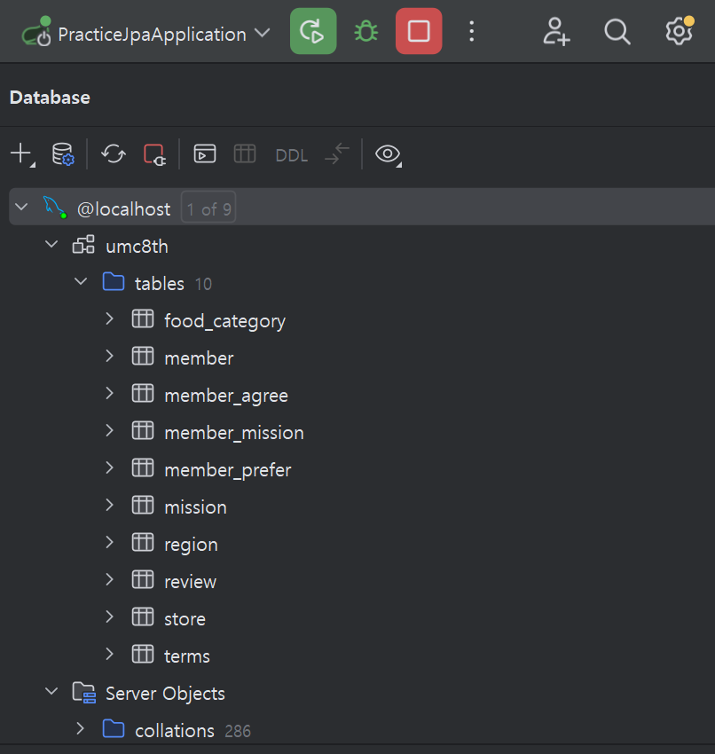

# 빈 미션 페이지

## 🔑핵심 키워드

1. Domain
- 애플리케이션이 다루는 핵심 개념과 비즈니스 로직을 담고 있는 객체 또는 영역을 의미해요. Spring Data JPA에서는 일반적으로 "도메인 객체"는 @Entity 어노테이션이 붙은 클래스, 곧 Entity 클래스를 의미해요. 이 클래스에는 DB와의 매핑 정보( @Column, @OneToMany 등등)이 들어가요

1. 양방향 매핑
- JPA에서 두 엔티티가 서로를 참조하는 경우를 양방향 매핑이라고 해요. 이전 DB 설계를 통해 서로를 참조하는 양방향 관계, N:M 관계에 대해 실질적인 연결을 해줄 때를 이야기 해요. 이 때 주의할 점은 양방향 관계에서 관계의 주인을 잘 설정하거나, Json 직렬화로 인한 무한 순환 참조 (A → B → A → …..)를 방지해주어야 해요.

1. N + 1 문제
- JPA에서 연관된 엔티티를 조회할 때, N개의 추가 쿼리가 발생하는 성능 관련 문제에요. 이 문제는 하나의 쿼리로 부모 엔티티, 즉 관계의 주인 엔티티를 조회한 후 자식, 하위 엔티티 까지 조회하면서 추가 쿼리가 발생하는 문제에요.

# 🔥 미션

---

### 1. 워크북에서 다루지 않은 연관관계 매핑

1. MemberMission 기준 mission 에 대한 연관 관계 코드가 없어, 예외가 발생하였다.
- 예외 로그
    
    ```sql
    org.springframework.beans.factory.BeanCreationException: ~ 중간 생략 ~: 
    Collection 'HelloJPA.PracticeJPA.domain.Mission.memberMissionList' is 'mappedBy' a property named 'mission' which does not exist in the target entity 'HelloJPA.PracticeJPA.domain.mapping.MemberMission
    ```
    
    - @OneToMany(mappedBy = "mission") 이라고 설정했는데, MemberMission클래스에 mission 이라는 필드가 없어 발생하는 오류이다.

```java
@ManyToOne(fetch = FetchType.LAZY)
@JoinColumn(name = "mission_id")
private Mission mission;
```

- 다음과 같이 양방향 관계를 설정하여 끊겼던 연관관계를 연결하여준다.

1. Region, Store, Review 에 관한 연관 관계 코드가 필요하다.

```java
@Entity @Builder @Getter
@NoArgsConstructor(access = AccessLevel.PROTECTED) @AllArgsConstructor
public class Region extends BaseEntity {

    @Id @GeneratedValue (strategy = GenerationType.IDENTITY)
    private Long id;

    private String name;

    @OneToMany(mappedBy = "region", cascade = CascadeType.ALL)
    private List<Store> regionStoreList = new ArrayList<>();
}
```

```java

@Entity @Getter @Builder
@NoArgsConstructor(access = AccessLevel.PROTECTED) @AllArgsConstructor
public class Store extends BaseEntity {

    @Id @GeneratedValue(strategy = GenerationType.IDENTITY)
    private Long id;

    private String name;

    private String address;

    private Float score;

    @ManyToOne(fetch = FetchType.LAZY)
    @JoinColumn(name = "region_id")
    private Region region;

    @OneToMany(mappedBy = "store", cascade = CascadeType.ALL)
    private List<Review> storeReviewList = new ArrayList<>();
}

```

```java
@Entity @Builder @Getter
@NoArgsConstructor(access = AccessLevel.PROTECTED) @AllArgsConstructor
public class Review extends BaseEntity {

    @Id @GeneratedValue (strategy = GenerationType.IDENTITY)
    private Long id;

    private String body;

    private Float score;

    @ManyToOne(fetch = FetchType.LAZY)
    @JoinColumn(name = "member_id")
    private Member member;

    @ManyToOne(fetch = FetchType.LAZY)
    @JoinColumn(name = "store_id")
    private Store store;
}
```

### 2. 생성된 테이블 확인



다음 SQL을 사용하여 확인하였습니다. 

```sql
SELECT TABLE_NAME,COLUMN_NAME,DATA_TYPE, IS_NULLABLE, COLUMN_TYPE 
	FROM INFORMATION_SCHEMA.COLUMNS 
	WHERE TABLE_SCHEMA = 'umc8th';
```

https://github.com/jijysun/Studing_JPA
