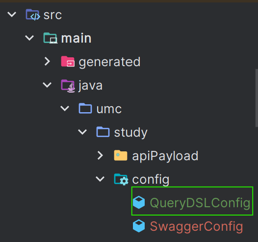

# 6주차 미션 페이지

# 미션

1. N+1 문제를 해결할 수 있는 다른 여러 방법 조사 후 핵심 키워드에 정리
2. 2주차 미션 중 작성했던 쿼리를 QueryDSL로 리팩토링 하기

## 핵심 키워드

> N+1 문제를 해결할 수 있는 다른 여러 방법 조사 후 핵심 키워드에 정리
> 

저번 시간에 살펴봤듯이 N+1 문제는 JPA에서 연관된 엔티티를 조회할 때, N개의 추가 쿼리가 발생하는 성능 관련 문제에요. 이 문제는 하나의 쿼리로 부모 엔티티, 즉 관계의 주인 엔티티를 조회한 후 자식, 하위 엔티티 까지 조회하면서 추가 쿼리가 발생하는 문제에요. 

더 정확히는 하나의 조회 쿼리, 1에 여러 개의 추가 쿼리, N 이 붙어서 1+N 문제라고도 해요.

이에 해결방법은 FecthType.LAZY, 지연로딩, Fetch Join,  @EntityGraph, JPQL과 QueryDSL 사용, 

1. 지연 로딩, FetchType.LAZY와 즉시 로딩, FetchType.EAGER의 차이
- 즉시 로딩은 해당 엔티티의 데이터 조회 시 관련된 모든 객체의 값 까지 동시에 불러오는 것을 뜻해요. @OneToOne 이나 @ManyToOne 방식에 기본적으로 조회되어 있는 방식이에요.
- 지연 로딩은 해당 엔티티의 데이터가 실제로 사용될 때 까지 지연 시키는 로딩을 말해요.
지연 로딩은 엔티티의 “프록시”를 등록하고 조회해서 “프록시 엔티티”를 반환하는 방식이에요.
- 즉시 로딩은 필요 없는 연관 데이터를 조회하거나, 예상 못한 SQL이 발생되어 성능이 저하될 수 있어요. 그래서 대부분의 연관 관계에서는 지연 로딩이 좋을 수 있어요.

2. Fetch Join
- 이는 JPQL 에서 성능 최적화를 위해 사용하는 기법으로 서로 연관된 엔티티를 SQL 한 번으로 모두 조회하는 기능이에요. 즉시 로딩 사용으로 예상 못한 SQL 발생 방지를 위해 위에서 언급한 지연 로딩과 함께 Fetch Join을 사용하기도 해요.
- SQL 의 join과 혼동될 수 있는데, 이는 함께 조회하는 것이 아닌 select로 조회되는 엔티티의 데이터만 조회해요.
- 이에 Fetch Join 은 DB에게 Join 쿼리가 나가는 것 까지는 동일해도, 직접적으로 조회되는 엔티티의 주체 이외에 Fetch Join 조건에 걸린 연관 엔티티도 모두 Select 해요

3. @EntityGraph
- 아까 Fetch Join을 쉽게 사용할 수 있게 해주는 어노테이션이라고 할 수 있어요. 엔티티의 관련 연관성과 기본 필드를 로딩할 때 런타임 성능을 향상시키는 것이 주요 목표라고 할 수 있어요
- 아무리 지연 로딩을 하더라도 추가 쿼리로 인한 N+1 문제가 발생할 수 있어요, 그렇기에 @EntityGraph를 사용함으로써 연관 엔티티를 즉시 로딩하여 추가 쿼리 문제를 해결할 수 있어요.

4. JPQL
- Java Persistence Query Language, 객체 지향 쿼리 언어의 줄임말로 JPA가 지원해주는 여러 방법 중 하나에요. 기본 SQL 과 비교해보자면
- 이런 간단한 기능에도 우리는 SQL를 작성할 때 “String,  문자열” 로 작성하기 때문에 의존적일 수 밖에 없으며, 컴파일 단계에서 사전에 오류를 체크하지 못하는 단점이 있어요..

5. QueryDSL
- JPQL의 단점을 해결하기 위해 등장한 Query + Domain Specific Language로 쿼리 영역에 특화된 언어라는 의미해요.
- JPQL만을 사용하여 개발하는 경우, 동적인 쿼리를 작성할 수 없을 뿐더러, 위에서 말했듯이 문자열에 의존적이며 사전에 오류 체크를 할 수 없어요.
- 이에 QueryDSL은 개발자와 JPQL 사이에 위치하여 쿼리를 문자열 대신 “코드 형식”으로 작성할 수 있게 도와줘요.
- 또한 @Entity 사용으로 JPA에 의존하지 않게 기존 엔티티 대신 그 정보를 담은 “Q 타입 엔티티 클래스”를 사용하여 JPA와 분리되어 독립적으로 동작해요.

정말 간단하게 닉네임을 통한 Member를 찾는 쿼리를 작성한다고 했을 때

```java
Public interface MemberRepository extends JpaRepository <Member, Long>{

	@Query (select m from Member m where m.username = ?)
	Optional<Member> findMemberByUsername (String username);
}
```

JPQL은 SQL를 문자열로 직접 타이핑 한다는 점에 있어 귀찮은 오류들이 발생할 수 있어요. 그리고 생각보다 정적인 쿼리 밖에 작성하지 못한다는 점도 존재해요.

```java
// JPAQueryFactory, 와 QMember가 선언되어 있다고 가정 
public class MemberRepositoryImpl implements MemberRepositoryCistom {

	public Optional<Member> dunamicQueryWithBooleanBuilder (String username){
		BooleanBuilder predicate = new BooleanBuilder();
		
		if (username != null){
			predicate.and(member.username.eq());
		}
		
		return jpaQueryFactory
							.select(member)
							.where(ppredicate)
							.fetchOne();
	}
}
```

같은 기능일지라도 코드가 길어졌지만, 더욱 동적인 쿼리를 작성할 수 있게 되었어요. 또한 문자열에 의존하지 않고, 컴파일 단계에서 에러를 체크할 수 있게 되었어요!

1. @BatchSize 사용

```java
@Entity @Getter @Builder
@NoArgsConstructor @AllRequiredConstructor
public class Member extends BaseEntity {
	...
	
	**@BatchSize (size = 10)** // BatchSize!
	@OneToMany(mappedBy = "member", cascade = CascadeType.ALL)
  private List<Review> reviewList = new ArrayList<>();
}

```

- Hibernate 가 제공하는 어노테이션으로, 연관 엔티티 조회 시 지정된 size 만큼 SQL의 IN절을 사용해서 조회해요. 연관관계 필드 위에 직접 달거나, 또는 @Entity 단위에서 전체 적용이 가능해요.
- 사이즈를 결정함으로써 값을 끊어서 조회하는 느낌이에요. 대신 이 값이 많으면 성능 저하는 당연하겠죠… Fetch Join 만큼의 즉시 로딩 보다는 묶어서 로딩한다 라는 느낌이 더 강해요.
- 만약 Member 24 명의 리뷰를 지연 로딩으로 조회하는 경우 설정 값인 **10**에 의해 10개 마다 끊어서 쿼리를 사용하게 되요! 1~10, 11~20, 21~23 총 3개인 셈이죠.

---

## 2주차 미션 쿼리 Refactoring

> 2주차 미션 중 작성했던 쿼리를 QueryDSL로 리팩토링 하기
> 

필드 이름을 워크북 기준의 ERD의 이름으로 통일하여 리팩토링 하였습니다. 해당 메소드 위에 JPAQueryFactory와 조회에 필요한 Q 타입 엔티티 클래스가 사전에 주입되었다는 가정 하에 코드를 작성했습니다.

### 1. 내가 진행 중, 진행 완료한 미션 모아서 보는 쿼리 (페이징 포함)

```sql
select store.name, mission.id, mission.mission_spec, mission.reward from member
	join member_mission on member_mission.member_id = member.id
		join mission on member_mission.mission_id = mission.id
			join store on mission.store_id = store.id
			where member.id = ?
				and member_mission.status = ? # 진행 중 or 진행 완료를 나타내는 값.
				and mission.id < ? # 커서 값
				
order by mission.id desc limit 10;
```

```java
@Repository
@RequiredArgsConstructor
public class MissionRepositoryImpl {

    private final JPAQueryFactory jpaQueryFactory;
    private final QMember member = QMember.member;
    private final QMemberMission memberMission = QMemberMission.memberMission;
    private final QMission mission = QMission.mission;
    private final QStore store = QStore.store;

    // 1. 내가 진행 중, 진행 완료한 미션 모아서 보는 쿼리 (페이징 포함)
    public List<MissionDto> dynamicReviewSelectQuery(Long memberId, MissionStatus status, int cursor) {
        return jpaQueryFactory
                .select(Projections.constructor(
                        MissionDto.class,
                        store.name,
                        mission.id,
                        mission.missionSpec,
                        mission.reward))
                .from(member)
                .join(memberMission).on(memberMission.mission.id.eq(mission.id))
                .join(store).on(mission.store.id.eq(store.id))

                .where(
                        member.id.eq(memberId),
                        memberMission.status.eq(status),
                        mission.id.lt(cursor)
                )

                .orderBy(mission.id.desc())
                .limit(10)
                .fetch();
    }
}
```

필요한 엔티티는 Member, MemberMission, Mission, Store 총 4개 이다. 식당의 이름, 미션의 id, 내용, 보상을 조회하면서 식당을  join 하되, 사용자의 id와 일치하는 미션만 조회할 수 있어야 한다. 그리고 10 개씩 페이징 처리하여 보여준다

그리고 조회되는 값이 여러 개 이므로, Projections을 사용하여 조회한 결과 값을 DTO에 포함시켜 반환한다.



- 기존 member_mission 테이블에 저장된 이력은 다음과 같다.


- Controller 에서 완료한 미션을 찾은 결과


- Controller 에서 도전 중인 미션을 찾은 결과


---

### 2. 리뷰 작성하는 쿼리 .

```sql
insert into review values (stars, review_content) values (?, ?)
```


```java
@Repository
@Slf4j
@RequiredArgsConstructor
public class ReviewRepositoryImpl {
    private final EntityManager em;

    @Transactional
    public void dynamicReviewInsertQuery(Long memberId, String body, Float score, Long storeId) {

        Member memberInfo = em.getReference(Member.class, memberId);
        Store storeInfo = em.getReference(Store.class, storeId);

        Review review = Review.builder()
                .body(body)
                .score(score)
                .member(memberInfo)
                .store(storeInfo)
                .build();

        em.persist(review);
    }
}

```

직접 실행해보니 오류가 발생했다, 이유는 JPAQueryFactory는 insert를 지원하지 않는다. 그러므로 Jpa의 EntityManger를 사용하여 insert한다.


정상적으로 쿼리가 생성되었으며, 파란 줄의 레코드로 생성된 것을 볼 수 있다.

---

### 3. 홈 화면 쿼리

```sql
select store.name, mission.reward, mission.mission_spec, mission.deadline from mission
	join store on mission.store_id = store.id
		join region on region.id = store.region_id
			where region.name = ?
				now() < mission.deadline
				and mission.id < ? # 커서
order by mission.id desc limit 10;
```

```java
@Repository
@RequiredArgsConstructor
public class MemberRepositoryImpl {
    private final JPAQueryFactory jpaQueryFactory;
    private final QMember member = QMember.member;
    private final QStore store = QStore.store;
    private final QMission mission = QMission.mission;
    private final QRegion region = QRegion.region;

    public List<HomeDto> dynamicHomeSelectQuery(String regionName, int cursor) {
        return jpaQueryFactory
                .select(Projections.constructor(
                        HomeDto.class,
                        store.name,
                        mission.reward,
                        mission.missionSpec,
                        mission.deadLine))
                .from(mission)

                .join(store).on(mission.store.id.eq(store.id))
                .join(region).on(store.region.id.eq(region.id))

                .where(
                        region.name.eq(regionName),
                        mission.deadLine.gt(LocalDateTime.now()),
                        mission.id.lt(cursor)
                )

                .orderBy(mission.id.desc())
                .limit(10)
                .fetch();
    }
}
```

필요한 Q 타입 엔티티는 store, mission, Region 으로 총 3개이다. 

반환되는 값이 여러 개 이므로 1번 단계에서 했던 것 처럼 DTO로 넘겨 반환한다.


쿼리가 정상적으로 생성되었으나, 데이터가 존재하지 않아 Null 값이 반환된 모습이다.

---

### 4. 마이 페이지 화면 쿼리

```sql
 select nickname, email, phone, veritify from member where id = ?
```

```java
@Repository
@RequiredArgsConstructor
public class MemberRepositoryImpl {
    private final JPAQueryFactory jpaQueryFactory;
    private final QMember member = QMember.member;

    public MemberDto dynamicMyPageSelectQuery(Long memberId) {
        return jpaQueryFactory
                .select(Projections.constructor(
                        MemberDto.class,
                        member.name,
                        member.email,
                        member.phone,
                        member.veritify
                ))
                .from(member)
                .where(member.id.eq(memberId))
                .fetchOne();
    }
}
```

간단한 조회 쿼리이다.  한 엔티티 Member에 대한 조회되는 값이 여러 개 이니 이 또한 DTO로 변환 시켜 반환한다. 엔티티 조회에 대해서 한 건의 결과만 조회되기 때에 fetchOne 을 사용한다.


정상적으로 기존 테스트 데이터 였던 값이 조회되었다.