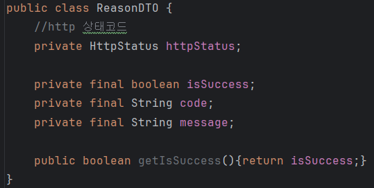

# 7주차 미션 페이지

# 미션

## 1. 링크 & 워크북을 보며 API 응답 통일과 에러 핸들러를 숙지하기.

https://github.com/chock-cho/UMC-7th-spring-workbook/tree/feature-week7-workbook

- 코드 리뷰 및 숙지 완료하였습니다.

## 2. 실습 코드, 브랜치

https://github.com/jijysun/Hello_Concurrency

- 하던 토이 프로젝트에 같이 실습해보았습니다. 같이 첨부하겠습니다.

---

## 3. 실습 과정

### (1) API 응답 통일

<aside>
💡

**구현 과정**

</aside>

> ApiResponse
> 



1. 통일 API 응답을 위한 클래스를 작성한다.
2. 특정 값에 대한 API 통일이 아니기 때문에 Generic 으로 만들어준다.
3. JsonPropertyOrder?
    1.  Json 직렬화하는 순서를 직접 정해준다. 만약 없는 경우 선언한 필드 순서대로 직렬화한다.
4. JsonInclude (JsonInclude.Include.NON_NULL)?
    1. 이또한 Json 직렬화에 사용한다. 
    2. 해당 객체의 값을 Json 직렬화 할 때, NULL 인 경우 해당 필드는 직렬화에서 제외한다.

> ReasonDto, ErrorReasonDto
> 


1. ApiResponse에 들어갈 code와 message의 형식을 정해주는 ReasonDto와 ErrorReasonDto를 작성한다.

> BaseCode, BaseErrorCode
> 


1. 이후 Status 관련 클래스를 구현할 때 “인터페이스 구현”으로 해당 메소드들을 필수로 구현하게 한다.

> SuccessStatus
> 


1. 실질적인 API 성공 응답 형식을 적는 SuccessStatus Enum을 작성한다.
2. 위 인터페이스를 구현하여 각 형식 별 ReasonDto의 get 메소드들을 필수로 작성한다.

---

**응답 통일 테스트 과정**


패키지 구조는 다음과 같이 실습하였습니다.

> TempRespDto
> 


1. 한 주제에 대한 API 응답 DTO를 만드는 TempRespDto를 작성하고 내부 static class로 테스트 Dto를 작성한다.
2. Dto는 여러 곳에서 만들어지고 사용된다. 그렇기에 일일히 매번 클래스를 만드는 것이 아닌, “ 주제RespDto.소주제Dto “ 식으로 구현하여 범용적으로 DTO를 사용한다.

> TempConverter
> 


1. 간단한 테스트 용으로 DTO 생성 시 임시 테스트용 문자열을 바로 넣어준다.

> TempController
> 


1. 실질적인 요청이 들어왔을 때의 TempController 이다. 
2. 현재 작성한 요청은 **테스트의 성공 요청**이므로 
    1. ApiResponse의 onSuccess를 호출하고, 
    2. TempConverter를 통해 Dto를 작성하여 반환한다.


Postman을 통해 해당 URL을 호출해본 결과, 200 성공 코드와 함께 통일된 깔끔한 성공 응답을 확인할 수 있었다!

---

**응용**

추가로 SuccessStatus에 서비스 입장으로 봤을 때 성공 코드를 보내는 경우를 추가로 구현해주었다. 간단한 응용을 통해 로그인, 로그아웃 상황 별 성공 응답 코드를 보내보자.

> ApiResponse 변경사항
> 


1. 성공 상황일 때 SuccessStatus.OK를 고정적으로 받았었다
2. 이를 변형하여 각 상황 별 성공 코드를 받는 식으로 변경하였다.

> TempRespDto의 변경사항은 없다.
> 

> TempConverter 변경사항
> 


1. 각 성공 상황 별 Converter가 필요하다. 
2. 빌더를 이용하여 쉽게 구현하였다.

> TempController 변경사항
> 


1. ApiResponse.onSuccess 메소드가 변경되어 “성공 상황 별 성공 코드” 가 필요로 하게 되었다.
2. 이에 각 요청 별 성공 했을 때의 맞는 코드를 ApiResponse로 넘겨준다
3. 이후 만들어진 응답 API를 반환한다.

> 결과 (클릭하여 확대하면 더 잘 보여요)
> 


- 성공 응답 API가 잘 작성되어 반환되는 것을 확인할 수 있다!

---

### (2) 에러 핸들러

SuccessStatus 작성을 완료했으니, 이제 실패에 대한 상태 ErrorStatus를 작성하고자 한다.

> ErrorStatus
> 


1. BaseErrorCode를 구현하기에, 사진에서는 나와있지 않으나 해당 메소드들을 필수로 구현해야 한다.
2. 다양한 Http 상태 코드를 사용해보고자 409, 415 코드 예시를 추가하였다.

> GeneralException
> 


> ExceptionAdvice
> 


1. public ResponseEntity <Object> validation
    - ConstraintViolationException 예외가 발생했을 때 첫 번째 메시지를 가져온다.
    - 이후실패 메시지를 RuntimeException 으로 감싸, 커스텀 예외 처리 후 응답을 반환한다.
2. protected ResponseEntity <Object> handleMethodArgumentNotValid ()
    - 이는 Override 한 메소드로  @Vaild 어노테이션, 스프링 부투의 유효성 검증에서 실패가 발생할 때의 예외인 MethodArgumentNotValidException을 처리한다.
    - 필드 별 오류 메세지를 Map으로 변환 후 클라이언트에 반환한다.
3. public ResponseEntity<Object> exception
    - 모든 일반적인 예외(Exception)를 잡아 로그를 출력하고, 에러 메세지를 그대로 반환하면서 내버 서버 오류 코드인 500 에러로 응답합니다.
4. public ResponseEntity<Object> onThrowExcpetion
    - @ExceptionHandler (value = GeneralException.class) 가 명시되어 있다.
    - 해당 예외가 발생한 경우, 해당 예외로 정의된 HttpStatus를 반환하며, 동시에 getReasonHttpStatus로 정확한 상태를 반환한다.
5. 이후 각 ApiResponse를 만드는 메소드를 통해 각 경우 별 통일된 응답 API를 작성한다.

> ErrorStatus 변경사항
> 


- 테스트 예외 대한 응답 내용을 작성한다.

> TempHandler
> 


- GeneralException 발생 시 예외를 컨트롤 할 TempHandler를 작성한다.

> TempRespDto 변경사항
> 


- 예외 사항은 flag = 2 일 때 이다.
- 해당 시뮬레이션에 필요한 Dto를 작성해준다.

> TempConverter 변경사항
> 


- 해당 Dto를 작성하도록 도와주는 컨버터 또한 작성한다

> TempController 변경사항
> 


- 요청이 들어올 경우 flag를 검사한다
- 성공한 경우 ApiResponse의 성공 응답 API를 반환한다.

> TempServiceImpl
> 


- flag가 1인 경우 성공하는 경우이다
- 2인 경우 다음의 과정을 밟는다.
    - TempHandler을 테스트 예외 에러 코드와 함께 Throw 한다.
    - TempHandler는 GeneralException을 상속한다. 즉 GeneralException을 Throw 하는 것과 같다.
        - 이때 생성자의 super 키워드를 통해 롬복의 생성자를 통해 자동으로 만들어진다.
    - GeneralException가 RuntimeException 을 상속하고 있으므로, ExceptionAdvice가 이를 감지한다.
        - 이유는 @RestControllerAdvice가 붙어있기 때문이다!
        - 이 어노테이션은 @RestController 나 @RequestMapping이 붙은 컨트롤러에서 발생한 예외를 처리하기 때문이다!
    - 이후 ExceptionAdvice에서 이를 처리한다.
        - 더 상세한 내용은 @ExceptionHandler (value = GeneralException.class)이 이를 처리한다.
    - 처리하는 내용은 ErrorResponseDto를 작성한다
    - 이를 바탕으로 ApiResponse의 실패 응답 제작 메소드, onFailure 를 호출하여 실패 응답을 반환한다.

> 테스트
> 


1. flag가 1 인 경우 성공 응답을 잘 반환하는 것을 알 수 있다.
2. flag가 2인 경우 실패 응답을 잘 반환하는 것을 알 수 있다.


해당 ExceptionHandler에 로깅 코드를 붙혀본 결과 잘 잘동하는 것 또한 확인할 수 있다.

---

## 4. 핵심 키워드

RestContollerAdvice?

- @ControllerAdvice 과 @ResponseBody의 조합이다. 당연히 @ControllerAdvice와 같은 역할을 수행하면서, 객체를 다른 형식으로 반환하는 역할을 한다.
- 커스텀 예외를 적용하여, 이에 대한 @ExceptionHandler가 붙은 핸들러 클래스를 정의하고, 해당 예외를 처리하고자 할 때 사용한다.
- 해당 어노테이션은 다음과 같은 장점을 갖고 있다.
    - 컨트롤러는 흐름 제어에만 집중할 수 있으며, 컨트롤러에서 발생하는 예외를 AOP를 적용하면서 처리할 수 있다는 점이다.
    - 해당 어노테이션이 붙은 컨트롤러의 모든 예외를 한 곳에서 처리하기에 예외 처리에 대한 로직을 구현한 다음 재사용할 수 있다는 점이다.
    - 커스텀 예외과 이에 대한 에러 응답 DTO로 성공 또는 실패 응답에 대한 API 를 커스텀하면서 통일할 수 있다.
- 만약 이 어노테이션이 없었다면
    - 컨트롤러에서나 서비스 계층 코드에서 예외를 처리해야 한다.
    - 또한 예외 발생 시 마다 이를 처리하는 Try-Catch나 Throw 문을 사용해야 하므로 코드 상의 많은 중복이 일어난다.
    - 이에 새로운 예외 상황 시 모든 컨트롤러를 수정해야 한다는 확장성의 비효율성이 존재한다.

lombok?

- 어노테이션 방식으로 동작하며 엔티티 클래스 관련 반복적인 코드를 방지한다.
- 특히 DTO를 작성할 때 사용되며, 코드의 가독성과 효율을 높히는 코드 (보일러플레이트 코드)를 자동으로 생성하게 해주는 JAVA의 코드 자동완성 라이브러리이다.
- 생성자 관련 어노테이션으로 기본 생성자를 생성해주는 @NoArgsConstructor, 모든 필드 포함 생성자를 생성해주는 @AllArgsConstructor, final 이나 @NonNull 필드만 포함하는 생성자를 생성하는 @RequiredArgsConstructor가 있다.
- 편의성 관련 어노테이션으로 빌더 패턴을 통해 객체를 생성하도록 도와주는 @Builder, 모든 필드에 대해 getter, setter를 생성해주는 @Getter, @Setter, 로깅 객체인 Logger를 자동 생성 해주는 @Slf4j 등이 있다.
- 이에 관해서 @Data, @Setter, @ToString의 사용은 지양하면서 개발하는 것이 좋다. @Setter인 경우 set 메소드를 통해 객체의 필드값 수정이 가능해지고, 이는 의도치 않은 변경과 무결성의 의심을 불러오게 된다.
- 또한 @ToString은 Json 직렬화 도중 연관 관계에 대한 무한 참조가 발생할 수 있는 위험을 불러온다. 어쩔 수 없이 사용하게 될 경우 @JsonIgnore을 사용하여 무한 순환 참조 방지를 하거나, 될 수 있으면 사용하지 않는 것을 목표로 한다.

---

## **5. 미션 목록 조회(진행중, 진행 완료) API 명세서** 작성하기

- 사용자가 진행 중이거나, 완료한 미션을 조회해야 한다. 그러므로 데이터 조회인 GET 방식이 사용된다.
- 필요한 정보로는 미션을 진행 중인 음식점, 미션 내용, 미션의 보상이다.

API EndPoint

- 사용자의 id 정도만  Path Variable로 표현하였다.

진행 중인 미션을 조회

```json
GET /users/{id}/user_mission?complete=processing
```

진행 완료인 미션을 조회

```json
GET /users/{id}/user_mission?complete=success
```

Request Body
- GET 방식이므로 필요하지 않다.

Api 응답
```json
{
	"code": "COMMON200",
	"message":"조회에 성공했습니다.",
	"result":[
		{"missionId":"1", "storeName":"요아정", "missionSpec":"에서 10,000 이상 식사하세요!", "reward":"500"},
		{"missionId":"2", "storeName":"김밥천국", "missionSpec":"에서 20,000 이상 식사하세요!", "reward":"1000"},
		...
	],
	success: true
}
```