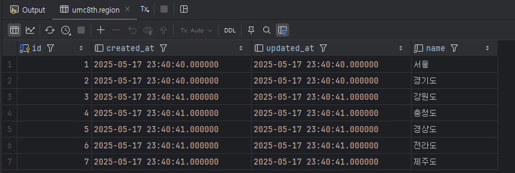

# 8주차 미션 페이지

# 핵심 키워드

### Java의 Exceptiopn 종류들
- Checked Exception, 즉 컴파일 타임에서 검사되는 예외에요. 반드시 예외 처리를 반드시 try-catch, throws로 무조건 잡아줘야 해요! SQLException의 db 관련 에러와 ParseException 등의 파싱 에러 관련 등이 있어요.
- 이에 반대되는 UnChecked Exception으로, 컴파일이 아닌 런타임에 발생해요. NullPointerException, ArrayIndexOutOfBoundsException 등이 존재해요
- Error, 이건 복구할 수 없는 오류에요. OutOfMemoryError, StackOverflowError 등이 있어요.


### @Valid?
- @Valid는 Java Bean Validation에서 사용하는 어노테이션으로, 객체의 필드 값 유효성 검사를 자동으로 수행해준다.
보통은 Spring Framework에서 많이 쓰이며, Controller 계층의 코드에서 클라이언트의 요청 값을 검증할 때 사용한다.

# 미션

[UMC 서버 워크북 참고 자료](https://github.com/CYY1007/UMC_SERVER_WORKBOOK.git)

[GitHub - chock-cho/UMC-7th-spring-workbook at feature-week8-workbook](https://github.com/chock-cho/UMC-7th-spring-workbook/tree/feature-week8-workbook)

---

3주차에 설계한 URL(없으면 추가!)을 바탕으로 아래의 API 구현

허나 아직 Validator에 수정을 하면 좋은 부분이 존재하며 이를 고치는 것을 미션에 포함을 시키겠습니다 🙂

**(힌트, repository에 접근하는 계층은 무조건 service 하나만 있어야 함)**

미션 수행 시 이 categoirsExistValidator를 올바르게 고쳐서 진행해보세요!

1. 특정 지역에 가게 추가하기 API
2. **가게에 리뷰 추가하기 API**
3. 가게에 미션 추가하기 API
4. **가게의 미션을 도전 중인 미션에 추가(미션 도전하기) API**

3주차에 설계하지 않은 API URL의 경우는 설계를 복습 할 겸 해보고 진행해주세요!

반드시 인증 사진을 중간 중간 남기며, 7주차와 동일하게 github에 브랜치를 새로 만들어서 푸시하기

https://github.com/jijysun/Studing_JPA/tree/feature/2

- [x]  github branch를 만들 때 issue를 만들고 branch 생성하여 진행 후 push할 것
- [x]  controller, service, converter, dto, repository를 모두 활용할 것
- [x]  ExceptionAdvice를 적극 활용, RequestBody에 값이 누락되거나 값이 잘못된 것을 @Valid 어노테이션으로 검증하기
- [x]  1, 2, 3 번 조건을 충족하지 않을 경우 해당 API는 미션 완료 대상에서 제외가 되며
- [x]  **2, 4번 API는 필수로 구현해야 하고,**
- [x]  만약 3번 API를 만들지 않을 경우 2,4번 API 만들 때 DB에 수동으로 미션 정보 기입해서 진행
- [x]  위의 4개 API중 **필수 API 포함 3개 미만으로 완료 시 원 아웃 부여**
- [x]  **4번 API의 경우는 도전 하려는 미션이 이미 도전 중인지를 검증해야 하며 이를 커스텀 어노테이션을 통해 검증을 해야 함.**
- [x]  **2번 API의 경우도 4번 API처럼 리뷰를 작성하려는 가게가 존재하는지 검증하는 커스텀 어노테이션을 사용할 것.**

---

- 사전 테스트용 데이터
    1. 지역, Region
    - 서울, 경기. 강원, 경상, 충청, 전라, 제주
    
    ```sql
    insert into region (created_at, updated_at, name) VALUES (now(), now(), "서울");
    insert into region (created_at, updated_at, name) VALUES (now(), now(), "경기도");
    insert into region (created_at, updated_at, name) VALUES (now(), now(), "강원도");
    insert into region (created_at, updated_at, name) VALUES (now(), now(), "충청도");
    insert into region (created_at, updated_at, name) VALUES (now(), now(), "경상도");
    insert into region (created_at, updated_at, name) VALUES (now(), now(), "전라도");
    insert into region (created_at, updated_at, name) VALUES (now(), now(), "제주도");
    
    ```
    
    
    
    1. 가게, Store
    - 꼬밥, 크라이치즈버거
    
    ```sql
    insert into store (name, address, score, region_id, created_at, updated_at) values ("꼬밥", "경기 부천시 원미구 지봉로 54", 4.4, 2, now(), now());
    insert into store (name, address, score, region_id, created_at, updated_at) values ("크라이치즈버거", "경기 부천시 원미구 지봉로34번길 19", 4.5, 2, now(), now());
    ```
    
    
    
    1. 미션, Mission
    
    ```sql
    insert into mission (created_at, updated_at, dead_line, mission_spec, reward, store_id) VALUES (now(), now(), date_add(now(), INTERVAL 7 DAY ), "꼬밥에서 15000원 이상 식사하세요", 2000, 3);
    insert into mission (created_at, updated_at, dead_line, mission_spec, reward, store_id) VALUES (now(), now(), date_add(now(), INTERVAL 7 DAY ), "크라이치즈버거에서 20000원 이상 식사하세요", 4000, 4);
    ```
    
    
    

## 1. 특정 지역에 가게 추가하기 API


가게 추가 issue 사진

추가라는 요청이므로 POST가 필요합니다. 또한 특정 지역이므로 지역에 대한 id 값이 필요하고, 이를 PathVariable로 받습니다. 

<aside>
💡

POST /regions/{id}/store

</aside>

또한 RequestBody를 통해 추가하고자 하는 가게에 대한 데이터를 받습니다.

```json
// POST /regions/{id}/store
{
	"name" : "storeName",
	"address" : "storeAddress",
	"score" : score
}
```

> Dto
> 


- 일단 데이터를 받아야 하므로 요청에 대한 Dto 가 필요합니다.
- 해당 Dto는 가게 정보를 넘기므로 가게의 이름, 주소, 평점이 필요로 합니다.
- 그리고 요청에 대한 자바 validation을 통해 올바른 값의 요청인 지 검증합니다.


RegionResponseDto

- 또한 응답용 Dto 또한 필요합니다. 응답용 Dto는 간단하게 추가된 가게의 id 와 이름, 생성 시간을 응답하는 것으로 하겠습니다.

> Repository
> 


RegionRepository

- 요청으로 받은 지역에 대한 id가 실제 존재하는 지 확인하기 위해 JpaRepository를 상속하여, Region에 대한 리포지토리 클래스를 만들어줍니다.


StoreRepository

- 또한 새로운 가게를 저장하기 위해 JpaRepository를 상속하여, Store에 대한 리포지토리 클래스를 만들어줍니다.

> Service
> 


RegionCommandService

- 해당 서비스 인터페이스를 만들어 줆으로써 필수적으로 구현하게 만들어줍니다.


RegionCommandServiceImpl

- 요청으로 들어온 지역에 대한 id 값을 통해 DB에 조회하여 실제 지역이 있는지 확인해야 합니다. 만약 없는 경우 새로 구현한 지역 예외 핸들러를 통해 해당 지역이 없다는 오류 메시지를 반환합니다.
- 만약 예외가 발생하지 않은 경우 컨버터를 통해 id 값으로 찾은 Region 과 요청 Dto를 넘겨 새로운 Store, 가게를 만듭니다.
- 마지막으로 새 Store를 저장하여 요청 서비스 로직을 마무리 짓습니다.

> Exception
> 


RegionHandler


ErrorStatus 추가

- 해당 지역이 존재하지 않는 경우에 대해 응답 메세지를 작성하였습니다.

> RegionController
> 


RegionController

- 최종 컨트롤러 코드입니다.
- 특정 지역에 대한 가게 추가 요청이 들어온 경우 @PathVariable로 지역 id 값을 , @RequestBody로 요청 값을 Dto 로 전환하여 각 데이터를 받습니다.
- 그리고 위에서 설명한 서비스 계층 코드에게 id 값과 Dto를 차례대로 넘기고 나서, 지역 값과 요청 가게 값을 검증 후 저장 처리를 한 후, 그 값을 반환받습니다.
- 이를 통해 Converter로 응답 Dto로 변환 후 ApiResponse를 통해 통일된 응답 API를 반환합니다.

> Converter
> 


StoreConverter


최종 응답 dto

> 테스트
> 

Postman을 통해 테스트 해보겠습니다.

상단에서 지역에 대한 테스트 데이터를 넣어놓았으며, 경기도의 id 값은 2 이었습니다. 그렇기에 다음과 같은 요청을 해보겠습니다.


해당 요청에 대해 성공적인 통일 응답과 저장된 DB 속 레코드를 확인할 수 있었습니다.

반례로 잘못된 RequestBody의 값을 넣어 요청해보겠습니다.

위에서 설정한 자바 validation을 통해 가게의 주소는 최소 5글자 최대 30글자 까지 허용됩니다. 


반례의 경우 또한 성공적으로 검증하여, 잘 못된 요청임을 클라이언트에게 알려주고 있습니다.

---

## 2. **가게에 리뷰 추가하기 API (필수)**


제가 했던 3주차 미션의 API 설계를 참고 및 리팩토링 하였습니다. 

> 사용자의 마이페이지에서 주문했던 가게 중 특정 가게에 대한 리뷰를 작성한다.
> 
- 사용자가 리뷰라는 데이터를 전달하는 것이므로 POST 요청이어야 한다.
- 리뷰를 작성하는 사용자는 특정 사용자 한 명입니다. 그렇기에 특정 사용자에 대한 id 값이 필요합니다.
- 또한 리뷰가 추가되는 가게는 특정 가게 하나입니다. 그렇기에 특정 가게에 대한 id 값이 필요합니다. 이는 RequestBody 에 담아 해결하겠습니다
- 전달받는 데이터로는 가게 id와 리뷰 내용에 담기는 별점, 본문, 사진 등이 있습니다.

<aside>
💡

POST /members/{id}/reviews

</aside>

```json
{
	"storeId" : "storeId",
	"score" : "Float형 별 개수",
	"body" : "리뷰 내용",
	"review_photo" : ["사진 1", "사진2" ...]
}
```

> 내가 주문한 가게들 중, 먹었던 가게에 대해 리뷰를 작성한다.
> 

먼저 Dto 부터 설계해보겠습니다.

> MemberRequestDto
> 


AddNewReviewRequestDto, 요청 Dto

- 위 URL의 경우, 사용자 id는 @PathVariable로 받습니다. 나머지 가게에 대한 데이터를 RequestBody로 받습니다.
- 점수, 본문은 필수이므로 각각 @NotNull 과 @Size 어노테이션을 사용합니다.
- 또한 해당 가게가 존재하는 지 여부를 검증하기 위해 커스텀 어노테이션 @ExistStores를 구현 및 사용하여 커스텀 검증을 실시합니다.
- 마지막으로 컨트롤러에서 해당 RequestBody를 받을 때 @Valid 를 사용하여 검증을실시합니다.

> ExistStores
> 


ExistStore, 커스텀 어노테이션

- @Constraint(validatedBy = CategoriesExistValidator.class)
    - 구현하는 어노테이션에 대한 제약 조건, 즉 어디서 검증 로직을 시행할 지를 지정하는 어노테이션입니다
    - 이후 밑에서 설명할 코드로 검증을 하겠다는 표현입니다.
- @Target({ElementType.FIELD, ElementType.PARAMETER, ElementType.METHOD})
    - 구현하는 어노테이션이 어디에 적용 가능한 지 범위를 지정하는 어노테이션입니다.
    - 현 설정으로는 필드, 파라미터, 메소드에 적용 가능합니다.
- @Retention(RetentionPolicy.RUNTIME)
    - 구현하는 어노테이션이 언제 까지 유지되는 지, 생명주기를 정하는 어노테이션입니다.
    - 현 설정으로는 Runtime, 즉 실행 까지 유지하므로, 검증 로직을 시행하기 위해 필수적으로 사용해야 합니다.

> StoreExistValidator
> 


- implements ConstraintValidator<ExistStores, Long>를 통해 Long 값에 대한 검증 코드를 Override 합니다.
- 이후 isValid () 메소드에서 DB에 해당 가게의 id를 조회하면서 가게 존재 유무를 검사합니다.
- 가게에 대한 DB의 접근이 필요하므로, StoreRepository 의존성 주입을 해줍니다.
    - 만약 존재하는 경우 검증을 통과시킵니다.
    - 만약 존재하지 않는 경우 context.disableDefaultConstraintViolation(); 을 통해 ContraintViolation 기본 예외 메세지를 제거한 후,
    context.buildConstraintViolationWithTemplate(ErrorStatus.STORE_NOT_FOUND.toString()).addConstraintViolation();  을 통해 직접 구현한 에러 요청에 대한 통일 응답 메세지를 넘겨줍니다.

> MemberResponseDto
> 


AddNewReviewResultDto, 응답 Dto

- 응답 Dto로써, 간단하게 생성된 새로운 review의 id, 해당 review가 삽입된 store의 id와, 생성 일자를 반환하여 응답하겠습니다.

> MemberController
> 


MemberController

- POST /users/{id}/reviews 이므로 MemberController 에서 이를 처리합니다
- @PathVariable로 사용자 id를, @RequestBody와 Dto 를 통한 요청 데이터를 받습니다.
- 이를 MemberCommandService를 통해 리뷰를 저장하고, 간단한 응답 Dto를 통해 이를 성공 응답으로 반홥합니다.

> MemberCommandService
> 


interface MemberCommandService

- 해당 인터페이스에 구현할 메소드를 작성하여, 하위 구현 클래스에서 필수적으로 구현하게 만듭니다.

> MemberCommandServiceImpl
> 


MemberCommandServiceImpl

- Review 엔티티에는 해당되는 사용자와 가게의 값이 필요로 합니다.
- 먼저 controller에서 받고, 넘겨진 @PathVariable Long memberId를 통해 사용자를 찾습니다. 만약 없는 경우, 기존에 작성하였던 UserHandler를 통해 예외를 발생시킵니다.
- 2 번째로, @RequestBody로 받은 Dto에서 가게 id를 통해 가게가 있는 지, 다시 한 번 조회합니다. 만약 없는 경우, 새로 작성한 “해당 가게를 찾을 수 없습니다” 라는 메세지의 예외를 UserHandler를 통해 발생시킵니다.
- 모두 값이 정상적으로 존재하는 경우 새로운 Review를 Converter를 통해 만들고, Repository 를 통해 저장합니다, 마지막으로 이 저장된 값을 반환합니다.

> ReviewRepositoy
> 


- JpaRepository 를 상속 받아 간단 구현하였습니다.

> ErrorStatus
> 


ErrorStatus

- 해당 가게가 존재하지 않는 응답 메세지를 작성하였습니다.

> ReviewConverter
> 


- Converter 코드로, 새로 작성한 Review를 만드는 toReview() 와, 응답할 Dto를 만드는 toAddNewReviewResultDto () 를 구현하였습니다.

> 테스트
> 


- 사전에 저장된 가게는 다음과 같습니다.


- 사전에 저장된 사용자는 다음과 같습니다.


- 기존 설계했던 URL과 RequestBody로 요청한 결과 정상적인 성공 응답을 반환하였으며, SQL 또한 정상적으로 생성된 것을 확인할 수 있었습니다.


- 또한 생성 일자를 보시는 것과 같이 정상적으로 새 Review가 DB 에 삽입된 것을 확인할 수 있었습니다.

이번엔 기존에 작성했던 커스텀 검증 어노테이션을 통해 잘못된 요청을 보내보겠습니다.

기존 데이터에는 id가 3~5 인 가게만 존재했었습니다. 이에 id가 10번인 존재하지 않는 가게에 대한 리뷰를 작성해보겠습니다.


- 보시는 것과 같이 기존에 구현했던 ErrorStatus의 실패 응답 API와 커스텀 검증 어노테이션의 메세지를 정상적으로 반환하는 모습을 확인할 수 있었습니다.

---

## 3. 가게에 미션 추가하기 API


<aside>
💡

POST /stores/{id}/missions

</aside>

```json
{
	"reward" : int 형식의 보상,
	"deadline" : 현 시간 + 양수 값 정도의 시간,
	"missionSpec" : "미션 내용"
}
```

특정한 가게에 새로운 미션을 추가하는 API 입니다. 

이에 대해 필요한 값으로 특정 가게, 가게에 대한 ID 값과, Mission 의 보상, 마감 기간, 미션 내용, 생성 & 수정 일자 등의 세부 내용이 전부 필요로 합니다. 

요청 dto, 응답 dto 먼저 구현해보겠습니다.

> StoreRequestDto
> 


StoreRequestDto

- 중요한 검증 조건으로는 미션의 마감 일자는 유한해야 합니다. 그렇기에 현 시간으로 부터 최소 3일, 최대 7일의 여유 시간이 주어집니다.

> StoreResponseDto
> 


- 응답 데이터로는 정상적으로 저장되었는 지 확인 가능한 새 미션의 보상, 마감 일자, 내용을 반환하겠습니다.

> StoreController
> 


- 전달 받은 가게의 id와 새로운 미션에 대한 RequestBody를 서비스에게 넘기고, 새롭게 저장된 미션을 반환 받습니다.
- 이를 Converter를 통해 Dto로 변환하고, 성공 응답 API 와 함께 응답합니다.

> StoreService
> 


interface StoreService

- 인터페이스로 구현하고, 이를 상속하여 해당 메소드를 필수적으로 구현하게 만들었습니다.

> StoreServiceImpl
> 


- 먼저 넘겨받은 가게의 id 에 대한 검증을 실시합니다. DB 조회를 통해 존재하지 않는 경우 해당되는 예외를 발생시킵니다.
- 넘겨받은 Dto와 DB 조회로 검증된 가게를 Converter를 통해 새로운 Mission 객체를 만듭니다.
- 이후 MissionRepository를 통해 저장하면서 Controller에게 저장 결과를 반환합니다.

> StoreHandler, ErrorStatus
> 


- 사용된 예외 핸들러와 실패 응답 API 는 다음과 같습니다.

> MissionConverter
> 


- Service 에서 조회된 가게와 Controller에서 전달 받은 Mission 세부 내용을 @Builder를 통해 만들고 return  합니다.

> StoreRepository, MissionRepository
> 


- 사용된 Repository 코드는 다음과 같습니다.
- StoreRepositoryCustom은 6주차 미션부터 동일한 프로젝트에서 실습했던 기존 코드입니다.

> 테스트
> 


- 사전에 저장된 가게는 다음과 같습니다
- 이를 바탕으로 미션을 저장해보겠습니다.


- 기존 설계했던 URL과 RequestBody를 바탕으로 요청 시 정상적으로 응답하면서, SQL이 생성된 모습을 확인할 수 있었습니다.


- DB 조회 시에도 정상적으로 저장된 모습을 확인할 수 있었습니다.


- 반례로 미션의 마감 일자는 현 날짜로부터 최소 3일, 최대 7일의 여유 기간이  주어집니다.
- 이 반례로 3일 미만, 8일 이상의 미션 마감 기간인 잘못된 요청을 했을 때에도, 정상적으로 실패 응답을 반환하는 것을 확인할 수 있었습니다.

---

## 4. **가게의 미션을 도전 중인 미션에 추가(미션 도전하기) API (필수)**


<aside>
💡

POST /members/{id}/missions

</aside>

```json
{
	"missionId" : missionId
}
```

- 미션을 도전하는 API 이므로, 주체는 사용자 입니다.
- 동시에 특정 가게에 대한, 특정 미션에 도전한 것이므로 해당 미션에 대한 각각의 id 값이 필요로 합니다.
- 가게에 대한 id 는 해당 미션의 객체에 포함되어 있습니다.

> ChallengeMissionRequestDto
> 


- 해당 미션에 대해 이미 도전 중인 지 검증하는 커스텀 어노테이션을 사용합니다.
- 이는 미션이 이미 수락중인 상태이고, 다시 미션을 도전 요청을 하는 과정을 검증해야 합니다.

> annotation ChallengeMission
> 


> MissionChallengeValidator
> 


- 검증하고자 하는 값이 Long, MemberMission의 id 값이므로, implements ConstraintValidator<ChallengeMission, Long> 으로 명시합니다.
- 먼저 MissionRepository를 통해 넘겨 받은 missionId로 조회를 실시합니다. 만약 없는 경우 존재하지 않는 미션에 대한 예외를 발생시킵니다.
- 마지막으로  memberMissionRepository를 통해 넘겨 받은 missionId로 조회를 실시합니다
    - 만약 해당 테이블에 존재하지 않는다면, 처음 도전하는 것이므로 검증을 통과시킵니다.
    - 만약 해당 테이블에 존재하면서, 도전 중인 상태인 경우 중복 도전이라는 예외를 발생시킵니다.

> ErrorStatus
> 


- 이미 도전 중인 미션을 표현하는 응답 메세지를 작성합니다.

> ChallengeMissionResponseDto
> 


- 요청에 대한 응답 Dto로 미션의 상태를 확인하는 데이터를 반환합니다.
- 중복 도전의 요청인 경우 위 검증을 통해 처리되었으므로, 요청한 미션과 함께 도전 중이라는 상태 값을 넣어 반환합니다.

> Controller
> 


- @Pathvariable을 통해 사용자의 id를 @RequestBody를 통해 사용자가 도전하고자 하는 미션의 id를 받습니다.
- 이후 membertCommandService에게 이 정보를 넘겨 사용자는 해당 미션을 도전하는 기록을 남깁니다.

> MemberCommandService
> 


- 인터페이스로 구현하여 해당 메소드를 필수적으로 구현하게 만듭니다.

> MemberCommandServiceImpl
> 


- 요청 받은 정보로 먼저 각각 사용자와 미션을 조회합니다. 만약 존재하지 않는 경우 사전에 구현한 미존재 예외를 발생시킵니다.
- 존재하는 경우 커스텀 어노테이션에 의해 검증은 이미 된 상태입니다. 그렇기에  새로 MemberMission을 Converter를 통해 만들고, repository를 통해 저장합니다.

 

> MemberMissionConverter
> 


- DB에서 찾은 값들을 토대로 MemberMission 객체를 만들어주는 Converter 입니다.

> 테스트
> 


- 사전에 저장된 사용자와 미션은 다음과 같습니다.
- 먼저 1번 사용자가 1번 미션을 수락하는 요청을 하겠습니다.


- 현재 mission 테이블에는 해당 미션이 정상적으로 존재하며,  member_mission 테이블에는 해당 미션을 도전하고 있지 않아, 정상적으로 도전 중임을 저장하는 SQL과 성공 응답 API를 확인할 수 있었습니다.


- 이전 요청을 한 번 더 할 경우, member_mission 테이블에는 해당 미션을 도전하고 있다는 정보가 저장되어 있습니다.
- 이에 사전에 구현하였던 중복 도전 요청 검증을 위한 커스텀 어노테이션 @ChallengeMission 이 @Valid를 통해 정상적으로 작동하여, 실패한 요청임을 확인할 수 있었습니다.