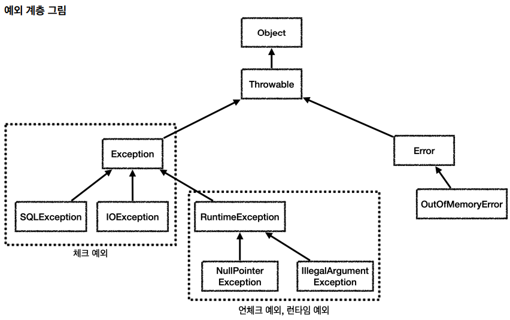

# 🎯핵심 키워드

---

<aside>
💡 주요 내용들에 대해 조사해보고, 자신만의 생각을 통해 정리해보세요!
레퍼런스를 참고하여 정의, 속성, 장단점 등을 적어주셔도 됩니다.
조사는 공식 홈페이지 **Best**, 블로그(최신 날짜) **Not Bad**

</aside>

- java의 Exception 종류들
    
    
    
    자바의 예외  계층은 다음과 같다. 
    
    자바에서 기본형을 제외하고는 다 객체이기 때문에 예외 객체의 최상위 부모는 Object이다. Throwable은 최상의 예외이고, 하위에는 Exception과 Error이 있다. 
    
    Error: 애플리케이션에서 복구가 불가능한 시스템 예외이기 때문에 개발자는 신경쓸 필요가 없다.
    
    Exception: 애플리케이션 개발자가 실질적으로 사용할 수 있는 최상위 예외이다. Exception과 하위 예외에서 RumtimeException을 제외하고는 모두 컴파일러가 체크하는 체크 예외이다.
    
    RumtimeException: 이 예외와 하위 예외는 모두 언체크 예외이다. 
    
- @Valid
    
    Bean Validation은 검증 로직을 모든 프로젝트에 적용할 수 있도록 공통화하고, 표준화한 것이다. 검증 애노테이션과 여러 인퍼테이스의 모음이다. 
    
    Bean Validation의 구현체는 하이버네이트의 Validator이다. 
    
    @NotBlank: 빈값 + 공백만 있는 경우를 허용하지 않음
    
    @NotNull: null값을 허용하지 않음
    
    @Range(min = 1000, max = 2000): 범위안의 값이어야함.
    
    ```java
    //검증기 생성
    ValidatorFactory factory = Validation.buildDefaultValidatorFactory();
    Validator validator = factory.getValidator();
    //검증기 실행
    Set<ConstraintViolation<Item>> violations = validator.validate(item);
    ```
    
    검증기를 실행하면 검증 대상(item)을 검증기에 넣고 결과를 받는다. Set에는 ConstraintViolation이라는 검증 오류가 담긴다. 결과가 비어있으면 오류가 없는것이다. ConstraintViolation을 출력하면 검증 오류가 발생한 객체, 필드, 메세지 정보등 다양한 정보를 확인할 수 있다.
    
    @Valid는 HttpMessageConverter (@RequestBody)에도 적용할 수 있다. 
    

# 📢 학습 후기

---

- 이번 주차 워크북을 해결해보면서 어땠는지 회고해봅시다.
- 핵심 키워드에 대해 완벽하게 이해했는지? 혹시 이해가 안 되는 부분은 뭐였는지?

<aside>
💡

</aside>

# ⚠️ 스터디 진행 방법

---

1. 스터디를 진행하기 전, 워크북 내용들을 모두 채우고 스터디에서는 서로 모르는 내용들을 공유해주세요.
2. 미션은 워크북 내용들을 모두 완료하고 나서 스터디 전/후로 진행해보세요.
3. 다음주 스터디를 진행하기 전, 지난주 미션을 서로 공유해서 상호 피드백을 진행하시면 됩니다.

---

### [UMC 서버 워크북 참고 자료](https://github.com/CYY1007/UMC_SERVER_WORKBOOK.git)

[GitHub - chock-cho/UMC-7th-spring-workbook at feature-week8-workbook](https://github.com/chock-cho/UMC-7th-spring-workbook/tree/feature-week8-workbook)

---

3주차에 설계한 URL(없으면 추가!)을 바탕으로 아래의 API 구현

단, 로그인 기능이 없는 관계로 리뷰를 작성하거나 미션 도전하는 유저는

**하드 코딩(그냥 무조건 디비에 있는 아무나 한명)**으로 하기!

1. 특정 지역에 가게 추가하기 API
2. **가게에 리뷰 추가하기 API**
3. 가게에 미션 추가하기 API
4. **가게의 미션을 도전 중인 미션에 추가(미션 도전하기) API**

3주차에 설계하지 않은 API URL의 경우는 설계를 복습 할 겸 해보고 진행해주세요!

반드시 인증 사진을 중간 중간 남기며, 7주차와 동일하게 github에 브랜치를 새로 만들어서 푸시하기

<aside>
📌 **조건**

1. github branch를 만들 때 issue를 만들고 branch 생성하여 진행 후 push할 것
2. controller, service, converter, dto, repository를 모두 활용할 것
3. ExceptionAdvice를 적극 활용해야하며 RequestBody에 값이 누락되거나 값이 잘못된 것을 @Valid 어노테이션으로 검증하기
4. **4번 API의 경우는 도전 하려는 미션이 이미 도전 중인지를 검증해야 하며 이를 커스텀 어노테이션을 통해 검증을 해야 함.**
5. **2번 API의 경우도 4번 API처럼 리뷰를 작성하려는 가게가 존재하는지 검증하는 커스텀 어노테이션을 사용할 것.**
</aside>

1, 2, 3 번 조건을 충족하지 않을 경우 해당 API는 미션 완료 대상에서 제외가 되며

**2, 4번 API는 필수로 구현해야 하고,**

만약 3번 API를 만들지 않을 경우 2,4번 API 만들 때 DB에 수동으로 미션 정보 기입해서 진행

위의 4개 API중 **필수 API 포함 3개 미만으로 완료 시 원 아웃 부여**

# 💪 미션 기록

---

<aside>
🍀 미션 기록의 경우, 아래 미션 기록 토글 속에 작성하시거나, 페이지를 새로 생성하여 해당 페이지에 기록하여도 좋습니다!

하지만, 결과물만 올리는 것이 아닌, **중간 과정 모두 기록하셔야 한다는 점!** 잊지 말아주세요.

</aside>

- **미션 기록**
    
    review 등록: 성공시 
    
    
    
    
    
    review 등록 예외: 해당하는 가게가 없을 경우
    
    
    
    미션 등록하기 (성공시)
    
    
    
    미션 등록하기: 해당하는 가게가 없을경우(실패시)
    
    
    
    미션을 도전중인 미션에 추가하기
    
    
    
    
    
    클라이언트에서 보낸 userId와 missionId가 user_mission 목록에 있을 경우 “이미 도전중인 미션입니다”  어노테이션을 만들었는데 동작이 안된다.
    
    ++ swagger이 왜 안되나 했더니 주소가 여기로 바뀌었다!!!!
    
    [http://localhost:8080/swagger-ui/index.html](http://localhost:8080/swagger-ui/index.html)
    
    미션을 도전중인 미션에 추가하기(이미 도전중인 미션일 경우)
    
    
    


오류 검증은 되는데 상태 코드랑 메세지가 바뀌지 않는다… 왜이러는걸까!!!!!!

> **github 링크**
> 
> 
> 

[시니어 미션](https://www.notion.so/1f3b57f4596b813fa37fc5b4ae9337a6?pvs=21)

# ⚡ 트러블 슈팅

---

<aside>
💡 실습하면서 생긴 문제들에 대해서, **이슈 - 문제 - 해결** 순서로 작성해주세요.

</aside>

<aside>
💡 스스로 해결하기 어렵다면? 스터디원들에게 도움을 요청하거나 **너디너리의 지식IN 채널에 질문**해보세요!

</aside>

- ⚡이슈 작성 예시 (이슈가 생기면 아래를 복사해서 No.1, No.2, No3 … 으로 작성해서 트러블 슈팅을 꼭 해보세요!)
    
    **`이슈`**
    
    👉 앱 실행 중에 노래 다음 버튼을 누르니까 앱이 종료되었다.
    
    **`문제`**
    
    👉 노래클래스의 데이터리스트의 Size를 넘어서 NullPointException이 발생하여 앱이 종료된 것이었다. 
    
    **`해결`**
    
    👉  노래 다음 버튼을 눌렀을 때 데이터리스트의 Size를 검사해 Size보다 넘어가려고 하면 다음으로 넘어가는 메서드를 실행시키지 않고, 첫 노래로 돌아가게끔 해결
    
    **`참고레퍼런스`**
    
    - 링크
- ⚡이슈 No.1
    
    **`이슈`**
    
    👉 @isChallenging 어노테이션이 동작하지 않는다.
    
    **`문제`**
    
    👉 
    
    
    
    Boolean isValid = null;이 아니라 true로 초기화해야 한다. 수정을 하고나니 어노테이션이 잘 동작했다. 하지만 이보다 더 쉬운 방법이 있다. springDataJpa를 사용하면 메서드 이름으로 유추해서 자동으로 쿼리를 생성한다.직접 구현할 필요가 없다.
    
    다음과 같이 userId, missionId, MissionStatus의 값을 받아서 user_mission 테이블에 사용자의 id, 미션id, MissionStatus가 매개변수 값과 모두 같은 데이터가 존재하면 “이미 도전중입니다”예외를 발생시킨다.
    
    ```java
    public interface UserMissionRepository extends JpaRepository <UserMission, Long> {
        boolean existsByUserIdAndMissionIdAndStatus(Long userId, Long missionId, MissionStatus status);
    }
    ```
    
    **`해결`** 
    
    👉 UserMissionRepository에 userId, missionId, MissionStatus의 값을 받아서 user_mission 테이블에 사용자의 id, 미션id, MissionStatus이 매개변수와 모두 같은 데이터가 존재하면 true를 반환하는 메소드를 정의한다.
    
    **`참고레퍼런스`**
    
    - [문제 해결 시 참고한 링크]

---

Copyright © 2023 최용욱(똘이) All rights reserved.

Copyright © 2024 김준환(제이미) All rights reserved.