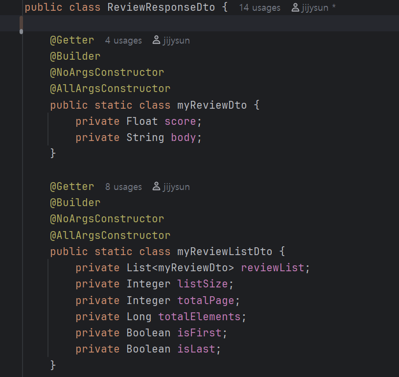

# 빈 미션 페이지

# 핵심 키워드

## Spring Data JPA의 Paging?

- Page
    - 책을 페이지로 표현하듯이, DB 에서의 데이터들도 페이지 단위로 잘라서 가져오는 것을 뜻한다.
    - 첫 번째 방법인 Page<> 가 있다.
    Page 자체에 페이징과 관련된 여러 정보가 담기게 되며 위에서 작성한 DTO에서 그 흔적을 확인할 수 있다. 
    전체 데이터 수, 전체 페이지 수, 현재 페이지 정보, 데이터 리스트 등등이 모두 포함된 결과이다. 
    또한 내부적으로 select count (*)  SQL의 자동 실행을 통해 전체 개수를 알아낼 수있다.
    - 두 번째 방법으로 PageRequest이 있다. 
    Pageable의 구현체로, 의미는 “어느 페이지” 에서 “몇 개의 데이터”를 가져올 지를 뜻한다.
    사용법은 PageRqeust.of(int 어느 페이지, int 몇 개의 데이터) 로 사용된다.
- Slice?
    - Page 와 거의 동일한 기능을 수행하나, 전체 데이터의 갯수 정보를 확인할 수 없다.
    즉, getTotalElements() 나 getTotalPages() 를 통해 갯수 확인이 불가능하다
    - JDBC의 ResultSet.hasNext() 처럼, 이에 Slice는 다음 페이지가 있는 지 정보만 확인이 가능하다.

## 객체 그래프 탐색?

- JPA는 객체지향 ORM (Object Relational Mapping) 이다. 즉 그래프 탐색은 객체 간 상속, 또는 연관 관계가 있다면 그 관계를 타고 건너가서 다른 관련된 객체를 확인 및 접근하는 기능을 뜻한다.

## 새로 등장한 개념들

- @Operation: 해당 API에 대한 설명을 넣는 어노테이션이다. summary, description에 해당 설명을 담고, swagger에서 확인할 수 있다.
- @ApiResponses: @ApiResponse로 만든 여려 형식의 응답을 한번에 담고,
- PageImpl?
    - 직접 만든 리스트를 Page 객체 처럼 감싸주는 용도이다.
    - 더 정확히는 직접 만든 리스트를 JPA를 통해 페이징 쿼리를 직접 실행하지 않고, Page 처럼 만들고자 할 때 사용한다.
    - 사용법은 다음과 같다.
    Page <Test> testPage = new PageImpl <> ( 페이징할 리스트 변수, pageable, 리스트 total 값 )

# 미션!

---

## 1. 내가 작성한 리뷰 목록

<aside>


GET /members/{memberId}/reviews?page=1

</aside>

“내가 작성한 리뷰 목록”이다. 그렇기에 요청에 필요한 데이터는 사용자에 대한 ID 와 페이징 번호이다.

이에 응답은 작성한 리뷰들이다. 리뷰의 id, 별점과 본문 내용이 필요하다. 작성자는 사용자 자신이므로 id값의 반환은 일단 생략한다. 

이를 Responsedto로 작성하자면 
(서버에서 필요한 값은 memberId와 page 번호면 충분하기에 RequestDTO는 딱히 필요하지는 않다.)

> DTO
> 



- myReviewDTO가 여러 개 생성되고, 이를 리스트로 담는 myReviewListDTO가 필요하다

> Controller
> 


- DTO를 이용하여 Controller를 먼저 구현하자면 다음과 같은 Controller가 구현된다. API 설명과 요청에 필수 값과 각 에러 응답 등을 어노테이션을 통해 Swagger 명세를 작성한다.
- 서비스 단에서는 페이징 처리되어 조회된 리뷰들을 받아오고, Converter를 통해 성공 응답에 담아 return 한다.

> Custom Annotation
> 


이 때 Controller 에서는  구현된 커스텀 어노테이션인 @ValidPage를 통해 올바른 페이지 번호인 지 검사하게 된다. 만약 0 이하의 올바르지 않은 Page 번호의 요청일 경우 에러 API를 응답한다.

```sql
WRONG_PAGE (HttpStatus.BAD_REQUEST, "PAGE4001", "올바르지 않은 페이지 번호 입니다."),
```

> Service
> 

```java
	
public interface MemberCommandService {
    Page<Review> getMyReviews (Long memberId, Integer page);
}
```

- MemberService 인터페이스를 통해 구현하고자 하는 API의 기능을 하위 Service 계층 코드에서 필수 구현하게 한다.


- 위 인터페이스를 상속받는 MemberServiceImpl에서는 넘겨 받은 값을 검증한다. Page 번호에 대한 검증은 Controller에서 커스텀 어노테이션을 통해 검증이 되었으므로, 넘거 받은 사용자의 id에 대해서만 검증을 한다.
- 만약 조회 시에 값이 빈 리스트가 반환되는 경우 예외를 발생시킨다.
- 이후 사용자의 id로 찾은 사용자 객체와 Page 번호를 JpaRepository를 통해 5개씩 페이징 조회를 한다.

> Converter
> 


Controller에서는 반환받은 값들을 Builder와 Stream이 사용된 Converter를 통해 DTO로 변환되어 사용자에게 반환된다.

- 테스트 데이터 및 SQL
    1. 사전 저장된 사용자 데이터
    
    | id | address | email | inactive\_date | name | point | spec\_address | created\_at | updated\_at | gender | social\_type | status | phone | veritify |
    | --- | --- | --- | --- | --- | --- | --- | --- | --- | --- | --- | --- | --- | --- |
    | 1 | 서울 양천구 | [jijysun@gmail.com](mailto:jijysun@gmail.com) | 2025-05-01 | 김석현 | 123 | test address | 2025-05-01 00:20:46.634339 | 2025-05-01 00:20:46.634339 | MALE | null | null | null | null |
    | 2 | 서울 양천구 | [jijysun@gmail.com](mailto:jijysun@gmail.com) | 2025-05-01 | 김석현 | 123 | test address | 2025-05-01 09:30:40.440567 | 2025-05-01 09:30:40.440567 | MALE | null | null | null | null |
    1. 사전 저장된 음식점 데이터
    
    | id | created\_at | updated\_at | address | name | score | region\_id |
    | --- | --- | --- | --- | --- | --- | --- |
    | 1 | 2025-05-02 12:37:00.000000 | 2025-05-02 12:37:00.000000 | 서울시 서대문구 이화여대길 52 | Store 1 | 4.5 | 1 |
    | 2 | 2025-05-02 12:37:00.000000 | 2025-05-02 12:37:00.000000 | 서울시 마포구 연남동 | Store 2 | 3.8 | 1 |
    | 3 | 2025-05-02 12:37:00.000000 | 2025-05-02 12:37:00.000000 | 서울시 동작구 흑석동 | Store 3 | 2.2 | 1 |
    | 4 | 2025-05-02 12:37:00.000000 | 2025-05-02 12:37:00.000000 | 서울시 용산구 이태원동 | 요아정 | 4 | 1 |
    | 5 | 2025-05-02 12:37:00.000000 | 2025-05-02 12:37:00.000000 | 서울시 서대문구 이화여대길 52 | 요아정 | 3.2 | 1 |
    | 6 | 2025-05-02 12:37:00.000000 | 2025-05-02 12:37:00.000000 | 서울시 강남구 대치동 | 요아정 | 4.5 | 1 |
    
    1. 테스트 리뷰 데이터 삽입 SQL
    
    ```sql
    insert into review (created_at, updated_at, body, score, member_id, store_id) values (now(), now(), "테스트 리뷰 1", 0.5, 1, 1);
    insert into review (created_at, updated_at, body, score, member_id, store_id) values (now(), now(), "테스트 리뷰 2", 1.5, 1, 2);
    insert into review (created_at, updated_at, body, score, member_id, store_id) values (now(), now(), "테스트 리뷰 3", 2.5, 1, 3);
    insert into review (created_at, updated_at, body, score, member_id, store_id) values (now(), now(), "테스트 리뷰 4", 3.5, 1, 4);
    insert into review (created_at, updated_at, body, score, member_id, store_id) values (now(), now(), "테스트 리뷰 5", 4.5, 1, 5);
    insert into review (created_at, updated_at, body, score, member_id, store_id) values (now(), now(), "테스트 리뷰 6", 0.1, 1, 6);
    insert into review (created_at, updated_at, body, score, member_id, store_id) values (now(), now(), "테스트 리뷰 7", 1.1, 1, 1);
    insert into review (created_at, updated_at, body, score, member_id, store_id) values (now(), now(), "테스트 리뷰 8", 2.1, 1, 2);
    insert into review (created_at, updated_at, body, score, member_id, store_id) values (now(), now(), "테스트 리뷰 9", 3.1, 1, 3);
    insert into review (created_at, updated_at, body, score, member_id, store_id) values (now(), now(), "테스트 리뷰 10", 4.1, 1, 4);
    insert into review (created_at, updated_at, body, score, member_id, store_id) values (now(), now(), "테스트 리뷰 11", 3.2, 1, 5);
    insert into review (created_at, updated_at, body, score, member_id, store_id) values (now(), now(), "테스트 리뷰 12", 2.3, 1, 6);
    ```
    

> Swagger 명세 확인 및 테스트 결과
> 


- 서버를 실행해본 결과 Controller 에서 작성한 대로 Swagger에서 올바른 명세서를 확인할 수 있었다.
- 이에 각 페이지 별 요청한 경우에도 DB에 저장된 값을 페이지로 나누어 조회하는 모습을 확인할 수 있었다.


- 현 DB 에 저장되어 있는 “사용자가 작성한 리뷰”는 총 12개임을 확인할 수 있다. 이 경우 올바르지 않은 페이지 요청인 4를 요청 시 에러 API를 반환하는 모습 또한 확인할 수 있었다.

---

## 2. 특정 가게의 미션 목록

<aside>


GET /stores/{storeId}/missions?page=1

</aside>

“특정 가게에 대한 미션을 조회하는 목록”이다. 이에 필요한 값은 가게에 대한 id 값과 page 번호이다. 

또한 가게의 미션 목록이므로,진행 가능한 미션들의 목록이며, 이 요청을 통해 사용자는 미션의 id, 내용, 보상, 마감 시간을 확인할 수 있어야 한다.

> DTO
> 

이를 ResponseDTO로 작성하자면
(서버에서 필요한 값은 storeId와 page 번호면 충분하기에 RequestDTO는 딱히 필요하지는 않다.)


- StoreMissionDTO가 여러 개 생성되면서, 이를 리스트로 담는 MissionResponseListDTO가 필요하다

> Controller
> 


- DTO를 이용하여 Controller를 먼저 구현하자면 다음과 같은 Controller가 구현된다.
- 해당 API 설명과 요청에 필수 값과 각 에러 응답 등을 어노테이션을 통해 Swagger 명세를 작성한다. 또한 커스텀 어노테이션을 통해 올바른 페이지 번호인 지 검증한다.
- 서비스 단에서는 페이징 처리되어 조회된 미션들을 받아오고, Converter를 통해 성공 응답에 담아 return 한다.

> Service
> 

```java
public interface StoreService {
    Page<Mission> getMissionList (Long storeId, Integer page);
}
```


- 이후 받은 정보를 통해 Service 계층 코드로 넘긴다. 이 때 Service 인터페이스를 통해 필요한 메소드를 작성하고, 하위 Service 코드에서 필수적으로 구현하게 한다.
- 만약 조회 시에 값이 빈 리스트가 반환되는 경우 예외를 발생시킨다.
- 위 인터페이스를 상속받은 하위 Service에서 넘겨 받은 값을 검증하면서, 넘겨 받은 id의 가게의 미션을 10개씩 페이징 조회하여 반환한다.

> Converter
> 


- 이후 반환하여, Controller에서는 반환받은 값들을 Builder와 Stream이 사용된 Converter를 통해 DTO로 변환되어 사용자에게 반환된다.

> Swagger 명세 확인 및 테스트
> 

- 테스트 데이터  및 SQL
    1. 사전 저장된 가게 데이터
    2. 테스트용 미션 데이터 SQL, 13개
    - SQL
        
        ```sql
        
        INSERT INTO mission (created_at, updated_at, dead_line, mission_spec, reward, store_id)
        VALUES (NOW(), NOW(), NOW() + INTERVAL 3 DAY, "테스트 가게1에서 미션 페이지를 확인하세요!", 800, 1);
        
        INSERT INTO mission (created_at, updated_at, dead_line, mission_spec, reward, store_id)
        VALUES (NOW(), NOW(), NOW() + INTERVAL 5 DAY, "테스트 가게1의 리뷰를 작성하세요!", 900, 1);
        
        INSERT INTO mission (created_at, updated_at, dead_line, mission_spec, reward, store_id)
        VALUES (NOW(), NOW(), NOW() + INTERVAL 7 DAY, "테스트 가게1을 찜하기 하세요!", 1000, 1);
        
        INSERT INTO mission (created_at, updated_at, dead_line, mission_spec, reward, store_id)
        VALUES (NOW(), NOW(), NOW() + INTERVAL 4 DAY, "테스트 가게1에 첫 리뷰를 남겨보세요!", 950, 1);
        
        INSERT INTO mission (created_at, updated_at, dead_line, mission_spec, reward, store_id)
        VALUES (NOW(), NOW(), NOW() + INTERVAL 6 DAY, "테스트 가게1의 상세정보를 모두 읽어보세요!", 1100, 1);
        
        INSERT INTO mission (created_at, updated_at, dead_line, mission_spec, reward, store_id)
        VALUES (NOW(), NOW(), NOW() + INTERVAL 2 DAY, "테스트 가게1의 리뷰에 사진을 1장 이상 업로드하세요!", 750, 1);
        
        INSERT INTO mission (created_at, updated_at, dead_line, mission_spec, reward, store_id)
        VALUES (NOW(), NOW(), NOW() + INTERVAL 3 DAY, "테스트 가게1의 다른 리뷰에 좋아요를 눌러보세요!", 1050, 1);
        
        INSERT INTO mission (created_at, updated_at, dead_line, mission_spec, reward, store_id)
        VALUES (NOW(), NOW(), NOW() + INTERVAL 5 DAY, "테스트 가게1 관련 알림을 설정해보세요!", 980, 1);
        
        INSERT INTO mission (created_at, updated_at, dead_line, mission_spec, reward, store_id)
        VALUES (NOW(), NOW(), NOW() + INTERVAL 8 DAY, "테스트 가게1의 태그를 추가해보세요!", 1200, 1);
        
        INSERT INTO mission (created_at, updated_at, dead_line, mission_spec, reward, store_id)
        VALUES (NOW(), NOW(), NOW() + INTERVAL 4 DAY, "테스트 가게1의 별점을 남겨보세요!", 850, 1);
        
        INSERT INTO mission (created_at, updated_at, dead_line, mission_spec, reward, store_id)
        VALUES (NOW(), NOW(), NOW() + INTERVAL 6 DAY, "테스트 가게1을 공유해보세요!", 990, 1);
        
        INSERT INTO mission (created_at, updated_at, dead_line, mission_spec, reward, store_id)
        VALUES (NOW(), NOW(), NOW() + INTERVAL 3 DAY, "테스트 가게1의 최근 소식을 확인해보세요!", 870, 1);
        
        INSERT INTO mission (created_at, updated_at, dead_line, mission_spec, reward, store_id)
        VALUES (NOW(), NOW(), NOW() + INTERVAL 7 DAY, "테스트 가게1의 리뷰 3개를 읽어보세요!", 940, 1);
        
        ```
        


- 서버를 실행해본 결과 Controller 에서 작성한 대로 Swagger에서 올바른 명세서를 확인할 수 있었다.
- 이에 각 페이지 별 요청한 경우에도 DB에 저장된 값을 페이지로 나누어 조회하는 모습을 확인할 수 있었다.


- 이에 반례로 존재하지 않는 가게의 미션을 찾거나, 페이지 번호를 넘어서는 미션 조회 시 에러 응답을 올바르게 반환하는 모습을 확인할 수 있었다.

---

## 3. 내가 진행중인 미션 목록

<aside>


GET /members/{memberId}/missions?status=challenging&page=1

</aside>

“내가 진행중인 미션 목록”이다. 이에 필요한 값은 사용자에 대한 id 값과 page 번호이다. 

또한 진행 중의 미션 목록 요청을 통해 사용자는 미션의 id, 내용, 보상, 마감 시간을 확인할 수 있어야 한다.

이를 ResponseDTO로 작성하자면
(서버에서 필요한 값은 storeId와 page 번호면 충분하기에 RequestDTO는 딱히 필요하지는 않다.)

> DTO
> 


- ChallengingMissionResponseDTO가 여러 개 생성되면서, 이를 리스트로 담는 ChallengingMissionResponseListDTO가 필요하다

> Controller
> 


- DTO를 이용하여 Controller를 구현하였으며, 해당 API 설명과 요청에 필수 값과 각 에러 응답 등을 어노테이션을 통해 Swagger 명세를 작성한다.
- 또한 커스텀 어노테이션을 통해 올바른 페이지 번호인 지 검증한다.
- 서비스 단에서는 페이징 처리되어 조회된 리뷰들을 받아오고, Converter를 통해 성공 응답에 담아 return 한다.

> Service
> 

```java
public interface MemberCommandService {
    Page<Mission> getChallengingMissions (Long memberId,  Integer page);
}
```


- 먼저 인터페이스에 해당 메소드를 작성하여 하위 서비스 코드에서 필수적으로 구현하게 만들어준다.
- 이후 서비스에서 이를 구현한다. 페이징은 조회 시 정확히 한 번만 이루어져야 한다. 그렇기에 조회 시 PageRequest 객체를 만들어 주는 것이 아닌, 사전에 PageReuest 객체를 만들어주어 조회 마다 해당 객체를 넘겨준다.
- 만약 조회 시에 값이 빈 리스트가 반환되는 경우 예외를 발생시킨다.
- 이후 Stream을 이용하여 반환 받은 mission들에 대해 id 값을 추출하고, Repository 에 접근하여 해당 mission들을 조회한다
- 마지막으로 Controller 에서는 Page <Mission>을 리턴 받게 구현했으므로, 해당 mission 객체들을 Page 객체로 감싸 반환한다.

> Converter
> 


- 이후 반환하여, Controller에서는 반환받은 값들을 Builder와 Stream이 사용된 Converter를 통해 DTO로 변환되어 사용자에게 반환된다.

> Swagger 명세 확인 및 테스트
> 
- 테스트 데이터 및 SQL
    1. 사전 저장된 미션 데이터
        - 2번 미션의 테스트 SQL로 삽입하였던 미션을 그대로 사용하였습니다.
        - 테스트 미션 데이터 및 SQL
            
            ```sql
            
            INSERT INTO mission (created_at, updated_at, dead_line, mission_spec, reward, store_id)
            VALUES (NOW(), NOW(), NOW() + INTERVAL 3 DAY, "테스트 가게1에서 미션 페이지를 확인하세요!", 800, 1);
            
            INSERT INTO mission (created_at, updated_at, dead_line, mission_spec, reward, store_id)
            VALUES (NOW(), NOW(), NOW() + INTERVAL 5 DAY, "테스트 가게1의 리뷰를 작성하세요!", 900, 1);
            
            INSERT INTO mission (created_at, updated_at, dead_line, mission_spec, reward, store_id)
            VALUES (NOW(), NOW(), NOW() + INTERVAL 7 DAY, "테스트 가게1을 찜하기 하세요!", 1000, 1);
            
            INSERT INTO mission (created_at, updated_at, dead_line, mission_spec, reward, store_id)
            VALUES (NOW(), NOW(), NOW() + INTERVAL 4 DAY, "테스트 가게1에 첫 리뷰를 남겨보세요!", 950, 1);
            
            INSERT INTO mission (created_at, updated_at, dead_line, mission_spec, reward, store_id)
            VALUES (NOW(), NOW(), NOW() + INTERVAL 6 DAY, "테스트 가게1의 상세정보를 모두 읽어보세요!", 1100, 1);
            
            INSERT INTO mission (created_at, updated_at, dead_line, mission_spec, reward, store_id)
            VALUES (NOW(), NOW(), NOW() + INTERVAL 2 DAY, "테스트 가게1의 리뷰에 사진을 1장 이상 업로드하세요!", 750, 1);
            
            INSERT INTO mission (created_at, updated_at, dead_line, mission_spec, reward, store_id)
            VALUES (NOW(), NOW(), NOW() + INTERVAL 3 DAY, "테스트 가게1의 다른 리뷰에 좋아요를 눌러보세요!", 1050, 1);
            
            INSERT INTO mission (created_at, updated_at, dead_line, mission_spec, reward, store_id)
            VALUES (NOW(), NOW(), NOW() + INTERVAL 5 DAY, "테스트 가게1 관련 알림을 설정해보세요!", 980, 1);
            
            INSERT INTO mission (created_at, updated_at, dead_line, mission_spec, reward, store_id)
            VALUES (NOW(), NOW(), NOW() + INTERVAL 8 DAY, "테스트 가게1의 태그를 추가해보세요!", 1200, 1);
            
            INSERT INTO mission (created_at, updated_at, dead_line, mission_spec, reward, store_id)
            VALUES (NOW(), NOW(), NOW() + INTERVAL 4 DAY, "테스트 가게1의 별점을 남겨보세요!", 850, 1);
            
            INSERT INTO mission (created_at, updated_at, dead_line, mission_spec, reward, store_id)
            VALUES (NOW(), NOW(), NOW() + INTERVAL 6 DAY, "테스트 가게1을 공유해보세요!", 990, 1);
            
            INSERT INTO mission (created_at, updated_at, dead_line, mission_spec, reward, store_id)
            VALUES (NOW(), NOW(), NOW() + INTERVAL 3 DAY, "테스트 가게1의 최근 소식을 확인해보세요!", 870, 1);
            
            INSERT INTO mission (created_at, updated_at, dead_line, mission_spec, reward, store_id)
            VALUES (NOW(), NOW(), NOW() + INTERVAL 7 DAY, "테스트 가게1의 리뷰 3개를 읽어보세요!", 940, 1);
            
            ```
            
            
            
    
    1. 테스트 member_mission 데이터 SQL, 13개
        - 테스트 member 데이터
            
            
            
        - 테스트 member_mission 데이터 SQL
            
            기존에 존재하던 mission에 대해 모두 도전하도록 member_mission에 삽입하였습니다.
            
            
            
            ```sql
            insert into member_mission (created_at, updated_at, status, member_id, mission_id) VALUES (now(), now(), "CHALLENGING", 1, 1);
            insert into member_mission (created_at, updated_at, status, member_id, mission_id) VALUES (now(), now(), "CHALLENGING", 1, 2);
            insert into member_mission (created_at, updated_at, status, member_id, mission_id) VALUES (now(), now(), "CHALLENGING", 1, 3);
            insert into member_mission (created_at, updated_at, status, member_id, mission_id) VALUES (now(), now(), "CHALLENGING", 1, 8);
            insert into member_mission (created_at, updated_at, status, member_id, mission_id) VALUES (now(), now(), "CHALLENGING", 1, 9);
            insert into member_mission (created_at, updated_at, status, member_id, mission_id) VALUES (now(), now(), "CHALLENGING", 1, 10);
            insert into member_mission (created_at, updated_at, status, member_id, mission_id) VALUES (now(), now(), "CHALLENGING", 1, 11);
            insert into member_mission (created_at, updated_at, status, member_id, mission_id) VALUES (now(), now(), "CHALLENGING", 1, 12);
            insert into member_mission (created_at, updated_at, status, member_id, mission_id) VALUES (now(), now(), "CHALLENGING", 1, 13);
            insert into member_mission (created_at, updated_at, status, member_id, mission_id) VALUES (now(), now(), "CHALLENGING", 1, 14);
            insert into member_mission (created_at, updated_at, status, member_id, mission_id) VALUES (now(), now(), "CHALLENGING", 1, 15);
            insert into member_mission (created_at, updated_at, status, member_id, mission_id) VALUES (now(), now(), "CHALLENGING", 1, 16);
            insert into member_mission (created_at, updated_at, status, member_id, mission_id) VALUES (now(), now(), "CHALLENGING", 1, 17);
            insert into member_mission (created_at, updated_at, status, member_id, mission_id) VALUES (now(), now(), "CHALLENGING", 1, 18);
            insert into member_mission (created_at, updated_at, status, member_id, mission_id) VALUES (now(), now(), "CHALLENGING", 1, 19);
            insert into member_mission (created_at, updated_at, status, member_id, mission_id) VALUES (now(), now(), "CHALLENGING", 1, 20);
            
            ```
            
            
            
            결과
            


- 서버를 실행해본 결과 Controller 에서 작성한 대로 Swagger에서 올바른 명세서를 확인할 수 있었다.
- 이에 각 페이지 별 요청한 경우에도 DB에 저장된 값을 페이지로 나누어 사용자가 진행 중인 미션을 조회하는 모습을 확인할 수 있었다.


- 이에 총 데이터 갯수 15개가 넘는 페이지 조회 시 에러 응답을 반환하는 모습을 확인할 수 있었다.

---

## 4. 진행중인 미션 진행 완료로 바꾸기

<aside>


POST /members/{memberId}/missions/{missionId}/complete

</aside>

사용자는 기존에 조회했던 미션 리스트에서 특정 미션을 완료 상태로 전환하기 위해 이 API를 호출 한다.

이를 위해선 요청으로는 PathVariable로 memberId, missionId가 필요하다. 

서버는 이 요청을 받을 경우 해당 missionId를 통해 member_mission 테이블에서 값을 찾아 진행 중인 값을 완료로 변경한다. 그렇기에 별도의 RequestBody나 page 번호가 필요하지 않다.

또한 서비스 상황 상 사용자가 진행 중인 미션을 완료 요청 처리를 함과 동시에 서버는 이를 수락하는 검증 로직이 추가하는 것이 요구된다.

하지만 협의를 하지 않고 미션을 수행한다는 점에 있어 다음과 같은 의문점이 발생하였다.

1. member_mission의 status의 값을 바꾸어 사용자의 요청을 처리한다?
    - 이는 사용자가 **같은 미션은 여러 번 수행할 수 없다**라는 가정이 전제되어있다.
    - 처리 과정은 setter 메소드가 아닌, @Transactional 과 생성자를 통해 값을 수정한다.
    - 이후 사용자는 member_mission의 id 값으로, 완료했던 중복 없는 미션을 조회할 수 있다.
2. member_mission에 새로운 데이터를 저장하여 사용자의 요청을 처리한다.?
    - 이는 사용자가 **같은 미션은 여러 번 수행할 수 있다**라는 가정이 전제되어있다.
    - 처리 과정은 새로운 member_mission 데이터를 만들어 DB에 저장한다.
    - 이후 사용자는 member_mission의 id 값으로 완료했던 중복 가능한 미션을 조회할 수 있다.

두 과정 모두 사용자에게는 완료 요청한 미션의 정보를 반환한다는 공통점이 있기에, 수정은 간단하므로 둘 다 구현해보기로 결정하였다. 

> DTO
> 


- 간단히 dto는 완료한 미션과, 완료한 미션의 수를 반환하여 사용자에게 응답한다.

> Controller
> 


- DTO를 이용하여 Controller를 구현하였으며, 해당 API 설명과 요청에 필수 값과 각 에러 응답 등을 어노테이션을 통해 Swagger 명세를 작성한다.
- 또한 커스텀 어노테이션을 통해 올바른 페이지 번호인 지 검증한다.
- 서비스 단에서는 요청된 미션에 대한 정보를 받아오고, Converter를 통해 성공 응답에 담아 return 한다.

> Service
> 


- Controller 에서 전달 받은 memberId, memberMissionId 에 대해 각각 필요한 Member, Mission을 DB에서 조회한다.
- ver1 이 위에서 언급한 1번의 과정을, ver2 가 2번의 과정을 표현하였다.
    - member_mission의 status의 값을 바꾸어 사용자의 요청을 처리하는 경우 변경 상태를 감지해야 하므로 해당 메소드에 대해서는 @Transactional이 필요하다.
    - 또한 해당 엔티티의 상태를 변경하는 메소드가 추가로 구현되어야 한다.
        
        
        
    - 또한 updated_at 또한 수정해주어야 하나, BaseEntity의 updated_at에는 @LastModifiedDate 어노테이션이 있어, 자동으로 감지되므로 따로 수정할 필요는 없다.
    - 주의할 점은 @SpringBootApplication 이 붙은 Main 클래스에 @EnableJpaAuditing 어노테이션이 추가로 붙어야 한다는 점이다.
        
        
        
- ver2, 2번의 과정의 경우 수정할 일 없이 member_mission 테이블에 새로 값을 저장하면 된다.
- 이후 사용자에게 응답하기 위한 데이터로 해당 member, 진행 완료 한 값을 기반으로 member_mission에서 counting 한다.
- 마지막으로 Converter를 통해 DTO를 만들고, Controller에게 이를 전달하여 사용자에게 응답한다.

> Converter
> 


- 해당 Converter는 완료한 미션의 id, 내용, 보상 등의 각 내용과 사용자가 완료한 미션 갯수를 담는 DTO를 만들어주는 역할을 한다.

> Swagger 명세 확인 및 테스트
> 


- Controller에서 작성한 대로, Swagger 명세서를 확인할 수 있었다.


- Swagger 를 통해 사용자의 id 와 진행 중인 미션, memberMission의 id 를 넘긴다.

- 기존 member_mission 테이블
    
    
    


- 결과로써 진행 중이던 미션의 status 가 COMPLTED 로 변경된 것, 사용자가 진행 완료한 미션의 갯수를 터미널과 Swagger를 통해 확인할 수 있었다.