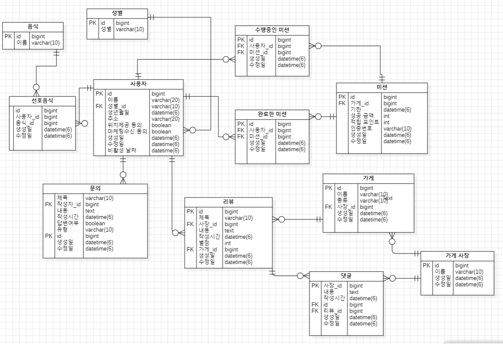

# 🎯 핵심 키워드

---

<aside>
💡 주요 내용들에 대해 조사해보고, 자신만의 생각을 통해 정리해보세요!
레퍼런스를 참고하여 정의, 속성, 장단점 등을 적어주셔도 됩니다.
조사는 공식 홈페이지 **Best**, 블로그(최신 날짜) **Not Bad**

</aside>

이번 주차는 키워드가 딱히 없습니다!

원하실 경우 join연산에 대해 더 알아보는 정도면 될 것 같습니다.

## 📢 학습 후기

---

- 이번 주차 워크북을 해결해보면서 어땠는지 회고해봅시다.
- 핵심 키워드에 대해 완벽하게 이해했는지? 혹시 이해가 안 되는 부분은 뭐였는지?

<aside>
💡  페이징 쿼리가 너무 복잡하다…cursor_value가 어렵다

</aside>

 좋아요 개수 순으로 목록 조회하는 쿼리에서 오타가 있다. book_id가 빠진거같다.

 select * from book as b 
join (select **book_id,** count(*) as like_count
				 from book_likes
						group by book_id) as likes on b.id = likes.book_id
order by likes.like_count desc;

## ⚠️ 스터디 진행 방법

---

1. 스터디를 진행하기 전, 워크북 내용들을 모두 채우고 스터디에서는 서로 모르는 내용들을 공유해주세요.
2. 미션은 워크북 내용들을 모두 완료하고 나서 스터디 전/후로 진행해보세요.
3. 다음주 스터디를 진행하기 전, 지난주 미션을 서로 공유해서 상호 피드백을 진행하시면 됩니다.

## ✅ 실습 체크리스트

---

실습은 따로 없었습니다

## ☑️ 실습 인증

---

실습이 없었습니다

## 🔥 미션

---

1. 1주차 때 설계한 데이터베이스를 토대로 아래의 화면에 대한 쿼리를 작성

내가 진행중, 진행 완료한 미션 모아서 보는 쿼리(페이징 포함)

리뷰 작성하는 쿼리,
* 사진의 경우는 일단 배제

홈 화면 쿼리
(현재 선택 된 지역에서 도전이 가능한 미션 목록, 페이징 포함)

마이 페이지 화면 쿼리

**< 시니어 미션 >**

[시니어 미션](https://www.notion.so/1b7b57f4596b81358841c31e193e4e85?pvs=21)

## 💪 미션 기록 (여기에 해도 되고 위의 미션에서 각 페이지 밑에 간단하게 블록 만들어서 하셔도 됩니다!)

---

<aside>
🍀 미션 기록의 경우, 아래 미션 기록 토글 속에 작성하시거나, 페이지를 새로 생성하여 해당 페이지에 기록하여도 좋습니다!

하지만, 결과물만 올리는 것이 아닌, **중간 과정 모두 기록하셔야 한다는 점!** 잊지 말아주세요.

</aside>

- **미션 기록**
    
    
    

(가게 : 미션 = 1 :  N관계를 그림에서 빼먹었습니다)

진행 중인 미션 보는 쿼리(페이징 포함)

필요한 데이터는 사용자가 진행 중인 미션의 가게 이름, 성공 금액, 적립 포인트이다.

 1.  수행중인 미션 테이블과 미션 테이블을 join한다. 조인 조건은 수행중인 [미션.](http://미션.id)미션_id = 미션.id이다. 2의 결과를 2번 테이블이라 하자.

1. 2의 테이블과 가게 테이블을 join한다. 조인 조건은 미션.가게_id = 가게.id이다.
2. 사용자_id가 1인 행만 추출한다.
3. 가게이름, 성공금액, 적립 포인트 열을 추출한다.

select 가게.이름, 미션.성공금액, 미션.적립포인트

from 수행중인_미션 

join 미션 on 수행중인_[미션.](http://미션.id)미션_id = [미션.id](http://미션.id) 

join 가게 on 미션.가게_id = 가게.id

where 사용자_id = 1;

1. 수행중인 미션의 생성일과 id값으로 cursor_value를 생성한다. 최근에 생성한 미션이 맨 위에 오도록, 4개씩 페이징한다.

select 가게.이름, 미션.성공금액, 미션.적립포인트, CONCAT(LPAD(수행중인_미션.생성일, 10, '0'), LPAD(수행중인_미션.id, 10, '0')) AS cursor_value

from 수행중인_미션 

join 미션 on 수행중인_[미션.](http://미션.id)미션_id = [미션.id](http://미션.id) 

join 가게 on 미션.가게_id = 가게.id

where 사용자_id = 1 and CONCAT(LPAD(수행중인_미션.생성일, 10, '0'), LPAD(수행중인_미션.id, 10, '0'))< 
      (SELECT CONCAT(LPAD(수행중인_미션.생성일, 10, '0'), LPAD(수행중인_미션.id, 10, '0'))
       FROM 수행중인_미션

WHERE 수행중인_미션.사용자_id = 1

 ORDER BY 수행중인_미션.생성일 DESC, 수행중인_미션.id DESC

LIMIT 1)

ORDER BY 수행중인_미션.생성일 DESC, 수행중인_미션.id DESC

LIMIT 4;

리뷰 작성 쿼리

가게의 id값으로 해당 가게에 작성된 모든 리뷰를 조회한다. 리뷰를 작성한 사용자의 닉네임, 별점, 내용, 작성시간이 필요하다.

1. 리뷰, 사용자 조인 
2. 가게의 id값이 일치하는 행 추출
3. 사용자.이름, 리뷰.별점, 리뷰,내용, 리뷰.작성시간 열 추출

select 사용자.이름, 리뷰.별점, 리뷰.내용, 리뷰.작성시간, 

             concat(lpad(리뷰.기한, 10, ‘0’), lpad(리뷰.id,10,’0’)) as cursor_value

from 리뷰

join 사용자 on 리뷰.사용자_id = 사용자.id

where 리뷰.가게_id = 1 and

             concat(lpad(리뷰.기한, 10, ‘0’), lpad(리뷰.id,10,’0’)) >

     (select concat(lpad(리뷰.기한, 10, ‘0’), lpad(리뷰.id,10,’0’)) 

      from 리뷰  as 리뷰2

      where 리뷰2.사용자_id = 사용자.id

order by 리뷰2.기한 asc, 리뷰[2.id](http://미션2.id) asc

limit 1)

order by 리뷰.기한 asc, 리뷰[.id](http://미션.id) asc

limit 3;

(지역 테이블을 추가했습니다.)

현재 선택된 지역에서 도전 가능한 미션목록(페이징 포함)

이름이 안암동인 데이터를 조회한다고 하자

1. 가게이름, 성공 금액, 적립 포인트,  기한 데이터가 필요하다.
2. 미션과 지역을 join 한다. 조건은 미션. 지역_id = 지역.id이다.
3. 2의 테이블과 가게를 join한다. 조건은 [미션.](http://미션.id)가게_id = [가게.id](http://가게.id) 이다.
4. 지역.id값이  1인 모든 행을 추출한다.
5. 가게.이름, 성공 금액, 적립 포인트, 기한 열을 추출한다.
6. 가게.기한과 [가게.id](http://가게.id) 값으로 cursor_value를 생성한다. 기한이 빠른 순으로 데이터가 조회되며, 3개씩 페이징하도록 한다.

select 가게.이름, 미션.성공 금액, 미션.적립 포인트, 미션.기한,CONCAT(LPAD(미션.기한, 10, '0'), LPAD([미션.id](http://xn--hg3bi2h.id/), 10, '0')) AS cursor_value

from 미션 join 지역 on 미션. 지역_id = 지역.id

join 가게 on  [미션.](http://미션.id)가게_id = [가게.id](http://가게.id) 

where [지역.](http://지역.id)이름=”안암동”;

    and concat(lpad(미션.기한, 10, ‘0’), lpad(미션.id,10,’0’)) <

     (select concat(lpad(미션.기한, 10, ‘0’), lpad(미션.id,10,’0’)) 

       from 미션2

       where 미션2.지역 = 미션.지역_id

order by 미션2.기한 asc, [미션2.id](http://미션2.id) asc

limit 1)

order by 미션.기한 asc, [미션.id](http://미션.id) asc

limit 3;

(이메일과 휴대폰 번호를 추가했다)

마이페이지 화면 쿼리 

사용자의 id값으로 사용자의 이름, 이메일, 휴대폰 번호, 포인트를 조회하는 쿼리이다.

사용자 테이블의 휴대폰번호는 인증하지 않았으면 “미인증” 문자열을, 인증했으면 휴대폰 번호를 저장한다. 사용자의 id값이 1인 사용자의 데이터를 조회한다고 하자.

1. 사용자와 완료한 미션, 미션 테이블을 join한다. 
2. 사용자의 id, 이름, 이메일, 휴대폰번호로 그룹화한다.
3. 이름, 이메일, 휴대폰번호, sum(적립포인트) 열을 추출한다.

select 사용자.이름, 사용자.이메일, 사용자.휴대폰번호, sum(미션.적립포인트) as 내포인트

from 사용자 join 완료한미션 on 완료한미션.[사용자_id](http://사용자.id) = 사용자.id

           join 미션 on 완료한미션.미션_id = 미션.id

where [사용자.id](http://사용자.id) =  1 

group by [사용자.id](http://xn--vf4bo3i2ta.id/), 사용자.이름, 사용자.이메일, 사용자.휴대폰번호;

## ⚡ 트러블 슈팅

---

<aside>
💡 실습하면서 생긴 문제들에 대해서, **이슈 - 문제 - 해결** 순서로 작성해주세요.

</aside>

<aside>
💡 스스로 해결하기 어렵다면? 스터디원들에게 도움을 요청하거나 **너디너리의 지식IN 채널에 질문**해보세요!

</aside>

- ⚡이슈 작성 예시 (이슈가 생기면 아래를 복사해서 No.1, No.2, No3 … 으로 작성해서 트러블 슈팅을 꼭 해보세요!)
    
    **`이슈`**
    
    👉 앱 실행 중에 노래 다음 버튼을 누르니까 앱이 종료되었다.
    
    **`문제`**
    
    👉 노래클래스의 데이터리스트의 Size를 넘어서 NullPointException이 발생하여 앱이 종료된 것이었다. 
    
    **`해결`**
    
    👉  노래 다음 버튼을 눌렀을 때 데이터리스트의 Size를 검사해 Size보다 넘어가려고 하면 다음으로 넘어가는 메서드를 실행시키지 않고, 첫 노래로 돌아가게끔 해결
    
    **`참고레퍼런스`**
    
    - 링크
- ⚡이슈 No.1
    
    **`이슈`**
    
    👉 [트러블이 생긴 상태 작성]
    
    cursor_value로 특정 순서로 조회하는 쿼리를 작성하지 못했다.
    
    **`문제`**
    
    👉 [어떤 이유로 해당 이슈가 일어났는지 작성]
    
     CONCAT(LPAD(likes.like_count, 10, '0'), LPAD(b.id, 10, '0')) < 
          (SELECT CONCAT(LPAD(like_count_sub.like_count, 10, '0'), LPAD(like_count_sub.book_id, 10, '0'))
           FROM (SELECT book_id, COUNT(*) AS like_count
                 FROM book_likes
                 GROUP BY book_id) AS like_count_sub
           WHERE like_count_sub.book_id = 3) 이 부분을 제대로 이해하지 못했기 때문이다.
    
    **`해결`**
    
    👉  [해결 방법 작성]
    
    참고자료의 블로그 내용을 공부하고 chatgpt한테 물어봤다.
    
    **`참고레퍼런스`**
    
    - [문제 해결 시 참고한 링크]
    - [https://velog.io/@minsangk/커서-기반-페이지네이션-Cursor-based-Pagination-구현하기](https://velog.io/@minsangk/%EC%BB%A4%EC%84%9C-%EA%B8%B0%EB%B0%98-%ED%8E%98%EC%9D%B4%EC%A7%80%EB%84%A4%EC%9D%B4%EC%85%98-Cursor-based-Pagination-%EA%B5%AC%ED%98%84%ED%95%98%EA%B8%B0)

## 🤔 참고 자료

[2주차](2%E1%84%8C%E1%85%AE%E1%84%8E%E1%85%A1%201b7b57f4596b8197bb68d69dcb3ede78.csv)

---

Copyright © 2023 최용욱(똘이) All rights reserved.

Copyright © 2024, 2025 제이미(김준환) All rights reserved.