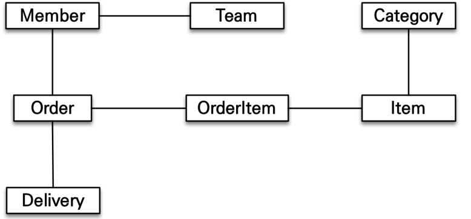

# 🎯핵심 키워드

---

<aside>
💡 주요 내용들에 대해 조사해보고, 자신만의 생각을 통해 정리해보세요!
레퍼런스를 참고하여 정의, 속성, 장단점 등을 적어주셔도 됩니다.
조사는 공식 홈페이지 **Best**, 블로그(최신 날짜) **Not Bad**

</aside>

**이번 주차는 핵심 키워드를 무조건 100% 다 조사 해야 하며 자세히 조사 할 것을 권고 드립니다.**

- Spring Data JPA의 Paging
    - Page
        
        spring data jpa는 쿼리 메소드에 페이징 기능을 사용할 수 있도록 특별한 파라미터를 제공한다.
        
        org.springframework.data.domain.Pageable: 페이징 기능
        
        파라미터에 Pageable을 사용하면 반환타입으로 List나 org.springframework.data.domain.Page를 사용할 수 있다. 
        
        ```java
        //count 쿼리 사용
        Page<Member> findByName(String name, Pageable pageable);
        //count 쿼리 사용 안함
        List<Member> findByName(String name, Pageable pageable);
        ```
        
        반환타입으로 Page를 사용하면 페이징 기능을 제공하기 위해 검색된 전체 데이터 건수를 조회하는 count 쿼리를 추가로 호출한다.
        
        다음 조건으로 페이징과 정렬을 사용하는 예제 코드는 다음과 같다.
        
        - 검색: 이름이 김으로 시작하는 회원
        - 정렬: 이름으로 내림차순
        - 페이징: 첫번째 페이지, 페이지당 보여줄 데이터는 10건
        
        ```java
        //리포지토리 정의
        public interface MemberRepository extends Repository<Member,Long> {
        Page<Member> findByNameStartingWith(String name, Pageable pageable);
        }
        ```
        
        두 번째 파라미터 Pagable은 인터페이스이다. 따라서 실제 사용할 때는 해당 인터페이스를 구현한
        
         org.springframework.data.domain.PageRequest 객체를 사용한다.
        
        PageRequest 생성자의 첫번째 파라미터는 현재 페이지, 두번째 파라미터는 조회할 데이터 수이다. 추가로 정렬 정보도 파라미터로 사용할 수 있다. 참고로 페이지는 0부터 시작한다. 
        
        ```java
        //페이징 조건과 정렬 조건 설정
        PageRequest pageRequest = new PageRequest(0, 10, new Sort(Direction.DESC,"name"));
        Page<Member> result = memberRepository.findByNameStartingWith("김",pageRequest);
        
        List<Member> members = result.getContent();//조회된 데이터
        int totalPages = result.getTotalPages(); //전체 페이지수
        boolean hasNextPage = result.hasNextPage(); //다음 페이지 존재 여부
        
        ```
        
    - Slice
        
        Page 인터페이스는 다양한 메소드를 제공한다.
        
        ```java
        public interface Page<T> extends Slice<T> {
            static <T> Page<T> empty() {
                return empty(Pageable.unpaged());
            }
        
            static <T> Page<T> empty(Pageable pageable) {
                return new PageImpl(Collections.emptyList(), pageable, 0L);
            }
        
            int getTotalPages();
        
            long getTotalElements();
        
            <U> Page<U> map(Function<? super T, ? extends U> converter);
        }
        //ㅡㅡㅡㅡㅡㅡㅡㅡㅡㅡㅡㅡㅡㅡㅡㅡㅡㅡㅡㅡㅡㅡㅡㅡㅡㅡㅡㅡㅡㅡㅡㅡㅡㅡㅡㅡㅡ
        public interface Slice<T> extends Streamable<T> {
            int getNumber();//현재 페이지
        
            int getSize();//페이지 크기
        
            int getNumberOfElements(); //현재 페이지에 나올 데이터 수
        
            List<T> getContent(); //조회된 데이터
        
            boolean hasContent(); //조회된 데이터 존재 여부
        
            Sort getSort(); //정렬 정보
        
            boolean isFirst(); //현재 페이지가 첫번째 페이지인가?
        
            boolean isLast(); //현재 페이지가 마지막 페이지인가?
        
            boolean hasNext(); //다음 페이지가 있는가?
        
            boolean hasPrevious(); //이전 페이지가 있는가?
        
            default Pageable getPageable() {
                return PageRequest.of(this.getNumber(), this.getSize(), this.getSort());
            }
        
            Pageable nextPageable(); //다음 페이지 객체, 없으면 null
        
            Pageable previousPageable(); //이전 페이지 객체, 없으면 null
        
            <U> Slice<U> map(Function<? super T, ? extends U> converter);
        
            default Pageable nextOrLastPageable() {
                return this.hasNext() ? this.nextPageable() : this.getPageable();
            }
        
            default Pageable previousOrFirstPageable() {
                return this.hasPrevious() ? this.previousPageable() : this.getPageable();
            }
        }
        
        ```
        
- 객체 그래프 탐색
    
    객체에서 회원이 소속된 팀을 조회할 때는 다음처럼 참조를 사용해서 연관된 팀을 찾는데, 이것을 그래프 탐색이라 한다.
    
    ```java
    Team team = member.getTeam();
    ```
    
    객체 연관관계가 다음과 같이 설계되어 있다고 해보자.
    
    
    
    다음은 객체 그래프를 탐색하는 코드이다.
    
    ```java
    member.getOrder().getOrderItemIO . . .
    ```
    
    객체는 마음껏 객체 그래프를 탐색할 수 있어야 한다. 그런데 db에서 이것이 가능할까?
    
    ```sql
    SELECT M.*, T.*
    FROM MEMBER M
    JOIN TEAM T ON M.TEAM_ID = T.TEAM_ID
    ```
    
    MemberDAO에서 member 객체를 조회할 때 위의 sql을 실행해서 회원과 팀의 데이터를 조회했다면 member.getTeam()은 성공하지만 다른 객체 그래프는 데이터가 없으므로 탐색할 수 없다. 
    
    ```java
    member.getTeam(); //OK
    member.getOrder(); //null
    ```
    
    sql은 처음 실행하는 sql쿼리에 따라서 객체 그래프를 어디까지 탐색할 수 있는지가 정해진다. 비즈니스 로직에 따라 사용하는 객체 그래프가 다르기 때문이다.
    
    ```java
    class MemberService {
    ...
    public void process() {
    Member member = memberDAO.find(memberId);
    member.getTeam(); //???
    member.getOrder().getDelivery(); // ???
    }
    }
    ```
    
    Memberservice에서 memberDTO를 통해 member 객체를 조회했으나 이 객체와 연관된 Team, Order, Delivery 방향으로 객체 그래프를 탐색할 수 있을지는  알 수 없다. 결국 데이터 접근 계층인 dao를 열어서 sql을 직접 확인해야 한다. 
    
    이를 해결하려면 MemberDAO에 회원을 조회하는 메소드를 상황에 따라 여러개 만들어서 사용해야 한다.
    
    ```java
    memberDAO.getMember(); //Member만 조회
    memberDAO.getMemberWithTeam();//Member와 Team 조회
    //Member,Order,Delivery 조회
    memberDAO.getMemberWithOrderWithDelivery();
    ```
    
    jpa에서는 이 문제를 어떻게 해결할까?
    
    **jpa를 이용한 그래프 탐색**
    
    jpa를 사용하면 객체 그래프를 마음껏 탐색할 수 있다.
    
    ```java
    member.getOrder().getOrderItem()...
    ```
    
    jpa는 연관된 객체를 사용하는 시점에 select문을 실행한다. 이 기능은 실제 객체를 사용하는 시점까지 db 조회를 미룬다고 해서 지연로딩이라 한다.
    
    ```java
    //처음 조회 시점에 select member sql 실행
    Member member = jpa.find(Member.class, memberId);
    Order order = member.getOrder();
    order.getOrderDate(); //Order을 사용하는 시점에 select order sql 실행
    ```
    
    member을 사용할 때마다 order을 함께 사용한다면 지연 로딩보다는 member을 조회하는 시점에 sql 조인을 사용하여 member과 order을 함께 조회하는 것이 효과적이다. 이를 즉시 로딩이라 한다.
    
    jpa에서는 연관된 객체를 즉시 로딩으로 조회할지 아니면 실제 사용 시점에 지연 로딩으로 조회할 지를 간단하게 설정할 수 있다. 즉시 로딩으로 설정하면 jpa는 member을 조회할 때 다음 sql을 실행해서 연관된 order도 함께 조회한다.
    
    ```sql
    SELECT M.**, O.**
    FROM MEMBER M
    JOIN ORDER O ON M.MEMBER_ID = O.MEMBER_ID
    ```
    

# 📢 학습 후기

---

- 이번 주차 워크북을 해결해보면서 어땠는지 회고해봅시다.
- 핵심 키워드에 대해 완벽하게 이해했는지? 혹시 이해가 안 되는 부분은 뭐였는지?

<aside>
💡

</aside>

# ⚠️ 스터디 진행 방법

---

1. 스터디를 진행하기 전, 워크북 내용들을 모두 채우고 스터디에서는 서로 모르는 내용들을 공유해주세요.
2. 미션은 워크북 내용들을 모두 완료하고 나서 스터디 전/후로 진행해보세요.
3. 다음주 스터디를 진행하기 전, 지난주 미션을 서로 공유해서 상호 피드백을 진행하시면 됩니다.

# 🔥 미션

---

### [UMC 서버 워크북 참고 자료](https://github.com/CYY1007/UMC_SERVER_WORKBOOK.git)

[GitHub - chock-cho/UMC-7th-spring-workbook at feature-week9-workbook](https://github.com/chock-cho/UMC-7th-spring-workbook/tree/feature-week9-workbook)

---

아래의 API를 구현해야 하며, 추가 조건을 무조건 포함해서 구현을 해야 함.

4개 중 3개 이상의 API를 구현해야 하며 그 이하(0개~2개 구현)는 **원 아웃** 부여.

**2개 이상을 구현 했다고 해도, 추가 조건을 모두 만족하지 않을 경우 구현하지 않은 것으로 판단함.**

**핵심 키워드를 하나라도 조사를 하지 않을 시 역시 원 아웃 부여.**

**구현이 필요한 API 목록**

1. 내가 작성한 리뷰 목록
    - 참고 화면
        
        
        
2. 특정 가게의 미션 목록
3. 내가 진행중인 미션 목록
4. 진행중인 미션 진행 완료로 바꾸기
    - 참고 화면
        
        
        

**API 구현 조건**

1. 반드시 Paging처리를 할 것, 한 페이지에 10개씩 조회 **프론트엔드는 1 이상의 page 번호를 전달**
2. 필요한 데이터는 데이터베이스에서 직접 삽입을 해서 진행 (미션 외 API는 구현해도 됨) 
    1. 다만 미션 외 API는 작성을 해도 구현한 API 갯수로 카운트가 되지 않음
3. 프론트엔드가 주는 page는 쿼리 스트링으로 받아오며 이에 대한 처리를 하는 커스텀 어노테이션 구현을 반드시 할 것 
    1. 1번의 page 범위에 따라 커스텀 어노테이션은 page 1을 0으로 만들어 return 해야 한다.
    2. 그와 동시에 page의 범위가 너무 작은지 (0 이하) 판단을 하여 작은 경우 에러를 발생
    3. 에러 발생 시 반드시 RestControllerAdvice와 연계를 해야 함
4. 반드시 모든 API에 대해 Swagger 명세를 해야 한다. 
5. Converter에서 절대로 for문을 사용해서는 안되며, 무조건 Java의 Stream을 사용해야 한다.
6. 무조건 빌더 패턴을 사용해야 한다.
7. API 구현

# 💪 미션 기록

---

<aside>
🍀 미션 기록의 경우, 아래 미션 기록 토글 속에 작성하시거나, 페이지를 새로 생성하여 해당 페이지에 기록하여도 좋습니다!

하지만, 결과물만 올리는 것이 아닌, **중간 과정 모두 기록하셔야 한다는 점!** 잊지 말아주세요.

</aside>

- **미션 기록**
    
    [https://www.notion.so/9-API-1f5a82adc065805b8ae1cf7af27f4bba](https://www.notion.so/1f5a82adc065805b8ae1cf7af27f4bba?pvs=21)
    

> **github 링크**
> 
> 
> 

[시니어 미션](https://www.notion.so/1fbb57f4596b8111926fff1b626576ea?pvs=21)

# ⚡ 트러블 슈팅

---

<aside>
💡 실습하면서 생긴 문제들에 대해서, **이슈 - 문제 - 해결** 순서로 작성해주세요.

</aside>

<aside>
💡 스스로 해결하기 어렵다면? 스터디원들에게 도움을 요청하거나 **너디너리의 지식IN 채널에 질문**해보세요!

</aside>

- ⚡이슈 작성 예시 (이슈가 생기면 아래를 복사해서 No.1, No.2, No3 … 으로 작성해서 트러블 슈팅을 꼭 해보세요!)
    
    **`이슈`**
    
    👉 앱 실행 중에 노래 다음 버튼을 누르니까 앱이 종료되었다.
    
    **`문제`**
    
    👉 노래클래스의 데이터리스트의 Size를 넘어서 NullPointException이 발생하여 앱이 종료된 것이었다. 
    
    **`해결`**
    
    👉  노래 다음 버튼을 눌렀을 때 데이터리스트의 Size를 검사해 Size보다 넘어가려고 하면 다음으로 넘어가는 메서드를 실행시키지 않고, 첫 노래로 돌아가게끔 해결
    
    **`참고레퍼런스`**
    
    - 링크
- ⚡이슈 No.1
    
    **`이슈`**
    
    👉진행중인 미션 리스트를 반환하려면 어떻게 해야하는지 모름
    
    **`문제`**
    
    👉 무지하기 때문
    
    **`해결`**
    
    👉  userMission에서 userId=1, status=challenging, page=10 인 모든 userMission List를 반환한 후 map으로 각각의 userMission에 대해 MissionDTO을 생성한 다음 이를 리스트에 담으면 된다.
    
    **`참고레퍼런스`**
    
    - [문제 해결 시 참고한 링크]

---

Copyright © 2023 최용욱(똘이) All rights reserved.

Copyright © 2024 김준환(제이미) All rights reserved.